# MCP Server with LangGraph + OpenFGA & Infisical

[](https://opensource.org/licenses/MIT)
[](https://www.python.org/downloads/)
[](docs/deployment/production-checklist.mdx)
[](https://github.com/vishnu2kmohan/mcp-server-langgraph#-use-this-template)
[](Dockerfile)
[](docs/deployment/kubernetes.mdx)

[](https://github.com/vishnu2kmohan/mcp-server-langgraph/actions/workflows/ci.yaml)
[](https://github.com/vishnu2kmohan/mcp-server-langgraph/actions/workflows/security-scan.yaml)
[](#quality-practices)

> **Full CI/CD status & all badges**: [docs/ci-cd/badges.mdx](docs/ci-cd/badges.mdx)

A **production-ready cookie-cutter template** for building MCP servers with LangGraph's Functional API. Features comprehensive authentication (JWT), fine-grained authorization (OpenFGA), secrets management (Infisical), and OpenTelemetry-based observability.

**🎯 Opinionated, production-grade foundation for your MCP server projects.**

---

## 🚀 Choose Your Path

Pick the quickstart that matches your needs:

| Path | Time | What You Get | Best For |
|------|------|-------------|----------|
| **[Quickstart (Zero Infrastructure)](docs/getting-started/day-1-developer.mdx#quickstart-zero-infrastructure)** | < 2 min | In-memory agent, no Docker, free LLM tier | Learning, prototyping, exploring |
| **[Local Development](docs/getting-started/day-1-developer.mdx#local-development-minimal-infrastructure)** | ~5 min | Redis + PostgreSQL, persistence, dev mode | Feature development, integration testing |
| **[Full Production](docs/getting-started/day-1-developer.mdx#full-production-setup)** | ~20 min | Complete stack: auth, observability, compliance | Production deployment, enterprise features |

**New here?** → Start with **[Day-1 Developer Guide](docs/getting-started/day-1-developer.mdx)** for step-by-step instructions

---

## 🔧 For Contributors: CI/CD Configuration

This project uses **19 GitHub Actions workflows** with Google Cloud Platform (GCP) Workload Identity Federation for secure deployments.

**Quick setup**: [SECRETS.md](SECRETS.md) | **Full CI/CD status**: [docs/ci-cd/badges.mdx](docs/ci-cd/badges.mdx) | **Workflow details**: [.github/WORKFLOW_AUDIT_REMAINING.md](.github/WORKFLOW_AUDIT_REMAINING.md)

---

## 📑 Table of Contents

**Quick Links**:
- 🚀 [Use as Template](#use-this-template) - Generate your own MCP server project
- ⚡ [Quick Start](#quick-start) - Get running in 2 minutes
- 📦 [Installation](#installation) - Setup instructions
- 🏗️ [Architecture](#architecture) - System design and agentic loop
- 🔐 [Authentication](#authentication-authorization) - Security setup
- 🚢 [Deployment](#deployment-options) - Production deployment guides

**Main Sections**:
- [Template vs Project Usage](#template-vs-project-usage) - Choose your approach
- [Features](#features) - Core capabilities and best practices
- [Documentation](#documentation) - Complete guides and references
- [Requirements](#requirements) - System and service requirements
- [Usage](#usage) - MCP server usage and client configuration
- [Testing Strategy](#testing-strategy) - Multi-layered testing approach
- [Feature Flags](#feature-flags) - Dynamic feature control
- [Observability](#observability) - LangSmith and OpenTelemetry
- [Configuration](#configuration) - Environment variables and settings
- [Security Considerations](#security-considerations) - Production checklist
- [API Gateway & Rate Limiting](#api-gateway-rate-limiting) - Kong integration
- [Quality Practices](#quality-practices) - Code quality standards
- [Contributing](#contributing) - Contribution guidelines
- [Support](#support) - Get help and report issues

---

## 🚀 Use This Template

```bash
# Generate your own MCP server project
uvx cookiecutter gh:vishnu2kmohan/mcp_server_langgraph

# Answer a few questions and get a fully configured project!
```

**See [Cookiecutter Template Strategy](adr/adr-0011-cookiecutter-template-strategy.md) for detailed information.**

---

## 📖 Template vs Project Usage

Choose the approach that matches your goals:

| **Use Case** | **As Template** | **Clone Directly** |
|--------------|-----------------|-------------------|
| **Best For** | Building your own custom MCP server | Learning, testing, or using reference implementation |
| **Command** | `uvx cookiecutter gh:vishnu2kmohan/mcp_server_langgraph` | `git clone https://github.com/vishnu2kmohan/mcp-server-langgraph.git && cd mcp-server-langgraph && uv sync` |
| **You Get** | Customizable project scaffold:<br/>• Your project name, author, license<br/>• Choose features (auth, observability, deployment)<br/>• Select LLM providers<br/>• Implement custom tools | Fully working reference implementation:<br/>• Example tools (`agent_chat`, `conversation_search`, `conversation_get`)<br/>• Complete observability stack<br/>• Production-ready deployment configs<br/>• Comprehensive test suite |
| **Next Steps** | 1. Customize tools in `agent.py`<br/>2. Update authorization in `scripts/setup/setup_openfga.py`<br/>3. Configure `.env` with your API keys<br/>4. Deploy your custom server | 1. Copy `.env.example` to `.env`<br/>2. Add API keys (GOOGLE_API_KEY, etc.)<br/>3. Run `make run-streamable`<br/>4. See [Quick Start](#quick-start) for details |
| **Learn More** | [Cookiecutter Template Strategy (ADR-0011)](adr/adr-0011-cookiecutter-template-strategy.md) | [Quick Start Guide](#quick-start) |

**💡 Recommendation**: Use **As Template** for production projects, **Clone Directly** for learning and testing.

---

## Features

### ⭐ Anthropic Best Practices (9.8/10 Adherence)

This project achieves **reference-quality implementation** of Anthropic's AI agent best practices with measurable improvements:

- **🎯 Just-in-Time Context Loading**: 60% token reduction via dynamic semantic search (Qdrant)
- **⚡ Parallel Tool Execution**: 1.5-2.5x faster through concurrent execution with dependency resolution
- **📝 Enhanced Structured Note-Taking**: LLM-based 6-category information extraction
- **✅ Complete Agentic Loop**: Gather-action-verify-repeat with 40-60% token reduction, 23% quality improvement

**See**: [Complete Assessment](reports/ANTHROPIC_BEST_PRACTICES_ASSESSMENT_20251017.md) | [ADR-0023](adr/adr-0023-anthropic-tool-design-best-practices.md), [ADR-0024](adr/adr-0024-agentic-loop-implementation.md), [ADR-0025](adr/adr-0025-anthropic-best-practices-enhancements.md)

### 🎯 Core Capabilities
- **Multi-LLM Support (LiteLLM)**: 100+ LLM providers - Anthropic, OpenAI, Google, Azure, AWS Bedrock, Ollama
- **Open-Source Models**: Llama 3.1, Qwen 2.5, Mistral, DeepSeek, and more via Ollama
- **LangGraph Functional API**: Stateful agent with conditional routing and checkpointing
- **MCP Server**: Standard protocol for exposing AI agents as tools (stdio, StreamableHTTP)
- **Enterprise Authentication**: Pluggable auth providers (InMemory, Keycloak SSO)
  - **JWT Authentication**: Token-based authentication with validation and expiration
  - **Keycloak Integration**: Production-ready SSO with OIDC/OAuth2 ([integrations/keycloak.md](integrations/keycloak.md))
  - **Token Refresh**: Automatic refresh token rotation
  - **JWKS Verification**: Public key verification without shared secrets
- **Session Management**: Flexible session storage backends
  - **InMemory**: Fast in-memory sessions for development
  - **Redis**: Persistent sessions with TTL, sliding windows, concurrent limits
  - **Advanced Features**: Session lifecycle management, bulk revocation, user tracking
- **Fine-Grained Authorization**: OpenFGA (Zanzibar-style) relationship-based access control
  - **Role Mapping**: Declarative role mappings with YAML configuration
  - **Keycloak Sync**: Automatic role/group synchronization to OpenFGA
  - **Hierarchies**: Role inheritance and conditional mappings
- **Secrets Management**: Infisical integration for secure secret storage and retrieval
- **Feature Flags**: Gradual rollouts with environment-based configuration
- **Dual Observability**: OpenTelemetry + LangSmith for comprehensive monitoring
  - **OpenTelemetry**: Distributed tracing with Jaeger, metrics with Prometheus (30+ auth metrics)
  - **LangSmith**: LLM-specific tracing, prompt engineering, evaluations
- **Structured Logging**: JSON logging with trace context correlation
- **Full Observability Stack**: Docker Compose setup with OpenFGA, Keycloak, Redis, Jaeger, Prometheus, Grafana, and Qdrant
- **LangGraph Platform**: Deploy to managed LangGraph Cloud with one command
- **Automatic Fallback**: Resilient multi-model fallback for high availability

### 🔒 GDPR & Privacy Compliance

Complete GDPR compliance with **6 API endpoints** (Articles 15-21) and **PostgreSQL storage backend**. Features include atomic deletions, 7-year audit logs, and 14x cost savings vs Redis. Covers GDPR, HIPAA §164.312/§164.316, and SOC2 CC6.6/PI1.4.

**See**: [GDPR API Reference](docs/api-reference/gdpr-endpoints.mdx) | [ADR-0041: PostgreSQL Storage](adr/ADR-0041-postgresql-gdpr-storage.md) | [Storage Configuration](docs/deployment/gdpr-storage-configuration.mdx) | [GDPR Compliance Guide](docs/compliance/gdpr/overview.mdx)

### 📦 Optional Dependencies

Install optional features on demand: **Secrets Management** (`[secrets]`), **Self-Hosted Embeddings** (`[embeddings]`), **All Features** (`[all]`). Production requires persistent storage (PostgreSQL/Redis) for GDPR compliance—in-memory mode is blocked.

**See**: [Installation Guide](docs/getting-started/installation.mdx#optional-dependencies) | [GDPR Storage Configuration](docs/deployment/gdpr-storage-configuration.mdx)

### 🧪 Quality & Testing
- **Property-Based Testing**: 27+ Hypothesis tests discovering edge cases automatically
- **Contract Testing**: 20+ JSON Schema tests ensuring MCP protocol compliance
- **Performance Regression Testing**: Automated latency tracking against baselines
- **Mutation Testing**: Test effectiveness verification with mutmut (80%+ target)
- **Strict Typing**: Gradual mypy strict mode rollout (3 modules complete)
- **OpenAPI Validation**: Automated schema generation and breaking change detection
- **Comprehensive Test Coverage**: Unit, integration, property-based, and contract tests. See [testing docs](docs/advanced/testing.mdx) for metrics.

### 🚀 Production Deployment
- **Kubernetes Ready**: Production manifests for GKE, EKS, AKS, Rancher, VMware Tanzu
- **Helm Charts**: Flexible deployment with customizable values and dependencies
- **Kustomize**: Environment-specific overlays (dev/staging/production)
- **Multi-Platform**: Docker Compose, kubectl, Kustomize, Helm deployment options
- **CI/CD Pipeline**: Automated testing, validation, build, and deployment with GitHub Actions
- **Deployment Validation**: Comprehensive validation scripts for all deployment configurations
- **E2E Testing**: Automated deployment tests with kind clusters
- **High Availability**: Pod anti-affinity, HPA, PDB, rolling updates
- **Monitoring**: 25+ Prometheus alerts, 4 Grafana dashboards, 9 operational runbooks
- **Observability**: Full monitoring for Keycloak, Redis, sessions, and application
- **Secrets**: External secrets operator support, sealed secrets compatible
- **Service Mesh**: Compatible with Istio, Linkerd, and other service meshes

## 📚 Documentation

- **[📖 Mintlify Documentation](https://mcp-server-langgraph.mintlify.app)** - Complete online documentation with guides, tutorials, and references
- **[API Documentation](http://localhost:8000/docs)** - Interactive OpenAPI/Swagger UI (when running locally)
- **[Mintlify Deployment Guide](docs-internal/DEPLOYMENT.md)** - How to deploy documentation updates

### 📖 Quality & Testing Guides
- **[Mutation Testing Guide](docs-internal/testing/mutation-testing.md)** - Test effectiveness measurement and improvement
- **[Strict Typing Guide](docs-internal/architecture/strict-typing-guide.md)** - Gradual mypy strict mode rollout
- **[Architecture Decision Records](adr/)** - Documented architectural choices

### 🚀 Deployment & Operations
- **[Deployment Quickstart](deployments/QUICKSTART.md)** - Quick deployment guide for all platforms
- **[Deployment README](deployments/README.md)** - Comprehensive deployment documentation
- **[CI/CD Guide](docs/reference/development/ci-cd.mdx)** - Continuous integration and deployment pipeline
- **[Keycloak Integration](integrations/keycloak.md)** - Enterprise SSO setup and configuration

### 📝 Architecture Decision Records (ADRs)
- [0001: Multi-Provider LLM Support (LiteLLM)](adr/adr-0001-llm-multi-provider.md)
- [0002: Fine-Grained Authorization (OpenFGA)](adr/adr-0002-openfga-authorization.md)
- [0003: Dual Observability Strategy](adr/adr-0003-dual-observability.md)
- [0004: MCP Transport Selection (StreamableHTTP)](adr/adr-0004-mcp-streamable-http.md)
- [0005: Type-Safe Responses (Pydantic AI)](adr/adr-0005-pydantic-ai-integration.md)
- [0023: Anthropic Tool Design Best Practices](adr/adr-0023-anthropic-tool-design-best-practices.md)
- [0024: Agentic Loop Implementation](adr/adr-0024-agentic-loop-implementation.md)
- [0025: Anthropic Best Practices - Advanced Enhancements](adr/adr-0025-anthropic-best-practices-enhancements.md)
- [See all 39 ADRs](adr/README.md)

### 💡 Examples & Tutorials
- **[Examples Directory](examples/README.md)** - Comprehensive examples demonstrating all features
  - [Dynamic Context Loading](examples/dynamic_context_usage.py) - Just-in-Time semantic search
  - [Parallel Tool Execution](examples/parallel_execution_demo.py) - Concurrent execution patterns
  - [Enhanced Note-Taking](examples/llm_extraction_demo.py) - LLM-based information extraction
  - [Complete Workflow](examples/full_workflow_demo.py) - Full agentic loop demonstration

## Requirements

### System Requirements
- **Python**: 3.10, 3.11, or 3.12
- **Memory**: 2GB RAM minimum (4GB recommended for production)
- **Disk**: 500MB for dependencies + 1GB for optional vector databases
- **OS**: Linux, macOS, or Windows with WSL2

### Required Services (for full features)
- **Redis**: Session storage (or use in-memory mode)
- **PostgreSQL**: Compliance data storage (optional)
- **OpenFGA**: Fine-grained authorization (optional)

### Optional Components
- **Qdrant/Weaviate**: Vector database for semantic search
- **Jaeger**: Distributed tracing visualization
- **Prometheus + Grafana**: Metrics and monitoring

See [Production Checklist](docs/deployment/production-checklist.mdx) for detailed requirements.

## Installation

### Quick Install

**Using uv (recommended)**:

This project uses [uv](https://github.com/astral-sh/uv) for fast, reliable dependency management:

```bash
# Install from PyPI
uv pip install mcp-server-langgraph

# Or clone and develop locally (creates virtual environment automatically)
git clone https://github.com/vishnu2kmohan/mcp-server-langgraph.git
cd mcp-server-langgraph
uv sync  # Installs all dependencies from pyproject.toml and uv.lock
```

**Why uv?**
- ⚡ **10-100x faster** than pip
- 🔒 **Reproducible builds** via uv.lock lockfile
- 📦 **Single source of truth** in pyproject.toml
- 🛡️ **Better dependency resolution**

> **Note**: requirements*.txt files are deprecated. Use `uv sync` instead.

### Verify Installation
```bash
python -c "import mcp_server_langgraph; print(mcp_server_langgraph.__version__)"
```

See [Installation Guide](docs/getting-started/installation.mdx) for complete instructions, including:
- Docker installation
- Virtual environment setup
- Dependency management
- Configuration options

## Architecture

### System Architecture

```mermaid
flowchart TB
    subgraph client["MCP Client"]
        mcpclient["Claude Desktop<br/>or other MCP client"]
    end

    subgraph server["MCP Server<br/>(server_stdio.py / streamable.py)"]
        auth["Auth Middleware<br/>• JWT Verification<br/>• OpenFGA Authorization"]
        agent["LangGraph Agent<br/>• Context Compaction<br/>• Pydantic AI Routing<br/>• Tool Execution<br/>• Response Generation<br/>• Output Verification<br/>• Iterative Refinement"]
    end

    subgraph observability["Observability Stack"]
        jaeger["Jaeger<br/>(Traces)"]
        prometheus["Prometheus<br/>(Metrics)"]
        grafana["Grafana<br/>(Dashboards)"]
    end

    mcpclient --> auth
    auth --> agent
    agent --> jaeger
    agent --> prometheus
    jaeger --> grafana
    prometheus --> grafana

    %% ColorBrewer2 Set3 palette - each component type uniquely colored
    classDef clientStyle fill:#8dd3c7,stroke:#2a9d8f,stroke-width:2px,color:#333
    classDef authStyle fill:#fdb462,stroke:#e67e22,stroke-width:2px,color:#333
    classDef agentStyle fill:#b3de69,stroke:#7cb342,stroke-width:2px,color:#333
    classDef observabilityStyle fill:#fccde5,stroke:#ec7ab8,stroke-width:2px,color:#333

    class mcpclient clientStyle
    class auth authStyle
    class agent agentStyle
    class jaeger,prometheus,grafana observabilityStyle
```



### Agentic Loop (ADR-0024, ADR-0025)

Our agent implements Anthropic's full **gather-action-verify-repeat** cycle with advanced enhancements:


**Key Features**:
- **Just-in-Time Context Loading**: Dynamic semantic search (60% token reduction)
- **Context Compaction**: Prevents overflow on long conversations (40-60% token reduction)
- **Parallel Tool Execution**: Concurrent execution with dependency resolution (1.5-2.5x speedup)
- **Enhanced Note-Taking**: LLM-based 6-category extraction for long-term context
- **Output Verification**: LLM-as-judge pattern catches errors before users see them (23% quality improvement)
- **Iterative Refinement**: Up to 3 self-correction attempts for quality
- **Observable**: Full tracing of each loop component

See [ADR-0024: Agentic Loop Implementation](adr/adr-0024-agentic-loop-implementation.md) and [ADR-0025: Advanced Enhancements](adr/adr-0025-anthropic-best-practices-enhancements.md) for details.

## Quick Start

### 🐳 Docker Compose (Recommended)

Get the complete stack running in 2 minutes:

```bash
# Quick start script handles everything
./scripts/docker-compose-quickstart.sh
```

This starts:
- **Agent API**: http://localhost:8000 (MCP agent)
- **OpenFGA**: http://localhost:8080 (authorization)
- **OpenFGA Playground**: http://localhost:3001
- **Jaeger UI**: http://localhost:16686 (distributed tracing)
- **Prometheus**: http://localhost:9090 (metrics)
- **Grafana**: http://localhost:3000 (visualization, admin/admin)
- **PostgreSQL**: localhost:5432 (OpenFGA storage)

**Then setup OpenFGA**:
```bash
python scripts/setup/setup_openfga.py
# Add OPENFGA_STORE_ID and OPENFGA_MODEL_ID to .env
docker-compose restart agent
```

**Test the agent**:
```bash
curl http://localhost:8000/health
```

See [Docker Compose documentation](docs/deployment/docker.mdx) for details.

### 🐍 Local Python Development

1. **Install dependencies**:
```bash
uv sync  # Install all dependencies and create virtual environment
# Note: Creates .venv automatically with all dependencies from pyproject.toml
```

2. **Start infrastructure** (without agent):
```bash
# Start only supporting services
docker-compose up -d openfga postgres otel-collector jaeger prometheus grafana
```

3. **Configure environment**:
```bash
cp .env.example .env
# Edit .env with your API keys:
# - GOOGLE_API_KEY (get from https://aistudio.google.com/apikey)
# - ANTHROPIC_API_KEY or OPENAI_API_KEY (optional)
```

4. **Setup OpenFGA**:
```bash
python scripts/setup/setup_openfga.py
# Save OPENFGA_STORE_ID and OPENFGA_MODEL_ID to .env
```

5. **Run the agent locally**:
```bash
python -m mcp_server_langgraph.mcp.server_streamable
```

6. **Test**:
```bash
# Test with example client
python examples/client_stdio.py

# Or curl
curl http://localhost:8000/health
```

## Usage

### Running the MCP Server

```bash
python -m mcp_server_langgraph.mcp.server_stdio
```

### Testing with Example Client

```bash
python examples/client_stdio.py
```

### MCP Client Configuration

Add to your MCP client config (e.g., Claude Desktop):

```json
{
  "mcpServers": {
    "langgraph-agent": {
      "command": "python",
      "args": ["/path/to/mcp_server_langgraph/src/mcp_server_langgraph/mcp/server_stdio.py"]
    }
  }
}
```

## Authentication & Authorization

Enterprise-grade authentication and fine-grained authorization powered by Keycloak and OpenFGA:

| **Feature** | **Technology** | **Use Case** | **Guide** |
|-------------|----------------|--------------|-----------|
| **JWT Authentication** | Keycloak RS256 | All API calls require tokens (15min lifetime) | [Migration Guide](docs/guides/authentication-migration-v2-8.mdx) |
| **Service Principals** | Keycloak + 30-day refresh | Machine-to-machine authentication | [Service Principals](docs/guides/service-principals.mdx) |
| **API Keys** | Bcrypt-hashed keys → JWT | Long-lived keys for automation | [API Key Management](docs/guides/api-key-management.mdx) |
| **Identity Federation** | LDAP, SAML, OIDC | Integrate existing identity providers (Google, Azure AD, Okta) | [Identity Federation](docs/guides/identity-federation-quickstart.mdx) |
| **SCIM Provisioning** | SCIM 2.0 | Automated user/group sync from enterprise systems | [SCIM Provisioning](docs/guides/scim-provisioning.mdx) |
| **Fine-Grained Authz** | OpenFGA (Zanzibar) | Relationship-based access control per tool/resource | [OpenFGA Setup](docs/guides/openfga-setup.mdx) |

**Quick Example** (JWT Authentication):
```python
# 1. Login to get JWT
response = httpx.post("http://localhost:8000/auth/login",
    json={"username": "alice", "password": "alice123"})
token = response.json()["access_token"]

# 2. Use token in tool calls
response = httpx.post("http://localhost:8000/message",
    json={"method": "tools/call", "params": {"name": "agent_chat", "arguments": {"token": token, "message": "Hello!"}}})
```

**Development Users** (⚠️ Plaintext passwords - dev only):
- `alice` / `alice123` (premium user) | `bob` / `bob123` (standard user) | `admin` / `admin123` (admin)

**Production**: Use `AUTH_PROVIDER=keycloak` with proper SSO. See [Keycloak Integration Guide](integrations/keycloak.md) for setup.

## CI/CD Pipeline

Production-grade pipeline with **19 GitHub Actions workflows** organized into four categories:

- **🔄 CI/CD**: Main pipeline (Python 3.10-3.12, multi-arch Docker), E2E tests, quality tests (property/contract/mutation), coverage tracking
- **🔒 Security**: Trivy/CodeQL/secrets scanning, GCP compliance validation, drift detection (6-hour intervals)
- **🚀 Deployment**: Automated staging deploys, manual production approval, version management
- **🤖 Automation**: Dependabot auto-merge, link checking, stale issue management

**Key Metrics**: 12 min avg build (66% faster), 80%+ coverage enforced, ~$40/month cost, automated staging + manual prod approval

**See**: [Complete CI/CD Documentation](docs/reference/development/ci-cd/overview.mdx) | [Workflow Details](docs/reference/development/ci-cd/workflows.mdx) | [CI/CD Status](docs/ci-cd/badges.mdx)

## Testing Strategy

Multi-layered testing approach ensuring production quality:

| **Test Type** | **Count** | **Command** | **Purpose** |
|---------------|-----------|-------------|-------------|
| **Unit Tests** | ~400 tests | `make test-unit` | Fast tests with mocked dependencies (2-5s) |
| **Integration Tests** | ~200 tests | `make test-integration` | End-to-end with real infrastructure |
| **Property Tests** | 27+ tests | `make test-property` | Edge case discovery with Hypothesis |
| **Contract Tests** | 20+ tests | `make test-contract` | MCP protocol compliance validation |
| **Performance Tests** | Baseline tracking | `make test-regression` | Latency monitoring (p95 thresholds) |
| **Mutation Tests** | 80%+ target | `make test-mutation` | Test effectiveness measurement |

**Quick Start**: `make test` (runs unit + integration tests)
**Coverage Report**: `make test-coverage` (opens htmlcov/index.html)
**Complete Details**: See [Testing Documentation](docs/advanced/testing.mdx) for metrics, strategies, and CI/CD integration

## Feature Flags

Control features dynamically without code changes:

```bash
# Enable/disable features via environment variables
FF_ENABLE_PYDANTIC_AI_ROUTING=true      # Type-safe routing (default: true)
FF_ENABLE_LLM_FALLBACK=true             # Multi-model fallback (default: true)
FF_ENABLE_OPENFGA=true                  # Authorization (default: true)
FF_OPENFGA_STRICT_MODE=false            # Fail-closed vs fail-open (default: false)
FF_PYDANTIC_AI_CONFIDENCE_THRESHOLD=0.7 # Routing confidence (default: 0.7)

# All flags with FF_ prefix (20+ available)
```

**Key Flags**:
- `enable_pydantic_ai_routing`: Type-safe routing with confidence scores
- `enable_llm_fallback`: Automatic fallback to alternative models
- `enable_openfga`: Fine-grained authorization (disable for development)
- `openfga_strict_mode`: Fail-closed (deny on error) vs fail-open (allow on error)
- `enable_experimental_*`: Master switches for experimental features

**See**: `src/mcp_server_langgraph/core/feature_flags.py` for all flags and validation

## Observability

**Dual observability stack**: OpenTelemetry for infrastructure + LangSmith for LLM-specific tracing.

### LangSmith (LLM Observability)
Set `LANGSMITH_API_KEY` for automatic tracing of all LLM calls. Features: prompt engineering, evaluations, user feedback, cost tracking, debugging. View at [smith.langchain.com](https://smith.langchain.com/).

### OpenTelemetry (Infrastructure)
End-to-end distributed tracing with Jaeger (http://localhost:16686), metrics with Prometheus (http://localhost:9090), structured JSON logging with trace correlation. Automatic collection of 30+ metrics (tool calls, auth failures, response duration).

**Quick Start**: Run `docker compose up` to launch full observability stack (Jaeger, Prometheus, Grafana).

**See**: [Complete Observability Guide](docs/guides/observability.mdx) | [LangSmith Integration](integrations/langsmith.md) | [Monitoring Setup](docs/deployment/monitoring/overview.mdx)

## LangGraph Agent

The agent uses the functional API with:

- **State Management**: TypedDict-based state with message history
- **Conditional Routing**: Dynamic routing based on message content
- **Tool Integration**: Extensible tool system (extend in `src/mcp_server_langgraph/core/agent.py`)
- **Checkpointing**: Conversation persistence with MemorySaver

### Extending the Agent

Add tools in `src/mcp_server_langgraph/core/agent.py`:

```python
def custom_tool(state: AgentState) -> AgentState:
    # Your tool logic
    return state

workflow.add_node("custom_tool", custom_tool)
workflow.add_edge("router", "custom_tool")
```

## Configuration

All settings via environment variables, Infisical, or `.env` file. Key variable categories:

- **LLM**: `ANTHROPIC_API_KEY`, `MODEL_NAME` (Claude Sonnet 4.5 default), `GOOGLE_API_KEY`
- **Auth/Session**: `JWT_SECRET_KEY`, `OPENFGA_STORE_ID`, `OPENFGA_MODEL_ID`, `AUTH_PROVIDER` (inmemory/keycloak)
- **Observability**: `OTLP_ENDPOINT`, `LANGSMITH_API_KEY`, `LOG_LEVEL`
- **Anthropic Features**: Dynamic context loading, parallel execution, verification (all disabled by default)
- **Secrets Loading**: Infisical (preferred) → Environment variables → Defaults

**See**: [Complete Configuration Reference](docs/reference/environment-variables.mdx) | [Config Source Code](src/mcp_server_langgraph/core/config.py) | [Example .env](.env.example)

## Monitoring Dashboard

Access Grafana at http://localhost:3000 (admin/admin) and create dashboards using:

- **Prometheus datasource**: Metrics visualization
- **Jaeger datasource**: Trace exploration

Example queries:
- Request rate: `rate(agent_tool_calls_total[5m])`
- Error rate: `rate(agent_calls_failed_total[5m])`
- P95 latency: `histogram_quantile(0.95, agent_response_duration_bucket)`

## Security Considerations

🔒 **Production Checklist**:

- [ ] Store JWT secret in Infisical
- [ ] Use production Infisical project with proper access controls
- [ ] Configure OpenFGA with PostgreSQL backend (not in-memory)
- [ ] Enable OpenFGA audit logging
- [ ] Enable TLS for all services (OTLP, OpenFGA, PostgreSQL)
- [ ] Implement rate limiting on MCP endpoints
- [ ] Use production-grade user database
- [ ] Review and minimize OpenFGA permissions
- [ ] Set up secret rotation in Infisical
- [ ] Enable monitoring alerts for auth failures
- [ ] Implement token rotation and revocation
- [ ] Use separate OpenFGA stores per environment
- [ ] Enable MFA for Infisical access

## Deployment Options

Choose your deployment platform based on operational needs:

| Platform | Deploy Time | Best For | Key Features | Guide |
|----------|------------|----------|--------------|-------|
| **LangGraph Platform** | `uvx langgraph-cli deploy` | Zero-ops, full observability | Managed hosting, auto-scaling, integrated LangSmith | [Guide](docs/deployment/langgraph-platform.mdx) |
| **Google Cloud Run** | ~5 min | Serverless, pay-per-use | 0-100+ instances, auto HTTPS, Secret Manager | [Guide](docs/deployment/cloud-run.mdx) |
| **Kubernetes (GKE)** | ~30 min | Production, multi-cloud | Full Terraform, 32 overlays, Workload Identity, 🟢 Prod Ready | [Guide](docs/deployment/kubernetes.mdx) |
| **Kubernetes (EKS)** | ~30 min | AWS production | Full Terraform, Karpenter, IRSA, RDS/ElastiCache, 🟢 Prod Ready | [Guide](docs/deployment/kubernetes/eks-production.mdx) |
| **Kubernetes (AKS)** | ~45 min | Azure production | Manual deployment, 🔴 Alpha (Terraform in dev) | [Guide](docs/deployment/kubernetes/aks.mdx) |
| **Docker Compose** | 2 min | Local development | Full stack with observability, quick iteration | [Guide](docs/deployment/docker.mdx) |
| **Helm Charts** | 10 min | K8s with customization | Flexible values, multi-environment support | [Guide](docs/deployment/helm.mdx) |

**Kubernetes Platform Maturity**:
- **GKE**: Full automation (dev/staging/prod), 32 Kustomize overlays, Cloud SQL, Workload Identity
- **EKS**: Full automation (dev/staging/prod), Karpenter autoscaling, IRSA, RDS/ElastiCache
- **AKS**: Manual deployment only, Terraform automation under development
- **Rancher/Tanzu**: Generic manifests, community-supported

**Quick Kubernetes Deploy**:
```bash
# Helm deployment
helm install langgraph-agent ./deployments/helm/langgraph-agent --set image.tag=v1.0.0

# Or Kustomize
kubectl apply -k deployments/kustomize/overlays/production
```

**See**: [Complete Deployment Guide](docs/deployment/overview.mdx) | [Production Checklist](docs/deployment/production-checklist.mdx) | [GKE Staging Setup](docs/deployment/kubernetes/gke-staging.mdx)

## API Gateway & Rate Limiting

Kong API Gateway integration provides:
- **Rate Limiting**: Tiered limits (60-1000 req/min) per consumer/tier
- **Authentication**: JWT, API Key, OAuth2
- **Traffic Control**: Request transformation, routing, load balancing
- **Security**: IP restriction, bot detection, CORS
- **Monitoring**: Prometheus metrics, request logging

```bash
# Deploy with Kong rate limiting
helm install langgraph-agent ./deployments/helm/langgraph-agent \
  --set kong.enabled=true \
  --set kong.rateLimitTier=premium

# Or apply Kong manifests directly
kubectl apply -k deployments/kubernetes/kong/
```

See **[Kong Gateway Integration](integrations/kong.md)** for complete Kong setup and rate limiting configuration.

## MCP Transports & Registry

The agent supports multiple MCP transports:
- **StreamableHTTP** (Recommended): Modern HTTP streaming for production
- **stdio**: For Claude Desktop and local applications

```bash
# StreamableHTTP (recommended for web/production)
python -m mcp_server_langgraph.mcp.server_streamable

# stdio (local/desktop)
python -m mcp_server_langgraph.mcp.server_stdio

# Access StreamableHTTP endpoints
POST /message         # Main MCP endpoint (streaming or regular)
GET /tools            # List tools
GET /resources        # List resources
```

**Why StreamableHTTP?**
- ✅ Modern HTTP/2+ streaming
- ✅ Better load balancer/proxy compatibility
- ✅ Proper request/response pairs
- ✅ Full MCP spec compliance
- ✅ Works with Kong rate limiting

**Registry compliant** - Includes manifest files for MCP Registry publication.

See **[MCP Registry Guide](reference/mcp-registry.md)** for registry deployment and transport configuration.

## Quality Practices

This project maintains high code quality through:

### 📈 Current Quality Score: **9.6/10**

Assessed across 7 dimensions:
- ✅ **Code Organization**: 9/10 - Clear module structure, separation of concerns
- ✅ **Testing**: 10/10 - Multi-layered testing (unit, integration, property, contract, regression, mutation)
- ✅ **Type Safety**: 9/10 - Gradual strict mypy rollout (Phases 1-3 complete: 18+ modules strict, ~22 modules remaining)
- ✅ **Documentation**: 10/10 - ADRs, guides, API docs, inline documentation
- ✅ **Error Handling**: 9/10 - Comprehensive error handling, fallback modes
- ✅ **Observability**: 10/10 - Dual observability (OpenTelemetry + LangSmith)
- ✅ **Security**: 9/10 - JWT auth, fine-grained authz, secrets management, security scanning

### 🎯 Quality Gates

**Pre-Commit**:
- Code formatting (black, isort)
- Linting (flake8, mypy)
- Security scan (bandit)

**CI/CD (GitHub Actions)**:
- Unit tests (Python 3.10, 3.11, 3.12)
- Integration tests
- Property-based tests
- Contract tests
- Performance regression tests
- OpenAPI validation
- Mutation tests (weekly)

**Commands**:
```bash
# Code quality checks
make format           # Format code (black + isort)
make lint             # Run linters (flake8 + mypy)
make security-check   # Security scan (bandit)

# Test suite
make test-unit        # Fast unit tests
make test-all-quality # Property + contract + regression
make test-coverage    # Coverage report
```

### 📝 Development Workflow

1. **Branch Protection**: All changes via Pull Requests
2. **Conventional Commits**: `feat:`, `fix:`, `test:`, `docs:`, `refactor:`
3. **Code Review**: Required before merge
4. **Quality Gates**: All tests must pass
5. **Documentation**: ADRs for architectural decisions

**See**: [.github/CLAUDE.md](.github/CLAUDE.md) for complete development guide

### 🔄 Continuous Improvement

**In Progress**:
- Expanding strict mypy to all modules (3/11 complete)
- Increasing mutation score to 80%+ on all critical modules
- Adding more property-based tests for edge case discovery

**Recent Improvements** (2025):
- Implemented Anthropic's agentic loop (ADR-0024) with context compaction and verification
- Adopted Anthropic's tool design best practices (ADR-0023)
- Added 27+ property-based tests (Hypothesis)
- Added 20+ contract tests (JSON Schema)
- Implemented performance regression tracking
- Set up mutation testing with mutmut
- Created 25 Architecture Decision Records
- Implemented feature flag system

## Contributors

Thanks to all the amazing people who have contributed to this project! 🙌

<!-- ALL-CONTRIBUTORS-LIST:START - Do not remove or modify this section -->
<!-- prettier-ignore-start -->
<!-- markdownlint-disable -->

<!-- markdownlint-restore -->
<!-- prettier-ignore-end -->

<!-- ALL-CONTRIBUTORS-LIST:END -->

This project follows the [all-contributors](https://github.com/all-contributors/all-contributors) specification.

Want to be listed here? See [CONTRIBUTING.md](.github/CONTRIBUTING.md)!

## Support

Need help? Check out our [Support Guide](.github/SUPPORT.md) for:

- 📚 Documentation links
- 💬 Where to ask questions
- 🐛 How to report bugs
- 🔒 Security reporting

## License

MIT - see [LICENSE](LICENSE) file for details

## Acknowledgments

Built with:
- [LangGraph](https://github.com/langchain-ai/langgraph) - Agent framework
- [MCP](https://modelcontextprotocol.io/) - Model Context Protocol
- [OpenFGA](https://openfga.dev/) - Authorization
- [LiteLLM](https://github.com/BerriAI/litellm) - Multi-LLM support
- [OpenTelemetry](https://opentelemetry.io/) - Observability

Special thanks to the open source community!

## Contributing

We welcome contributions from the community! 🎉

### Quick Start for Contributors

1. **Read the guides**:
   - [CONTRIBUTING.md](.github/CONTRIBUTING.md) - Contribution guidelines
   - [Development Guide](docs/reference/development/development.mdx) - Developer setup

2. **Find something to work on**:
   - [Good First Issues](https://github.com/vishnu2kmohan/mcp_server_langgraph/labels/good%20first%20issue)
   - [Help Wanted](https://github.com/vishnu2kmohan/mcp_server_langgraph/labels/help%20wanted)

3. **Get help**:
   - [GitHub Discussions](https://github.com/vishnu2kmohan/mcp_server_langgraph/discussions)
   - [Support Guide](.github/SUPPORT.md)

### Contribution Areas

- 💻 **Code**: Features, bug fixes, performance improvements
- 📖 **Documentation**: Guides, tutorials, API docs
- 🧪 **Testing**: Unit tests, integration tests, test coverage
- 🔒 **Security**: Security improvements, audits
- 🌐 **Translations**: i18n support (future)
- 💡 **Ideas**: Feature requests, architecture discussions

All contributors will be recognized in our [Contributors](#contributors) section!
