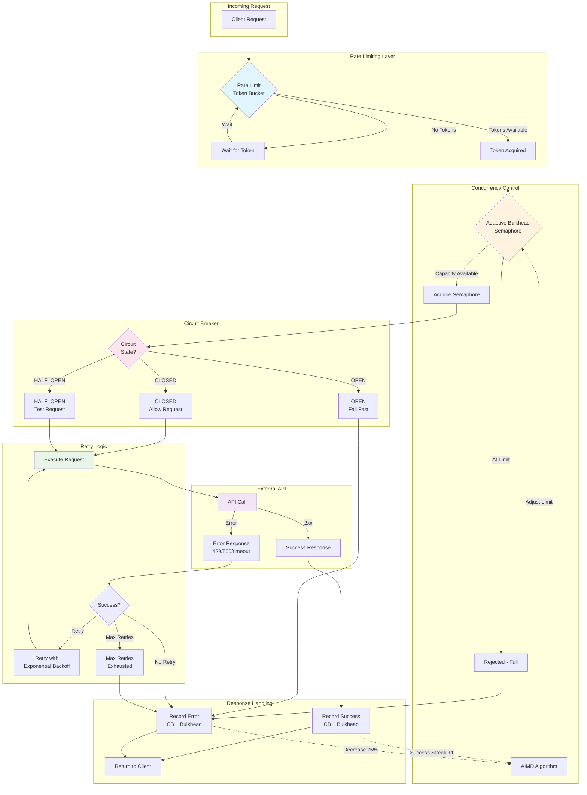
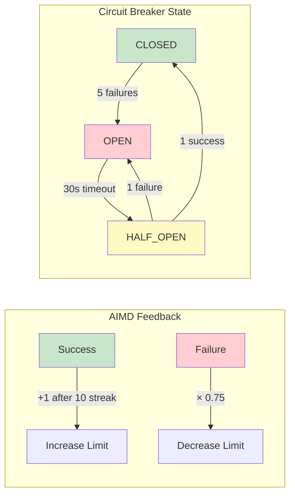
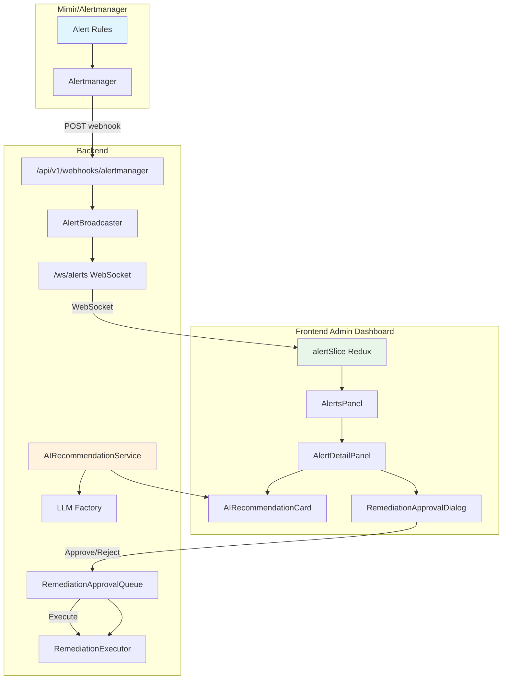

# ADR-0026: Comprehensive Client Resilience Patterns

**Status**: Accepted
**Date**: 2025-12-20
**Supersedes**: None
**Related**:
- ADR-RESILIENCE-DECORATOR-PARAMETERS.md
- [Operations Runbook](runbooks/RESILIENCE_OPERATIONS.md)
- [Grafana Dashboard](dashboards/resilience-patterns.json)
- [Alerting Rules](../deployments/monitoring/alerting-rules/resilience-alerts.yaml)
- [Alertmanager Config](../deployments/monitoring/alertmanager/alertmanager-config.yaml)
- [Metrics Cardinality Analysis](../deployments/monitoring/METRICS_CARDINALITY.md)

## Context

Modern cloud-native applications require robust resilience patterns to handle transient failures, network partitions, and service unavailability. Without proper resilience patterns, a single failing dependency can cause cascade failures across the entire system.

This ADR documents the comprehensive resilience implementation across all external service clients in the MCP Server LangGraph project.

## Decision

We will implement the following resilience patterns consistently across all external service clients:

### Resilience Patterns Implemented

| Pattern | Description | Configuration |
|---------|-------------|---------------|
| **Circuit Breaker** | Fail fast when service is repeatedly unavailable | fail_max=5, timeout=30s |
| **Retry with Exponential Backoff** | Retry transient failures with increasing delays | 3 attempts, 2.0x multiplier |
| **Timeout** | Prevent operations from hanging indefinitely | Service-specific (5s-60s) |
| **Bulkhead** | Limit concurrent requests to prevent resource exhaustion | Service-specific (8-50) |
| **Fallback** | Provide degraded functionality when service unavailable | L1 cache, fail-closed |
| **Rate Limiting** | Prevent overwhelming external services | Token bucket per provider |

### Client Implementation Status

| Client | Circuit Breaker | Retry | Timeout | Bulkhead | Rate Limit | Fallback | Score |
|--------|-----------------|-------|---------|----------|------------|----------|-------|
| **OpenFGA** | Yes | Yes | Yes | Yes | - | Yes | 10/10 |
| **LiteLLM** | Yes | Yes | Yes | Adaptive | Token Bucket | Model fallback | 10/10 |
| **Keycloak** | Yes | Yes | Yes | - | - | - | 9/10 |
| **Redis** | Yes | Yes | Yes | - | - | L1 fallback | 8/10 |
| **PostgreSQL** | Yes | Yes | Yes | Pool | - | - | 8/10 |
| **Prometheus** | Yes | Yes | Yes | - | - | - | 8/10 |
| **Tempo** | Yes | Yes | Yes | - | - | - | 8/10 |
| **Loki** | Yes | Yes | Yes | - | - | - | 8/10 |
| **Visual Verification** | - | Yes | Yes | - | - | L1 cache | 8/10 |

### Circuit Breaker Configuration

All circuit breakers use the shared `get_circuit_breaker()` factory:

```python
from mcp_server_langgraph.resilience.circuit_breaker import get_circuit_breaker

# Get or create named circuit breaker
breaker = get_circuit_breaker("service_name")

# Check state before operation
if breaker.current_state == pybreaker.STATE_OPEN:
    raise pybreaker.CircuitBreakerError(breaker)

# Record success
breaker.state.on_success()

# Record failure
breaker._inc_counter()
breaker.state.on_failure(exception)
```

**Default Configuration**:
- `fail_max`: 5 failures before opening
- `timeout`: 30 seconds before attempting recovery
- States: CLOSED (healthy) → OPEN (failing) → HALF_OPEN (testing)

### Retry with Exponential Backoff

Standard retry pattern for transient failures:

```python
max_attempts = 3
base_delay = 1.0
backoff_multiplier = 2.0  # 1s, 2s, 4s

for attempt in range(1, max_attempts + 1):
    try:
        result = await operation()
        breaker.state.on_success()
        return result
    except TransientError as e:
        if attempt < max_attempts:
            delay = base_delay * (backoff_multiplier ** (attempt - 1))
            await asyncio.sleep(delay)
            continue
        # Record failure for circuit breaker
        breaker._inc_counter()
        breaker.state.on_failure(e)
        raise
```

### LLM Rate Limiting (Token Bucket)

Pre-emptive rate limiting to prevent 429 errors:

```python
from mcp_server_langgraph.resilience.rate_limit import get_provider_token_bucket

# Get provider-specific token bucket
bucket = get_provider_token_bucket(provider)

# Acquire token before API call (blocks if exhausted)
await bucket.acquire(timeout=30.0)

# Make API call
response = await llm.ainvoke(messages)
```

**Provider Rate Limits** (configurable via `RATE_LIMIT_<PROVIDER>_RPM` env var):

| Provider | RPM | Burst Capacity |
|----------|-----|----------------|
| Anthropic | 50 | ~8 requests |
| OpenAI | 500 | ~83 requests |
| Vertex AI | 600 | ~150 requests |
| Vertex AI Anthropic | 1000 | ~167 requests |
| Bedrock | 50 | ~8 requests |
| Ollama | 1000 | ~500 requests |

### LLM Adaptive Bulkhead (AIMD)

Self-tuning concurrency limits based on error rates:

```python
from mcp_server_langgraph.resilience.adaptive import get_provider_adaptive_bulkhead

# Get adaptive bulkhead for provider
bulkhead = get_provider_adaptive_bulkhead(provider)

# Record success (increases limit after success streak)
bulkhead.record_success()

# Record error (immediately decreases limit by 25%)
bulkhead.record_error()

# Get current stats
stats = bulkhead.get_stats()
# {'current_limit': 8, 'min_limit': 2, 'max_limit': 20, 'error_rate': 0.1, ...}
```

**AIMD Parameters**:
- Initial limit: Provider base limit (8-50)
- Min limit: 25% of base (floor)
- Max limit: 200% of base (ceiling)
- Error threshold: 10% triggers decrease
- Decrease factor: 0.75 (reduce by 25% on error)
- Increase amount: +1 per 10-success streak

### Visual Verification Retry Pattern

Screenshot capture and LLM verification use a specialized retry pattern aligned with
the standard patterns but with domain-specific error classification.

**Configuration** (`llm/verifier.py`):
```python
VISUAL_VERIFICATION_MAX_ATTEMPTS = 3
VISUAL_VERIFICATION_EXPONENTIAL_BASE = 2.0
VISUAL_VERIFICATION_EXPONENTIAL_MAX = 10.0
```

**Retryable Exceptions**:
| Error Type | Retried | Notes |
|------------|---------|-------|
| `httpx.TimeoutException` | Yes | Network timeout |
| `httpx.ConnectError` | Yes | Connection refused |
| `httpx.ReadError` | Yes | Network read failure |
| HTTP 429 (Rate Limit) | Yes | With longer backoff |
| HTTP 502/503/504 | Yes | Server errors |
| HTTP 529 (Overload) | Yes | Extended retry (1.5x delay) |
| `ValidationError` | **No** | Configuration error |
| `AuthenticationError` | **No** | Invalid credentials |
| `AuthorizationError` | **No** | Permission denied |

**Graceful Failure Pattern** (visual verification specific):

Unlike standard retry patterns that re-raise exceptions after exhaustion,
visual verification uses `break` instead of `raise` for non-retryable errors
to return a failure result instead of propagating exceptions:

```python
for attempt in range(max_attempts):
    try:
        result = await operation()
        return result
    except Exception as e:
        if not _is_retryable(e):
            # Non-retryable: break to error handling, don't raise
            break
        await asyncio.sleep(calculate_backoff(attempt))

# Fall through to error handling - return failure result
return VisualVerificationResult(
    passed=False,
    feedback="Operation failed after retry attempts",
    ...
)
```

This pattern ensures visual verification failures don't crash agent workflows
while still recording metrics and providing actionable error messages.

**Screenshot Caching** (`core/cache.py`):
- L1 in-memory fallback when Redis unavailable
- TTL: 300 seconds (5 minutes) for screenshot data
- Cache key: MD5 hash of normalized URL (scheme + host lowercased, trailing slash removed)
- Cache bypass: `use_screenshot_cache=False` for fresh captures

**Prometheus Metrics**:
| Metric | Labels | Purpose |
|--------|--------|---------|
| `visual_verification_retries_total` | `operation` | Track retry frequency |
| `screenshot_cache_hits_total` | - | Cache efficiency |
| `screenshot_cache_misses_total` | - | Cold cache rate |

### Health Check Integration

Circuit breaker state is integrated into Kubernetes health checks:

```python
def validate_circuit_breakers_healthy() -> tuple[bool, str]:
    """Check circuit breaker states for readiness probe."""
    critical_breakers = ["redis", "keycloak", "openfga", "postgres"]
    warning_breakers = ["prometheus", "tempo", "loki"]

    # Critical breakers: OPEN = unhealthy (503)
    # Warning breakers: OPEN = healthy with warning (200)
```

**Kubernetes Integration**:
- **Liveness Probe**: Basic health check (always healthy if process running)
- **Readiness Probe**: Includes circuit breaker state check
  - Any critical circuit breaker OPEN → 503 Not Ready
  - Only warning circuit breakers OPEN → 200 OK with warning

## Architecture

### Resilience Pattern Flow

The following diagram shows the order of resilience patterns applied to API calls:



### Pattern Application Order

| Order | Pattern | Purpose | Failure Action |
|-------|---------|---------|----------------|
| 1 | **Rate Limit** | Prevent provider rate limit errors | Wait for token |
| 2 | **Adaptive Bulkhead** | Self-tune concurrency based on errors | Reject if full |
| 3 | **Circuit Breaker** | Fail fast on repeated failures | Return error immediately |
| 4 | **Retry + Backoff** | Handle transient failures | Retry with delay |
| 5 | **Timeout** | Prevent hung operations | Cancel after limit |

### Feedback Loops



## Implementation Details

### Files Modified

| File | Changes |
|------|---------|
| `src/mcp_server_langgraph/llm/factory.py` | Rate limiting + adaptive bulkhead + circuit breaker |
| `src/mcp_server_langgraph/auth/keycloak.py` | Circuit breaker + retry + connection pooling |
| `src/mcp_server_langgraph/core/cache.py` | Circuit breaker + retry + L1 fallback |
| `src/mcp_server_langgraph/infrastructure/database.py` | Circuit breaker + retry |
| `src/mcp_server_langgraph/monitoring/prometheus_client.py` | Circuit breaker + 2.0x exponential backoff |
| `src/mcp_server_langgraph/monitoring/tempo_client.py` | Circuit breaker + retry |
| `src/mcp_server_langgraph/observability/query/backends/loki.py` | Circuit breaker + retry |
| `src/mcp_server_langgraph/api/health.py` | Circuit breaker state integration |

### Test Coverage

| Test File | Tests | Purpose |
|-----------|-------|---------|
| `tests/unit/llm/test_llm_resilience.py` | 9 | LLM rate limiting + adaptive bulkhead |
| `tests/unit/auth/test_keycloak_resilience.py` | 6 | Keycloak circuit breaker + retry |
| `tests/unit/core/test_cache_resilience.py` | 9 | Redis circuit breaker + L1 fallback |
| `tests/unit/core/test_http_client_metrics.py` | 6 | HTTP pool metrics |
| `tests/unit/infrastructure/test_database_resilience.py` | 5 | PostgreSQL circuit breaker |
| `tests/unit/monitoring/test_observability_resilience.py` | 9 | Prometheus/Tempo/Loki resilience |
| `tests/unit/api/test_health_resilience_stats.py` | 9 | Health endpoint resilience stats |
| `tests/integration/test_resilience_chaos_scenarios.py` | 13 | Chaos scenario verification (incl. LLM) |

**Total: 66 resilience tests**

## Consequences

### Positive

- **Cascade Failure Prevention**: Circuit breakers prevent failures from propagating
- **Graceful Degradation**: L1 cache fallback when Redis unavailable
- **Fast Failure**: OPEN circuit breakers fail immediately (no timeout wait)
- **Automatic Recovery**: Circuit breakers auto-recover after timeout period
- **Observable Health**: Kubernetes readiness probe reflects true system health
- **Consistent Patterns**: All clients follow same resilience approach

### Negative

- **Complexity**: More code to maintain in each client
- **Testing Overhead**: Each client needs resilience-specific tests
- **State Management**: Circuit breaker state is global, needs reset in tests

### Risks

- **False Positives**: Circuit breaker may open due to legitimate spikes
- **Mitigation**: Appropriate thresholds (fail_max=5) and timeout (30s)

## Best Practices

### DO

```python
# Use global config, not hardcoded parameters
@retry_with_backoff()  # Uses global config
@circuit_breaker(name="service")  # Name is required

# Record both success and failure
breaker.state.on_success()  # On success
breaker.state.on_failure(e)  # On failure
```

### DON'T

```python
# Don't hardcode parameters (see ADR-RESILIENCE-DECORATOR-PARAMETERS.md)
@retry_with_backoff(max_attempts=3)  # Prevents test optimization

# Don't forget to check circuit state before operations
await operation()  # Missing circuit breaker check
```

## Monitoring Infrastructure

### Grafana Dashboard

A comprehensive Grafana dashboard is available at:
- **File**: `docs-internal/dashboards/resilience-patterns.json`
- **Import**: Grafana → Dashboards → Import → Upload JSON

**Dashboard Panels**:
| Panel | Metric Type | Purpose |
|-------|-------------|---------|
| Circuit Breaker Status | Stat | Current state per service |
| Circuit Breaker Failures | Graph | Failure rate over time |
| LLM Adaptive Bulkhead Limits | Time series | Provider concurrency limits |
| LLM Provider Error Rate | Gauge | Error rate per provider |
| Rate Limit Token Availability | Time series | Available tokens per provider |
| Retry Success After Retry | Counter | Transient error recovery |
| Retry Exhaustion Rate | Graph | Persistent failures |
| Timeout Rate | Graph | Operations exceeding limits |
| HTTP Pool Utilization | Gauge | Connection pool capacity |
| Bulkhead Queue Depth | Time series | Request queueing |

### Prometheus Alerting Rules

Alerting rules for all resilience patterns:
- **File**: `deployments/monitoring/alerting-rules/resilience-alerts.yaml`
- **Deploy**: Add to Prometheus rules directory and reload

**Alert Groups**:
| Group | Alerts | Severity Range |
|-------|--------|----------------|
| resilience.circuit_breaker | CircuitBreakerOpen, CircuitBreakerFlapping | critical-info |
| resilience.retry | RetryExhaustionHigh, TransientErrorsElevated | warning-info |
| resilience.timeout | TimeoutRateHigh | warning |
| resilience.bulkhead | BulkheadRejectionsHigh, BulkheadQueueDeepening | warning |
| resilience.adaptive_bulkhead | AdaptiveBulkheadAtFloor, ErrorRateHigh | warning-info |
| resilience.rate_limit | RateLimitTokenExhaustion, WaitTimeHigh | warning |
| resilience.http_pool | HTTPPoolNearCapacity, HTTPPoolExhausted | critical-warning |

### Health Endpoint Integration

The `/health/ready` endpoint now includes resilience statistics:

```json
{
  "status": "ready",
  "checks": {
    "observability": true,
    "database": true,
    "circuit_breakers": true
  },
  "resilience_stats": {
    "adaptive_bulkheads": {
      "openai": {"current_limit": 10, "error_rate": 0.02, ...},
      "anthropic": {"current_limit": 8, "error_rate": 0.0, ...}
    },
    "circuit_breakers": {
      "redis": "CLOSED",
      "keycloak": "CLOSED",
      "openfga": "CLOSED"
    },
    "rate_limits": {}
  }
}
```

### HTTP Connection Pool Metrics

Real-time pool metrics exported to Prometheus:
- `http_pool_active_connections` - Current active connections
- `http_pool_max_connections` - Configured maximum
- `http_pool_utilization` - Utilization percentage (0-1)

### Operations Runbook

Detailed operational procedures available at:
- **File**: `docs-internal/runbooks/RESILIENCE_OPERATIONS.md`
- **Contents**: Troubleshooting procedures, tuning parameters, emergency procedures

## Alert UI Integration (Admin Dashboard)

The resilience patterns integrate with the Admin Dashboard for real-time alert management
with AI-powered remediation recommendations.

### Architecture



### Backend Components

| Component | File | Purpose |
|-----------|------|---------|
| **Alertmanager Webhook** | `api/v1/alertmanager_webhook.py` | Receives alerts from Mimir |
| **Alert WebSocket** | `api/v1/alert_websocket.py` | Real-time broadcast to clients |
| **Alert Broadcaster** | `alerts/broadcaster.py` | Manages WebSocket subscriptions |
| **AI Recommendation** | `alerts/ai_recommendation.py` | LLM-powered root cause analysis |
| **Recommendation API** | `api/v1/alert_recommendations.py` | REST endpoints for recommendations |
| **Approval Queue** | `alerts/approval_queue.py` | Human-in-the-loop approval workflow |
| **Remediation API** | `api/v1/remediation_approvals.py` | Approve/reject remediation requests |
| **Executor** | `alerts/executor.py` | Secure command execution |
| **Alert Stores** | `alerts/stores.py` | In-memory and PostgreSQL persistence |

### Frontend Components

| Component | File | Purpose |
|-----------|------|---------|
| **alertSlice** | `store/slices/alertSlice.ts` | Redux state for alerts + sound preference |
| **useAlertWebSocket** | `hooks/useAlertWebSocket.ts` | Real-time alert connection |
| **useAlertSound** | `hooks/useAlertSound.ts` | Critical alert sound notifications |
| **AlertsPanel** | `components/Admin/AlertsPanel.tsx` | Alert list with filters |
| **AlertDetailPanel** | `components/Admin/AlertDetailPanel.tsx` | Alert details + AI recommendations |
| **AIRecommendationCard** | `components/Admin/AIRecommendationCard.tsx` | Root cause + remediation steps |
| **RemediationApprovalDialog** | `components/Admin/RemediationApprovalDialog.tsx` | Approve/reject modal |
| **AlertBadge** | `layout/AlertBadge.tsx` | Header badge with alert count |

### RTK Query Endpoints

```typescript
// Alert Management
listAlerts: builder.query<AlertListResponse, AlertFilters>()
getAlertRecommendation: builder.query<AIRecommendation, string>()
regenerateRecommendation: builder.mutation<AIRecommendation, string>()

// Remediation Workflow
listPendingRemediations: builder.query<RemediationRequest[], void>()
approveRemediation: builder.mutation<void, ApproveRequest>()
rejectRemediation: builder.mutation<void, RejectRequest>()
listRemediationHistory: builder.query<RemediationHistory[], HistoryFilters>()
```

### AI Recommendation Flow

| Step | Timing | Description |
|------|--------|-------------|
| 1 | On alert arrival | Critical alerts → queue for pre-computation |
| 2 | On pre-compute | LLM generates root cause + remediation steps |
| 3 | On cache hit | Return cached recommendation (1-hour TTL) |
| 4 | On demand | Warning alerts → generate on first request |
| 5 | On regenerate | Force bypass cache and regenerate |

### Security: Command Validation

The `RemediationExecutor` validates all commands before execution:

**Allowed Prefixes**: `kubectl`, `helm`, `docker`, `aws`, `gcloud`, `az`, `echo`

**Blocked Patterns**: `rm -rf`, `sudo rm`, `| bash`, `mkfs`, `chmod 777`, etc.

### Sound Notifications

- **Trigger**: Critical severity alerts only
- **Persistence**: localStorage (user preference)
- **Controls**: Toggle in AlertsPanel header
- **Audio**: Web Audio API with 440Hz beep

### Test Coverage

| Test File | Tests | Coverage |
|-----------|-------|----------|
| `test_alertmanager_webhook.py` | 12 | Webhook processing |
| `test_alert_websocket.py` | 10 | WebSocket connection |
| `test_alert_recommendations.py` | 19 | API endpoints + LLM |
| `test_remediation_approvals.py` | 14 | Approval workflow |
| `test_ai_recommendation.py` | 12 | LLM service |
| `test_stores.py` | 28 | Alert persistence |
| `alertSlice.test.ts` | 32 | Redux state |
| `AlertsPanel.test.tsx` | 18 | UI component |
| `admin-alerts.spec.ts` | 20 | E2E flows |

**Total: 165+ alert-related tests**

### Deployment Configuration

**Mimir Alertmanager Webhook** (`docker/mimir/alertmanager-fallback.yaml`):
```yaml
receivers:
  - name: 'mcp-server-webhook'
    webhook_configs:
      - url: 'http://mcp-server-test:8000/api/v1/webhooks/alertmanager'
        send_resolved: true
```

**Production Alertmanager** (`deployments/monitoring/alertmanager/alertmanager-config.yaml`):
```yaml
routes:
  - match_re:
      severity: 'critical|warning'
    receiver: 'mcp-server-dashboard'
    continue: true  # Also notify Slack/PagerDuty
```

## Monitoring Recommendations

Track these metrics in Grafana:

| Metric | Alert Threshold |
|--------|-----------------|
| `circuit_breaker.state{service="X"}` | OPEN > 5 minutes |
| `retry.exhausted{service="X"}` | > 10/minute |
| `timeout.exceeded{service="X"}` | > 10/minute |
| `fallback.activated{service="X"}` | Any activation |
| `adaptive_bulkhead.limit{provider="X"}` | <= 2 for 10 minutes |
| `http_pool.utilization` | > 80% for 5 minutes |

## References

- [Microsoft Cloud-Native Resilience Patterns](https://learn.microsoft.com/en-us/dotnet/architecture/cloud-native/application-resiliency-patterns)
- [Resilience4j Best Practices](https://mobisoftinfotech.com/resources/blog/microservices/resilience4j-circuit-breaker-retry-bulkhead-spring-boot)
- [12-Factor App: Backing Services](https://12factor.net/backing-services)
- [pybreaker Documentation](https://github.com/danielfm/pybreaker)

---

**Approved by**: Engineering Team
**Reviewed**: 2025-12-20
**Next Review**: 2026-03-20 (or when major refactoring occurs)
