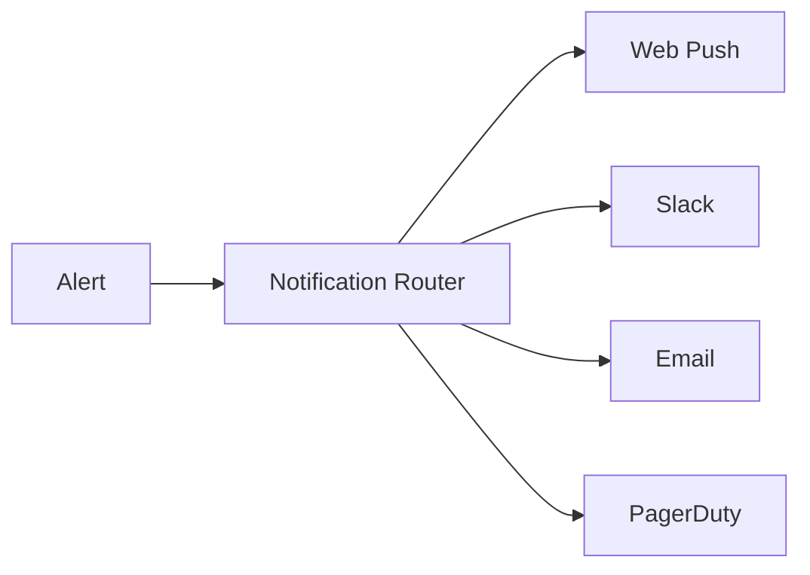
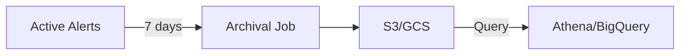

# Future Enhancements Tracker

**Last Updated**: 2025-12-21
**Status**: Active Development
**Reference Plan**: `.claude/plans/zany-exploring-flame.md`

---

## Overview

This document tracks potential enhancements, improvements, and features that have been identified during development but are not yet prioritized for implementation. Items are organized by category and priority.

---

## Priority Levels

| Priority | Description | Timeline |
|----------|-------------|----------|
| P0 | Critical - Security or stability | Next sprint |
| P1 | High - Key user-facing features | 1-2 sprints |
| P2 | Medium - Nice-to-have improvements | 2-4 sprints |
| P3 | Low - Future considerations | Backlog |

---

## Alert System Enhancements

### P1: Multi-Tenant Alert Routing

**Description**: Route alerts to different user groups based on alert labels (namespace, team, service).

**Current State**: All admins receive all alerts via WebSocket broadcast.

**Proposed Enhancement**:
```python
# alerts/routing.py
class AlertRouter:
    """Route alerts to appropriate teams based on labels."""

    async def route_alert(self, alert: Alert) -> list[str]:
        """Return list of user_ids who should receive this alert."""
        rules = await self._get_routing_rules()

        recipients = set()
        for rule in rules:
            if rule.matches(alert.labels):
                recipients.update(await self._get_team_members(rule.team_id))

        return list(recipients)
```

**Files to Create**:
- `src/mcp_server_langgraph/alerts/routing.py`
- `src/mcp_server_langgraph/api/v1/alert_routing.py`
- `tests/unit/alerts/test_routing.py`

**Dependencies**: Team management API, RBAC integration

---

### P2: Alert Correlation and Deduplication

**Description**: Correlate related alerts to reduce noise and identify root causes.

**Current State**: Alerts are displayed individually; grouping is by service+alertname only.

**Proposed Enhancement**:
```python
# alerts/correlation.py
class AlertCorrelator:
    """Correlate alerts based on temporal and topological proximity."""

    async def correlate(self, alert: Alert) -> CorrelatedAlertGroup | None:
        """Find related alerts within time window."""
        # Check for alerts in same namespace within 5-minute window
        # Check for alerts affecting dependent services
        # Return correlation group with root cause hypothesis
```

**Research Required**:
- Algorithm selection (temporal correlation, graph-based, ML)
- Performance impact on high-volume alert streams
- UI/UX for displaying correlated alerts

---

### P2: Alert Silencing and Maintenance Windows

**Description**: Allow admins to silence alerts during planned maintenance.

**Current State**: All alerts are displayed regardless of maintenance status.

**Proposed Features**:
- Create silence rules by label selector
- Schedule maintenance windows
- Auto-expire silences after duration
- UI for managing active silences

**Implementation Notes**:
- Store silences in PostgreSQL with expiration
- Filter alerts at broadcast time
- Show silenced count in UI

---

### P3: Alert History and Analytics

**Description**: Long-term storage and analysis of alert patterns.

**Current State**: Alerts are ephemeral; only current state is tracked.

**Proposed Features**:
- TimescaleDB hypertable for alert history
- MTTR (Mean Time To Resolve) tracking
- Alert frequency heatmaps
- Trending alert detection

---

## Push Notification Enhancements

### P1: VAPID Key Rotation Automation

**Description**: Automate the VAPID key rotation process with zero-downtime migration.

**Current State**: Documented in push-notifications.mdx but not implemented.

**Proposed Implementation**:
```python
# notifications/vapid_rotation.py (skeleton exists in docs)
class VAPIDKeyRotationManager:
    """Implements zero-downtime VAPID key rotation."""

    async def schedule_rotation(self, rotation_date: datetime) -> str:
        """Schedule rotation and notify users to re-subscribe."""

    async def execute_rotation(self, rotation_id: str) -> RotationResult:
        """Execute the scheduled rotation."""

    async def rollback_rotation(self, rotation_id: str) -> None:
        """Rollback failed rotation."""
```

**Files to Create**:
- `src/mcp_server_langgraph/notifications/vapid_rotation.py`
- `tests/unit/notifications/test_vapid_rotation.py`
- Database migration for rotation tracking

---

### P2: Push Notification Analytics

**Description**: Track delivery rates, open rates, and user engagement.

**Current State**: Basic metrics (sent/failed counters) exist.

**Proposed Metrics**:
| Metric | Description |
|--------|-------------|
| `push_delivery_rate` | Successful deliveries / total sent |
| `push_open_rate` | Notifications clicked / delivered |
| `push_dismiss_rate` | Notifications dismissed / delivered |
| `push_action_rate` | Specific actions taken / delivered |

**Implementation Notes**:
- Requires client-side tracking (service worker)
- Privacy considerations: aggregate only, no individual tracking

---

### P2: Push Notification Templates

**Description**: Pre-defined templates for common notification types.

**Current State**: Each push message is constructed manually.

**Proposed Templates**:
```python
# notifications/templates.py
TEMPLATES = {
    "critical_alert": {
        "title": "{severity}: {alert_name}",
        "body": "{message}",
        "icon": "/icons/alert-critical.png",
        "requireInteraction": True,
        "actions": [
            {"action": "view", "title": "View Alert"},
            {"action": "acknowledge", "title": "Acknowledge"},
        ],
    },
    "remediation_approved": {
        "title": "Remediation Approved",
        "body": "Action '{action}' has been approved by {approver}",
        "icon": "/icons/check-circle.png",
    },
}
```

---

### P3: Multi-Channel Notifications

**Description**: Extend beyond Web Push to include Slack, Email, PagerDuty.

**Current State**: Web Push only.

**Proposed Architecture**:


**Considerations**:
- Each channel has different rate limits
- User preferences per channel
- Escalation policies

---

## AI Recommendation Enhancements

### P1: Recommendation Quality Scoring

**Description**: Score AI recommendations based on historical feedback accuracy.

**Current State**: Few-shot learning implemented, but no quality metrics.

**Proposed Features**:
- Track recommendation accuracy per alert type
- Show confidence score in UI
- Auto-regenerate for low-confidence recommendations

---

### P2: Runbook Auto-Linking

**Description**: Automatically link AI recommendations to existing runbooks.

**Current State**: Runbooks documented in alert-management.mdx, not linked to AI.

**Proposed Enhancement**:
```python
# alerts/runbook_linker.py
class RunbookLinker:
    """Link AI recommendations to existing runbooks."""

    async def find_runbook(self, alert: Alert) -> RunbookReference | None:
        """Find matching runbook for alert type."""
        # Search runbook database by alert name
        # Fuzzy match on alert message
        # Return structured runbook reference
```

---

### P2: Recommendation Caching with Invalidation

**Description**: Smarter caching that invalidates when feedback patterns change.

**Current State**: Simple TTL-based caching.

**Proposed Enhancement**:
- Cache key includes alert labels hash
- Invalidate when new rejection patterns emerge
- Pre-compute for known alert types during off-peak

---

### P3: ML-Based Root Cause Analysis

**Description**: Use ML to identify root causes from correlated alerts.

**Research Required**:
- Training data collection
- Model selection (decision tree, neural network)
- Integration with existing LLM pipeline

---

## Frontend Enhancements

### P1: Alert Sound Customization

**Description**: Allow users to customize alert sounds per severity.

**Current State**: Single critical alert sound.

**Proposed Features**:
- Sound library with multiple options
- Volume control per severity
- Quiet hours settings

---

### P2: Keyboard Navigation for Alerts

**Description**: Full keyboard navigation in alert panels.

**Current State**: Basic focus management.

**Proposed Shortcuts**:
| Key | Action |
|-----|--------|
| `j/k` | Navigate between alerts |
| `Enter` | Open alert detail |
| `a` | Acknowledge alert |
| `r` | Request remediation |
| `m` | Mute alert |
| `?` | Show shortcuts |

---

### P2: Alert Dashboard Customization

**Description**: Allow admins to customize dashboard layout and widgets.

**Current State**: Fixed layout.

**Proposed Features**:
- Drag-and-drop widgets
- Custom metric displays
- Saved dashboard configurations
- Per-user preferences

---

### P3: Mobile-Optimized Alert View

**Description**: Responsive design for mobile devices.

**Current State**: Desktop-first design.

**Proposed Enhancements**:
- Swipe gestures for alert actions
- Compact card view
- Native share integration

---

## Infrastructure Enhancements

### P1: Redis Cluster Support for Alert Queue

**Description**: Support Redis Cluster for high-availability alert queuing.

**Current State**: Single Redis instance.

**Implementation Notes**:
- Use `redis-py-cluster` or Redis 7+ cluster mode
- Key slot distribution for alert queues
- Failover handling

---

### P2: Alert Archival to Object Storage

**Description**: Archive old alerts to S3/GCS for compliance.

**Current State**: No archival strategy.

**Proposed Flow**:


---

### P2: Horizontal Scaling for WebSocket Connections

**Description**: Scale WebSocket handling across multiple pods.

**Current State**: Single-pod connection handling.

**Proposed Solution**:
- Redis PubSub for cross-pod broadcasting
- Sticky sessions with backup pod routing
- Connection migration on pod restart

---

### P3: Multi-Region Deployment

**Description**: Deploy across multiple regions for low-latency global access.

**Considerations**:
- Alert replication strategy
- Conflict resolution for approvals
- Regional VAPID keys

---

## Testing Enhancements

### P1: Chaos Engineering Framework

**Description**: Systematic chaos testing beyond circuit breaker.

**Current State**: Circuit breaker chaos tests created.

**Proposed Extensions**:
- Network partition simulation
- Database failover testing
- Redis cluster failure scenarios
- Push service outage simulation

---

### P2: Load Testing Suite

**Description**: Automated load testing for alert throughput.

**Proposed Scenarios**:
| Scenario | Target |
|----------|--------|
| Alert ingestion | 1000 alerts/sec |
| WebSocket broadcast | 10,000 connections |
| Push delivery | 100 pushes/sec |
| API endpoints | 99th percentile < 100ms |

---

### P3: Visual Regression Testing

**Description**: Automated screenshot comparison for UI changes.

**Tools**: Playwright, Percy, Chromatic

---

## Documentation Enhancements

### P1: Interactive API Documentation

**Description**: Add interactive examples to API docs.

**Proposed**: OpenAPI spec with Swagger UI integration

---

### P2: Video Tutorials

**Description**: Screencasts for common workflows.

**Topics**:
- Setting up push notifications
- Configuring alert routing
- Approving remediations
- Using AI recommendations

---

### P3: Architecture Decision Records (ADRs)

**Description**: Document architectural decisions formally.

**Status**: ADR-0026 exists for resilience patterns.

**Proposed ADRs**:
- ADR-0030: Alert Grouping Strategy
- ADR-0031: Push Notification Architecture
- ADR-0032: AI Recommendation Pipeline

---

## Completed Enhancements (Reference)

| Enhancement | Completed | Reference |
|-------------|-----------|-----------|
| Circuit Breaker Integration Tests | 2025-12-21 | `tests/integration/test_push_circuit_breaker_chaos.py` |
| Alert Grouping Benchmarks (Frontend) | 2025-12-21 | `alertSlice.benchmark.test.ts` |
| Alert Grouping Benchmarks (Backend) | 2025-12-21 | `tests/benchmarks/test_alert_grouping_benchmark.py` |
| Alert Management Runbooks | 2025-12-21 | `docs/guides/alert-management.mdx` |
| Push Notifications VAPID Guide | 2025-12-21 | `docs/guides/push-notifications.mdx` |
| Phase 1-8 Implementation | 2025-12-20 | Plan file: `zany-exploring-flame.md` |

---

## How to Contribute

1. **Add new enhancement**: Create a PR adding to the appropriate category
2. **Update priority**: Discuss in team sync, update this document
3. **Start implementation**: Move to sprint backlog, create GitHub issue
4. **Mark complete**: Move to Completed section with date and reference

---

## Related Documents

- [Plan File](.claude/plans/zany-exploring-flame.md) - Original implementation plan
- [Alert Management Guide](docs/guides/alert-management.mdx) - User-facing documentation
- [Push Notifications Guide](docs/guides/push-notifications.mdx) - Push setup guide
- [ADR-0026](docs-internal/ADR-0026-RESILIENCE-PATTERNS.md) - Resilience patterns

---

*This document is maintained as part of the mcp-server-langgraph project.*
