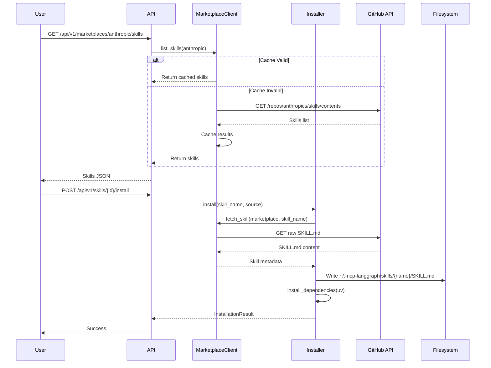
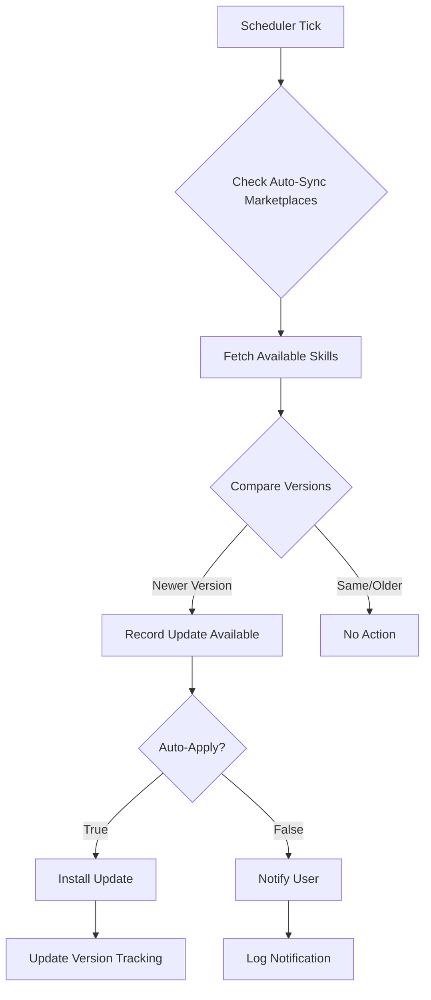

# Skills Marketplace Architecture - Internal Documentation

**Status**: Implemented (ADR-0072 Phase 3)
**Last Updated**: 2025-12-26
**Feature Flags**: `enable_skills_system`, `enable_skills_marketplace`
**Author**: Claude Code

---

## Table of Contents

1. [Overview](#overview)
2. [Architecture](#architecture)
3. [Skill Lifecycle](#skill-lifecycle)
4. [Skill Types](#skill-types)
5. [Storage and Persistence](#storage-and-persistence)
6. [Feature Flags](#feature-flags)
7. [API Endpoints](#api-endpoints)
8. [Marketplace Types](#marketplace-types)
9. [Security Model](#security-model)
10. [Auto-Update Mechanism](#auto-update-mechanism)
11. [Code References](#code-references)

---

## Overview

The Skills Marketplace system enables extensible agent capabilities through a plugin-like architecture. Skills are defined in `SKILL.md` files with YAML frontmatter (following Anthropic's Agent Skills specification) and can be:

- **Discovered** from multiple marketplace sources
- **Installed** at user-level or org-level
- **Auto-updated** based on version tracking
- **Executed** in sandboxed environments

### Key Benefits

- **Progressive Discovery**: Skills provide structured definitions with instructions, examples, and dependencies
- **Multi-Marketplace Support**: Anthropic's canonical skills repository + custom enterprise marketplaces
- **Sandboxed Execution**: Network controls, resource limits, and dependency isolation
- **Version Management**: Semantic versioning with automated update notifications

### Core Components

```
┌─────────────────────────────────────────────────────────────────┐
│                    Skills Marketplace System                     │
├─────────────────────────────────────────────────────────────────┤
│                                                                  │
│  ┌──────────────┐  ┌──────────────┐  ┌──────────────┐         │
│  │  Marketplace │  │    Skill     │  │  Installer   │         │
│  │   Registry   │→ │   Client     │→ │              │         │
│  └──────────────┘  └──────────────┘  └──────────────┘         │
│         ↓                  ↓                  ↓                  │
│  ┌──────────────┐  ┌──────────────┐  ┌──────────────┐         │
│  │   Auto-      │  │    Skill     │  │    Skill     │         │
│  │   Update     │  │   Loader     │  │  Executor    │         │
│  │  Scheduler   │  │              │  │              │         │
│  └──────────────┘  └──────────────┘  └──────────────┘         │
│                                                                  │
└─────────────────────────────────────────────────────────────────┘
```

**Module Locations**:
- **Models**: `/src/mcp_server_langgraph/skills/models.py`
- **Marketplace**: `/src/mcp_server_langgraph/skills/marketplace.py`
- **Installer**: `/src/mcp_server_langgraph/skills/installer.py`
- **Auto-Update**: `/src/mcp_server_langgraph/skills/auto_update.py`
- **Registry**: `/src/mcp_server_langgraph/skills/registry.py`
- **API**: `/src/mcp_server_langgraph/api/v1/marketplace_admin.py`

---

## Architecture

### Layered Architecture

```
┌─────────────────────────────────────────────────────────────────┐
│                         API Layer                                │
│  /api/v1/marketplaces/* (Admin), /admin/skills/* (Updates)      │
└─────────────────────────────────────────────────────────────────┘
                              ↓
┌─────────────────────────────────────────────────────────────────┐
│                      Business Logic Layer                        │
│  MarketplaceRegistry, MarketplaceClient, SkillInstaller          │
└─────────────────────────────────────────────────────────────────┘
                              ↓
┌─────────────────────────────────────────────────────────────────┐
│                      Storage Layer                               │
│  Local Filesystem (~/.mcp-langgraph/skills/)                     │
│  In-Memory Registry (SkillRegistry)                              │
└─────────────────────────────────────────────────────────────────┘
                              ↓
┌─────────────────────────────────────────────────────────────────┐
│                     External Marketplaces                        │
│  GitHub (Anthropic), OCI Registry, Custom REST API               │
└─────────────────────────────────────────────────────────────────┘
```

### Data Flow

**Skill Discovery → Installation → Execution**



---

## Skill Lifecycle

### 1. Discovery (Marketplace API)

**MarketplaceClient** fetches skills from configured marketplaces:

```python
from mcp_server_langgraph.skills.marketplace import (
    MarketplaceRegistry,
    MarketplaceClient,
)

# Initialize
registry = MarketplaceRegistry()
client = MarketplaceClient(cache_ttl_seconds=3600)

# Get Anthropic marketplace
anthropic = registry.get("anthropic")

# List available skills (cached for 1 hour)
skills = await client.list_skills(anthropic)
# Returns: [{"name": "web-research", "type": "dir", ...}, ...]
```

**Marketplace Types**:
- **GitHub**: Parses repository structure (`/skills/{name}/SKILL.md`)
- **OCI**: Uses OCI Distribution API (`/v2/{namespace}/{repo}/tags/list`)
- **Registry**: Custom REST API (`GET /skills`)

**Caching**:
- TTL: 1 hour (default), configurable via `cache_ttl_seconds`
- Cache key: `{marketplace_name}:{marketplace_uri}`
- Metrics: `record_marketplace_fetch(marketplace_name, operation, success, cached)`

### 2. Installation (User-Level or Org-Level)

**SkillInstaller** downloads and installs skills:

```python
from mcp_server_langgraph.skills.installer import SkillInstaller

installer = SkillInstaller(
    install_path="/home/user/.mcp-langgraph/skills"  # User-level
    # OR: "/opt/mcp-langgraph/skills"  # Org-level
)

result = await installer.install(
    skill_name="web-research",
    source="anthropic",
    version="1.0.0"  # Optional, defaults to "latest"
)

if result.success:
    print(f"Installed to: {result.installed_path}")
    print(f"Dependencies: {result.dependencies_installed}")
else:
    print(f"Error: {result.error}")
```

**Installation Steps**:

1. **Fetch Skill Metadata**: Download `SKILL.md` from marketplace
2. **Create Skill Directory**: `~/.mcp-langgraph/skills/{skill_name}/`
3. **Write SKILL.md**: Persist skill definition
4. **Install Dependencies**: Use `uv` for package management
   - Preferred: `uv sync --frozen` (if `pyproject.toml` exists)
   - Fallback: `uv pip install -r requirements.txt`
5. **Return Result**: `InstallationResult` with success/failure details

**Storage Locations**:
- **User-Level**: `~/.mcp-langgraph/skills/` (default)
- **Org-Level**: `/opt/mcp-langgraph/skills/` (configurable)
- **Structure**:
  ```
  ~/.mcp-langgraph/skills/
  ├── web-research/
  │   ├── SKILL.md
  │   ├── requirements.txt
  │   └── scripts/
  │       └── search.py
  ├── code-review/
  │   ├── SKILL.md
  │   └── pyproject.toml
  ```

### 3. Auto-Update Mechanism

**AutoUpdateScheduler** tracks versions and notifies of updates:

```python
from mcp_server_langgraph.skills.auto_update import AutoUpdateScheduler

scheduler = AutoUpdateScheduler(
    update_interval_hours=24,  # Check daily
    auto_apply=False,          # Notify only, don't auto-install
)

# Register installed skill
scheduler.register_installed_skill(
    skill_name="web-research",
    version="1.0.0",
    marketplace="anthropic"
)

# Start scheduler
await scheduler.start()

# Check for updates manually
updates = await scheduler.check_updates_available()
# Returns: [SkillUpdate(skill_name="web-research", current_version="1.0.0", new_version="1.1.0", ...)]

# Apply updates
results = await scheduler.apply_updates()
```

**Auto-Sync Marketplaces**:

Only marketplaces with `auto_sync=True` are checked for updates:

```python
from mcp_server_langgraph.skills.marketplace import MarketplaceConfig

# Default Anthropic marketplace (auto_sync=True)
ANTHROPIC_MARKETPLACE = MarketplaceConfig(
    name="anthropic",
    uri="https://github.com/anthropics/skills",
    type="github",
    trusted=True,
    auto_sync=True,  # ← Checked by scheduler
    requires_approval=False,
)
```

**Version Comparison**:

```python
from mcp_server_langgraph.skills.auto_update import compare_versions

compare_versions("1.0.0", "1.0.1")  # Returns: -1 (1.0.0 < 1.0.1)
compare_versions("2.0.0", "1.9.9")  # Returns:  1 (2.0.0 > 1.9.9)
compare_versions("1.0.0", "1.0.0")  # Returns:  0 (equal)
```

**Update Metrics**:

```python
record_skill_update_metric(
    skill_name="web-research",
    old_version="1.0.0",
    new_version="1.1.0",
    success=True,
)

record_update_check_metric(
    marketplace="anthropic",
    skills_checked=10,
    updates_available=2,
)
```

### 4. Uninstallation

**Remove Skill**:

```python
success = await installer.uninstall("web-research")
# Deletes: ~/.mcp-langgraph/skills/web-research/
```

**Cleanup**:
- Removes skill directory and all contents
- Does NOT uninstall Python dependencies (shared with other skills)
- Updates in-memory registry if skill is loaded

---

## Skill Types

Skills can provide three types of capabilities:

### 1. Tool Skills (MCP Tools)

Skills that expose executable tools via MCP protocol.

**Example: Web Research Skill**

```markdown
---
name: web-research
description: Research topics using web search and scraping
version: 1.0.0
dependencies:
  - httpx>=0.25.0
  - beautifulsoup4>=4.12.0
sandbox_config:
  network: allowlist
  allowed_domains:
    - wikipedia.org
    - duckduckgo.com
  timeout_seconds: 30
  memory_mb: 256
---

# Web Research Skill

This skill enables Claude to research topics using web search.

## Tools

- `search_web(query: str) -> SearchResults`
- `fetch_page(url: str) -> PageContent`

## Usage

When the user asks "Research quantum computing", invoke:
1. `search_web("quantum computing basics")`
2. `fetch_page(top_result_url)`
```

**Tool Registration**:

```python
from mcp_server_langgraph.skills.loader import SkillLoader

loader = SkillLoader()
skills = loader.load_from_directory("~/.mcp-langgraph/skills")

# Skills expose MCP tools
for skill in skills:
    for tool_name in skill.tools:
        mcp_server.register_tool(tool_name, skill.execute_tool)
```

### 2. Prompt Skills (Reusable Prompts)

Skills that provide reusable prompt templates or instructions.

**Example: Code Review Skill**

```markdown
---
name: code-review
description: Structured code review checklist
version: 1.0.0
---

# Code Review Skill

Use this checklist when reviewing code:

1. **Correctness**: Does the code do what it claims?
2. **Tests**: Are there tests? Do they cover edge cases?
3. **Security**: Any SQL injection, XSS, or auth issues?
4. **Performance**: Any O(n²) algorithms or memory leaks?
5. **Readability**: Clear naming, comments where needed?

## Examples

User: "Review this function"
Claude: [Applies checklist systematically]
```

**Prompt Integration**:

```python
# Include skill instructions in system prompt
system_prompt = f"""
You are a helpful assistant with the following skills:

{skill.instructions}

When the user asks for code review, follow the checklist above.
"""
```

### 3. Resource Skills (MCP Resources)

Skills that expose data sources via MCP resources.

**Example: Documentation Skill**

```markdown
---
name: api-docs
description: Access to API documentation
version: 1.0.0
---

# API Documentation Skill

Provides access to project API documentation.

## Resources

- `resource://api-docs/authentication`
- `resource://api-docs/endpoints`
- `resource://api-docs/errors`

## Usage

When the user asks "How do I authenticate?", read:
`resource://api-docs/authentication`
```

**Resource Registration**:

```python
from mcp_server_langgraph.mcp.handlers.skills import SkillsResourceHandler

handler = SkillsResourceHandler(skills_registry)
mcp_server.register_resource_handler(handler)

# Client can read: resource://api-docs/authentication
```

---

## Storage and Persistence

### Skill Metadata Storage

**In-Memory Registry** (`SkillRegistry`):

```python
from mcp_server_langgraph.skills.registry import SkillRegistry

registry = SkillRegistry()

# Register skill
registry.register(skill)

# Lookup
skill = registry.get("web-research")

# Search
results = registry.search("web")  # Searches name, description, tags

# Filter by source
anthropic_skills = registry.list_by_source("anthropic")
```

**Filesystem Storage**:

```
~/.mcp-langgraph/skills/
├── {skill_name}/
│   ├── SKILL.md          # YAML frontmatter + Markdown
│   ├── requirements.txt  # Python dependencies
│   ├── pyproject.toml    # Alternative to requirements.txt
│   └── scripts/          # Bundled Python scripts
│       └── *.py
```

**SKILL.md Format**:

```markdown
---
name: skill-name
description: Short description
version: 1.0.0
author: Author Name
source: anthropic
tags:
  - research
  - web
dependencies:
  - httpx>=0.25.0
sandbox_config:
  network: allowlist
  allowed_domains:
    - example.com
  timeout_seconds: 30
  memory_mb: 256
required_secrets:
  - API_KEY
optional_secrets:
  - DEBUG_MODE
scripts:
  - scripts/search.py
---

# Skill Instructions (Markdown)

Instructions for Claude on how to use this skill...
```

### User Skill Associations

**Current Implementation**: Filesystem-based (user-level or org-level)

**Future Enhancement**: PostgreSQL storage for multi-tenancy

```sql
-- Future schema (not yet implemented)
CREATE TABLE user_skills (
    user_id UUID REFERENCES users(id),
    skill_name VARCHAR(255),
    marketplace_name VARCHAR(255),
    version VARCHAR(50),
    installed_at TIMESTAMP DEFAULT NOW(),
    PRIMARY KEY (user_id, skill_name)
);

CREATE TABLE skill_metadata (
    skill_name VARCHAR(255) PRIMARY KEY,
    marketplace_name VARCHAR(255),
    latest_version VARCHAR(50),
    description TEXT,
    tags JSONB,
    source_uri TEXT,
    last_synced TIMESTAMP
);
```

### Version Management

**SkillVersion Tracking**:

```python
from mcp_server_langgraph.skills.auto_update import SkillVersion
from datetime import datetime, UTC

version = SkillVersion(
    skill_name="web-research",
    version="1.0.0",
    marketplace="anthropic",
    installed_at=datetime.now(UTC),
    last_checked=datetime.now(UTC),
)
```

**Update Detection**:

1. **Scheduler Checks**: `AutoUpdateScheduler` checks marketplaces every N hours
2. **Version Comparison**: Compares installed version vs. available version
3. **Notification**: `_notify_update_available()` logs or sends notification
4. **Auto-Apply**: If `auto_apply=True`, installs update automatically

**Semantic Versioning**:

```python
# Version format: MAJOR.MINOR.PATCH
"1.0.0" < "1.0.1"  # Patch update (bug fixes)
"1.0.1" < "1.1.0"  # Minor update (new features, backward-compatible)
"1.1.0" < "2.0.0"  # Major update (breaking changes)
```

---

## Feature Flags

### Primary Flags

**`enable_skills_system`** (default: `True`)

Enables SKILL.md-based skills system.

```python
from mcp_server_langgraph.core.feature_flags import get_feature_flags

flags = get_feature_flags()

if flags.enable_skills_system:
    # Load and execute skills
    loader = SkillLoader()
    skills = loader.load_from_directory("~/.mcp-langgraph/skills")
```

**Environment Override**:

```bash
FF_ENABLE_SKILLS_SYSTEM=false  # Disable skills system
```

**`enable_skills_marketplace`** (default: `True`)

Enables marketplace integration with Anthropic skills repo.

```python
if flags.enable_skills_marketplace:
    # Fetch skills from marketplaces
    registry = MarketplaceRegistry()
    client = MarketplaceClient()
    skills = await client.list_skills(registry.get("anthropic"))
```

**Environment Override**:

```bash
FF_ENABLE_SKILLS_MARKETPLACE=false  # Disable marketplace
```

### Related Flags

**`enable_skill_auto_update`** (Not yet implemented)

Future flag for controlling auto-update behavior.

**`skills_cache_ttl_seconds`** (Not yet implemented)

Future flag for configuring marketplace cache TTL.

**Current Default**: 3600 seconds (1 hour) in `MarketplaceClient.DEFAULT_CACHE_TTL`

---

## API Endpoints

### Admin Endpoints (Marketplace Management)

**Base Path**: `/api/v1/marketplaces`

#### `GET /api/v1/marketplaces`

List all registered skill marketplaces.

**Response**:

```json
{
  "marketplaces": [
    {
      "name": "anthropic",
      "uri": "https://github.com/anthropics/skills",
      "type": "github",
      "trusted": true,
      "auto_sync": true,
      "requires_approval": false,
      "skill_count": 15
    }
  ]
}
```

#### `GET /api/v1/marketplaces/{name}`

Get details for a specific marketplace.

**Response**:

```json
{
  "name": "anthropic",
  "uri": "https://github.com/anthropics/skills",
  "type": "github",
  "trusted": true,
  "auto_sync": true,
  "requires_approval": false,
  "last_sync": "2025-12-26T10:00:00Z",
  "skill_count": 15
}
```

#### `POST /api/v1/marketplaces`

Register a new skill marketplace.

**Request Body**:

```json
{
  "name": "acme-corp",
  "uri": "https://skills.acme.com/api/v1",
  "type": "registry",
  "trusted": false,
  "auto_sync": false,
  "required_approval": true
}
```

**Response**:

```json
{
  "success": true,
  "message": "Marketplace 'acme-corp' registered successfully"
}
```

**Validation**:
- `name`: Must start with lowercase letter, only `[a-z0-9-]`
- `uri`: Must be valid HTTPS URL (or `http://localhost` for testing)
- `type`: One of `github`, `registry`, `oci`

#### `DELETE /api/v1/marketplaces/{name}`

Remove a marketplace.

**Protection**: Cannot remove `anthropic` marketplace (protected).

**Response**:

```json
{
  "success": true,
  "message": "Marketplace 'acme-corp' removed successfully"
}
```

#### `POST /api/v1/marketplaces/{name}/sync`

Force sync skills from a marketplace.

**Response**:

```json
{
  "synced": 15,
  "new": 2,
  "updated": 3
}
```

#### `GET /api/v1/marketplaces/{name}/skills`

List all skills from a specific marketplace.

**Response**:

```json
{
  "skills": [
    {
      "name": "web-research",
      "description": "Research topics using web search",
      "version": "1.0.0",
      "tags": ["research", "web"]
    }
  ]
}
```

### User Endpoints (Skill Management)

**Base Path**: `/api/v1/skills`

#### `GET /api/v1/skills`

List available skills from all marketplaces.

**Query Parameters**:
- `marketplace`: Filter by marketplace name
- `tags`: Filter by tags (comma-separated)
- `search`: Search query

**Response**:

```json
{
  "skills": [
    {
      "name": "web-research",
      "description": "Research topics using web search",
      "version": "1.0.0",
      "marketplace": "anthropic",
      "installed": false
    }
  ]
}
```

#### `POST /api/v1/skills/{id}/install`

Install a skill.

**Request Body**:

```json
{
  "source": "anthropic",
  "version": "1.0.0"  // Optional, defaults to "latest"
}
```

**Response**:

```json
{
  "success": true,
  "skill_name": "web-research",
  "version": "1.0.0",
  "installed_path": "/home/user/.mcp-langgraph/skills/web-research",
  "dependencies_installed": ["httpx>=0.25.0", "beautifulsoup4>=4.12.0"]
}
```

**Error Response**:

```json
{
  "success": false,
  "skill_name": "web-research",
  "error": "Skill not found: web-research in anthropic"
}
```

#### `DELETE /api/v1/skills/{id}/uninstall`

Uninstall a skill.

**Response**:

```json
{
  "success": true,
  "message": "Skill 'web-research' uninstalled successfully"
}
```

#### `GET /api/v1/users/me/skills`

Get user's installed skills.

**Response**:

```json
{
  "skills": [
    {
      "name": "web-research",
      "version": "1.0.0",
      "marketplace": "anthropic",
      "installed_at": "2025-12-26T10:00:00Z"
    }
  ]
}
```

### Auto-Update Endpoints

**Base Path**: `/admin/skills`

#### `GET /admin/skills/updates`

Check for available skill updates.

**Response**:

```json
{
  "updates": [
    {
      "skill_name": "web-research",
      "current_version": "1.0.0",
      "new_version": "1.1.0",
      "marketplace": "anthropic",
      "changelog": "Fixed search rate limiting"
    }
  ],
  "count": 1
}
```

#### `POST /admin/skills/updates/apply`

Apply all available skill updates.

**Response**:

```json
{
  "applied": [
    {
      "skill_name": "web-research",
      "success": true,
      "new_version": "1.1.0"
    }
  ],
  "count": 1,
  "success_count": 1
}
```

---

## Marketplace Types

### GitHub Marketplace

**URI Format**: `https://github.com/{owner}/{repo}`

**Example**: `https://github.com/anthropics/skills`

**API Calls**:

1. **List Skills**: `GET /repos/{owner}/{repo}/contents/skills`
   - Returns: Array of directories (each is a skill)
2. **Fetch Skill**: `GET raw.githubusercontent.com/{owner}/{repo}/main/skills/{name}/SKILL.md`
   - Returns: Raw SKILL.md content

**Implementation**: `MarketplaceClient._list_skills_github()`

**Caching**: Results cached for `cache_ttl_seconds` (default: 1 hour)

**Protected Marketplace**: `anthropic` (cannot be removed)

### OCI Registry Marketplace

**URI Format**: `oci://registry[:port]/namespace/repository`

**Example**: `oci://ghcr.io/anthropics/skills`

**OCI Distribution API**:

1. **List Skills**: `GET /v2/{namespace}/{repository}/tags/list`
   - Returns: `{"tags": ["skill-1", "skill-2"]}`
2. **Fetch Skill**: `GET /v2/{namespace}/{repository}/manifests/{tag}`
   - Returns: OCI manifest
3. **Get Metadata**: `GET /v2/{namespace}/{repository}/blobs/{digest}`
   - Returns: Config blob with skill metadata

**Implementation**: `MarketplaceClient._list_skills_oci()`

**Use Case**: Enterprise container registries (Artifactory, Harbor, etc.)

### Custom Registry Marketplace

**URI Format**: `https://skills.example.com/api/v1`

**Example**: `https://skills.acme.com/api/v1`

**REST API Requirements**:

1. **List Skills**: `GET {base_url}/skills`
   - Returns: `{"skills": [{...}]}` or `[{...}]`
2. **Fetch Skill**: `GET {base_url}/skills/{name}`
   - Returns: Skill metadata JSON

**Implementation**: `MarketplaceClient._list_skills_registry()`

**Use Case**: Custom enterprise skill repositories

**Security**: HTTPS required (HTTP only allowed for `localhost`)

---

## Security Model

### Marketplace Trust Levels

**Trusted Marketplaces** (`trusted=True`):

- Skills can be installed without admin approval
- Auto-sync enabled by default
- Example: Anthropic's canonical marketplace

**Untrusted Marketplaces** (`trusted=False`):

- Skills require admin approval before use
- Auto-sync disabled by default
- Example: Third-party or enterprise marketplaces

**Admin Approval Workflow** (Future):

```python
# Admin reviews pending skill
pending = await get_pending_skill_approvals()
# Admin approves skill
await approve_skill(skill_name="web-research", approved_by="admin@example.com")
```

### Sandbox Configuration

**Network Access Modes**:

1. **`none`**: No network access (default)
2. **`allowlist`**: Only allowed domains
3. **`unrestricted`**: Full network access (requires admin approval)

**Resource Limits**:

```yaml
sandbox_config:
  network: allowlist
  allowed_domains:
    - wikipedia.org
    - duckduckgo.com
  timeout_seconds: 30    # Max execution time
  memory_mb: 256         # Max memory usage
```

**Implementation**: Enforced by skill executor (future enhancement)

### Secret Management

**Required Secrets**: Skill execution fails if not provided

```yaml
required_secrets:
  - API_KEY
  - DATABASE_URL
```

**Optional Secrets**: Skill execution continues if not provided

```yaml
optional_secrets:
  - DEBUG_MODE
  - LOG_LEVEL
```

**Secret Volumes**: For TLS certs, SSH keys, etc.

```yaml
secret_volumes:
  - type: tls
    mount_path: /etc/ssl/certs
  - type: ssh-auth
    mount_path: /root/.ssh
```

**Security Best Practices**:

1. Never log secret values
2. Use environment variables for secrets
3. Rotate secrets regularly
4. Audit secret access (future enhancement)

---

## Auto-Update Mechanism

### Scheduler Lifecycle

```python
from mcp_server_langgraph.skills.auto_update import initialize_auto_update_scheduler

# Initialize and start scheduler
scheduler = await initialize_auto_update_scheduler(
    update_interval_hours=24,  # Check daily
    auto_apply=False,          # Notify only
)

# Scheduler runs in background asyncio.Task
# Checks for updates every 24 hours

# Shutdown gracefully
from mcp_server_langgraph.skills.auto_update import shutdown_auto_update_scheduler
await shutdown_auto_update_scheduler()
```

### Update Check Flow



### Metrics and Logging

**Update Check Metrics**:

```python
record_update_check_metric(
    marketplace="anthropic",
    skills_checked=10,
    updates_available=2,
)
```

**Update Application Metrics**:

```python
record_skill_update_metric(
    skill_name="web-research",
    old_version="1.0.0",
    new_version="1.1.0",
    success=True,
)
```

**Structured Logging**:

```python
logger.info(
    "skill_update_available",
    extra={
        "skill_name": "web-research",
        "current_version": "1.0.0",
        "new_version": "1.1.0",
    },
)
```

### Notification Integration (Future)

**Push Notifications**:

```python
# When update is available
await notification_service.send(
    user_id=user.id,
    title="Skill Update Available",
    body=f"{skill_name}: {current_version} → {new_version}",
    action_url=f"/skills/{skill_name}",
)
```

**WebSocket Updates** (Real-time):

```python
# Broadcast to connected clients
await websocket_manager.broadcast(
    event="skill_update_available",
    data={
        "skill_name": skill_name,
        "current_version": current_version,
        "new_version": new_version,
    },
)
```

---

## Code References

### Core Modules

| Module | Path | Purpose |
|--------|------|---------|
| **Models** | `skills/models.py` | Skill, SandboxConfig, SecretVolume |
| **Marketplace** | `skills/marketplace.py` | MarketplaceRegistry, MarketplaceClient |
| **Installer** | `skills/installer.py` | SkillInstaller, InstallationResult |
| **Auto-Update** | `skills/auto_update.py` | AutoUpdateScheduler, SkillVersion |
| **Registry** | `skills/registry.py` | SkillRegistry (in-memory) |
| **Loader** | `skills/loader.py` | SkillLoader (loads from filesystem) |
| **Executor** | `skills/executor.py` | SkillExecutor (sandbox execution) |
| **Metrics** | `skills/metrics.py` | record_marketplace_fetch, etc. |

### API Routers

| Router | Path | Purpose |
|--------|------|---------|
| **Marketplace Admin** | `api/v1/marketplace_admin.py` | Admin marketplace management |
| **Skills API** | `api/v1/skills.py` | User skill operations |
| **Auto-Update API** | `api/v1/skills.py` | Auto-update endpoints |

### Tests

| Test File | Path | Coverage |
|-----------|------|----------|
| **Marketplace** | `tests/unit/skills/test_skill_marketplace.py` | MarketplaceRegistry, MarketplaceClient |
| **Installer** | `tests/unit/skills/test_skill_installer.py` | SkillInstaller |
| **Auto-Update** | `tests/unit/skills/test_skill_auto_update.py` | AutoUpdateScheduler |
| **Auto-Update Integration** | `tests/unit/skills/test_auto_update_integration.py` | End-to-end auto-update flow |
| **Marketplace Admin API** | `tests/unit/api/v1/test_marketplace_admin.py` | API endpoints |

### Documentation

| Document | Path | Content |
|----------|------|---------|
| **INTERNAL-0072** | `docs-internal/INTERNAL-0072-ANTHROPIC-BEST-PRACTICES.md` | Phase 3: Skills System |
| **Feature Flag Catalog** | `docs-internal/FEATURE_FLAG_CATALOG.md` | `enable_skills_system`, `enable_skills_marketplace` |

---

## Future Enhancements

### Phase 1: PostgreSQL Storage

**Goal**: Multi-tenant skill associations

**Schema**:

```sql
CREATE TABLE user_skills (
    user_id UUID REFERENCES users(id),
    skill_name VARCHAR(255),
    marketplace_name VARCHAR(255),
    version VARCHAR(50),
    installed_at TIMESTAMP DEFAULT NOW(),
    PRIMARY KEY (user_id, skill_name)
);

CREATE TABLE skill_metadata (
    skill_name VARCHAR(255) PRIMARY KEY,
    marketplace_name VARCHAR(255),
    latest_version VARCHAR(50),
    description TEXT,
    tags JSONB,
    source_uri TEXT,
    last_synced TIMESTAMP
);
```

### Phase 2: Admin Approval Workflow

**Goal**: Approve untrusted marketplace skills

**Workflow**:

1. User requests skill from untrusted marketplace
2. Skill enters "pending approval" state
3. Admin reviews skill metadata and source
4. Admin approves/rejects skill
5. Approved skills can be installed by users

**API Endpoints**:

- `GET /admin/skills/pending`
- `POST /admin/skills/{id}/approve`
- `POST /admin/skills/{id}/reject`

### Phase 3: Sandboxed Execution

**Goal**: Enforce network and resource limits

**Implementation**:

- Use `firejail` or Docker containers for isolation
- Enforce `sandbox_config` limits
- Monitor resource usage (CPU, memory, network)

### Phase 4: Skill Analytics

**Goal**: Track skill usage and performance

**Metrics**:

- Installation count per skill
- Execution count per skill
- Average execution time
- Error rate
- User ratings

**Dashboard**:

- Top skills by usage
- Trending skills
- Performance insights

---

## Glossary

| Term | Definition |
|------|------------|
| **Skill** | Plugin-like extension defined in SKILL.md with YAML frontmatter |
| **Marketplace** | Source repository for discovering and fetching skills |
| **Installer** | Component that downloads and installs skills |
| **Auto-Update** | Scheduler that checks for skill updates and applies them |
| **Registry** | In-memory index of loaded skills |
| **Loader** | Component that loads skills from filesystem into registry |
| **Executor** | Component that runs skill code in sandboxed environment |
| **Sandbox Config** | Security settings for skill execution (network, resources) |
| **SKILL.md** | Markdown file with YAML frontmatter defining a skill |
| **User-Level** | Skills installed per-user (`~/.mcp-langgraph/skills`) |
| **Org-Level** | Skills installed system-wide (`/opt/mcp-langgraph/skills`) |
| **Trusted Marketplace** | Marketplace whose skills don't require admin approval |

---

**End of Document**
