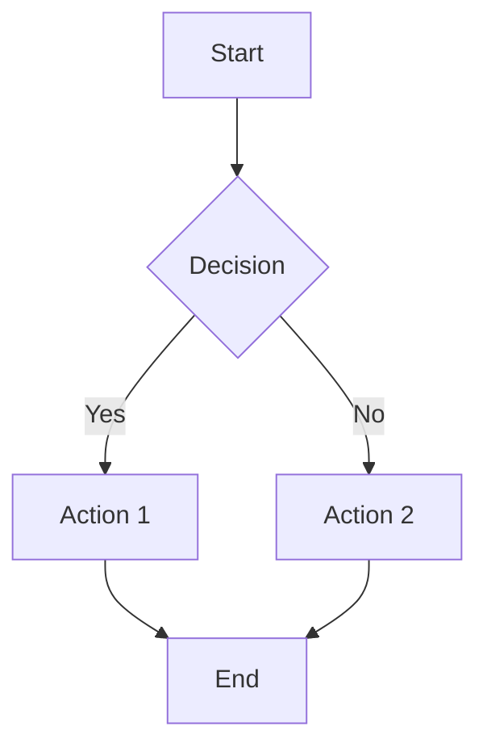

# Artifact Types Reference

Comprehensive documentation for all artifact types supported by Agent Studio.

## Quick Reference

| Type | Language Tags | Description | Renderer |
|------|---------------|-------------|----------|
| `chart` | `chart`, `recharts`, `echarts` | Bar, line, pie charts | ChartArtifact |
| `vega-lite` | `vega-lite`, `vega`, `altair` | Interactive Vega-Lite specs | VegaLiteArtifact |
| `table` | `table`, `csv`, `tsv` | Tabular data with sorting/filtering | TableArtifact |
| `mermaid` | `mermaid` | Diagrams (flowchart, sequence, ER) | MermaidArtifact |
| `json` | `json`, `jsonc` | Interactive JSON viewer | JSONArtifact |
| `code` | 20+ languages | Syntax-highlighted code | CodeArtifact |
| `svg` | `svg` | Vector graphics with zoom/pan | InteractiveSVGArtifact |
| `html` | `html` | HTML content in sandboxed iframe | HTMLArtifact |
| `latex` | `latex`, `tex`, `math` | Mathematical expressions | LaTeXArtifact |
| `executable` | `jsx`, `tsx` | Live React components | SandpackExecutor |
| `mdx` | `mdx` | Interactive MDX documents | MDXArtifact |
| `widget` | `widget` | Quick charts/tables/text | GenerativeWidget |
| `image` | - | Image URLs or base64 data | img element |
| `audio` | - | HTML5 audio playback | audio element |
| `video` | - | HTML5 video playback | video element |
| `text` | - | Plain text fallback | pre element |

---

## Chart Artifacts

### Vega-Lite (Recommended for Interactive Charts)

Best for interactive data visualization. Supports Altair output from Python.

**Language tags:** `vega-lite`, `vega`, `altair`

```vega-lite
{
  "$schema": "https://vega.github.io/schema/vega-lite/v5.json",
  "title": "Sales by Category",
  "data": {
    "values": [
      {"category": "A", "value": 28},
      {"category": "B", "value": 55},
      {"category": "C", "value": 43}
    ]
  },
  "mark": "bar",
  "encoding": {
    "x": {"field": "category", "type": "nominal"},
    "y": {"field": "value", "type": "quantitative"}
  }
}
```

**Features:**
- Interactive tooltips
- Zoom and pan
- Export to PNG/SVG
- Title extraction from spec.title or spec.description
- Dark/light theme support

**Python Integration (Altair):**
```python
import altair as alt
import pandas as pd

df = pd.DataFrame({'category': ['A', 'B', 'C'], 'value': [28, 55, 43]})
chart = alt.Chart(df).mark_bar().encode(
    x='category',
    y='value'
).properties(title='Sales by Category')
chart  # Returns Vega-Lite spec
```

### Simple Charts

For quick bar, line, or pie charts without Vega-Lite complexity.

**Language tags:** `chart`, `recharts`, `echarts`

```chart
{
  "type": "bar",
  "title": "Monthly Revenue",
  "data": [
    {"label": "Jan", "value": 100},
    {"label": "Feb", "value": 150},
    {"label": "Mar", "value": 120}
  ]
}
```

---

## Table Artifacts

### CSV/TSV Tables

For tabular data with sorting and filtering.

**Language tags:** `table`, `csv`, `tsv`

```csv
Name,Age,City
Alice,30,New York
Bob,25,Los Angeles
Charlie,35,Chicago
```

**Features:**
- Automatic column detection
- Sortable columns
- Filterable rows
- Handles quoted fields with embedded commas

### JSON Table Data

Tables can also be created from JSON arrays:

```json
[
  {"name": "Alice", "age": 30, "city": "New York"},
  {"name": "Bob", "age": 25, "city": "Los Angeles"}
]
```

---

## Diagram Artifacts

### Mermaid Diagrams

For flowcharts, sequence diagrams, ER diagrams, and more.

**Language tags:** `mermaid`



**Supported diagram types:**
- Flowcharts (`graph`, `flowchart`)
- Sequence diagrams (`sequenceDiagram`)
- Class diagrams (`classDiagram`)
- ER diagrams (`erDiagram`)
- State diagrams (`stateDiagram`)
- Gantt charts (`gantt`)
- Pie charts (`pie`)
- Mind maps (`mindmap`)
- Timelines (`timeline`)
- Git graphs (`gitGraph`)

---

## Code Artifacts

### Syntax-Highlighted Code

For displaying code with syntax highlighting.

**Supported languages (20+):**
`javascript`, `typescript`, `python`, `rust`, `go`, `java`, `c`, `cpp`, `csharp`, `ruby`, `php`, `swift`, `kotlin`, `scala`, `haskell`, `elixir`, `clojure`, `sql`, `bash`, `shell`, `yaml`, `toml`, `html`, `css`, `scss`, `graphql`, `dockerfile`, `makefile`, `lua`, `perl`, `r`, `matlab`, `julia`

```python
def fibonacci(n):
    if n <= 1:
        return n
    return fibonacci(n-1) + fibonacci(n-2)
```

**Features:**
- Line numbers (optional)
- Smart title extraction from function/class names
- Copy to clipboard
- Language badge display

---

## Mathematical Expressions

### LaTeX Rendering

For mathematical formulas via KaTeX.

**Language tags:** `latex`, `tex`, `math`

```latex
\int_{-\infty}^{\infty} e^{-x^2} dx = \sqrt{\pi}
```

**Inline math in markdown:** Use `$...$` for inline and `$$...$$` for display mode.

---

## HTML Artifacts

### Sandboxed HTML Content

For rendering HTML content in a secure iframe sandbox. Supports Bokeh interactive charts.

**Language tags:** `html`

```html
<!DOCTYPE html>
<html>
<head><title>Sample Page</title></head>
<body>
  <h1>Hello World</h1>
  <p>This is rendered in a sandboxed iframe.</p>
</body>
</html>
```

**Features:**
- Sandboxed iframe for security
- Automatic Bokeh detection (enables `allow-scripts` for interactivity)
- Dark/light theme support
- Configurable height

**Bokeh Detection:**
HTMLArtifact automatically detects Bokeh content via:
- Bokeh CDN references (`cdn.bokeh.org`)
- `Bokeh.embed` function calls
- `bk-root` class markers

When Bokeh is detected, scripts are enabled for interactivity.

---

## Interactive Artifacts

### JSX/TSX Components

For live React components rendered with Sandpack.

**Language tags:** `jsx`, `tsx`

```jsx
export default function Counter() {
  const [count, setCount] = React.useState(0);
  return (
    <div className="p-4">
      <p>Count: {count}</p>
      <button onClick={() => setCount(c => c + 1)}>
        Increment
      </button>
    </div>
  );
}
```

**Features:**
- Live code editor
- Real-time preview
- Error handling
- Console output

### MDX Documents

For interactive documentation with embedded components.

**Language tags:** `mdx`

```mdx
# Welcome

<Callout type="tip">
  This is a helpful tip!
</Callout>

<Accordion title="Click to expand">
  Hidden content here.
</Accordion>
```

**Built-in components (Mintlify-compatible):**

| Component | Description |
|-----------|-------------|
| `Accordion`, `AccordionGroup` | Collapsible sections with optional icons |
| `Callout` | Base styled alert (use `type` prop) |
| `Note` | Blue informational callout |
| `Warning` | Yellow/orange warning callout |
| `Info` | Blue info callout |
| `Tip` | Green helpful tip callout |
| `Check` | Green success/completion callout |
| `Card`, `CardGroup` | Container components for layouts |
| `Tabs`, `Tab` | Tabbed content sections |
| `Steps`, `Step` | Numbered step-by-step guides |
| `CodeGroup` | Tabbed code examples |
| `Frame` | Image/content frame with caption |
| `Expandable` | Click-to-expand content |
| `Icon` | Inline icon display |
| `ResponseField` | API response field documentation |
| `ParamField` | API parameter documentation |

**Example with extended components:**
```mdx
# API Reference

<ParamField path="user_id" type="string" required>
  The unique user identifier.
</ParamField>

<ResponseField name="data" type="object">
  The response data object.
</ResponseField>

<CodeGroup>
\`\`\`python
import requests
response = requests.get("/api/users")
\`\`\`

\`\`\`javascript
const response = await fetch("/api/users");
\`\`\`
</CodeGroup>

<Frame caption="Architecture Diagram">
  
</Frame>
```

---

## Widget Artifacts

### GenUI Quick Widgets

For rapid chart/table/text generation.

**Language tags:** `widget`

```widget
{
  "type": "chart",
  "title": "Quick Chart",
  "data": {
    "labels": ["A", "B", "C"],
    "values": [10, 20, 30]
  }
}
```

**Widget types:**
- `chart` - Quick bar chart
- `table` - Quick table with columns/rows
- `text` - Formatted text content

---

## Graphics Artifacts

### SVG Graphics

For vector graphics with interactive features.

**Language tags:** `svg`

```svg
<svg viewBox="0 0 100 100" xmlns="http://www.w3.org/2000/svg">
  <circle cx="50" cy="50" r="40" fill="steelblue"/>
  <title>Interactive Circle</title>
</svg>
```

**Features:**
- Zoom and pan
- Title extraction from `<title>` element
- Dark/light theme support

### JSON Data

For interactive JSON exploration.

**Language tags:** `json`, `jsonc`

```json
{
  "name": "Agent Studio",
  "version": "2.9.0",
  "features": ["artifacts", "canvas", "chat"]
}
```

**Features:**
- Expand/collapse nested structures
- Syntax highlighting
- Copy to clipboard

---

## Backend Integration

### Python Code Execution

Python code artifacts can be executed in the sandbox (Docker/Kubernetes) or browser (Pyodide).

**Available packages:**
- **Data Science:** numpy, pandas, scipy, xarray, h5py
- **ML:** scikit-learn, xgboost, lightgbm
- **Visualization:** matplotlib, seaborn, altair (preferred), bokeh
- **Image:** pillow, scikit-image
- **Math:** sympy, networkx, statsmodels
- **LLM:** tiktoken
- **Docker-only:** polars, duckdb, redshift-connector, sqlalchemy-bigquery

### Bokeh Interactive Charts

Bokeh is available for custom interactive visualizations in Docker sandbox:

```python
from bokeh.plotting import figure, show
from bokeh.io import output_file, save
from bokeh.embed import file_html
from bokeh.resources import CDN

# Create chart
p = figure(title="Interactive Plot", x_axis_label='x', y_axis_label='y')
p.line([1, 2, 3, 4, 5], [6, 7, 2, 4, 5], line_width=2)

# Output as HTML
html = file_html(p, CDN, "My Plot")
print(html)  # HTML output rendered as artifact
```

### Polars DataFrames

Polars is available in Docker sandbox for high-performance data processing:

```python
import polars as pl

df = pl.read_csv("data.csv")
# Convert to table artifact format
print(df.to_dicts())  # List of dicts for table rendering

# Or convert to Altair for visualization
import altair as alt
chart = alt.Chart(df.to_pandas()).mark_bar()...
```

---

## Artifact Detection Rules

The artifact parser automatically detects types based on:

1. **Language tag** - Fenced code block language (e.g., ` ```vega-lite`)
2. **Content patterns** - Mermaid diagrams, SVG content, JSON structure
3. **Meta attributes** - Optional meta after language (e.g., ` ```chart {title}`)

**Priority order:**
1. Explicit language tag
2. Content-based detection (Mermaid patterns, SVG tags)
3. JSON structure analysis
4. Fallback to code or text

---

## Smart Naming

Artifacts automatically extract descriptive names:

| Type | Extraction Source |
|------|-------------------|
| Code | Exported function/class names |
| Mermaid | Title directive or diagram type |
| SVG | `<title>` element or `aria-label` |
| Chart | `title` field in config |
| JSON | `name` or `title` field |
| Vega-Lite | `title` or `description` field |

---

## File Locations

| File | Purpose |
|------|---------|
| `src/types/artifacts.ts` | Type definitions |
| `src/utils/artifactParser.ts` | Parsing and detection |
| `src/utils/mdxParser.ts` | MDX component parsing |
| `src/components/Artifacts/ArtifactRenderer.tsx` | Universal renderer |
| `src/components/Artifacts/HTMLArtifact.tsx` | HTML/Bokeh renderer |
| `src/components/Artifacts/MDXArtifact.tsx` | MDX component renderer |
| `src/components/Artifacts/VegaLiteArtifact.tsx` | Vega-Lite/Altair renderer |
| `src/components/Artifacts/*.tsx` | Individual artifact components |
| `src/core/prompts/studio_prompt.py` | LLM system prompt |

---

## Feature Flags

| Flag | Description |
|------|-------------|
| `interactive_artifacts` | Enable Sandpack for JSX/TSX/MDX |
| `widget_artifacts` | Enable GenUI widgets |

---

*Last updated: January 2026*
