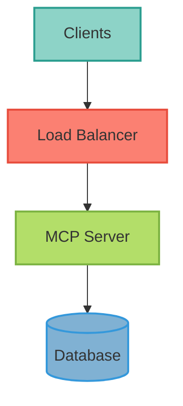

### Overview

[Provide a high-level overview of this deployment method. What is it? When should you use it? What are the key benefits?]

<Info>
  **Key Feature**: [Highlight a key differentiator or important note]
</Info>

### Prerequisites

* [Prerequisite 1]
* [Prerequisite 2]
* [Prerequisite 3]

### Quick Start

#### One-Command Deployment

```bash
## Command to deploy
./deploy.sh
```

[Explain what this command does]

### Step-by-Step Deployment

#### 1. Preparation

```bash
## Preparation commands
git clone https://github.com/your-org/your-repo
cd your-repo
```

[Explain the preparation steps]

#### 2. Configuration

Create or update configuration:

```yaml
## config.yaml
key: value
```

[Explain configuration options]

#### 3. Deploy

```bash
## Deployment command
kubectl apply -f deployment.yaml
```

[Explain deployment process]

#### 4. Verify

```bash
## Verification command
kubectl get pods
```

Expected output:
```text
NAME                     READY   STATUS    RESTARTS   AGE
mcp-server-xxxx          1/1     Running   0          2m
```

### Configuration

#### Environment Variables

| Variable | Description | Default | Required |
|----------|-------------|---------|----------|
| `VAR_NAME` | Description of variable | `default` | Yes |
| `VAR_NAME_2` | Description of variable | `default` | No |

#### Advanced Configuration

[Describe advanced configuration options]

### Architecture



[Explain the architecture diagram. Note: Always use ColorBrewer2 Set3 palette for diagram styling.]

### Scaling

[Explain how to scale this deployment]

```bash
## Example scaling command
kubectl scale deployment mcp-server --replicas=3
```

### Monitoring

[Explain how to monitor this deployment]

### Troubleshooting

#### Issue 1: [Common Issue]

**Symptoms**:
- [Symptom 1]
- [Symptom 2]

**Solution**:
```bash
## Fix command
kubectl logs pod-name
```

#### Issue 2: [Another Common Issue]

**Symptoms**:
- [Symptom 1]

**Solution**:
[Explanation of fix]

### Security Considerations

<Warning>
  **Important**: [Critical security consideration]
</Warning>

* [Security consideration 1]
* [Security consideration 2]

### Cost Optimization

[Tips for optimizing costs in this deployment]

### Next Steps

<CardGroup cols={2}>
  <Card title="Monitoring Setup" icon="chart-line" href="/deployment/monitoring">
    Set up monitoring and observability
  </Card>
  <Card title="Security Hardening" icon="shield-halved" href="/security/overview">
    Implement security best practices
  </Card>
</CardGroup>

### Related Documentation

* [Related Guide 1](/path/to/guide)
* [Related Guide 2](/path/to/guide)

### References

* [External Resource 1](https://example.com)
* [External Resource 2](https://example.com)
