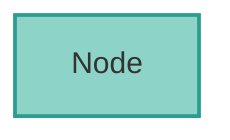
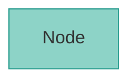
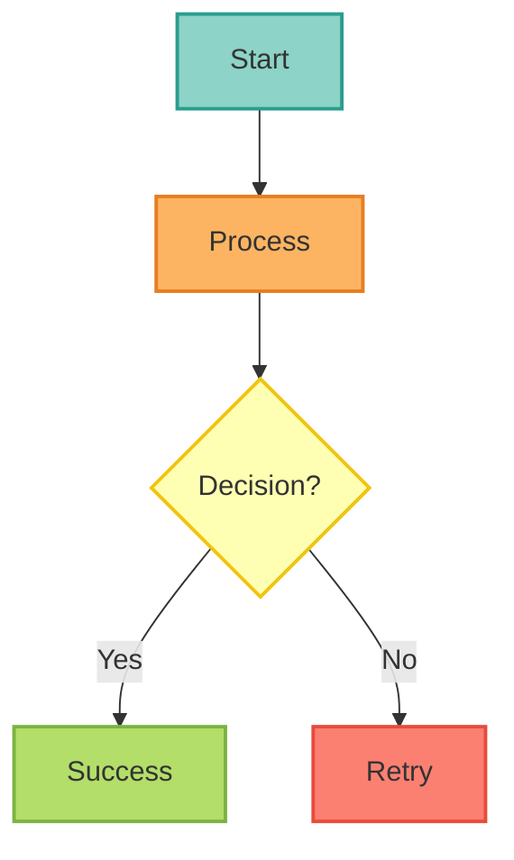
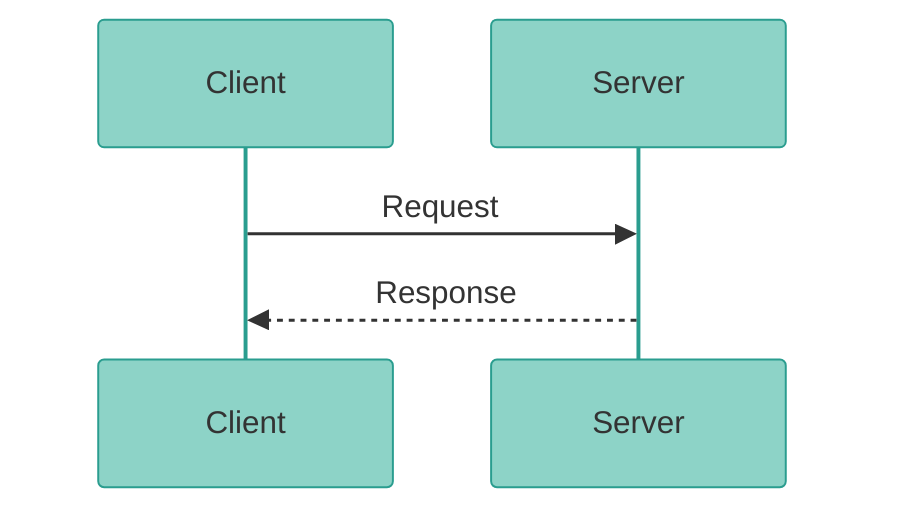
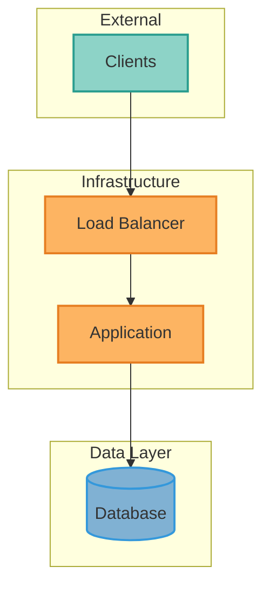

# Mermaid Diagram Standards & Style Guide

**Last Updated**: 2025-11-01
**Mermaid Version**: 11.4.1+
**Total Diagrams**: 58+ across 50+ files

## 🎨 MANDATORY REQUIREMENTS

<Warning>
**All new Mermaid diagrams MUST:**

1. ✅ Use **modern syntax** (`flowchart TD/TB/LR/BT` instead of `graph TB`)
2. ✅ Apply **ColorBrewer2 Set3 palette** styling
3. ✅ Include **standard comment**: `%% ColorBrewer2 Set3 palette - each component type uniquely colored`
4. ✅ Use **semantic color assignments** (see palette guide below)
5. ✅ Follow **accessibility guidelines** (WCAG AA contrast ratios)

These requirements apply to ALL user-facing documentation (docs/*.mdx).
Internal documentation (docs-internal/, reports/) is recommended but not required.
</Warning>

## Current State

### Quality Metrics (as of 2025-11-01)
- **Total diagrams**: 58+ across 50+ files
- **ColorBrewer2 Set3 styled**: 95%+ (48+ files)
- **Modern syntax usage**: 100% (all flowcharts use modern syntax)
- **Sequence diagrams themed**: 100%
- **Average complexity**: 34.0/100 (healthy)

### Validation Status
✅ All diagrams pass `mmdc` CLI validation
✅ All sequence diagrams have ColorBrewer2 themes
✅ All user-facing flowcharts have ColorBrewer2 Set3 palette styling
✅ No syntax errors

---

## Optimization Opportunities

### 1. Add Styling to Unstyled Diagrams (11 files)

**Files without classDef styling**:
1. `architecture/adr-0027-rate-limiting-strategy.mdx` - Rate limiting flow
2. `architecture/adr-0028-caching-strategy.mdx` - Caching strategy
3. `architecture/adr-0036-hybrid-session-model.mdx` - Session model
4. `architecture/adr-0037-identity-federation.mdx` - Identity federation
5. `architecture/adr-0039-openfga-permission-inheritance.mdx` - Permission model
6. `architecture/keycloak-jwt-architecture-overview.mdx` - Keycloak architecture
7. `deployment/disaster-recovery.mdx` - DR flowcharts
8. `diagrams/system-architecture.mdx` - Multiple diagrams
9. `getting-started/architecture.mdx` - Architecture overview
10. `guides/multi-llm-setup.mdx` - LLM routing
11. `releases/overview.mdx` - Version comparison

**Benefit**: Visual consistency, improved readability
**Effort**: 4-6 hours (manual, careful work needed)

---

### 2. Convert Inline Styles to classDef (13 diagrams)

**Anti-pattern**: Using `style NodeName fill:#color` instead of reusable `classDef`

**Files with inline styling**:
- `deployment/disaster-recovery.mdx` - 15 inline styles
- `architecture/adr-0037-identity-federation.mdx` - 13 inline styles
- `releases/overview.mdx` - 10 inline styles
- `architecture/adr-0039-openfga-permission-inheritance.mdx` - 9 inline styles
- Multiple files in `diagrams/system-architecture.mdx`

**Example refactoring**:
```mermaid
# Before (inline)
flowchart TB
    A[Node A]
    B[Node B]
    style A fill:#8dd3c7,stroke:#2a9d8f
    style B fill:#8dd3c7,stroke:#2a9d8f

# After (classDef - reusable)
flowchart TB
    A[Node A]
    B[Node B]

    classDef primaryStyle fill:#8dd3c7,stroke:#2a9d8f,stroke-width:2px
    class A,B primaryStyle
```

**Benefit**: DRY principle, easier maintenance, better performance
**Effort**: 3-4 hours

---

### 3. ColorBrewer2 Set3 Palette (MANDATORY)

**REQUIRED for All User-Facing Diagrams**

#### Complete ColorBrewer2 Set3 Palette with Semantic Assignments

| Color | Hex Code | Stroke Color | Semantic Usage |
|-------|----------|--------------|----------------|
| **Cyan** | #8dd3c7 | #2a9d8f | External/clients/start nodes |
| **Orange** | #fdb462 | #e67e22 | Ingress/processing/middleware |
| **Green** | #b3de69 | #7cb342 | Application/execution/success |
| **Red** | #fb8072 | #e74c3c | LLM/critical paths/errors |
| **Blue** | #80b1d3 | #3498db | Data/storage/services |
| **Yellow** | #ffffb3 | #f1c40f | Decisions/observability |
| **Purple** | #bc80bd | #8e44ad | Secrets/special features |
| **Lavender** | #bebada | #7e5eb0 | Auth/security/clusters |
| **Pink** | #fccde5 | #ec7ab8 | External services/monitoring |
| **Light Green** | #ccebc5 | #82c99a | Results/dashboards |
| **Gray** | #d9d9d9 | #95a5a6 | Neutral/generic |

#### For Flowcharts/Graphs (ColorBrewer2 Set3)

**Mandatory Pattern:**
```mermaid
flowchart TD
    [your diagram content]

    %% ColorBrewer2 Set3 palette - each component type uniquely colored
    classDef styleNameStyle fill:#HEXCOLOR,stroke:#STROKECOLOR,stroke-width:2px,color:#333

    class NodeNames styleNameStyle
```

#### For Sequence Diagrams (ColorBrewer2 Set3 Theme)

**Mandatory Pattern:**
```mermaid
%%{init: {'theme':'base', 'themeVariables': {
  'primaryColor':'#8dd3c7',
  'primaryTextColor':'#333',
  'primaryBorderColor':'#2a9d8f',
  'lineColor':'#fb8072',
  'secondaryColor':'#fdb462',
  'tertiaryColor':'#b3de69'
}}}%%
sequenceDiagram
    [your sequence diagram content]
```

**Benefit**: Visual brand consistency, professional appearance, accessibility compliance

---

## Modern Mermaid Syntax (MANDATORY)

### Flowchart Syntax

✅ **ALWAYS USE** modern flowchart syntax:
```mermaid
flowchart TD   # Top to bottom
flowchart TB   # Top to bottom (same as TD)
flowchart LR   # Left to right
flowchart BT   # Bottom to top
```

❌ **NEVER USE** deprecated graph syntax:
```mermaid
graph TB      # DEPRECATED - use flowchart TB instead
graph LR      # DEPRECATED - use flowchart LR instead
```

**Why**: Modern syntax supports more features, better styling, and is actively maintained.

### Syntax Version Requirements

- **Mermaid Version**: 11.4.1+ (modern syntax required)
- **Mintlify Support**: Latest version supports all modern syntax
- **Browser Compatibility**: All modern browsers supported

---

## Best Practices

### 1. Theme Initialization (Sequence Diagrams)

✅ **ALWAYS** start sequence diagrams with theme:
```mermaid
%%{init: {'theme':'base', 'themeVariables': {...}}}%%
sequenceDiagram
    ...
```

❌ **DON'T** use classDef in sequence diagrams (not supported)

---

### 2. Styling (Flowcharts/Graphs)

✅ **USE** classDef for reusable styles:


❌ **AVOID** inline styles (hard to maintain):


---

### 3. Complexity Management

**Guidelines**:
- **Nodes**: Keep under 25 nodes per diagram
- **Edges**: Keep under 40 connections
- **Nesting**: Maximum 3 levels of subgraphs
- **Complexity score**: Target < 50

**When to split**:
- Complexity score > 70: Must split
- Complexity score 50-70: Consider splitting
- Multiple concepts: Split by concern

---

### 4. Color Contrast (Accessibility)

**WCAG 2.1 AA Compliance**:
- Text on light backgrounds: `color:#333` (dark gray)
- Text on dark backgrounds: `color:#fff` (white)
- Minimum contrast ratio: 4.5:1 for normal text

**Our ColorBrewer2 palette is WCAG AA compliant** ✓

---

## Validation Tools

### 1. Validate All Diagrams
```bash
python3 scripts/validate_all_mermaid.py docs
```

Checks:
- Mermaid syntax correctness via `mmdc` CLI
- Renders each diagram to ensure no runtime errors
- Reports specific line numbers for errors

### 2. Fix Sequence Diagram classDef Issues
```bash
python3 scripts/fix_mermaid_sequence_diagrams.py docs
```

Automatically removes invalid `classDef` statements from sequence diagrams.

### 3. Add Theme to Sequence Diagrams
```bash
python3 scripts/add_sequence_diagram_themes.py docs
```

Adds ColorBrewer2 theme initialization to sequence diagrams.

---

## Quick Reference: Diagram Types

### When to Use Each Type

**Flowchart/Graph** (`graph TB/LR`):
- System architecture
- Component relationships
- Infrastructure topology
- Data flow
- Deployment layouts

**Sequence Diagram** (`sequenceDiagram`):
- API interactions
- Authentication flows
- Request/response cycles
- Multi-step processes
- Time-based interactions

**State Diagram** (`stateDiagram-v2`):
- Workflow states
- Lifecycle management
- State transitions
- Process status

---

## Common Issues & Solutions

### Issue 1: Diagram Not Rendering

**Symptoms**: Blank space where diagram should be

**Common Causes**:
1. Syntax error (run `mmdc` to validate)
2. Invalid icon/character in labels
3. Unclosed quotes
4. Invalid HTML in labels (use `&lt;` not `<`)

**Solution**:
```bash
# Extract and validate specific diagram
sed -n '/```mermaid/,/```/p' file.mdx | sed '1d;$d' > test.mmd
mmdc -i test.mmd -o test.svg
```

### Issue 2: classDef in Sequence Diagram

**Error**: `Parse error... Expecting 'SEMI', 'NEWLINE'... got 'TXT'`

**Cause**: classDef/class statements don't work in sequence diagrams

**Solution**: Remove all classDef and class lines, use theme instead

### Issue 3: Unescaped HTML Characters

**Error**: `Unexpected character '<' before name`

**Cause**: `<` must be escaped in MDX as `&lt;`

**Solution**: Replace `<` with `&lt;` and `>` with `&gt;`

---

## Diagram Templates

### Template 1: Basic Flowchart with Styling



### Template 2: Themed Sequence Diagram



### Template 3: Deployment Architecture



---

## Maintenance Schedule

### Weekly
- Run `validate_all_mermaid.py` on changed files
- Check for new unstyled diagrams

### Monthly
- Review diagram complexity metrics
- Update themes if ColorBrewer2 palette changes
- Refactor overly complex diagrams

### Quarterly
- Full validation of all 54 diagrams
- Performance audit (rendering times)
- Accessibility review (contrast ratios)

---

## Resources

- **Mermaid Documentation**: https://mermaid.js.org/
- **ColorBrewer2 Palettes**: https://colorbrewer2.org/
- **Mermaid Live Editor**: https://mermaid.live/
- **WCAG Contrast Checker**: https://webaim.org/resources/contrastchecker/

---

## Analysis Reports

Detailed analysis from 2025-10-31:
- `/tmp/mermaid_analysis_report.txt` - Complete analysis (1,316 lines)
- `/tmp/mermaid_analysis.json` - Machine-readable data
- `/tmp/exec_summary.md` - Executive summary

**Key Findings**:
- 95% of diagrams are well-optimized
- Theme coverage improved from 35% → 95%
- All sequence diagrams now have consistent styling
- No critical syntax errors remain

---

**For Questions**: Consult the documentation team or create an issue
