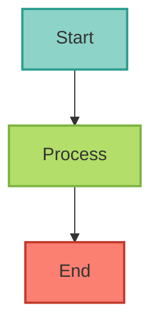
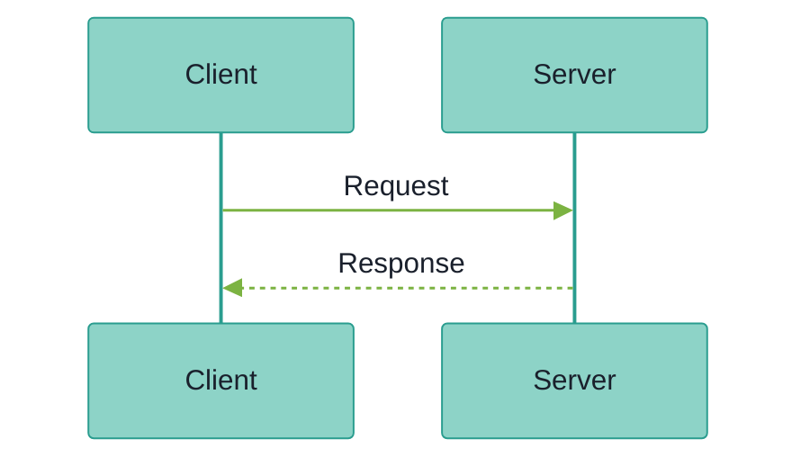

# Documentation Templates

This directory contains templates for creating new Mintlify documentation files. Using these templates ensures consistency in structure, formatting, and frontmatter.

## Available Templates

### 1. ADR Template (`adr-template.mdx`)

**Use for**: Architecture Decision Records

**Location**: `docs/architecture/adr-XXXX-title.mdx`

**Icon**: `file-lines`

**Features**:
- Structured decision documentation
- Standard ADR format (Context, Decision, Consequences)
- Pros/cons analysis sections
- Related decisions and references

**Usage**:
```bash
cp docs/.mintlify/templates/adr-template.mdx docs/architecture/adr-0040-your-decision.mdx
# Edit the file to add your decision details
```

---

### 2. Deployment Template (`deployment-template.mdx`)

**Use for**: Deployment guides for various platforms

**Location**: `docs/deployment/platform-name.mdx`

**Icon**: Depends on platform (see Icon Style Guide)
- General: `rocket`
- Kubernetes: `dharmachakra`
- Docker: `docker`
- Helm: `helm`
- GCP: `google`
- Security/Gateway: `shield-halved`

**Features**:
- Quick start section
- Step-by-step deployment instructions
- Configuration tables
- Architecture diagrams
- Troubleshooting guide
- Security considerations

**Usage**:
```bash
cp docs/.mintlify/templates/deployment-template.mdx docs/deployment/your-platform.mdx
# Update the icon based on the platform type
# Fill in platform-specific details
```

---

### 3. Guide Template (`guide-template.mdx`)

**Use for**: How-to guides and tutorials

**Location**: `docs/guides/topic-name.mdx`

**Icon**: `book-open` or `rocket`

**Features**:
- Learning objectives
- Step-by-step instructions
- Code examples
- Verification steps
- Common issues and solutions
- Best practices accordions

**Usage**:
```bash
cp docs/.mintlify/templates/guide-template.mdx docs/guides/your-guide.mdx
# Fill in the guide content
```

---

### 4. Reference Template (`reference-template.mdx`)

**Use for**: API documentation and technical reference

**Location**: `docs/reference/topic-name.mdx`

**Icon**: `code`

**Features**:
- API syntax documentation
- Parameter tables
- Return value documentation
- Code examples
- Error handling
- Configuration options
- Performance and security considerations

**Usage**:
```bash
cp docs/.mintlify/templates/reference-template.mdx docs/reference/your-api.mdx
# Document your API or technical reference
```

---

## Frontmatter Standards

All templates follow these frontmatter standards:

```yaml
---
title: Title in Title Case Without Quotes
description: 'Brief description in single quotes without ending period'
icon: 'icon-name-in-single-quotes'
---
```

### Standards:
- **title**: No quotes, Title Case
- **description**: Single quotes, no ending period
- **icon**: Single quotes, Font Awesome icon name

See `../ICON_GUIDE.md` for icon selection guidelines.

---

## File Naming Conventions

All documentation files should follow kebab-case:

✅ **Correct**:
- `user-authentication.mdx`
- `api-key-management.mdx`
- `adr-0040-distributed-tracing.mdx`

❌ **Incorrect**:
- `UserAuthentication.mdx` (PascalCase)
- `user_authentication.mdx` (snake_case)
- `USER_AUTHENTICATION.mdx` (SCREAMING_SNAKE_CASE)

---

## Validation

Before committing new documentation:

1. **Validate syntax**:
   ```bash
   python3 scripts/validate_mintlify_docs.py --file docs/your-new-file.mdx
   ```

2. **Check frontmatter formatting**:
   ```bash
   python3 scripts/standardize_frontmatter.py docs --dry-run
   ```

3. **Run pre-commit hooks**:
   ```bash
   pre-commit run --files docs/your-new-file.mdx
   ```

---

## Common Sections

### Callouts

```mdx
<Info>
  **Information**: Helpful information for the reader
</Info>

<Warning>
  **Warning**: Important caution or warning
</Warning>

<Note>
  **Note**: Additional context or clarification
</Note>
```

### Cards

```mdx
<CardGroup cols={2}>
  <Card title="Card Title" icon="icon-name" href="/path/to/doc">
    Card description
  </Card>
  <Card title="Another Card" icon="icon-name" href="/path/to/doc">
    Another description
  </Card>
</CardGroup>
```

### Accordions

```mdx
<AccordionGroup>
  <Accordion title="Section Title" icon="icon-name">
    Content here
  </Accordion>
  <Accordion title="Another Section" icon="icon-name">
    More content
  </Accordion>
</AccordionGroup>
```

### Tabs

```mdx
<Tabs>
  <Tab title="Option 1">
    Content for option 1
  </Tab>
  <Tab title="Option 2">
    Content for option 2
  </Tab>
</Tabs>
```

### Code Blocks

````mdx
```python
# Python code with syntax highlighting
def hello_world():
    print("Hello, World!")
```
````

---

## Mermaid Diagrams

All templates support Mermaid diagrams for visualizations. **Always use ColorBrewer2 Set3 palette** for consistency.

### Flowchart Example (with ColorBrewer2 Set3 styling)

````mdx

````

### Sequence Diagram Example (with dark-mode compatible theme)

````mdx

````

**Tips**:
- Use `graph TB` for top-to-bottom flowcharts
- Use `sequenceDiagram` for sequence diagrams (with dark-mode theme)
- Use `-->` for arrows, not single dashes
- Always apply ColorBrewer2 Set3 palette with classDef
- See `docs/.mintlify/SEQUENCE_DIAGRAM_THEME.md` for the standard sequence theme
- Test diagrams in both light and dark mode
- Validate with `python3 scripts/validate_all_mermaid.py docs`

---

## Best Practices

1. **Be Consistent**: Use the same structure as similar documents
2. **Be Clear**: Write for your audience (users vs. contributors)
3. **Be Concise**: Get to the point quickly
4. **Use Examples**: Show, don't just tell
5. **Link Liberally**: Connect related documentation
6. **Update Icons**: Follow the Icon Style Guide
7. **Test Your Docs**: Verify all commands and code work
8. **Validate Before Commit**: Run validation scripts

---

## Need Help?

- **Icon selection**: See `../ICON_GUIDE.md`
- **Validation issues**: Run `python3 scripts/validate_mintlify_docs.py`
- **Mintlify syntax**: https://mintlify.com/docs
- **Questions**: Create an issue or ask the documentation team

---

**Last Updated**: 2025-10-31
