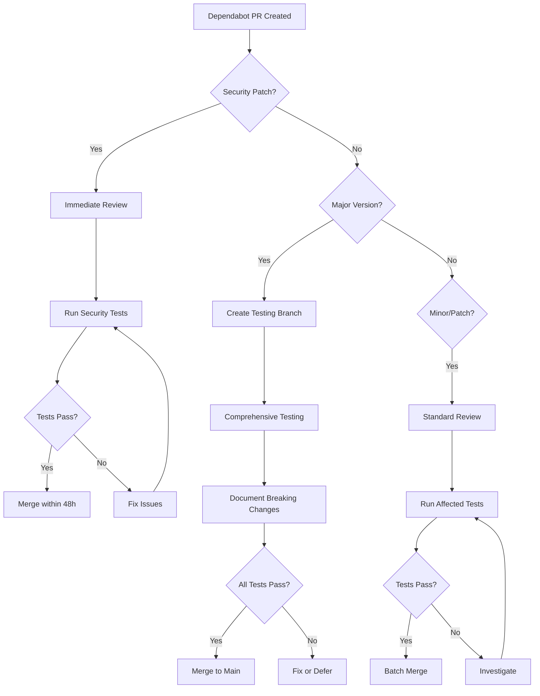

# Dependency Management Strategy

**MCP Server with LangGraph - Comprehensive Dependency Update Process**

**Version**: 1.0.0
**Last Updated**: 2025-10-13
**Owner**: Engineering Team

---

## Table of Contents

- [Overview](#overview)
- [Current State](#current-state)
- [Dependency Update Process](#dependency-update-process)
- [Testing Requirements](#testing-requirements)
- [Risk Assessment](#risk-assessment)
- [Rollback Procedures](#rollback-procedures)
- [Automation](#automation)
- [Monthly Audit Process](#monthly-audit-process)

---

## Overview

This document defines the strategy and process for managing dependencies in the MCP Server with LangGraph project. Our approach balances **security**, **stability**, and **feature velocity**.

### Principles

1. **Security First**: Critical security updates merged within 48 hours
2. **Stability**: Major version updates require comprehensive testing
3. **Automation**: Leverage Dependabot with intelligent grouping
4. **Single Source of Truth**: `pyproject.toml` is the authoritative dependency definition
5. **Transparency**: Document all breaking changes and migration paths

---

## Current State

### Open Dependabot PRs (as of 2025-10-13)

| PR # | Package | Current | Target | Type | Priority | Risk |
|------|---------|---------|--------|------|----------|------|
| #22 | langgraph | 0.2.28 | 0.6.10 | MAJOR | P0 | HIGH |
| #23 | fastapi | 0.109.0 | 0.119.0 | MINOR | P1 | MEDIUM |
| #32 | cryptography | 42.0.2 | 42.0.8 | PATCH | P1 | LOW |
| #30 | PyJWT | 2.8.0 | 2.10.1 | MINOR | P1 | LOW |
| #29 | openfga-sdk | 0.5.0 | 0.9.7 | MINOR | P1 | MEDIUM |
| #24 | mypy | 1.8.0 | 1.18.2 | MINOR | P2 | LOW |
| #31 | pytest-mock | 3.12.0 | 3.15.1 | MINOR | P2 | VERY LOW |
| #28 | pytest-xdist | 3.5.0 | 3.8.0 | MINOR | P2 | VERY LOW |
| #33 | respx | 0.20.2 | 0.22.0 | MINOR | P2 | VERY LOW |
| #34 | faker | 22.0.0 | 22.7.0 | MINOR | P2 | VERY LOW |
| #26 | actions/checkout | 4 | 5 | MAJOR | P1 | LOW |
| #25 | actions/labeler | 5 | 6 | MAJOR | P2 | VERY LOW |
| #21 | actions/download-artifact | 4 | 5 | MAJOR | P2 | VERY LOW |

### Dependency File Inconsistencies

**Problem**: We have version mismatches between `pyproject.toml` and `requirements.txt`:

| Package | pyproject.toml | requirements.txt | Status |
|---------|----------------|------------------|--------|
| litellm | `>=1.52.3` | `>=1.50.0` | ❌ Inconsistent |
| cryptography | `>=42.0.2` | `>=41.0.0` | ❌ Inconsistent |
| opentelemetry-api | `>=1.22.0` | `>=1.21.0` | ❌ Inconsistent |
| fastapi | `>=0.109.0` | `>=0.104.0` | ❌ Inconsistent |

**Solution**: Consolidate to `pyproject.toml` as single source of truth.

---

## Dependency Update Process

### Update Classification

#### **Critical Security (SLA: 48 hours)**
- **Definition**: CVE with severity HIGH or CRITICAL
- **Action**: Immediate review and merge
- **Testing**: Smoke tests + security validation
- **Example**: `cryptography` security patches

#### **Major Version (SLA: 2-4 weeks)**
- **Definition**: Breaking API changes (X.y.z → X+1.y.z)
- **Action**: Comprehensive testing required
- **Testing**: Full test suite + manual validation
- **Example**: `langgraph 0.2.28 → 0.6.10`

#### **Minor Version (SLA: 1-2 weeks)**
- **Definition**: New features, backward compatible (x.Y.z → x.Y+1.z)
- **Action**: Standard testing
- **Testing**: Affected component tests
- **Example**: `fastapi 0.109.0 → 0.119.0`

#### **Patch Version (SLA: 1 month)**
- **Definition**: Bug fixes (x.y.Z → x.y.Z+1)
- **Action**: Low-priority batch update
- **Testing**: Regression tests
- **Example**: `cryptography 42.0.2 → 42.0.8`

### Process Workflow



---

## Testing Requirements

### Pre-Merge Checklist

#### For ALL Dependency Updates:
```bash
# 1. Create test branch
git checkout -b deps/test-<package>-<version>

# 2. Install updated dependency
pip install -e ".[dev]"

# 3. Run unit tests
pytest -m unit --tb=short -v

# 4. Run security scan
bandit -r src/

# 5. Run linting
make lint

# 6. Check for dependency conflicts
pip check
```

#### For Major Version Updates:
```bash
# Additional tests for major updates

# 1. Run ALL test suites
pytest tests/ -v --tb=short

# 2. Run integration tests
pytest -m integration

# 3. Run property-based tests
pytest -m property

# 4. Manual testing
make run-dev
# Perform manual smoke tests

# 5. Performance regression
pytest -m regression --benchmark-only

# 6. Documentation review
# Check for API changes requiring doc updates
```

#### Package-Specific Tests

##### **LangGraph (0.2.28 → 0.6.10)**
```bash
# Test agent state machine
pytest tests/test_agent.py -v

# Test checkpointing
pytest tests/ -k checkpoint -v

# Test streaming modes
pytest tests/ -k stream -v

# Manual MCP protocol testing
# Test via MCP client (Claude Desktop, etc.)
```

##### **FastAPI (0.109.0 → 0.119.0)**
```bash
# Test all REST endpoints
pytest tests/test_gdpr.py -v
pytest tests/test_health_check.py -v

# Test Pydantic v2 compatibility
pytest tests/ -k pydantic -v

# Manual API testing
curl http://localhost:8000/health
curl http://localhost:8000/api/v1/users/me/data
```

##### **OpenFGA SDK (0.5.0 → 0.9.7)**
```bash
# Test authorization layer
pytest tests/test_openfga_client.py -v
pytest tests/test_auth.py -k openfga -v

# Test tuple operations
pytest tests/ -k tuple -v
```

---

## Risk Assessment

### Risk Matrix

| Package | Version Jump | Breaking Changes | Test Coverage | Risk Level | Mitigation |
|---------|--------------|------------------|---------------|------------|------------|
| **langgraph** | 0.2 → 0.6 | HIGH | 99 tests | 🔴 **HIGH** | Feature branch + 2-week testing |
| **fastapi** | 0.109 → 0.119 | MEDIUM | 30+ tests | 🟡 **MEDIUM** | Test all APIs |
| **openfga-sdk** | 0.5 → 0.9 | MEDIUM | 35+ tests | 🟡 **MEDIUM** | Test authorization |
| **cryptography** | 42.0.2 → 42.0.8 | NONE | Implicit | 🟢 **LOW** | Test JWT/encryption |
| **pytest-*** | Various | NONE | Self-testing | 🟢 **VERY LOW** | Run test suite |

### Critical Components

**Components most affected by dependency updates**:

1. **Agent Core** (`src/mcp_server_langgraph/core/agent.py`)
   - Depends on: `langgraph`, `langchain-core`
   - Risk: HIGH for LangGraph major updates

2. **Authentication** (`src/mcp_server_langgraph/auth/`)
   - Depends on: `PyJWT`, `cryptography`, `python-keycloak`
   - Risk: MEDIUM for crypto/JWT updates

3. **Authorization** (`src/mcp_server_langgraph/auth/openfga.py`)
   - Depends on: `openfga-sdk`
   - Risk: MEDIUM for OpenFGA updates

4. **REST API** (`src/mcp_server_langgraph/api/`)
   - Depends on: `fastapi`, `pydantic`, `uvicorn`
   - Risk: MEDIUM for FastAPI updates

5. **Observability** (`src/mcp_server_langgraph/observability/`)
   - Depends on: `opentelemetry-*`
   - Risk: LOW (stable API)

---

## Rollback Procedures

### Immediate Rollback (Production Issue)

```bash
# 1. Identify the problematic commit
git log --oneline -10

# 2. Revert the dependency update
git revert <commit-hash>

# 3. Push to production
git push origin main

# 4. Verify rollback
# Check that old version is installed
pip show <package-name>
```

### Temporary Pin (Blocking Issue)

```bash
# Edit pyproject.toml
# Change:   package>=x.y.z
# To:       package==x.y.z-old

# Reinstall
pip install -e .

# Test
pytest -m unit

# Commit temporary pin
git add pyproject.toml
git commit -m "chore(deps): temporarily pin <package> to <version> due to <issue>"
git push origin main
```

### Long-term Rollback Strategy

**Maintain compatibility branches**:
```bash
# Before major update, create compatibility branch
git checkout -b compat/langgraph-0.2.x
git push origin compat/langgraph-0.2.x

# Can return to this branch if needed within 30 days
```

---

## Automation

### Dependabot Configuration

**Current State** (`.github/dependabot.yml`):
```yaml
version: 2
updates:
  - package-ecosystem: "pip"
    directory: "/"
    schedule:
      interval: "weekly"
    open-pull-requests-limit: 10
    ignore:
      - dependency-name: "*"
        update-types: ["version-update:semver-major"]
```

**Recommended Enhancements**:

1. **Group Related Updates**:
```yaml
groups:
  github-actions:
    patterns:
      - "actions/*"
      - "docker/*"
      - "azure/*"
    update-types:
      - "minor"
      - "patch"

  testing:
    patterns:
      - "pytest*"
      - "respx"
      - "faker"
      - "hypothesis*"
    update-types:
      - "minor"
      - "patch"

  opentelemetry:
    patterns:
      - "opentelemetry-*"
    update-types:
      - "minor"
      - "patch"
```

2. **Allow Major Updates for Critical Packages**:
```yaml
ignore:
  # Only ignore major updates for stable packages
  - dependency-name: "pydantic"
    update-types: ["version-update:semver-major"]
  # Allow major updates for actively developed packages
  # (langgraph, fastapi, etc.)
```

### Automated Dependency Testing

**Create `.github/workflows/dependency-test.yml`**:
```yaml
name: Dependency Update Test
on:
  pull_request:
    paths:
      - 'pyproject.toml'
      - 'requirements*.txt'

jobs:
  test-dependencies:
    runs-on: ubuntu-latest
    strategy:
      matrix:
        python-version: ['3.10', '3.11', '3.12']

    steps:
      - uses: actions/checkout@v5

      - name: Set up Python ${{ matrix.python-version }}
        uses: actions/setup-python@v5
        with:
          python-version: ${{ matrix.python-version }}

      - name: Install dependencies
        run: |
          pip install -e ".[dev]"

      - name: Run unit tests
        run: |
          pytest -m unit --tb=short -v

      - name: Run security scan
        run: |
          pip install pip-audit
          pip-audit --desc

      - name: Check dependency tree
        run: |
          pip check
```

### Automated Security Scanning

**Create `.github/workflows/security-audit.yml`**:
```yaml
name: Security Audit
on:
  schedule:
    - cron: '0 0 * * 1'  # Weekly on Monday
  workflow_dispatch:

jobs:
  security-audit:
    runs-on: ubuntu-latest
    steps:
      - uses: actions/checkout@v5

      - name: Set up Python
        uses: actions/setup-python@v5
        with:
          python-version: '3.12'

      - name: Install dependencies
        run: |
          pip install -e ".[dev]"

      - name: Run pip-audit
        run: |
          pip install pip-audit
          pip-audit --desc --format=json > security-audit.json

      - name: Upload audit results
        uses: actions/upload-artifact@v4
        with:
          name: security-audit
          path: security-audit.json

      - name: Create issue for vulnerabilities
        if: failure()
        uses: actions/github-script@v8
        with:
          script: |
            github.rest.issues.create({
              owner: context.repo.owner,
              repo: context.repo.repo,
              title: '🚨 Security Vulnerabilities Detected',
              body: 'Automated security audit found vulnerabilities. See workflow run for details.',
              labels: ['security', 'dependencies']
            })
```

---

## Monthly Audit Process

### Audit Checklist

**First Monday of Every Month**:

- [ ] Review all open Dependabot PRs
- [ ] Run dependency audit script
- [ ] Check for outdated packages
- [ ] Review security advisories
- [ ] Plan major version updates
- [ ] Update this document

### Audit Script

**Create `scripts/dependency-audit.sh`**:
```bash
#!/bin/bash
# Monthly dependency audit script

echo "========================================"
echo "  Dependency Audit Report"
echo "  Date: $(date)"
echo "========================================"
echo ""

# Check for outdated packages
echo "=== Outdated Packages ==="
pip list --outdated --format=columns
echo ""

# Security vulnerabilities
echo "=== Security Vulnerabilities ==="
pip-audit --desc
echo ""

# License compliance
echo "=== License Compliance ==="
pip-licenses --format=markdown --order=license
echo ""

# Dependency tree conflicts
echo "=== Dependency Conflicts ==="
pip check
echo ""

# Summary
echo "=== Summary ==="
echo "Total packages: $(pip list --format=json | jq 'length')"
echo "Outdated: $(pip list --outdated --format=json | jq 'length')"
echo ""
echo "Report saved to: dependency-audit-$(date +%Y%m%d).txt"
```

**Run Monthly**:
```bash
chmod +x scripts/dependency-audit.sh
./scripts/dependency-audit.sh | tee dependency-audit-$(date +%Y%m%d).txt
```

---

## Implementation Timeline

### Week 1: Immediate Actions (Oct 13-20, 2025)
- [x] Document dependency management strategy
- [x] Create monthly audit script (`scripts/dependency-audit.sh`)
- [x] Run initial dependency audit (see `DEPENDENCY_AUDIT_REPORT_20251013.md`)
- [x] Fix black vulnerability (CVE-2024-21503): 24.1.1 → 25.9.0
- [ ] Merge security patches (cryptography, PyJWT)
- [ ] Batch merge CI/CD actions
- [ ] Batch merge test framework updates
- [ ] Update Dependabot config with grouping
- [ ] Consolidate dependency files (deprecate requirements.txt)

### Week 2: Testing Major Updates
- [ ] Test LangGraph 0.6.10 in feature branch
- [ ] Test FastAPI 0.119.0
- [ ] Test OpenFGA SDK 0.9.7
- [ ] Document breaking changes

### Week 3: Merge Non-Critical Updates
- [ ] Merge FastAPI (if tests pass)
- [ ] Merge OpenFGA SDK (if tests pass)
- [ ] Merge mypy 1.18.2
- [ ] Merge test framework updates

### Week 4: LangGraph Migration
- [ ] Final comprehensive testing
- [ ] Update agent documentation
- [ ] Merge LangGraph 0.6.10
- [ ] Release v2.3.0

---

## References

- **Dependabot Documentation**: https://docs.github.com/en/code-security/dependabot
- **Python Packaging Guide**: https://packaging.python.org/
- **Semantic Versioning**: https://semver.org/
- **pip-audit**: https://github.com/pypa/pip-audit

---

## Change Log

| Date | Version | Changes | Author |
|------|---------|---------|--------|
| 2025-10-13 | 1.0.0 | Initial dependency management strategy | Claude Code |

---

**Document Owner**: Engineering Team
**Review Frequency**: Quarterly
**Next Review**: 2026-01-13
