## Overview

Connection Templates provide pre-configured settings for connecting to popular MCP servers. Templates reduce setup time by providing default URLs, OAuth2 scopes, and configuration fields for each service.

<Info>
Connection templates are read-only. To create an actual connection from a template, use the [Connections API](/api-reference/connections) with the template's pre-filled values.

```mermaid
flowchart LR
    subgraph Templates["Connection Templates"]
        List["/connection-templates"]
        Get["/connection-templates/{id}"]
        Suggestions["/connection-templates/suggestions"]
        Categories["/connection-templates/categories"]
        Apply["/connection-templates/{id}/apply"]
    end

    subgraph Services["Supported Services"]
        GitHub["GitHub"]
        Slack["Slack"]
        Notion["Notion"]
        Custom["Custom API"]
    end

    Templates --> Services

    classDef templateStyle fill:#b3e2cd,stroke:#1a9850,stroke-width:2px,color:#333
    classDef serviceStyle fill:#fdcdac,stroke:#f4a582,stroke-width:2px,color:#333

    class List,Get,Suggestions,Categories,Apply templateStyle
    class GitHub,Slack,Notion,Custom serviceStyle
```

</Info>



## Base URL

```yaml
/api/v1/connection-templates
```

---

## Endpoints

### GET /connection-templates

List all available connection templates.

<ParamField query="category" type="string">
  Filter by category (e.g., "development", "productivity", "communication")
</ParamField>

<ParamField query="auth_type" type="string">
  Filter by authentication type: "none", "api_key", or "oauth2"
</ParamField>

<ParamField query="search" type="string">
  Search templates by name or description
</ParamField>

**Request**:

```bash
curl -X GET "http://localhost:8000/api/v1/connection-templates" \
  -H "Authorization: Bearer $TOKEN"
```

**Response**:

```json
{
  "items": [
    {
      "id": "github",
      "name": "GitHub",
      "description": "Access GitHub repositories, issues, and pull requests",
      "icon": "github",
      "auth_type": "oauth2",
      "default_url": "https://api.github.com/mcp",
      "category": "development",
      "oauth2_scopes": ["repo", "user", "read:org"],
      "config_fields": [],
      "keywords": ["github", "pr", "pull request", "repository", "commit", "issue", "repo", "git"],
      "popularity": 95,
      "documentation_url": "https://docs.github.com/"
    },
    {
      "id": "slack",
      "name": "Slack",
      "description": "Access Slack channels and messages",
      "icon": "slack",
      "auth_type": "oauth2",
      "default_url": "https://slack.com/api/mcp",
      "category": "communication",
      "oauth2_scopes": ["channels:read", "chat:write", "users:read"],
      "config_fields": [],
      "keywords": ["slack", "channel", "message", "dm", "workspace", "thread"],
      "popularity": 90,
      "documentation_url": "https://api.slack.com/"
    }
  ],
  "total": 12
}
```

---

### GET /connection-templates/{id}

Get a specific connection template by ID.

<ParamField path="id" type="string" required>
  The template ID (e.g., "github", "slack", "notion")
</ParamField>

**Request**:

```bash
curl -X GET "http://localhost:8000/api/v1/connection-templates/github" \
  -H "Authorization: Bearer $TOKEN"
```

**Response**:

```json
{
  "id": "github",
  "name": "GitHub",
  "description": "Access GitHub repositories, issues, and pull requests",
  "icon": "github",
  "auth_type": "oauth2",
  "default_url": "https://api.github.com/mcp",
  "category": "development",
  "oauth2_scopes": ["repo", "user", "read:org"],
  "config_fields": [],
  "keywords": ["github", "pr", "pull request", "repository", "commit", "issue", "repo", "git"],
  "popularity": 95,
  "documentation_url": "https://docs.github.com/"
}
```

---

### GET /connection-templates/suggestions

<Note>
**New in Phase 5**: Intent-based template suggestions for proactive connection prompts in chat.
</Note>

Match templates by natural language query using keyword matching. Returns templates sorted by relevance and popularity.

<ParamField query="query" type="string" required>
  Natural language query to match against template keywords and names.
  Minimum length: 1 character. Maximum length: 200 characters.
</ParamField>

<ParamField query="limit" type="integer" default="3">
  Maximum number of suggestions to return. Range: 1-10.
</ParamField>

**Request**:

```bash
# Get suggestions for a GitHub-related query
curl -X GET "http://localhost:8000/api/v1/connection-templates/suggestions?query=check%20my%20pull%20requests" \
  -H "Authorization: Bearer $TOKEN"
```

**Response**:

```json
{
  "items": [
    {
      "id": "github",
      "name": "GitHub",
      "description": "Access GitHub repositories, issues, and pull requests",
      "icon": "github",
      "auth_type": "oauth2",
      "default_url": "https://api.github.com/mcp",
      "category": "development",
      "oauth2_scopes": ["repo", "user", "read:org"],
      "config_fields": [],
      "keywords": ["github", "pr", "pull request", "repository", "commit", "issue", "repo", "git"],
      "popularity": 95,
      "documentation_url": "https://docs.github.com/"
    },
    {
      "id": "gitlab",
      "name": "GitLab",
      "description": "Access GitLab repositories and merge requests",
      "icon": "gitlab",
      "auth_type": "oauth2",
      "default_url": "https://gitlab.com/api/v4/mcp",
      "category": "development",
      "oauth2_scopes": ["read_api", "read_repository"],
      "config_fields": [],
      "keywords": ["gitlab", "merge request", "mr", "repository", "ci", "pipeline"],
      "popularity": 70,
      "documentation_url": "https://docs.gitlab.com/ee/api/"
    }
  ],
  "total": 2
}
```

**Matching Algorithm**:

The suggestions endpoint uses a scoring algorithm:

1. **Keyword matches** (weight: 2x): Each keyword found in the query
2. **Name match** (weight: 3x): Template name appears in query
3. **Word matches** (weight: 1x): Query words that appear in template keywords

Templates are sorted by score (descending), then by popularity (descending).

**Use Cases**:

- **Proactive Chat Suggestions**: Show "This might need GitHub access" when user types "check my PRs"
- **Smart Connection Discovery**: Surface relevant connectors based on user intent
- **Inline Connection Card**: Pre-select the best template when auth is required

---

### GET /connection-templates/categories

List all available template categories.

**Request**:

```bash
curl -X GET "http://localhost:8000/api/v1/connection-templates/categories" \
  -H "Authorization: Bearer $TOKEN"
```

**Response**:

```json
{
  "items": [
    {
      "id": "development",
      "name": "Development",
      "description": "Code repositories and developer tools"
    },
    {
      "id": "productivity",
      "name": "Productivity",
      "description": "Project management and documentation"
    },
    {
      "id": "communication",
      "name": "Communication",
      "description": "Chat and messaging platforms"
    },
    {
      "id": "local",
      "name": "Local",
      "description": "Local file system and databases"
    },
    {
      "id": "custom",
      "name": "Custom",
      "description": "Custom API integrations"
    }
  ],
  "total": 5
}
```

---

### POST /connection-templates/{id}/apply

Apply a template to generate connection configuration. This validates required fields and merges template defaults with user input.

<ParamField path="id" type="string" required>
  The template ID to apply
</ParamField>

<ParamField body="name" type="string" required>
  Name for the new connection
</ParamField>

<ParamField body="url" type="string">
  Override the default URL (optional)
</ParamField>

<ParamField body="config" type="object">
  Template-specific configuration fields
</ParamField>

**Request**:

```bash
curl -X POST "http://localhost:8000/api/v1/connection-templates/github/apply" \
  -H "Authorization: Bearer $TOKEN" \
  -H "Content-Type: application/json" \
  -d '{
    "name": "My GitHub Connection",
    "config": {}
  }'
```

**Response**:

```json
{
  "name": "My GitHub Connection",
  "url": "https://api.github.com/mcp",
  "auth_type": "oauth2",
  "oauth2_scopes": ["repo", "user", "read:org"],
  "template_id": "github"
}
```

<Tip>
Use the response from `/apply` to create an actual connection via `POST /api/v1/connections`.
</Tip>

---

## Template Schema

### ConnectionTemplate

| Field | Type | Description |
|-------|------|-------------|
| `id` | string | Unique template identifier |
| `name` | string | Display name |
| `description` | string | Human-readable description |
| `icon` | string | Icon identifier (e.g., "github", "slack") |
| `auth_type` | string | Authentication type: "none", "api_key", "oauth2" |
| `default_url` | string | Default MCP server URL |
| `category` | string | Category ID (development, productivity, etc.) |
| `oauth2_scopes` | string[] | Required OAuth2 scopes (if auth_type is oauth2) |
| `config_fields` | ConfigField[] | Custom configuration fields |
| `keywords` | string[] | Keywords for intent matching |
| `popularity` | integer | Popularity score (0-100) for sorting |
| `documentation_url` | string\|null | Link to service documentation |

### ConfigField

| Field | Type | Description |
|-------|------|-------------|
| `name` | string | Field identifier |
| `label` | string | Display label |
| `type` | string | Input type: "text", "password", "url", "textarea" |
| `required` | boolean | Whether field is required |
| `placeholder` | string | Placeholder text |
| `description` | string | Help text |
| `default` | string | Default value (optional) |

---

## Available Templates

| ID | Name | Auth Type | Category |
|----|------|-----------|----------|
| `github` | GitHub | OAuth2 | development |
| `gitlab` | GitLab | OAuth2 | development |
| `slack` | Slack | OAuth2 | communication |
| `notion` | Notion | OAuth2 | productivity |
| `jira` | Jira | OAuth2 | productivity |
| `linear` | Linear | OAuth2 | productivity |
| `filesystem` | Filesystem | None | local |
| `sqlite` | SQLite | None | local |
| `custom-api` | Custom API | API Key | custom |
| `custom-oauth2` | Custom OAuth2 | OAuth2 | custom |

---

## Error Responses

### Template Not Found

```json
{
  "detail": "Template not found: unknown-template"
}
```
HTTP Status: 404

### Validation Error

```json
{
  "detail": [
    {
      "loc": ["query", "query"],
      "msg": "ensure this value has at least 1 characters",
      "type": "value_error.any_str.min_length"
    }
  ]
}
```
HTTP Status: 422

---

## Related APIs

- [Connections API](/api-reference/connections) - Create and manage actual connections
- [MCP Endpoints](/api-reference/mcp-endpoints) - Model Context Protocol operations
