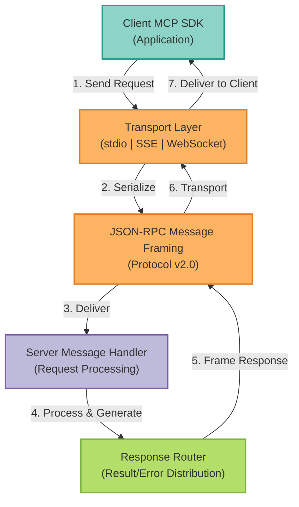

## Overview

MCP messages define the communication format between clients and servers. This reference documents all message types, their structure, and usage patterns.

<Info>
MCP follows a request-response pattern similar to JSON-RPC 2.0 with extensions for streaming and bidirectional communication.
</Info>

## Protocol Transport Architecture

The MCP protocol supports multiple transport layers for communication between clients and servers. The diagram below illustrates how messages flow through the system:



### Transport Options

<AccordionGroup>
  <Accordion title="Standard I/O (stdio)" icon="terminal">
    Process-based communication using stdin/stdout. Best for local CLI integrations.

    ```bash
    # Server reads from stdin, writes to stdout
    echo '{"jsonrpc":"2.0","id":1,"method":"initialize"}' | mcp-server
    ```
  </Accordion>

  <Accordion title="Server-Sent Events (SSE)" icon="broadcast-tower">
    HTTP-based one-way streaming from server to client. Ideal for web applications.

    ```javascript
    const eventSource = new EventSource('/mcp/stream');
    eventSource.onmessage = (event) => {
      const message = JSON.parse(event.data);
      // Handle message
    };
    ```
  </Accordion>

  <Accordion title="WebSocket" icon="plug">
    Full-duplex bidirectional communication. Best for real-time interactive applications.

    ```python
    import websockets
    async with websockets.connect('ws://localhost:8000/mcp/ws') as ws:
        await ws.send(json.dumps(request))
        response = await ws.recv()
    ```
  </Accordion>
</AccordionGroup>

## Message Structure

All MCP messages follow this base structure:

```json
{
  "jsonrpc": "2.0",
  "id": "request-123",
  "method": "tools/call",
  "params": {
    "name": "chat",
    "arguments": {"query": "Hello"}
  }
}
```
<ParamField path="jsonrpc" type="string" required>
  Protocol version, always `"2.0"`
</ParamField>

<ParamField path="id" type="string | number" required>
  Unique request identifier for matching responses
</ParamField>

<ParamField path="method" type="string" required>
  The method to invoke (e.g., `"tools/call"`, `"resources/read"`)
</ParamField>

<ParamField path="params" type="object">
  Method-specific parameters
</ParamField>

## Response Messages

### Success Response

```json
{
  "jsonrpc": "2.0",
  "id": "request-123",
  "result": {
    "content": [
      {
        "type": "text",
        "text": "Hello! How can I help you?"
      }
    ]
  }
}
```

### Error Response

```json
{
  "jsonrpc": "2.0",
  "id": "request-123",
  "error": {
    "code": -32602,
    "message": "Invalid params",
    "data": {
      "field": "query",
      "reason": "Required field missing"
    }
  }
}
```
## Error Codes

| Code | Message | Description |
|------|---------|-------------|
| -32700 | Parse error | Invalid JSON |
| -32600 | Invalid Request | Invalid request object |
| -32601 | Method not found | Method does not exist |
| -32602 | Invalid params | Invalid method parameters |
| -32603 | Internal error | Internal server error |
| -32000 | Server error | Generic server error |

## Message Types

### Initialize

**Request**:
```json
{
  "jsonrpc": "2.0",
  "id": 1,
  "method": "initialize",
  "params": {
    "protocolVersion": "2024-11-05",
    "capabilities": {
      "roots": {
        "listChanged": true
      },
      "sampling": {}
    },
    "clientInfo": {
      "name": "example-client",
      "version": "1.0.0"
    }
  }
}
```

**Response**:
```json
{
  "jsonrpc": "2.0",
  "id": 1,
  "result": {
    "protocolVersion": "2024-11-05",
    "capabilities": {
      "logging": {},
      "prompts": {
        "listChanged": true
      },
      "resources": {
        "subscribe": true,
        "listChanged": true
      },
      "tools": {
        "listChanged": true
      }
    },
    "serverInfo": {
      "name": "mcp-server-langgraph",
      "version": "2.8.0"
    }
  }
}
```
### Tools/List

**Request**:
```json
{
  "jsonrpc": "2.0",
  "id": 2,
  "method": "tools/list",
  "params": {}
}
```

**Response**:
```json
{
  "jsonrpc": "2.0",
  "id": 2,
  "result": {
    "tools": [
      {
        "name": "chat",
        "description": "Chat with the AI agent",
        "inputSchema": {
          "type": "object",
          "properties": {
            "query": {
              "type": "string",
              "description": "User query"
            }
          },
          "required": ["query"]
        }
      }
    ]
  }
}
```
### Tools/Call

**Request**:
```json
{
  "jsonrpc": "2.0",
  "id": 3,
  "method": "tools/call",
  "params": {
    "name": "chat",
    "arguments": {
      "query": "What is the weather?",
      "conversation_id": "conv_123"
    }
  }
}
```

**Response**:
```json
{
  "jsonrpc": "2.0",
  "id": 3,
  "result": {
    "content": [
      {
        "type": "text",
        "text": "I don't have access to real-time weather data. Please check a weather service."
      }
    ],
    "isError": false
  }
}
```
### Resources/List

**Request**:
```json
{
  "jsonrpc": "2.0",
  "id": 4,
  "method": "resources/list",
  "params": {}
}
```

**Response**:
```json
{
  "jsonrpc": "2.0",
  "id": 4,
  "result": {
    "resources": [
      {
        "uri": "conversation://conv_123",
        "name": "Conversation History",
        "description": "Chat conversation context",
        "mimeType": "application/json"
      }
    ]
  }
}
```
### Resources/Read

**Request**:
```json
{
  "jsonrpc": "2.0",
  "id": 5,
  "method": "resources/read",
  "params": {
    "uri": "conversation://conv_123"
  }
}
```

**Response**:
```json
{
  "jsonrpc": "2.0",
  "id": 5,
  "result": {
    "contents": [
      {
        "uri": "conversation://conv_123",
        "mimeType": "application/json",
        "text": "{\"messages\": [...]}"
      }
    ]
  }
}
```
### Prompts/List

**Request**:
```json
{
  "jsonrpc": "2.0",
  "id": 6,
  "method": "prompts/list",
  "params": {}
}
```

**Response**:
```json
{
  "jsonrpc": "2.0",
  "id": 6,
  "result": {
    "prompts": [
      {
        "name": "code_review",
        "description": "Review code for quality and best practices",
        "arguments": [
          {
            "name": "code",
            "description": "Code to review",
            "required": true
          }
        ]
      }
    ]
  }
}
```
### Prompts/Get

**Request**:
```json
{
  "jsonrpc": "2.0",
  "id": 7,
  "method": "prompts/get",
  "params": {
    "name": "code_review",
    "arguments": {
      "code": "def add(a, b): return a + b"
    }
  }
}
```

**Response**:
```json
{
  "jsonrpc": "2.0",
  "id": 7,
  "result": {
    "description": "Review code for quality and best practices",
    "messages": [
      {
        "role": "user",
        "content": {
          "type": "text",
          "text": "Please review this code:\n\ndef add(a, b): return a + b"
        }
      }
    ]
  }
}
```
## Content Types

### Text Content

```json
{
  "type": "text",
  "text": "This is plain text content"
}
```

### Image Content

```json
{
  "type": "image",
  "data": "base64-encoded-image-data",
  "mimeType": "image/png"
}
```
### Resource Content

```json
{
  "type": "resource",
  "resource": {
    "uri": "file:///path/to/file.txt",
    "mimeType": "text/plain",
    "text": "File contents"
  }
}
```

## Notifications

Notifications are messages sent without expecting a response (no `id` field):

### Tools/ListChanged

```json
{
  "jsonrpc": "2.0",
  "method": "notifications/tools/list_changed"
}
```
### Resources/ListChanged

```json
{
  "jsonrpc": "2.0",
  "method": "notifications/resources/list_changed"
}
```

### Resources/Updated

```json
{
  "jsonrpc": "2.0",
  "method": "notifications/resources/updated",
  "params": {
    "uri": "conversation://conv_123"
  }
}
```
## Streaming Messages

For streaming responses, the server sends multiple messages:

### Content Start

```json
{
  "jsonrpc": "2.0",
  "id": 8,
  "result": {
    "type": "content_start"
  }
}
```

### Content Delta

```json
{
  "jsonrpc": "2.0",
  "id": 8,
  "result": {
    "type": "content_delta",
    "delta": "Quantum computing"
  }
}
```
### Content End

```json
{
  "jsonrpc": "2.0",
  "id": 8,
  "result": {
    "type": "content_end",
    "conversation_id": "conv_123",
    "usage": {
      "prompt_tokens": 20,
      "completion_tokens": 150,
      "total_tokens": 170
    }
  }
}
```

## Progress Updates

For long-running operations:

```json
{
  "jsonrpc": "2.0",
  "method": "notifications/progress",
  "params": {
    "progressToken": "token-123",
    "progress": 50,
    "total": 100
  }
}
```
## Example Flows

### Complete Chat Interaction

```python
import asyncio
import json
import httpx

async def chat_example():
    async with httpx.AsyncClient() as client:
        # 1. Initialize
        init_response = await client.post(
            "http://localhost:8000/mcp",
            json={
                "jsonrpc": "2.0",
                "id": 1,
                "method": "initialize",
                "params": {
                    "protocolVersion": "2024-11-05",
                    "clientInfo": {"name": "example", "version": "1.0"}
                }
            },
            headers={"Authorization": f"Bearer {token}"}
        )
        print("Initialized:", init_response.json())

        # 2. List tools
        tools_response = await client.post(
            "http://localhost:8000/mcp",
            json={
                "jsonrpc": "2.0",
                "id": 2,
                "method": "tools/list"
            },
            headers={"Authorization": f"Bearer {token}"}
        )
        print("Available tools:", tools_response.json())

        # 3. Call chat tool
        chat_response = await client.post(
            "http://localhost:8000/mcp",
            json={
                "jsonrpc": "2.0",
                "id": 3,
                "method": "tools/call",
                "params": {
                    "name": "chat",
                    "arguments": {"query": "Hello!"}
                }
            },
            headers={"Authorization": f"Bearer {token}"}
        )
        result = chat_response.json()
        print("Response:", result["result"]["content"][0]["text"])

asyncio.run(chat_example())
```

### Batch Requests

Send multiple requests in a single HTTP call:

```json
[
  {
    "jsonrpc": "2.0",
    "id": 1,
    "method": "tools/list"
  },
  {
    "jsonrpc": "2.0",
    "id": 2,
    "method": "resources/list"
  },
  {
    "jsonrpc": "2.0",
    "id": 3,
    "method": "prompts/list"
  }
]
```
**Response**:
```json
[
  {
    "jsonrpc": "2.0",
    "id": 1,
    "result": {"tools": [...]}
  },
  {
    "jsonrpc": "2.0",
    "id": 2,
    "result": {"resources": [...]}
  },
  {
    "jsonrpc": "2.0",
    "id": 3,
    "result": {"prompts": [...]}
  }
]
```

## Validation

### Request Validation

All requests must:
- Include `jsonrpc: "2.0"`
- Have a unique `id` (except notifications)
- Specify a valid `method`
- Provide required `params` for the method

### Response Validation

Clients should validate:
- Response `id` matches request `id`
- Either `result` or `error` is present (not both)
- Content types match expected formats

## Best Practices

<AccordionGroup>
  <Accordion title="Use Unique IDs" icon="fingerprint">
    Always use unique IDs for requests to prevent confusion:

    ```python
    import uuid

    request_id = str(uuid.uuid4())

    request = {
        "jsonrpc": "2.0",
        "id": request_id,
        "method": "tools/call",
        "params": {...}
    }
    ```
  </Accordion>

  <Accordion title="Handle Errors Gracefully" icon="shield-check">
    Always check for error responses:

    ```python
    response = await client.post(url, json=request)
    data = response.json()

    if "error" in data:
        code = data["error"]["code"]
        message = data["error"]["message"]
        raise Exception(f"MCP Error {code}: {message}")

    return data["result"]
    ```
  </Accordion>

  <Accordion title="Implement Timeouts" icon="clock">
    Set reasonable timeouts for requests:

    ```python
    async with httpx.AsyncClient(timeout=30.0) as client:
        response = await client.post(url, json=request)
    ```
  </Accordion>

  <Accordion title="Use Batch Requests" icon="layer-group">
    Combine multiple requests to reduce latency:

    ```python
    batch = [
        {"jsonrpc": "2.0", "id": 1, "method": "tools/list"},
        {"jsonrpc": "2.0", "id": 2, "method": "resources/list"}
    ]

    responses = await client.post(url, json=batch)
    ```
  </Accordion>
</AccordionGroup>

## Next Steps

<CardGroup cols={2}>
  <Card title="MCP Endpoints" icon="server" href="/api-reference/mcp-endpoints">
    Available endpoints
  </Card>
  <Card title="MCP Tools" icon="wrench" href="/api-reference/mcp/tools">
    Tool reference
  </Card>
  <Card title="MCP Resources" icon="database" href="/api-reference/mcp/resources">
    Resource types
  </Card>
  <Card title="Authentication" icon="key" href="/api-reference/authentication">
    Get auth tokens
  </Card>
</CardGroup>

---

<Check>
**MCP Messages**: Standardized communication protocol for AI applications!
</Check>
