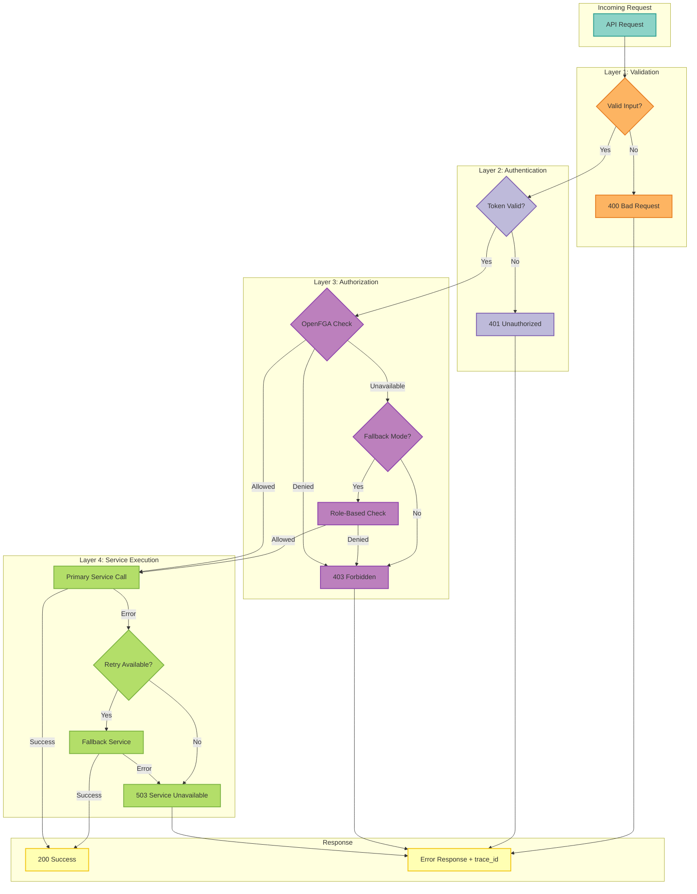
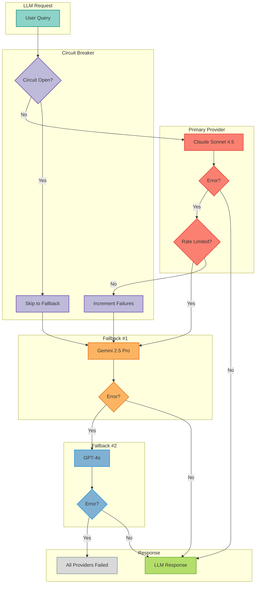

# 17. Error Handling Strategy

Date: 2025-10-13

## Status

Accepted

## Category

Core Architecture

## Context

The MCP Server with LangGraph needs a consistent, production-grade error handling strategy that:
- Provides clear error messages to users
- Enables debugging with sufficient context
- Maintains security by not leaking sensitive information
- Supports observability and monitoring
- Handles failures gracefully with appropriate fallback mechanisms
- Complies with enterprise SLAs and uptime requirements

## Decision

We will implement a **layered error handling strategy** with the following principles:

### 1. Error Categories

We categorize all errors into five types:

#### Client Errors (4xx)
- **Authentication Errors** (401): Invalid or expired credentials
- **Authorization Errors** (403): Insufficient permissions
- **Validation Errors** (400): Invalid input data
- **Not Found Errors** (404): Resource doesn't exist

#### Server Errors (5xx)
- **Internal Errors** (500): Unexpected server failures
- **Service Unavailable** (503): Temporary service disruption
- **Timeout Errors** (504): Operation exceeded time limit

### 2. Error Propagation Pattern

```
Layer 1: Infrastructure (Database, External APIs)
   ↓
Layer 2: Service Layer (Business Logic)
   ↓
Layer 3: API Layer (Controllers/Handlers)
   ↓
Layer 4: Client (User-facing error messages)
```

**Rules**:
- **Catch at appropriate layer**: Catch errors where you have context to handle them
- **Add context**: Each layer adds relevant context before re-raising
- **Transform sensitive errors**: Never expose infrastructure details to clients
- **Log once**: Log at the layer where you handle the error, not at every layer

### 3. Error Response Format

All API errors return a consistent JSON structure:

```json
{
  "error": {
    "code": "AUTHENTICATION_FAILED",
    "message": "Invalid credentials",
    "details": {
      "reason": "token_expired",
      "timestamp": "2025-10-13T12:00:00Z"
    },
    "trace_id": "abc123",
    "request_id": "req_xyz"
  }
}
```

**Fields**:
- `code`: Machine-readable error code (uppercase snake_case)
- `message`: Human-readable error message
- `details`: Additional context (optional, non-sensitive)
- `trace_id`: OpenTelemetry trace ID for debugging
- `request_id`: Request identifier

### 4. Retry Strategy

#### Automatic Retries
- **LLM API Calls**: 3 retries with exponential backoff (1s, 2s, 4s)
- **OpenFGA Checks**: 2 retries with 500ms backoff
- **Redis Operations**: 2 retries with 100ms backoff

#### No Retries
- Authentication failures (permanent failures)
- Validation errors (requires user correction)
- Resource not found (won't exist on retry)

### 5. Fallback Mechanisms

#### Error Handling & Recovery Flow



#### Multi-Provider LLM Fallback Decision Tree



#### LLM Fallback
When primary model fails:
```
1. Try fallback model #1 (gemini-2.5-pro)
2. Try fallback model #2 (claude-sonnet-4-5)
3. Try fallback model #3 (gpt-5.1)
4. Return error if all fail
```

#### Authorization Fallback
When OpenFGA is unavailable:
```python
if openfga_strict_mode:
    # Fail-closed: deny all requests
    return deny_access("Authorization service unavailable")
else:
    # Fail-open: use role-based fallback
    return check_fallback_authorization(user, resource)
```

#### Session Storage Fallback
When Redis is unavailable:
```
Redis (primary) → InMemory (fallback) → Error
```

### 6. Logging Strategy

#### Error Logging Levels

- **ERROR**: Unexpected failures requiring investigation
  - Database connection failures
  - External API errors (after retries)
  - Unhandled exceptions

- **WARNING**: Expected failures with fallback handling
  - OpenFGA timeout (using fallback)
  - LLM primary model failure (trying fallback)
  - Rate limit approaching threshold

- **INFO**: Normal operational events
  - Successful fallback execution
  - Retry attempts
  - Circuit breaker state changes

#### Log Structure

```python
logger.error(
    "LLM API call failed after retries",
    extra={
        "error_code": "LLM_API_ERROR",
        "provider": "google",
        "model": "gemini-2.5-flash",
        "retry_count": 3,
        "trace_id": trace_id,
        "user_id": user_id
    },
    exc_info=True  # Include stack trace
)
```

### 7. OpenTelemetry Integration

All errors are captured in distributed traces:

```python
with tracer.start_as_current_span("llm.call") as span:
    try:
        result = await llm.call(prompt)
        span.set_status(StatusCode.OK)
    except LLMAPIError as e:
        span.set_status(StatusCode.ERROR, str(e))
        span.record_exception(e)
        raise
```

**Span Attributes**:
- `error.type`: Exception class name
- `error.message`: Error message
- `error.stack`: Stack trace (truncated)
- `error.recoverable`: Whether error is recoverable

### 8. Error Codes

#### Authentication/Authorization (AUTH_*)
- `AUTH_INVALID_CREDENTIALS`: Invalid username/password
- `AUTH_TOKEN_EXPIRED`: JWT token expired
- `AUTH_TOKEN_INVALID`: Malformed or invalid token
- `AUTH_INSUFFICIENT_PERMISSIONS`: User lacks required permissions
- `AUTH_SESSION_EXPIRED`: Session no longer valid
- `AUTH_MFA_REQUIRED`: Multi-factor authentication required

#### Validation (VALIDATION_*)
- `VALIDATION_REQUIRED_FIELD`: Required field missing
- `VALIDATION_INVALID_FORMAT`: Field format incorrect
- `VALIDATION_OUT_OF_RANGE`: Value outside allowed range
- `VALIDATION_CONSTRAINT_VIOLATION`: Business rule violated

#### Resource (RESOURCE_*)
- `RESOURCE_NOT_FOUND`: Requested resource doesn't exist
- `RESOURCE_ALREADY_EXISTS`: Resource already exists (conflict)
- `RESOURCE_LOCKED`: Resource is locked by another process
- `RESOURCE_QUOTA_EXCEEDED`: Resource quota limit reached

#### Infrastructure (INFRA_*)
- `INFRA_DATABASE_ERROR`: Database connection/query failure
- `INFRA_REDIS_ERROR`: Redis connection/operation failure
- `INFRA_OPENFGA_ERROR`: OpenFGA service error
- `INFRA_NETWORK_ERROR`: Network connectivity issue

#### External Service (EXT_*)
- `EXT_LLM_API_ERROR`: LLM provider API error
- `EXT_LLM_RATE_LIMIT`: LLM rate limit exceeded
- `EXT_KEYCLOAK_ERROR`: Keycloak authentication error
- `EXT_INFISICAL_ERROR`: Infisical secrets retrieval error

#### Internal (INTERNAL_*)
- `INTERNAL_UNEXPECTED_ERROR`: Unhandled exception
- `INTERNAL_TIMEOUT`: Operation timeout
- `INTERNAL_CIRCUIT_BREAKER_OPEN`: Circuit breaker protecting service

### 9. Error Metrics

Track error rates with Prometheus:

```python
error_counter = Counter(
    "mcp_errors_total",
    "Total errors by type and layer",
    ["error_code", "layer", "severity"]
)

error_duration = Histogram(
    "mcp_error_handling_duration_seconds",
    "Time spent handling errors",
    ["error_code"]
)
```

### 10. Security Considerations

**Never expose**:
- Database connection strings
- Internal IP addresses or service names
- Authentication secrets or tokens
- Full stack traces (only trace_id for debugging)
- SQL queries or database schema details
- API keys or credentials

**Always sanitize**:
- User input in error messages
- File paths (show relative, not absolute)
- Email addresses (show partial: a***@acme.com)

## Implementation Examples

### Example 1: Authentication Error

```python
# auth/middleware.py
async def verify_token(self, token: str) -> TokenVerification:
    """Verify JWT token with proper error handling"""

    with tracer.start_as_current_span("auth.verify_token") as span:
        try:
            payload = jwt.decode(
                token,
                self.secret_key,
                algorithms=[self.algorithm]
            )
            span.set_attribute("user_id", payload["user_id"])
            return TokenVerification(valid=True, user_id=payload["user_id"])

        except jwt.ExpiredSignatureError:
            span.set_status(StatusCode.ERROR, "Token expired")
            logger.warning(
                "Token verification failed: expired",
                extra={
                    "error_code": "AUTH_TOKEN_EXPIRED",
                    "trace_id": span.get_span_context().trace_id
                }
            )
            return TokenVerification(
                valid=False,
                error_code="AUTH_TOKEN_EXPIRED",
                error_message="Authentication token has expired"
            )

        except jwt.InvalidTokenError as e:
            span.set_status(StatusCode.ERROR, str(e))
            logger.warning(
                "Token verification failed: invalid",
                extra={
                    "error_code": "AUTH_TOKEN_INVALID",
                    "trace_id": span.get_span_context().trace_id
                }
            )
            return TokenVerification(
                valid=False,
                error_code="AUTH_TOKEN_INVALID",
                error_message="Invalid authentication token"
            )
```

### Example 2: LLM Fallback

```python
# llm/factory.py
async def create_llm_with_fallback(
    self,
    model: str,
    temperature: float = 0.7
) -> ChatModel:
    """Create LLM with automatic fallback"""

    models_to_try = [model] + self.fallback_models

    for attempt, model_name in enumerate(models_to_try):
        try:
            logger.info(
                f"Attempting LLM creation: {model_name}",
                extra={"model": model_name, "attempt": attempt + 1}
            )

            llm = await self._create_llm(model_name, temperature)

            # Test the LLM with a simple call
            await llm.ainvoke("test")

            if attempt > 0:
                # Successfully failed over
                logger.warning(
                    "LLM fallback successful",
                    extra={
                        "primary_model": model,
                        "fallback_model": model_name,
                        "attempt": attempt + 1
                    }
                )

            return llm

        except Exception as e:
            logger.error(
                f"LLM creation failed: {model_name}",
                extra={
                    "model": model_name,
                    "error": str(e),
                    "attempt": attempt + 1,
                    "is_last_attempt": attempt == len(models_to_try) - 1
                },
                exc_info=True if attempt == len(models_to_try) - 1 else False
            )

            if attempt == len(models_to_try) - 1:
                # All models failed
                raise LLMCreationError(
                    f"All LLM models failed after {len(models_to_try)} attempts",
                    error_code="EXT_LLM_API_ERROR",
                    models_tried=models_to_try
                )
```

### Example 3: Service Layer Error

```python
# core/compliance/data_export.py
async def export_user_data(
    self,
    user_id: str,
    username: str,
    email: str
) -> UserDataExport:
    """Export user data with comprehensive error handling"""

    with tracer.start_as_current_span("data_export.export_user_data") as span:
        span.set_attribute("user_id", user_id)

        try:
            # Gather data from multiple sources
            sessions = await self._get_user_sessions(user_id)

            export = UserDataExport(
                user_id=user_id,
                username=username,
                email=email,
                sessions=sessions,
                # ... other fields
            )

            span.set_status(StatusCode.OK)
            return export

        except Exception as e:
            # Add context and re-raise
            span.set_status(StatusCode.ERROR, str(e))
            span.record_exception(e)

            logger.error(
                "User data export failed",
                extra={
                    "user_id": user_id,
                    "error_code": "INTERNAL_EXPORT_ERROR",
                    "error": str(e)
                },
                exc_info=True
            )

            raise DataExportError(
                f"Failed to export data for user {user_id}",
                error_code="INTERNAL_EXPORT_ERROR",
                user_id=user_id
            ) from e
```

## Consequences

### Positive
- **Consistency**: All errors follow the same structure and patterns
- **Debuggability**: Trace IDs link errors to distributed traces
- **Reliability**: Fallback mechanisms prevent single points of failure
- **Observability**: Comprehensive metrics and logging
- **Security**: No sensitive information leaked in error messages

### Negative
- **Complexity**: Developers must understand error categorization
- **Overhead**: Additional logging and tracing adds latency (minimal)
- **Maintenance**: Error codes must be documented and maintained

### Mitigation
- Provide error handling templates and examples
- Create linting rules to enforce patterns
- Document all error codes in centralized registry
- Monitor error handling overhead in production

## Related ADRs
- [0003: Dual Observability Strategy](https://github.com/vishnu2kmohan/mcp-server-langgraph/blob/main/adr/adr-0003-dual-observability.md)
- [0001: Multi-Provider LLM Support](https://github.com/vishnu2kmohan/mcp-server-langgraph/blob/main/adr/adr-0001-llm-multi-provider.md)

## References
- [Google SRE: Error Handling](https://sre.google/sre-book/handling-overload/)
- [12 Factor App: Logs](https://12factor.net/logs)
- [OpenTelemetry Error Handling](https://opentelemetry.io/docs/instrumentation/python/manual/#errors)
- [OWASP: Error Handling](https://owasp.org/www-community/Improper_Error_Handling)
