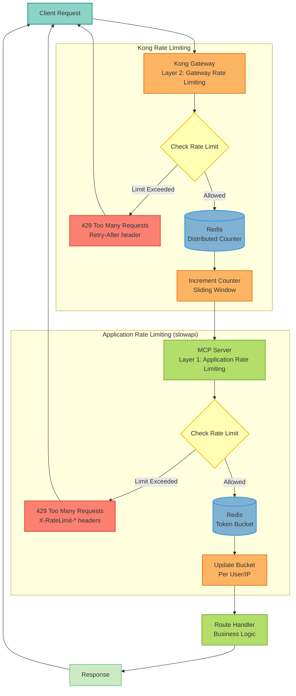
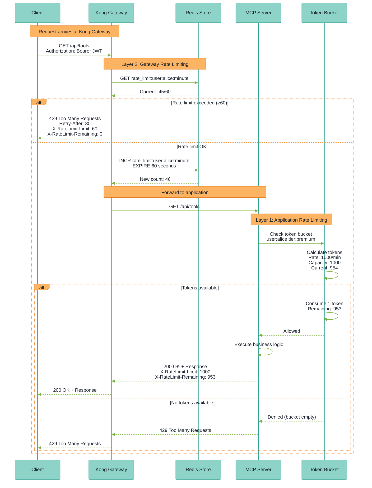

## ADR-0027: Rate Limiting Strategy for API Protection

<Note>
**Status**: Accepted
**Date**: 2025-10-20
**Deciders**: Engineering Team, Security Team
</Note>

### Context

The MCP server exposes HTTP endpoints without rate limiting, creating vulnerabilities:

- **Denial of Service (DoS)**: Malicious actors can overwhelm the system
- **Resource exhaustion**: Uncontrolled resource consumption
- **Cost explosion**: Uncontrolled LLM API usage leading to high bills
- **Brute force attacks**: Unlimited authentication attempts
- **Data scraping**: Automated extraction of sensitive data

#### Risk Assessment

- **Likelihood**: HIGH (public API)
- **Impact**: CRITICAL (service unavailability, financial loss)
- **CVSS Score**: 7.5 (High) - DoS vulnerability

#### Compliance Requirements

- **SOC 2**: Access controls and abuse prevention
- **GDPR**: Prevent excessive data processing
- **OWASP Top 10**: A05:2021 - Security Misconfiguration

### Decision

Implement a **hybrid rate limiting strategy** with two layers:

#### Rate Limiting Architecture


**Rate Limiting Flow with Token Bucket**:


#### Layer 1: Application-Level Rate Limiting (Immediate)

**Implementation**: FastAPI middleware using `slowapi` library.

**Why slowapi**:
- Native FastAPI/Starlette support
- Redis-backed for distributed rate limiting
- Decorator-based API (developer-friendly)
- Customizable response codes and headers
- IP address and user-based limiting

##### Tiered Rate Limits

| Tier | Requests/Min | Requests/Hour | Requests/Day | Use Case |
|------|--------------|---------------|--------------|----------|
| **Anonymous** | 10 | 100 | 1,000 | Public endpoints |
| **Free** | 60 | 1,000 | 10,000 | Registered users |
| **Standard** | 300 | 5,000 | 50,000 | Paid tier 1 |
| **Premium** | 1,000 | 20,000 | 200,000 | Paid tier 2 |
| **Enterprise** | Unlimited | Unlimited | Unlimited | Enterprise contracts |

##### Response Headers

```http
X-RateLimit-Limit: 60
X-RateLimit-Remaining: 45
X-RateLimit-Reset: 1697654400
Retry-After: 30
```
##### Rate Limit Exceeded Response

```json
{
  "error": {
    "code": "rate_limit_exceeded",
    "message": "Rate limit exceeded. Try again in 30 seconds.",
    "tier": "free",
    "limit": "60 requests/min",
    "retry_after": 30
  }
}
```

#### Layer 2: Kong API Gateway (Production)

**Implementation**: Deploy Kong gateway in front of MCP server.

**Why Kong**:
- Industry-standard API gateway
- Advanced rate limiting algorithms (sliding window, fixed window, leaky bucket)
- Per-consumer, per-route, global limits
- Rate limit sharing across cluster
- Plugin ecosystem (auth, logging, monitoring)

```yaml
plugins:
  - name: rate-limiting
    config:
      minute: 60
      hour: 1000
      day: 10000
      policy: redis
      redis_host: redis
      redis_port: 6379
      fault_tolerant: true
      hide_client_headers: false
```
### Architecture

#### New Module Structure

```text
src/mcp_server_langgraph/
└── middleware/
    └── rate_limiter.py  # Rate limiting middleware
```
#### FastAPI Integration

```python
from slowapi import Limiter
from mcp_server_langgraph.middleware.rate_limiter import limiter

app = FastAPI()
app.state.limiter = limiter

@app.post("/api/v1/agent_chat")
@limiter.limit("60/minute")
async def agent_chat(request: Request, message: str):
    return await handle_chat(message)

@app.get("/health")
@limiter.exempt  # No rate limit for health checks
async def health_check():
    return {"status": "healthy"}
```

#### Endpoint-Specific Limits

```python
RATE_LIMITS = {
    "auth": "10/minute",      # Login (prevent brute force)
    "llm": "30/minute",       # LLM endpoints (cost control)
    "search": "100/minute",   # Search endpoints
    "read": "200/minute",     # Read-only endpoints
}
```
### Configuration

#### Environment Variables

```bash
## Rate Limiting
RATE_LIMIT_ENABLED=true
RATE_LIMIT_STORAGE_URI=redis://localhost:6379
RATE_LIMIT_STRATEGY=fixed-window

## Tier Limits (requests per minute)
RATE_LIMIT_ANONYMOUS=10
RATE_LIMIT_FREE=60
RATE_LIMIT_STANDARD=300
RATE_LIMIT_PREMIUM=1000
RATE_LIMIT_ENTERPRISE=999999

## Advanced
RATE_LIMIT_FAIL_OPEN=true  # Allow if Redis is down
```

#### Feature Flags

```python
FF_ENABLE_RATE_LIMITING=true
FF_RATE_LIMIT_ENFORCEMENT_MODE=enforce  # enforce, log_only, disabled
```
### Metrics & Observability

#### New Metrics

```python
## Rate limit violations
rate_limit_exceeded_total{tier, endpoint, limit_type}
rate_limit_remaining{tier, endpoint}

## Redis health
rate_limiter_redis_errors_total
rate_limiter_redis_latency_seconds

## Abuse detection
suspicious_activity_total{ip, user_id, reason}
```

#### Prometheus Alerts

```yaml
- alert: HighRateLimitViolations
  expr: rate(rate_limit_exceeded_total[5m]) > 10
  for: 5m

- alert: PossibleDoSAttack
  expr: rate(rate_limit_exceeded_total{tier="anonymous"}[1m]) > 100
  for: 1m
```
### Consequences

#### Positive

<Check>**DoS Protection** - Prevent resource exhaustion from malicious actors</Check>
<Check>**Cost Control** - Cap LLM API usage per user</Check>
<Check>**Fair Resource Allocation** - Ensure equitable access for all users</Check>
<Check>**Compliance** - Meet SOC 2 access control requirements</Check>
<Check>**Monetization** - Enable tiered pricing (free, standard, premium)</Check>

#### Negative

<Warning>**Legitimate Users Blocked** - Burst traffic may hit limits</Warning>
<Warning>**Configuration Complexity** - Need to tune limits per endpoint</Warning>
<Warning>**Performance Overhead** - Redis lookup on every request (~1-2ms)</Warning>

#### Mitigations

1. **Start Conservative**: High initial limits, lower based on usage
2. **Burst Allowance**: Allow short bursts above limit
3. **Whitelist**: Exempt trusted IPs, monitoring tools
4. **Clear Communication**: Display limits in API docs
5. **Graceful Degradation**: Fall back to in-memory if Redis down

### Alternatives Considered

#### Alternative 1: NGINX Rate Limiting
- **Pros**: High performance, battle-tested
- **Cons**: Limited to IP-based, no user-tier support
- **Decision**: Use for infrastructure layer, slowapi for application logic

#### Alternative 2: Cloudflare Rate Limiting
- **Pros**: DDoS protection, global edge network
- **Cons**: Vendor lock-in, cost, limited customization
- **Decision**: Keep as option for enterprise deployments

#### Alternative 3: Token Bucket Algorithm (Custom)
- **Pros**: Full control, optimal for burst traffic
- **Cons**: Complex implementation, testing overhead
- **Decision**: Use slowapi (proven library) instead

### Implementation Status

#### Dependencies

```bash
uv add slowapi
```

#### Files Created

- `src/mcp_server_langgraph/middleware/rate_limiter.py` - Rate limiting middleware
- `monitoring/prometheus/alerts/rate_limiting.yaml` - Prometheus alerts
- `monitoring/grafana/dashboards/rate-limiting.json` - Grafana dashboard

### Success Metrics

| Metric | Target | Measurement |
|--------|--------|-------------|
| **Security** | 0 successful DoS attacks | No service degradation from single source |
| **Performance** | < 2ms latency overhead | P95 latency with vs without rate limiting |
| **User Experience** | < 1% false positives | rate_limit_exceeded / http_requests < 0.01 |
| **Cost Control** | LLM costs capped | Daily cost tracking per user ID |

### Related

- [ADR-0026: Resilience Patterns](/architecture/adr-0030-resilience-patterns)
- [Kong Gateway Integration](/deployment/kong-gateway)
- [Security Best Practices](/security/best-practices)

---

**Last Updated**: 2025-10-20
**Next Review**: 2025-11-20
