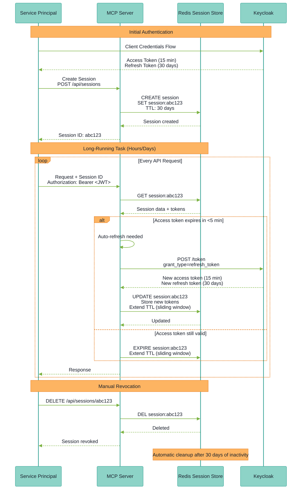

# 36. Hybrid Session Model for Long-Running Tasks

Date: 2025-01-28

## Status

Accepted

## Context

JWT-based authentication (ADR-0032) uses short-lived access tokens (15 minutes) for security, but this conflicts with long-running tasks:
- Batch ETL jobs running 6-12 hours
- Streaming WebSocket connections
- Background processors with persistent queues
- Scheduled reports generated over hours
- Real-time data pipelines

Challenges:
- 15-minute tokens inadequate for multi-hour tasks
- Client-side refresh complex for background processes
- Purely stateless JWT can't be revoked mid-session
- Service principals need 30-day authentication

Current system: Stateless JWTs only (no server-side sessions).

## Decision

Implement a **Hybrid Session Model** where standard users use stateless JWTs with client-side refresh, while service principals optionally use server-side sessions with automatic token refresh for long-running tasks.

### Architecture

**Mode 1: Stateless JWT (Default for Users)**:
- 15-minute access tokens
- 30-minute refresh tokens
- Client-side refresh logic
- No server-side storage

**Mode 2: Hybrid Session (Service Principals)**:
- 15-minute access tokens (still short)
- 30-day refresh tokens stored in Redis
- Server-side automatic refresh before expiration
- Session TTL: 30 days with sliding window

### Hybrid Session Architecture Comparison

```mermaid
graph TB
    subgraph "Mode 1: Stateless JWT (Interactive Users)"
        U1[User: alice] --> KC1[Keycloak Login]
        KC1 --> JWT1[Access Token: 15 min<br/>Refresh Token: 30 min]
        JWT1 --> Client1[Client App]
        Client1 --> Refresh1{Token expires?}
        Refresh1 -->|Yes| ClientRefresh[Client refreshes<br/>via Keycloak]
        ClientRefresh --> JWT1
        Refresh1 -->|No| API1[API Request]
        API1 --> Validate1[Validate JWT<br/>No server state]
        Validate1 --> Response1[Response]

        NoSession1[No Redis Storage] -.->|Not needed| Validate1
    end

    subgraph "Mode 2: Hybrid Session (Service Principals)"
        SP1[Service Principal:<br/>batch-etl-job] --> KC2[Client Credentials]
        KC2 --> JWT2[Access Token: 15 min<br/>Refresh Token: 30 days]
        JWT2 --> Session[Create Session in Redis]
        Session --> Redis[(Redis Session Store<br/>TTL: 30 days)]

        SP1 --> API2[API Request<br/>+ Session ID]
        API2 --> Check[Check Session]
        Check --> Redis
        Redis --> AutoRefresh{Expires in <5 min?}
        AutoRefresh -->|Yes| ServerRefresh[Server auto-refreshes<br/>via Keycloak]
        ServerRefresh --> UpdateSession[Update session tokens]
        UpdateSession --> Redis
        AutoRefresh -->|No| Validate2[Validate JWT]
        Validate2 --> SlidingWindow[Extend TTL<br/>Sliding window]
        SlidingWindow --> Redis
        Validate2 --> Response2[Response]
    end

    style U1 fill:#8dd3c7,stroke:#2a9d8f,stroke-width:2px
    style SP1 fill:#fdb462,stroke:#e67e22,stroke-width:2px
    style KC1 fill:#bebada,stroke:#8e44ad,stroke-width:2px
    style KC2 fill:#bebada,stroke:#8e44ad,stroke-width:2px
    style Redis fill:#fb8072,stroke:#c0392b,stroke-width:2px
    style NoSession1 fill:#f0f0f0,stroke:#999,stroke-dasharray: 5 5
    style JWT1 fill:#ffffb3,stroke:#f39c12,stroke-width:2px
    style JWT2 fill:#ffffb3,stroke:#f39c12,stroke-width:2px
```



### Session Lifecycle Flow



### Core Principles

1. **JWT First**: Always use JWTs for authentication (not opaque session IDs)
2. **Selective Sessions**: Only service principals use server-side sessions
3. **Automatic Refresh**: Server refreshes tokens before expiration
4. **Sliding Window**: Session TTL extends on activity
5. **Instant Revocation**: Server-side sessions can be revoked immediately
6. **Redis Storage**: Distributed session store for multi-replica support

### Configuration

```bash
# Session Mode
AUTH_MODE=hybrid  # stateless for users, session for service principals
SESSION_BACKEND=redis
REDIS_URL=redis://localhost:6379/0

# Service Principal Sessions
SERVICE_PRINCIPAL_SESSION_ENABLED=true
SERVICE_PRINCIPAL_SESSION_TTL=2592000  # 30 days
SERVICE_PRINCIPAL_AUTO_REFRESH=true
SESSION_SLIDING_WINDOW=true
SESSION_REFRESH_THRESHOLD=300  # Refresh if expires in <5 min

# User Sessions (optional)
USER_SESSION_TTL=86400  # 24 hours if enabled
```

## Consequences

### Positive Consequences
- Long-running task support (30-day sessions)
- Automatic refresh (no client complexity)
- Instant revocation capability
- Security maintained (still use short-lived access tokens)
- Audit trail (session activity logged)

### Negative Consequences
- Redis dependency (infrastructure overhead)
- Complexity (two modes to maintain)
- Storage cost (session data in Redis)
- Potential session leakage if not cleaned up

### Mitigation Strategies
- Redis HA setup (cluster mode), automatic TTL expiration
- Clear documentation on when to use each mode
- Monitoring: session count, memory usage, refresh failures
- Cleanup job for orphaned sessions

## Alternatives Considered

1. **Long-Lived JWTs**: Rejected - cannot revoke, security risk
2. **Sessions for All**: Rejected - stateless architecture preferred for users
3. **Stateless Only**: Rejected - inadequate for long-running tasks
4. **Token Exchange**: Rejected - complex, requires admin credentials

## Implementation

**Session Data Structure**:
```python
@dataclass
class ServicePrincipalSession:
    session_id: str
    user_id: str  # service:batch-job
    access_token: str  # Current JWT
    refresh_token: str  # 30-day refresh token
    created_at: str
    last_accessed: str
    expires_at: str  # 30 days from last activity
    metadata: Dict[str, Any]
```

**Session Manager** (`src/mcp_server_langgraph/auth/session.py`):
```python
class RedisSessionStore:
    async def create_session(self, user_id, tokens, ttl=2592000):
        session = ServicePrincipalSession(...)
        await redis.setex(f"session:{session_id}", ttl, session.json())

    async def get_session(self, session_id):
        data = await redis.get(f"session:{session_id}")
        return ServicePrincipalSession.parse_raw(data)

    async def refresh_if_needed(self, session_id):
        session = await self.get_session(session_id)
        if session.expires_in < 300:  # <5 minutes
            new_tokens = await keycloak.refresh_token(session.refresh_token)
            session.access_token = new_tokens["access_token"]
            session.refresh_token = new_tokens["refresh_token"]
            await self.update_session(session)
```

**Middleware** (`src/mcp_server_langgraph/auth/middleware.py`):
```python
async def get_current_user(request: Request):
    # Extract JWT from header
    token = extract_bearer_token(request)

    # Verify JWT
    payload = await auth.verify_token(token)

    # If service principal, check/refresh session
    if payload["sub"].startswith("service:"):
        session_id = request.headers.get("X-Session-ID")
        if session_id:
            await session_manager.refresh_if_needed(session_id)

    return payload
```

## References

- Session Store: `src/mcp_server_langgraph/auth/session.py` (existing, to be enhanced)
- Middleware: `src/mcp_server_langgraph/auth/middleware.py` (to be updated)
- Related ADRs: [ADR-0006](/architecture/adr-0006-session-storage-architecture), [ADR-0032](/architecture/adr-0032-jwt-standardization), [ADR-0033](/architecture/adr-0033-service-principal-design)
- External: [Redis TTL](https://redis.io/commands/expire), [OAuth2 Refresh](https://datatracker.ietf.org/doc/html/rfc6749#section-1.5)
