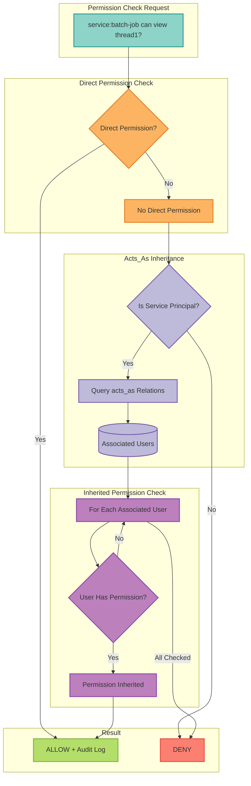

# 39. OpenFGA Permission Inheritance for Service Principals

Date: 2025-01-28

## Status

Accepted

## Category

Authentication & Authorization

## Context

Service principals (ADR-0033) need to act on behalf of users for scenarios like:
- Scheduled reports generated for specific users
- Batch jobs processing user data with user's permissions
- Background tasks accessing user conversations
- Service-to-service calls maintaining user context

Challenge: Service principals have their own identity (`service:batch-job`) but need user permissions without password sharing or impersonation tokens.

Current OpenFGA model supports direct user→object permissions but not delegation/inheritance.

## Decision

Extend OpenFGA authorization model with **`acts_as` relation** enabling service principals to inherit permissions from associated user principals while maintaining distinct identities.

### Architecture

#### OpenFGA Permission Inheritance Flow



```
OpenFGA Authorization Model:
  service_principal (new type)
    - acts_as: [user]  ← Permission inheritance relation
    - owner: [user]    ← Who owns this service principal

Permission Check Flow:
  1. Check: service:batch-job can view conversation:thread1?
  2. Direct check: No
  3. Check acts_as: service:batch-job acts_as user:alice?
  4. If yes, check: user:alice can view conversation:thread1?
  5. If yes: Permission granted (inherited)
```

### Core Principles

1. **Explicit Association**: `acts_as` tuples created deliberately (not automatic)
2. **Transitive Permissions**: Service inherits all user permissions
3. **Distinct Identity**: Service actions logged as service (not user)
4. **Audit Trail**: Both service and associated user tracked
5. **Revocable**: Disabling user revokes service permissions
6. **Ownership Tracking**: Services have owners for management

### OpenFGA Model Extension

**New Type**:
```typescript
type service_principal
  relations
    define owner: [user]
    define acts_as: [user]
    define viewer: owner
    define editor: owner
```

**Relationship Tuples**:
```python
[
    # Service inherits permissions from user
    {
        "user": "service:batch-etl-job",
        "relation": "acts_as",
        "object": "user:alice"
    },
    # User owns service principal
    {
        "user": "user:bob",
        "relation": "owner",
        "object": "service_principal:batch-etl-job"
    },
    # Example user permission (inherited by service)
    {
        "user": "user:alice",
        "relation": "viewer",
        "object": "conversation:thread1"
    }
]
```

### Permission Check Implementation

**Enhanced Authorization** (`src/mcp_server_langgraph/auth/openfga.py`):
```python
async def check_permission(
    user_id: str,
    relation: str,
    object: str,
    openfga_client
) -> bool:
    """Check permission with acts_as support"""

    # 1. Direct permission check
    if await openfga_client.check(user_id, relation, object):
        return True

    # 2. If service principal, check inherited permissions
    if user_id.startswith("service:"):
        # Get associated users via acts_as
        acts_as_query = {
            "user": user_id,
            "relation": "acts_as",
            "object_type": "user"
        }
        associated_users = await openfga_client.list_objects(acts_as_query)

        # Check if any associated user has permission
        for associated_user in associated_users:
            if await openfga_client.check(associated_user, relation, object):
                # Log: service:batch-job accessed resource via user:alice
                logger.info(
                    f"{user_id} accessed {object} via inherited permission from {associated_user}"
                )
                return True

    return False
```

### Configuration

```bash
# OpenFGA Permission Inheritance
OPENFGA_PERMISSION_INHERITANCE_ENABLED=true
OPENFGA_LOG_INHERITED_ACCESS=true  # Log when service uses inherited permissions
OPENFGA_CACHE_ACTS_AS_RELATIONS=true  # Cache acts_as lookups (5 min TTL)
```

## Consequences

### Positive Consequences
- Service principals can act on behalf of users (no password sharing)
- Clear audit trail (service identity + associated user)
- Flexible permissions (service can act as multiple users)
- Revocation propagates (disable user → service loses permissions)
- Standard ReBAC model (no custom authorization logic)

### Negative Consequences
- Additional authorization complexity (extra tuple lookups)
- Performance impact (two permission checks instead of one)
- Potential permission confusion (non-obvious inheritance)
- Authorization model more complex (additional relation types)

### Mitigation Strategies
- Cache `acts_as` relationships (5-min TTL, high hit rate)
- Clear logging of inherited access
- UI showing effective permissions for service principals
- Documentation with clear examples

## Alternatives Considered

1. **Token Impersonation**: Rejected - complex OAuth2 token exchange, admin credentials required
2. **Shared Credentials**: Rejected - security risk, poor audit trail
3. **Copy Permissions**: Rejected - sync overhead, permission drift
4. **Service-Specific Permissions**: Rejected - doesn't support user context

## Implementation

**OpenFGA Model Update** (`src/mcp_server_langgraph/auth/openfga.py:287-377`):
```python
def get_model_definition() -> dict:
    return {
        "schema_version": "1.2",
        "type_definitions": [
            # ... existing types ...
            {
                "type": "service_principal",
                "relations": {
                    "owner": {"this": {}},
                    "acts_as": {"this": {}},
                    "viewer": {"computedUserset": {"object": "", "relation": "owner"}},
                    "editor": {"computedUserset": {"object": "", "relation": "owner"}}
                }
            }
        ]
    }
```

**Tuple Creation** (in ServicePrincipalManager):
```python
async def associate_with_user(
    self, service_id: str, user_id: str, inherit_permissions: bool = True
):
    if inherit_permissions:
        await openfga_client.write_tuples([{
            "user": f"service:{service_id}",
            "relation": "acts_as",
            "object": user_id
        }])
```

**Authorization Check Enhancement**:
```python
# In middleware or route handlers
allowed = await check_permission(
    user_id="service:batch-job",
    relation="viewer",
    object="conversation:thread1",
    openfga_client=openfga_client
)
# Returns True if service:batch-job acts_as user who has viewer permission
```

## References

- OpenFGA Integration: `src/mcp_server_langgraph/auth/openfga.py`
- Service Principal Manager: `src/mcp_server_langgraph/auth/service_principal.py` (to be created)
- Related ADRs: [ADR-0002](https://github.com/vishnu2kmohan/mcp-server-langgraph/blob/main/adr/adr-0002-openfga-authorization.md), [ADR-0033](https://github.com/vishnu2kmohan/mcp-server-langgraph/blob/main/adr/adr-0033-service-principal-design.md)
- External: [OpenFGA Docs](https://openfga.dev/docs), [ReBAC](https://openfga.dev/docs/modeling/building-blocks/usersets#the-basics)
