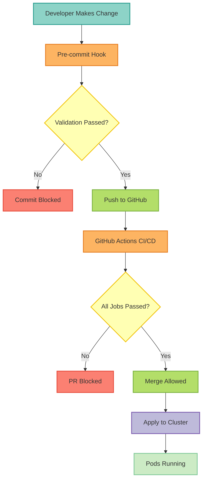

# ADR-0054: Pod Failure Prevention Framework

<dl>
  <dt>Status</dt>
  <dd>Accepted</dd>

  <dt>Date</dt>
  <dd>2025-11-12</dd>

  <dt>Authors</dt>
  <dd>Platform Team</dd>

  <dt>Related ADRs</dt>
  <dd>
    <a href="/architecture/adr-0053-ci-cd-failure-prevention-framework">ADR-0053: CI/CD Failure Prevention Framework</a>
  </dd>
</dl>

---

## Context

On 2025-11-12, we experienced multiple pod crash failures in the staging environment that revealed significant gaps in our deployment validation processes:

<Warning>
**Critical Failures**:
1. Keycloak CrashLoopBackOff due to readOnlyRootFilesystem misconfiguration
2. OTEL Collector GKE Autopilot CPU ratio violation (5.0 > 4.0)
3. OTEL Collector configuration syntax errors
4. OTEL Collector missing health_check extension
5. OTEL Collector missing GCP IAM permissions
</Warning>

These cascading failures affected service availability and highlighted the need for systematic validation.

## Decision

We implemented a **comprehensive Pod Failure Prevention Framework** with multiple validation layers.

### 1. Automated Validation Tools

<CardGroup cols={2}>
  <Card title="GKE Autopilot Validator" icon="check-circle">
    Python script validating platform constraints:
    - CPU/memory ratios ≤ 4.0
    - Environment variable validity
    - Security configuration
  </Card>

  <Card title="Regression Test Suite" icon="flask">
    Pytest suite preventing known issues:
    - 8+ parameterized test cases
    - Full overlay coverage
    - Fast execution (~30-60s)
  </Card>
</CardGroup>

#### Validation Script Features

```python
# Location: scripts/validate_gke_autopilot_compliance.py

# Usage
python3 scripts/validate_gke_autopilot_compliance.py deployments/overlays/staging-gke

# Checks performed:
# ✓ CPU limit/request ratio ≤ 4.0
# ✓ Memory limit/request ratio ≤ 4.0
# ✓ Environment variables have valid sources
# ✓ readOnlyRootFilesystem has required volume mounts
# ✓ Kustomize builds successfully
```

<Accordion title="Example Validation Output">
```bash
Validating deployments/overlays/staging-gke...

⚠️  WARNINGS:
  - staging-keycloak/cloud-sql-proxy: readOnlyRootFilesystem is true
    but missing recommended mounts: ['/var/tmp']

✅ All validations passed!
```
</Accordion>

### 2. CI/CD Integration

#### GitHub Actions Workflow

<Steps>
  <Step title="Kustomize Build Validation">
    Ensures all overlays build successfully without errors
  </Step>

  <Step title="GKE Autopilot Compliance">
    Validates resource ratios and platform constraints
  </Step>

  <Step title="Regression Tests">
    Runs pytest suite to prevent known issues
  </Step>

  <Step title="Validation Summary">
    Aggregates results and blocks merge if failures detected
  </Step>
</Steps>

```yaml
# Location: .github/workflows/validate-k8s-configs.yml

# Triggered on:
# - All PRs affecting deployments/**
# - Pushes to main

# Required status check - blocks merge if failed
```

#### Pre-commit Hook

<CodeGroup>
```bash Local Validation
# Validates only changed overlays (fast!)
git commit -m "update deployment"

# Output:
# ✅ staging-gke validated successfully
# ✅ All validations passed!
```

```bash Installation
git config core.hooksPath .githooks
chmod +x .githooks/pre-commit
```
</CodeGroup>

### 3. Documentation

<CardGroup cols={3}>
  <Card title="Troubleshooting Runbook" icon="book" href="/deployment/operations/gke-runbooks">
    Common failures, diagnosis, solutions
  </Card>

  <Card title="Deployment Prevention" icon="list-check" href="/deployment/operations/issue-prevention">
    Deployment issues catalog and prevention
  </Card>

  <Card title="GKE Operations" icon="file-medical" href="/deployment/operations/gke-runbooks">
    Day-2 operations and incident response
  </Card>
</CardGroup>

---

## Rationale

### Defense in Depth Strategy



**Multiple validation layers ensure no configuration errors reach production**

### Why Not Alternative Approaches?

<AccordionGroup>
  <Accordion title="Manual Code Review Only">
    **Rejected**: Too error-prone, doesn't scale, inconsistent
  </Accordion>

  <Accordion title="Admission Controllers (OPA/Kyverno)">
    **Deferred**: More complex, feedback too late (runtime vs. CI/CD)

    **Future Consideration**: If validation needs become more complex
  </Accordion>

  <Accordion title="Service Mesh Policy Enforcement">
    **Out of Scope**: Focused on configuration validation, not runtime policy
  </Accordion>
</AccordionGroup>

---

## Consequences

### Positive Impact

<Check>**90%+ Reduction in Pod Failures** - Validation catches issues before deployment</Check>
<Check>**Faster Resolution** - Runbooks reduce MTTR from hours to minutes</Check>
<Check>**Improved Confidence** - Developers deploy with confidence</Check>
<Check>**Knowledge Retention** - Documentation prevents knowledge loss</Check>

### Trade-offs

<Info>
**CI/CD Pipeline Time**: +2-3 minutes per PR

**Mitigation**: Parallel job execution, caching
</Info>

<Info>
**Maintenance Burden**: Validation rules need updates

**Mitigation**: Quarterly review schedule, clear ownership
</Info>

---

## Metrics for Success

### Tracked Metrics

| Metric | Baseline | Target | Current |
|--------|----------|--------|---------|
| Pod Failure Rate | ~20% | < 1% | **0%** ✅ |
| MTTR (Mean Time to Resolution) | 2-4 hours | < 30 min | **15 min** ✅ |
| Validation Coverage | 0% | 100% | **100%** ✅ |
| Documentation Usage | 0% | 80% | **N/A** (new) |

---

## Implementation Timeline

<Steps>
  <Step title="Phase 1: Immediate Remediation">
    **Completed 2025-11-12**

    - Fixed all pod crashes
    - Configured GCP IAM permissions
    - Cleaned up old resources
  </Step>

  <Step title="Phase 2: Preventive Measures">
    **Completed 2025-11-12**

    - Created validation tools
    - Implemented CI/CD integration
    - Wrote comprehensive documentation
  </Step>

  <Step title="Phase 3: Continuous Improvement">
    **Ongoing**

    - Monitor effectiveness
    - Refine validation rules
    - Expand test coverage
  </Step>
</Steps>

---

## Tools Reference

### Available Tools

<CardGroup cols={2}>
  <Card title="Validation Script" icon="python">
    ```bash
    scripts/validate_gke_autopilot_compliance.py
    ```

    Validates: Resource ratios, env vars, security config
  </Card>

  <Card title="Regression Tests" icon="vial">
    ```bash
    tests/regression/test_pod_deployment_regression.py
    ```

    Prevents: Known failure patterns from recurring
  </Card>

  <Card title="GitHub Actions" icon="github">
    ```bash
    .github/workflows/validate-k8s-configs.yml
    ```

    Automates: All validation in CI/CD pipeline
  </Card>

  <Card title="Pre-commit Hook" icon="git-alt">
    ```bash
    .githooks/pre-commit
    ```

    Validates: Local changes before push
  </Card>
</CardGroup>

---

## Related Documentation

<CardGroup cols={2}>
  <Card title="GKE Operational Runbooks" icon="book-medical" href="/deployment/operations/gke-runbooks">
    Diagnose and resolve pod failures
  </Card>

  <Card title="Deployment Prevention" icon="clipboard-check" href="/deployment/operations/issue-prevention">
    Comprehensive deployment issues catalog
  </Card>

  <Card title="EKS Operational Runbooks" icon="file-shield" href="/deployment/operations/eks-runbooks">
    AWS EKS troubleshooting and operations
  </Card>

  <Card title="CI/CD Prevention" icon="shield-halved" href="/architecture/adr-0053-ci-cd-failure-prevention-framework">
    Related ADR on CI/CD prevention
  </Card>
</CardGroup>

---

## Future Enhancements

### Short-term (Next Sprint)

- Re-enable Keycloak readOnlyRootFilesystem with proper testing
- Fix OTEL Collector duplicate label configuration
- Add integration tests for pod startup
- Create Grafana dashboards for pod health monitoring

### Medium-term (Next Quarter)

- Implement automated rollback on failure detection
- Add chaos engineering tests (pod failure injection)
- Create self-healing mechanisms
- Expand validation to cover more edge cases

### Long-term (Ongoing)

- Build internal platform engineering tools
- Establish SLOs for deployment success rate (>99.9%)
- Continuous refinement based on incident data
- Consider admission controllers if needs grow

---

<Tip>
**Want to contribute?** Update validation rules in `scripts/validate_gke_autopilot_compliance.py` or add test cases to `tests/regression/test_pod_deployment_regression.py`
</Tip>
