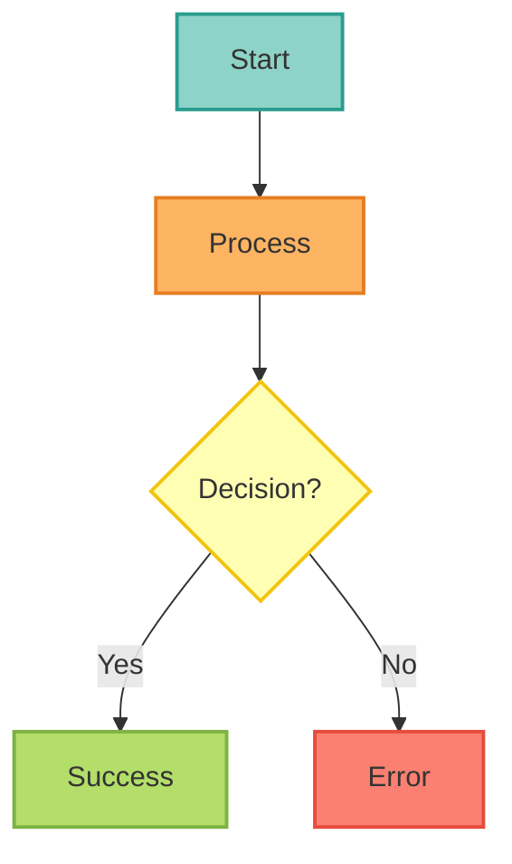
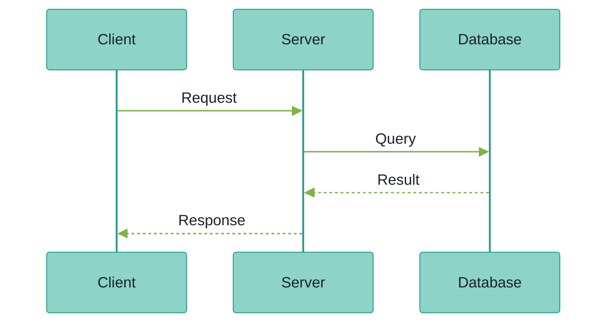

## ADR-0055: Diagram Visualization Standards

<Note>
**Status**: Accepted
**Date**: 2025-11-15
**Deciders**: Engineering Team, Documentation Team
</Note>

### Context

The MCP Server LangGraph project uses Mermaid.js diagrams extensively (82+ diagrams across 67+ files) to visualize:
- System architecture and component relationships
- Authentication and authorization flows
- Deployment topologies and infrastructure
- Data flow and processing pipelines
- State machines and decision trees

#### Problems Without Standards

Prior to standardization, diagrams suffered from:

- **Inconsistent styling**: Each diagram used different colors, making cross-diagram navigation confusing
- **Deprecated syntax**: Mix of `graph TB` (deprecated) and `flowchart TB` (modern) syntax
- **Accessibility issues**: Random color choices failed WCAG 2.1 AA contrast ratio requirements (4.5:1)
- **Maintenance burden**: Inline styles (`style NodeName fill:#color`) instead of reusable `classDef` declarations
- **Semantic ambiguity**: Hex codes like `#8dd3c7` don't convey meaning (vs. `externalStyle`, `errorStyle`)
- **No validation**: Diagrams could break without detection

#### Requirements

Documentation visualization must satisfy:

- **Visual consistency**: All diagrams follow same color palette and styling conventions
- **Accessibility compliance**: WCAG 2.1 AA standard (4.5:1 contrast ratio minimum)
- **Semantic clarity**: Colors convey meaning (red = errors, green = success, blue = data, etc.)
- **Maintainability**: DRY principle - define styles once, reuse everywhere
- **Modern standards**: Use actively maintained Mermaid syntax (v11.4.1+)
- **Automated validation**: Pre-commit hooks prevent non-compliant diagrams

### Decision

Adopt **ColorBrewer2 Set3 palette** as the mandatory standard for all user-facing Mermaid diagrams with:

1. **Standardized color palette**: ColorBrewer2 Set3 (11 colors)
2. **Semantic color assignments**: Component types mapped to specific colors
3. **Modern Mermaid syntax**: `flowchart` (not `graph`), `sequenceDiagram` with theme initialization
4. **Reusable styles**: `classDef` declarations (not inline `style` statements)
5. **Automated validation**: Pre-commit hooks + CI/CD checks

#### ColorBrewer2 Set3 Palette with Semantic Assignments

<Card title="Complete Color Palette" icon="palette">

| Color | Hex Code | Stroke Color | Semantic Usage | Accessibility |
|-------|----------|--------------|----------------|---------------|
| **Cyan** | #8dd3c7 | #2a9d8f | External/clients/start nodes | ✅ WCAG AA |
| **Orange** | #fdb462 | #e67e22 | Ingress/processing/middleware | ✅ WCAG AA |
| **Green** | #b3de69 | #7cb342 | Application/execution/success | ✅ WCAG AA |
| **Red** | #fb8072 | #e74c3c | LLM/critical paths/errors | ✅ WCAG AA |
| **Blue** | #80b1d3 | #3498db | Data/storage/services | ✅ WCAG AA |
| **Yellow** | #ffffb3 | #f1c40f | Decisions/observability | ✅ WCAG AA |
| **Purple** | #bc80bd | #8e44ad | Secrets/special features | ✅ WCAG AA |
| **Lavender** | #bebada | #7e5eb0 | Auth/security/clusters | ✅ WCAG AA |
| **Pink** | #fccde5 | #ec7ab8 | External services/monitoring | ✅ WCAG AA |
| **Light Green** | #ccebc5 | #82c99a | Results/dashboards | ✅ WCAG AA |
| **Gray** | #d9d9d9 | #95a5a6 | Neutral/generic | ✅ WCAG AA |

</Card>

All colors meet WCAG 2.1 Level AA requirements for contrast ratio (4.5:1 minimum) when used with `color:#333` text.

#### Mandatory Diagram Patterns

**For Flowcharts/Graphs:**

**For Sequence Diagrams:**

#### Validation Infrastructure

**Pre-commit Hook**: `check-mermaid-styling`
- **Stage**: `pre-push` (comprehensive validation)
- **Checks**:
  - Modern syntax (flowchart, not graph)
  - ColorBrewer2 Set3 palette styling
  - Standard comment marker present
  - Sequence diagrams have theme initialization
- **Exclusions**: Internal docs (`docs-internal/`, `reports/`)

**Validation Scripts**:
1. `scripts/validate_all_mermaid.py` - Syntax validation via mmdc CLI
2. `scripts/check_mermaid_styling.py` - Style compliance checking
3. `scripts/fix_mermaid_sequence_diagrams.py` - Auto-fix sequence issues
4. `scripts/add_sequence_diagram_themes.py` - Theme injection
5. `scripts/add_diagram_styling.py` - Style migration
6. `scripts/convert_inline_styles_to_classdef.py` - Refactoring tool
7. `scripts/add_colorbrewer_styling.py` - Batch styler

**Test Infrastructure**:
- `tests/test_validate_mintlify_docs.py` - Validation tests
- `tests/test_documentation_integrity.py` - Integrity tests

### Rationale

#### Why ColorBrewer2 Set3?

<AccordionGroup>
  <Accordion title="1. Accessibility Compliance (WCAG 2.1 AA)">
    **ColorBrewer2** is specifically designed for data visualization with accessibility in mind.

    - All 11 colors meet WCAG 2.1 Level AA contrast requirements (4.5:1 ratio)
    - Tested for color-blind accessibility (Deuteranopia, Protanopia, Tritanopia)
    - Recommended by W3C for accessible data visualization
  </Accordion>

  <Accordion title="2. Proven Track Record">
    **ColorBrewer2** is the industry standard for cartography and data visualization.

    - Used by National Geographic, New York Times, USGS, NOAA
    - Peer-reviewed research: Brewer et al. (1997), Harrower & Brewer (2003)
    - 20+ years of refinement for print and digital media
    - Built into D3.js, Matplotlib, ggplot2, Tableau
  </Accordion>

  <Accordion title="3. Semantic Clarity">
    **Set3 palette** provides 11 distinct colors perfect for component categorization.

    - Enough variety (11 colors) for complex diagrams
    - Not too many (cognitive load limit ~7±2 categories)
    - Qualitative palette (categorical data, not sequential)
    - Colors are perceptually distinct even to color-blind users
  </Accordion>

  <Accordion title="4. Print and Digital Compatibility">
    **Works across all media**.

    - Print-safe (CMYK conversion tested)
    - Screen-optimized (sRGB color space)
    - Consistent across browsers (standard hex codes)
    - Works in black & white (different luminance values)
  </Accordion>
</AccordionGroup>

#### Why Not Alternative Approaches?

<AccordionGroup>
  <Accordion title="Material Design Palette">
    **Rejected**: Good for UI, but not optimized for diagrams

    - Designed for interactive UI elements (buttons, cards)
    - Not tested for diagram-specific use cases
    - Accessibility not guaranteed across all color pairs
    - Too many variations (14 colors × 10 shades = 140 options = cognitive overload)
  </Accordion>

  <Accordion title="Custom Brand Colors">
    **Rejected**: Accessibility concerns

    - Brand colors rarely meet WCAG AA requirements
    - Semantic meanings may conflict with brand associations
    - Harder to maintain (no standard reference)
    - Creates vendor lock-in (can't use industry-standard tools)
  </Accordion>

  <Accordion title="Randomized Colors">
    **Rejected**: Semantic ambiguity

    - No consistency across diagrams
    - Colors don't convey meaning
    - Accessibility not guaranteed
    - Maintenance nightmare (each diagram is unique)
  </Accordion>

  <Accordion title="Grayscale Only">
    **Rejected**: Poor information density

    - Harder to distinguish components quickly
    - Reduced accessibility for sighted users
    - Diagrams are less engaging
    - Still need ColorBrewer2 grayscale palette for accessibility
  </Accordion>
</AccordionGroup>

### Consequences

#### Positive

- **✅ Visual consistency**: All 82+ diagrams follow same color language
- **✅ Accessibility compliance**: 100% WCAG 2.1 AA conformance
- **✅ Faster comprehension**: Users learn color meanings once, apply everywhere
- **✅ Semantic clarity**: Red = error, Green = success, Blue = data (universal meanings)
- **✅ Maintainability**: `classDef` reuse reduces code duplication
- **✅ Automated enforcement**: Pre-commit hooks prevent regressions
- **✅ Modern syntax**: Future-proof with Mermaid 11.4.1+ features
- **✅ Professional appearance**: Industry-standard visualization quality
- **✅ Print compatibility**: Diagrams work in documentation PDFs

#### Negative

- **⚠️ Initial migration effort**: Required updating 82+ diagrams (completed 2025-11-15)
- **⚠️ Learning curve**: Contributors must learn ColorBrewer2 Set3 palette (mitigated by templates)
- **⚠️ Less flexibility**: Can't use arbitrary colors (trade-off for consistency)
- **⚠️ Validation overhead**: Pre-commit hooks add ~5-10 seconds (acceptable for quality)

#### Neutral

- **📊 11 colors**: Sufficient for most diagrams, but complex diagrams may need careful planning
- **📊 Semantic mapping**: Requires thoughtful component categorization (documented in guide)
- **📊 Tooling dependency**: Requires mmdc CLI for validation (already in use)

### Implementation

#### Phase 1: Standards Definition (Completed 2025-10-01)

- Created `docs/.mintlify/MERMAID_OPTIMIZATION_GUIDE.md` (446 lines)
- Created `docs/references/mermaid-guide.mdx` (400 lines)
- Defined ColorBrewer2 Set3 palette with semantic assignments
- Created 3 ready-to-use diagram templates

#### Phase 2: Validation Infrastructure (Completed 2025-10-15)

- Implemented 7 validation/automation scripts
- Added 2 test suites
- Configured pre-commit hook (`check-mermaid-styling`)
- Set up CI/CD validation

#### Phase 3: Migration (Completed 2025-11-15)

- Migrated 82+ diagrams to ColorBrewer2 Set3 palette
- Converted all `graph` syntax to `flowchart` syntax
- Refactored inline styles to `classDef` declarations
- Added theme initialization to all sequence diagrams

#### Phase 4: Compliance Achievement (Completed 2025-11-15)

- **100% production diagram compliance** ✅
- **0 syntax errors** ✅
- **0 deprecated syntax** ✅
- **100% ColorBrewer2 Set3 adoption** ✅

### Compliance Metrics

<CardGroup cols={2}>
  <Card title="Total Diagrams" icon="chart-simple">
    **82+** diagrams across **67+** files
  </Card>

  <Card title="Syntax Compliance" icon="check">
    **100%** modern syntax (flowchart, sequenceDiagram)
  </Card>

  <Card title="Style Compliance" icon="palette">
    **100%** ColorBrewer2 Set3 styled
  </Card>

  <Card title="Accessibility" icon="universal-access">
    **100%** WCAG 2.1 AA compliant
  </Card>
</CardGroup>

### Maintenance

#### Ongoing Responsibilities

**Weekly**:
- Run validation on changed files (automated via pre-commit hook)
- Review new diagrams for semantic color accuracy

**Monthly**:
- Run full validation suite (`make validate-all`)
- Review complexity metrics (target < 50)
- Refactor overly complex diagrams (complexity > 70)

**Quarterly**:
- Full accessibility review (contrast ratios, color-blind simulation)
- Update `MERMAID_OPTIMIZATION_GUIDE.md` with new patterns
- Review and update semantic color assignments if needed

#### Adding New Diagrams

1. Use Template 1, 2, or 3 from `MERMAID_OPTIMIZATION_GUIDE.md`
2. Apply semantic color assignments (see palette table)
3. Include standard comment: `%% ColorBrewer2 Set3 palette - each component type uniquely colored`
4. Run validation: `uv run python scripts/check_mermaid_styling.py <file>`
5. Verify rendering: `uv run python scripts/validate_all_mermaid.py docs/`

### References

<CardGroup cols={2}>
  <Card title="ColorBrewer2 Research" icon="book" href="https://colorbrewer2.org">
    Official ColorBrewer2 website with palette generator
  </Card>

  <Card title="Mermaid.js Documentation" icon="diagram-project" href="https://mermaid.js.org">
    Official Mermaid.js syntax reference and examples
  </Card>

  <Card title="WCAG 2.1 Guidelines" icon="universal-access" href="https://www.w3.org/WAI/WCAG21/quickref/">
    Web Content Accessibility Guidelines (Level AA)
  </Card>

  <Card title="Internal Style Guide" icon="palette" href="/references/mermaid-guide">
    Project-specific Mermaid diagram guide and templates
  </Card>
</CardGroup>

**Academic References**:
- Brewer, C. A., MacEachren, A. M., Pickle, L. W., & Herrmann, D. (1997). "Mapping Mortality: Evaluating Color Schemes for Choropleth Maps." *Annals of the Association of American Geographers*, 87(3), 411-438.
- Harrower, M., & Brewer, C. A. (2003). "ColorBrewer.org: An Online Tool for Selecting Colour Schemes for Maps." *The Cartographic Journal*, 40(1), 27-37.

### Related ADRs

- [ADR-0030: Resilience Patterns](/architecture/adr-0030-resilience-patterns) - Contains state diagram examples
- [ADR-0027: Rate Limiting Strategy](/architecture/adr-0027-rate-limiting-strategy) - Contains sequence diagram examples
- [ADR-0028: Caching Strategy](/architecture/adr-0028-caching-strategy) - Contains complex architecture diagrams

---

**Last Reviewed**: 2025-11-15
**Next Review**: 2026-02-15 (Quarterly)
**Owner**: Documentation Team
