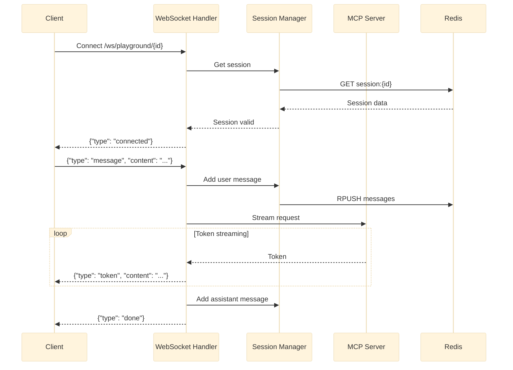

# 67. Interactive Playground

Date: 2025-12-05

## Status

Accepted

## Category

Development & Tooling

## Context

Developers and users need a way to:

1. **Test agents quickly**: Interact with LangGraph agents without writing client code
2. **Stream responses**: See real-time token-by-token output during generation
3. **Manage sessions**: Maintain conversation context across multiple messages
4. **Prototype rapidly**: Experiment with agent behaviors in an interactive environment
5. **Debug workflows**: Observe agent behavior during development

Without an interactive playground, teams face:
- Need to write custom clients for each testing session
- Lack of real-time streaming visibility
- Difficulty maintaining conversation state
- Time-consuming context switches between code and testing

## Decision

We will implement an **Interactive Playground** with the following architecture:

### **Architecture Overview**

**FastAPI Application** with:
1. **REST API**: Session CRUD, non-streaming chat
2. **WebSocket**: Real-time streaming chat
3. **Redis Backend**: Session persistence with TTL
4. **JWT Authentication**: Integrated with Keycloak SSO

### **Technology Stack**

```json
{
  "framework": "FastAPI",
  "language": "Python 3.12",
  "websocket": "Starlette WebSocket",
  "session_store": "Redis (async)",
  "models": "Pydantic v2",
  "authentication": "JWT (Keycloak)"
}
```

### **API Endpoints**

```yaml
Backend: http://localhost:8002

# Health & Info
GET  /                              → API information
GET  /api/playground/health         → Health check with dependencies

# Session Management
POST /api/playground/sessions       → Create session
GET  /api/playground/sessions       → List user sessions
GET  /api/playground/sessions/{id}  → Get session details
DELETE /api/playground/sessions/{id} → Delete session

# Chat
POST /api/playground/chat           → Non-streaming chat

# WebSocket
WS   /ws/playground/{session_id}    → Real-time streaming
```

### **Data Models**

**Session**:
```python
@dataclass
class Session:
    id: str                         # UUID
    user_id: str                    # Owner
    name: str                       # Display name
    created_at: datetime            # Creation time (UTC)
    expires_at: datetime | None     # TTL expiration
    message_count: int              # Messages in session
    metadata: dict[str, Any]        # Custom metadata
```

**WebSocket Messages**:
```typescript
// Incoming (Client → Server)
{ "type": "message", "content": "..." }  // Send chat
{ "type": "cancel" }                     // Cancel generation
{ "type": "ping" }                       // Heartbeat

// Outgoing (Server → Client)
{ "type": "connected", "session_id": "...", "timestamp": "..." }
{ "type": "token", "content": "..." }    // Streaming token
{ "type": "done", "message_id": "..." }  // Complete
{ "type": "pong", "timestamp": "..." }   // Heartbeat response
{ "type": "error", "message": "..." }    // Error
```

### **Session Management Architecture**

```
┌─────────────────────────────────────────────────────────────┐
│                    Redis Key Structure                       │
├─────────────────────────────────────────────────────────────┤
│                                                              │
│  playground:session:{session_id}    → Session JSON (TTL)    │
│  playground:user_sessions:{user_id} → Set of session IDs    │
│  playground:messages:{session_id}   → List of messages      │
│                                                              │
└─────────────────────────────────────────────────────────────┘
```

**Features**:
1. **Automatic Expiration**: Sessions expire after `SESSION_TTL_SECONDS`
2. **Activity Refresh**: TTL resets on each message
3. **Message Limits**: Max `MAX_MESSAGES_PER_SESSION` messages
4. **User Isolation**: Sessions scoped by `user_id` from JWT
5. **Stale Cleanup**: References cleaned on list operations

### **WebSocket Streaming Flow**



### **Authentication Strategy**

**Development Mode**:
- Accept `test-*` prefixed tokens
- Accept `token-for-user-*` tokens
- No external validation required

**Production Mode**:
- Validate JWT against Keycloak JWKS
- Extract `user_id` from token claims
- Enforce session ownership

### **Port Allocation**

Following the test-offset strategy:

| Environment | Port | Description |
|-------------|------|-------------|
| Development | 8002 | Local development |
| Test | 9002 | Test infrastructure (+1000 offset) |
| Production | 8002 | Kubernetes deployment |

### **Configuration**

```python
# Environment Variables
REDIS_URL = "redis://localhost:6379/2"  # Dedicated DB index
MCP_SERVER_URL = "http://localhost:8000"
JWT_SECRET_KEY = "..."
ENVIRONMENT = "development"  # or production, test

# Session Config
SESSION_TTL_SECONDS = 3600      # 1 hour default
MAX_MESSAGES_PER_SESSION = 100  # Message limit
```

## Consequences

### **Positive**

1. **Rapid Testing**: Developers can test agents immediately
2. **Real-time Feedback**: Token streaming shows generation progress
3. **Session Persistence**: Conversations survive page refreshes
4. **Secure by Default**: JWT authentication from day one
5. **Observable**: Health checks and metrics endpoints
6. **Scalable**: Redis backend supports horizontal scaling
7. **12-Factor Compliant**: Config via environment variables

### **Negative**

1. **Infrastructure Dependency**: Requires Redis
2. **WebSocket Complexity**: More complex than REST-only
3. **State Management**: Session state adds operational overhead

### **Mitigations**

1. **Redis Included**: Already part of core infrastructure
2. **Graceful Fallback**: REST endpoint for non-streaming use
3. **Auto-Cleanup**: TTL-based expiration, no manual cleanup needed

## Implementation Details

### **Module Structure**

```
src/mcp_server_langgraph/playground/
├── __init__.py
├── api/
│   ├── __init__.py
│   ├── server.py          # FastAPI application
│   └── models.py          # Pydantic request/response
├── session/
│   ├── __init__.py
│   └── manager.py         # Redis session CRUD
└── streaming/
    ├── __init__.py
    └── handler.py         # WebSocket message handler
```

### **Test Coverage**

| Test File | Tests | Description |
|-----------|-------|-------------|
| `test_playground_api.py` | 15 | REST endpoint tests |
| `test_playground_websocket.py` | 12 | WebSocket streaming |
| `test_playground_session.py` | 10 | Session management |
| `test_playground_security.py` | 8 | Auth & security |

### **Docker Deployment**

```dockerfile
# docker/Dockerfile.playground
FROM python:3.12-slim

WORKDIR /app

# Install uv and dependencies
COPY --from=ghcr.io/astral-sh/uv:latest /uv /usr/local/bin/uv
COPY pyproject.toml uv.lock ./
RUN uv sync --frozen --no-dev

# Copy playground module
COPY src/mcp_server_langgraph/playground ./src/mcp_server_langgraph/playground

EXPOSE 8002

CMD ["uv", "run", "uvicorn", "mcp_server_langgraph.playground.api.server:app", \
     "--host", "0.0.0.0", "--port", "8002"]
```

## Comparison with Alternatives

### **vs. Swagger/ReDoc**

| Feature | Playground | Swagger/ReDoc |
|---------|------------|---------------|
| Streaming | ✅ WebSocket | ❌ REST only |
| Session State | ✅ Persistent | ❌ Stateless |
| Conversation | ✅ Multi-turn | ❌ Single request |
| Real-time | ✅ Token streaming | ❌ Full response |

### **vs. Postman/Insomnia**

| Feature | Playground | Postman |
|---------|------------|---------|
| Built-in | ✅ | ❌ External tool |
| Agent-aware | ✅ | ❌ Generic HTTP |
| Streaming UI | ✅ | ⚠️ Limited |
| Session Management | ✅ | ❌ Manual |

## Future Enhancements

### **v1.1** (Planned)
- [ ] Message search within session
- [ ] Session export/import
- [ ] Typing indicators
- [ ] Read receipts

### **v2.0** (Roadmap)
- [ ] Web UI frontend (React)
- [ ] Multi-agent visualization
- [ ] Trace viewer integration
- [ ] Performance profiling

## Related ADRs

- [ADR-0047: Visual Workflow Builder](/architecture/adr-0047-visual-workflow-builder) - Complementary visual tool
- [ADR-0006: Session Storage Architecture](/architecture/adr-0006-session-storage-architecture) - Session design patterns
- [ADR-0019: Async-First Architecture](/architecture/adr-0019-async-first-architecture) - Async patterns used

## References

- FastAPI WebSocket: https://fastapi.tiangolo.com/advanced/websockets/
- Redis Async Python: https://redis.readthedocs.io/en/latest/asyncio.html
- Pydantic v2: https://docs.pydantic.dev/latest/

## Appendix: Example Usage

### **Python Client**

```python
import aiohttp
import asyncio

async def chat_streaming():
    async with aiohttp.ClientSession() as session:
        headers = {"Authorization": "Bearer test-token"}

        # Create session
        async with session.post(
            "http://localhost:9002/api/playground/sessions",
            headers=headers,
            json={"name": "My Session"}
        ) as resp:
            session_id = (await resp.json())["id"]

        # Connect WebSocket
        async with session.ws_connect(
            f"ws://localhost:9002/ws/playground/{session_id}"
        ) as ws:
            await ws.receive_json()  # connected

            # Send message
            await ws.send_json({"type": "message", "content": "Hello!"})

            # Receive streaming response
            async for msg in ws:
                data = msg.json()
                if data["type"] == "token":
                    print(data["content"], end="", flush=True)
                elif data["type"] == "done":
                    break

asyncio.run(chat_streaming())
```

### **JavaScript Client**

```javascript
const ws = new WebSocket('ws://localhost:9002/ws/playground/SESSION_ID');

ws.onmessage = (event) => {
  const data = JSON.parse(event.data);
  if (data.type === 'token') {
    process.stdout.write(data.content);
  } else if (data.type === 'done') {
    console.log('\n--- Complete ---');
  }
};

ws.onopen = () => {
  ws.send(JSON.stringify({
    type: 'message',
    content: 'What is quantum computing?'
  }));
};
```
