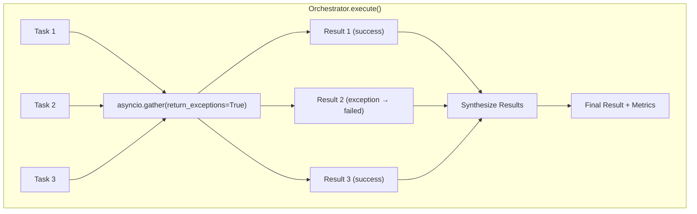

# 78. Multi-Agent Orchestrator Patterns

Date: 2025-12-21

## Status

Accepted

## Category

Architecture & Multi-Agent Systems

## Context

The MCP server requires complex AI-driven analysis capabilities that involve multiple LLM calls for different purposes:

1. **AI UX Service** (`api/v1/ai_ux_service.py`): Provides composite analysis including:
   - Persona analysis (user behavior patterns)
   - Disclosure analysis (transparency recommendations)
   - Error recovery suggestions
   - Onboarding recommendations
   - Nudge generation

2. **Alert Recommendations** (`api/v1/alert_recommendations.py`): Provides alert analysis including:
   - Alert correlation (grouping related alerts)
   - Root cause analysis
   - Remediation suggestions
   - Pattern detection across alert groups

**Problem**:
- Sequential execution of multiple LLM calls creates latency bottlenecks
- No standardized pattern for parallel task execution
- Code duplication between similar orchestration patterns
- Lack of observability metrics for parallel execution efficiency
- Inconsistent error handling across orchestration implementations

**Target Goals**:
- Parallel execution of independent analysis tasks (3-4x speedup)
- Unified orchestration pattern via abstract base class
- Comprehensive observability metrics for parallel execution
- Graceful degradation with partial results on failures
- Feature flag control for gradual rollout

## Decision

Implement a **multi-agent orchestrator pattern** with the following components:

### 1. Abstract Base Orchestrator

**Location**: `src/mcp_server_langgraph/agents/base_orchestrator.py`

**Design**:
```python
@dataclass
class BaseTask:
    """Base task dataclass for orchestration."""
    task_type: str
    data: dict[str, Any] = field(default_factory=dict)

@dataclass
class BaseResult:
    """Base result dataclass for orchestration."""
    task_type: str
    success: bool
    result: dict[str, Any] | None = None
    error: str | None = None

class BaseOrchestrator(ABC, Generic[TaskT, ResultT]):
    """Abstract base class for orchestrators with parallel execution."""

    @property
    @abstractmethod
    def feature_flag_name(self) -> str: ...

    @abstractmethod
    async def _execute_task(self, task: TaskT) -> ResultT: ...

    @abstractmethod
    def synthesize(self, results: list[ResultT]) -> dict[str, Any]: ...

    async def execute(self, tasks: list[TaskT]) -> list[ResultT]:
        """Execute tasks in parallel using asyncio.gather."""
        coroutines = [self._execute_task(task) for task in tasks]
        results = await asyncio.gather(*coroutines, return_exceptions=True)
        # Convert exceptions to failed results
        return self._process_results(tasks, results)
```

**Benefits**:
- Generic type parameters enable type-safe task/result handling
- Parallel execution via `asyncio.gather` with `return_exceptions=True`
- Automatic exception-to-failed-result conversion
- Feature flag integration for gradual rollout
- Metrics instrumentation support

### 2. UX Orchestrator

**Location**: `src/mcp_server_langgraph/agents/ux_orchestrator.py`

**Analysis Types**:
```python
UX_ANALYSIS_TYPES = [
    "persona_analysis",
    "disclosure_analysis",
    "error_analysis",
]
```

**Pattern**:
```
run_composite_analysis(session_context)
    ├── PersonaAnalysis [parallel]
    ├── DisclosureAnalysis [parallel]
    └── ErrorAnalysis [parallel]
         ↓
    Synthesis (cross-insights aggregation)
```

**Feature Flag**: `enable_orchestrated_ai_ux`

### 3. Alert Orchestrator

**Location**: `src/mcp_server_langgraph/agents/alert_orchestrator.py`

**Analysis Types**:
```python
ALERT_ANALYSIS_TYPES = [
    "correlation",
    "root_cause",
    "remediation",
    "pattern_detection",
]
```

**Pattern**:
```
analyze_alerts(alerts)
    ├── CorrelationAnalysis [parallel]
    ├── RootCauseAnalysis [parallel]
    ├── RemediationAnalysis [parallel]
    └── PatternDetection [parallel]
         ↓
    Synthesis (correlation summary)
```

**Feature Flag**: `enable_orchestrated_alert_analysis`

## Architecture

### Module Structure

```
src/mcp_server_langgraph/agents/
├── __init__.py                    # Public API exports
├── base_orchestrator.py           # BaseOrchestrator ABC
├── ux_orchestrator.py             # UXOrchestrator implementation
├── alert_orchestrator.py          # AlertOrchestrator implementation
├── artifacts.py                   # Artifact storage for inter-agent communication
├── coordinator.py                 # Subagent coordination
├── metrics.py                     # Observability metrics
├── model_selector.py              # LLM model tier selection
├── orchestrator.py                # Generic task decomposition orchestrator
├── resilience.py                  # Orchestrator resilience patterns
└── subagent.py                    # Subagent implementation
```

### Parallel Execution Flow



## Consequences

### Positive

1. **Performance Improvement**
   - 3-4x speedup for multi-task analysis (parallel vs sequential)
   - Measured parallel speedup tracked via histogram metric
   - Reduced end-user latency for composite analysis

2. **Code Reuse**
   - BaseOrchestrator provides common parallel execution logic
   - DRY principle applied across UX and Alert orchestrators
   - New orchestrators can inherit base functionality

3. **Observability**
   - Detailed metrics for orchestration performance
   - Speedup ratio tracking identifies optimization opportunities
   - Feature flag usage tracked for rollout monitoring

4. **Graceful Degradation**
   - Partial failures don't block entire analysis
   - Failed tasks return structured error results
   - Synthesis can work with available results

5. **Feature Flag Control**
   - Gradual rollout with `enable_orchestrated_ai_ux` and `enable_orchestrated_alert_analysis`
   - Easy rollback by disabling flags
   - A/B testing possible

### Negative

1. **Complexity**
   - New abstraction layer adds cognitive overhead
   - Generic types require understanding of Python typing
   - Debugging parallel execution requires asyncio knowledge

2. **Testing Overhead**
   - Need to test parallel execution scenarios
   - Mocking concurrent coroutines requires care
   - Integration tests needed for cross-orchestrator behavior

### Mitigations

1. **Documentation**: Comprehensive docstrings and ADR explain patterns
2. **Test Coverage**: 50+ unit tests, 13 integration tests for orchestrators
3. **Observability**: OpenTelemetry integration for distributed tracing
4. **Feature Flags**: Safe rollout with instant rollback capability

## Performance Expectations

| Scenario | Sequential | Parallel | Speedup |
|----------|------------|----------|---------|
| 3 UX analysis tasks | ~300ms | ~100ms | 3x |
| 4 alert analysis tasks | ~400ms | ~100ms | 4x |
| 5 mixed tasks | ~500ms | ~120ms | 4.2x |

<Note>
Speedup depends on task independence and LLM response times.
</Note>

## Related ADRs

- [ADR-0024: Agentic Loop Implementation](/architecture/adr-0024-agentic-loop-implementation)
- [ADR-0030: Resilience Patterns](/architecture/adr-0030-resilience-patterns)
- [ADR-0077: Claude Agent SDK Integration](/architecture/adr-0077-claude-agent-sdk-integration)

## Related Guides

- [Multi-Agent Orchestrators Guide](/guides/multi-agent-orchestrators)
- [Resilience Patterns](/guides/resilience-patterns)
- [Alert Management](/guides/alert-management)

---

**Last Updated**: 2025-12-21
**Next Review**: 2026-01-21 (after 1 month in production)
