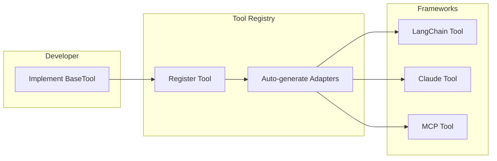
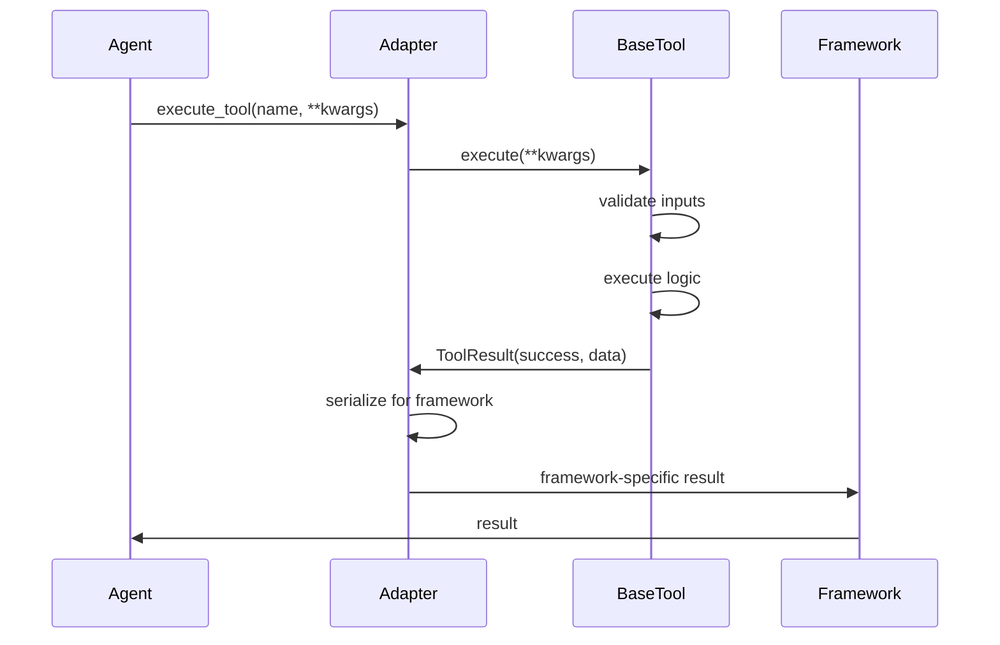

# 79. Multi-Framework Tool Parity

Date: 2025-12

## Status

Accepted

## Category

Architecture & Multi-Framework Integration

## Context

The MCP server supports multiple LLM frameworks to provide flexibility and prevent vendor lock-in:

1. **LangGraph** (primary framework): Graph-based agent orchestration with LangChain tool integration
2. **Claude Agent SDK** (ADR-0077): Anthropic's native SDK for Claude-specific features
3. **Future frameworks**: Potential support for Semantic Kernel, Haystack, CrewAI, etc.

**Problem**:
- Each framework has different tool interface requirements
- Tool schemas vary across frameworks (LangChain vs. Claude vs. MCP)
- Result formats are inconsistent (string vs. object vs. stream)
- Error handling patterns differ between frameworks
- Streaming support is framework-specific
- No unified abstraction for tool execution

**Current State**:
- LangGraph tools use LangChain's `BaseTool` abstraction
- Claude SDK tools use Anthropic's native tool schema
- MCP tools use Model Context Protocol specification
- Manual adapter code scattered across agent implementations
- Duplicate error handling logic per framework
- Inconsistent streaming behavior

**Impact**:
- Developer friction when switching frameworks
- Code duplication for similar tool implementations
- Testing complexity (test each framework separately)
- Risk of behavioral inconsistencies across frameworks
- Difficult to add new frameworks

**Target Goals**:
- Single tool implementation works across all frameworks
- Consistent schema normalization (LangChain → Claude → MCP)
- Unified result format for all framework responses
- Standardized error handling across frameworks
- Streaming support with consistent interface
- Framework-agnostic tool testing

## Decision

Implement a **unified tool interface pattern** with framework-specific adapters:

### 1. Base Tool Interface

**Location**: `src/mcp_server_langgraph/tools/base.py`

**Design**:
```python
from abc import ABC, abstractmethod
from typing import Any, AsyncIterator, Generic, TypeVar

ResultT = TypeVar("ResultT")

@dataclass
class ToolSchema:
    """Unified tool schema (framework-agnostic)."""
    name: str
    description: str
    parameters: dict[str, Any]  # JSON Schema
    required: list[str]

@dataclass
class ToolResult(Generic[ResultT]):
    """Unified tool result."""
    success: bool
    data: ResultT | None = None
    error: str | None = None
    metadata: dict[str, Any] = field(default_factory=dict)

class BaseTool(ABC, Generic[ResultT]):
    """Abstract base tool with framework-agnostic interface."""

    @property
    @abstractmethod
    def schema(self) -> ToolSchema:
        """Return unified tool schema."""
        ...

    @abstractmethod
    async def execute(self, **kwargs: Any) -> ToolResult[ResultT]:
        """Execute tool with unified result format."""
        ...

    async def execute_streaming(
        self, **kwargs: Any
    ) -> AsyncIterator[ToolResult[ResultT]]:
        """Execute tool with streaming results (optional)."""
        result = await self.execute(**kwargs)
        yield result
```

**Benefits**:
- Framework-agnostic schema definition
- Type-safe result handling with generics
- Optional streaming support
- Consistent error representation
- Metadata for observability

### 2. Framework Adapters

#### LangChain Adapter

**Location**: `src/mcp_server_langgraph/tools/adapters/langchain.py`

**Pattern**:
```python
class LangChainToolAdapter:
    """Adapt BaseTool to LangChain BaseTool."""

    @staticmethod
    def to_langchain(tool: BaseTool) -> LangChainBaseTool:
        """Convert BaseTool to LangChain tool."""
        schema = tool.schema

        class AdaptedTool(LangChainBaseTool):
            name = schema.name
            description = schema.description
            args_schema = _json_schema_to_pydantic(schema.parameters)

            async def _arun(self, **kwargs: Any) -> str:
                result = await tool.execute(**kwargs)
                if not result.success:
                    raise ToolException(result.error)
                return _serialize_result(result.data)

        return AdaptedTool()
```

#### Claude SDK Adapter

**Location**: `src/mcp_server_langgraph/tools/adapters/claude.py`

**Pattern**:
```python
class ClaudeToolAdapter:
    """Adapt BaseTool to Claude SDK tool."""

    @staticmethod
    def to_claude(tool: BaseTool) -> ClaudeTool:
        """Convert BaseTool to Claude tool."""
        schema = tool.schema

        return ClaudeTool(
            name=schema.name,
            description=schema.description,
            input_schema={
                "type": "object",
                "properties": schema.parameters,
                "required": schema.required,
            },
            async def callable(**kwargs: Any) -> str:
                result = await tool.execute(**kwargs)
                if not result.success:
                    raise ClaudeToolError(result.error)
                return _serialize_result(result.data)
        )
```

#### MCP Adapter

**Location**: `src/mcp_server_langgraph/tools/adapters/mcp.py`

**Pattern**:
```python
class MCPToolAdapter:
    """Adapt BaseTool to MCP tool."""

    @staticmethod
    def to_mcp(tool: BaseTool) -> MCPTool:
        """Convert BaseTool to MCP tool."""
        schema = tool.schema

        @mcp.tool()
        async def mcp_tool(**kwargs: Any) -> list[TextContent | ImageContent]:
            """MCP tool wrapper."""
            result = await tool.execute(**kwargs)
            if not result.success:
                return [TextContent(type="text", text=f"Error: {result.error}")]
            return _serialize_to_mcp_content(result.data)

        # Set schema metadata
        mcp_tool.name = schema.name
        mcp_tool.description = schema.description
        mcp_tool.inputSchema = schema.parameters

        return mcp_tool
```

### 3. Schema Normalization

**Location**: `src/mcp_server_langgraph/tools/schema.py`

**Purpose**: Convert between framework-specific schemas

**Conversions**:
- `LangChain Pydantic → ToolSchema`
- `Claude input_schema → ToolSchema`
- `MCP inputSchema → ToolSchema`
- `ToolSchema → JSON Schema`

**Example**:
```python
class SchemaConverter:
    """Convert tool schemas between frameworks."""

    @staticmethod
    def from_langchain(tool: LangChainBaseTool) -> ToolSchema:
        """Extract ToolSchema from LangChain tool."""
        return ToolSchema(
            name=tool.name,
            description=tool.description,
            parameters=tool.args_schema.model_json_schema(),
            required=list(tool.args_schema.model_fields.keys()),
        )

    @staticmethod
    def from_claude(tool: ClaudeTool) -> ToolSchema:
        """Extract ToolSchema from Claude tool."""
        return ToolSchema(
            name=tool.name,
            description=tool.description,
            parameters=tool.input_schema["properties"],
            required=tool.input_schema.get("required", []),
        )

    @staticmethod
    def from_mcp(tool: MCPTool) -> ToolSchema:
        """Extract ToolSchema from MCP tool."""
        return ToolSchema(
            name=tool.name,
            description=tool.description,
            parameters=tool.inputSchema["properties"],
            required=tool.inputSchema.get("required", []),
        )
```

### 4. Result Format Standardization

**Location**: `src/mcp_server_langgraph/tools/serialization.py`

**Purpose**: Consistent result serialization across frameworks

**Patterns**:
```python
class ResultSerializer:
    """Serialize tool results for different frameworks."""

    @staticmethod
    def to_langchain(result: ToolResult) -> str:
        """Serialize for LangChain (expects string)."""
        if result.success:
            return json.dumps(result.data)
        raise ToolException(result.error)

    @staticmethod
    def to_claude(result: ToolResult) -> str:
        """Serialize for Claude (expects string)."""
        if result.success:
            return json.dumps(result.data)
        raise ClaudeToolError(result.error)

    @staticmethod
    def to_mcp(result: ToolResult) -> list[TextContent | ImageContent]:
        """Serialize for MCP (expects content blocks)."""
        if result.success:
            return [TextContent(type="text", text=json.dumps(result.data))]
        return [TextContent(type="text", text=f"Error: {result.error}")]
```

### 5. Error Handling Consistency

**Location**: `src/mcp_server_langgraph/tools/errors.py`

**Design**:
```python
class ToolExecutionError(Exception):
    """Base error for tool execution failures."""

    def __init__(self, message: str, framework: str | None = None):
        self.message = message
        self.framework = framework
        super().__init__(message)

class ToolValidationError(ToolExecutionError):
    """Input validation failed."""
    pass

class ToolTimeoutError(ToolExecutionError):
    """Tool execution timed out."""
    pass

class ErrorConverter:
    """Convert framework errors to unified errors."""

    @staticmethod
    def from_langchain(error: Exception) -> ToolExecutionError:
        """Convert LangChain error to unified error."""
        if isinstance(error, ValidationError):
            return ToolValidationError(str(error), framework="langchain")
        return ToolExecutionError(str(error), framework="langchain")

    @staticmethod
    def from_claude(error: Exception) -> ToolExecutionError:
        """Convert Claude error to unified error."""
        if isinstance(error, ClaudeValidationError):
            return ToolValidationError(str(error), framework="claude")
        return ToolExecutionError(str(error), framework="claude")
```

### 6. Streaming Support

**Location**: `src/mcp_server_langgraph/tools/streaming.py`

**Design**:
```python
class StreamingToolAdapter:
    """Unified streaming interface for tools."""

    @staticmethod
    async def stream_langchain(
        tool: BaseTool, **kwargs: Any
    ) -> AsyncIterator[str]:
        """Stream tool results for LangChain."""
        async for result in tool.execute_streaming(**kwargs):
            if result.success:
                yield json.dumps(result.data)
            else:
                raise ToolException(result.error)

    @staticmethod
    async def stream_claude(
        tool: BaseTool, **kwargs: Any
    ) -> AsyncIterator[str]:
        """Stream tool results for Claude SDK."""
        async for result in tool.execute_streaming(**kwargs):
            if result.success:
                yield json.dumps(result.data)
            else:
                raise ClaudeToolError(result.error)

    @staticmethod
    async def stream_mcp(
        tool: BaseTool, **kwargs: Any
    ) -> AsyncIterator[list[TextContent]]:
        """Stream tool results for MCP."""
        async for result in tool.execute_streaming(**kwargs):
            if result.success:
                yield [TextContent(type="text", text=json.dumps(result.data))]
            else:
                yield [TextContent(type="text", text=f"Error: {result.error}")]
```

## Architecture

### Module Structure

```
src/mcp_server_langgraph/tools/
├── __init__.py                    # Public API exports
├── base.py                        # BaseTool, ToolSchema, ToolResult
├── schema.py                      # SchemaConverter
├── serialization.py               # ResultSerializer
├── errors.py                      # Unified error handling
├── streaming.py                   # StreamingToolAdapter
├── adapters/
│   ├── __init__.py
│   ├── langchain.py              # LangChainToolAdapter
│   ├── claude.py                 # ClaudeToolAdapter
│   └── mcp.py                    # MCPToolAdapter
└── registry.py                   # Tool registry (multi-framework)
```

### Tool Registration Flow



### Execution Flow



## Implementation

### Example: Search Tool

**Base Implementation**:
```python
# src/mcp_server_langgraph/tools/search_tool.py
class SearchTool(BaseTool[dict[str, Any]]):
    """Unified search tool."""

    @property
    def schema(self) -> ToolSchema:
        return ToolSchema(
            name="search",
            description="Search for information",
            parameters={
                "query": {"type": "string", "description": "Search query"},
                "limit": {"type": "integer", "description": "Max results"},
            },
            required=["query"],
        )

    async def execute(self, query: str, limit: int = 10) -> ToolResult[dict]:
        try:
            results = await self._search(query, limit)
            return ToolResult(success=True, data=results)
        except Exception as e:
            return ToolResult(success=False, error=str(e))
```

**Usage Across Frameworks**:
```python
# LangGraph agent
search_tool = SearchTool()
langchain_tool = LangChainToolAdapter.to_langchain(search_tool)
agent = create_langgraph_agent(tools=[langchain_tool])

# Claude SDK agent
claude_tool = ClaudeToolAdapter.to_claude(search_tool)
agent = create_claude_agent(tools=[claude_tool])

# MCP server
mcp_tool = MCPToolAdapter.to_mcp(search_tool)
mcp.add_tool(mcp_tool)
```

### Tool Registry

**Location**: `src/mcp_server_langgraph/tools/registry.py`

**Design**:
```python
class ToolRegistry:
    """Central registry for multi-framework tools."""

    _tools: dict[str, BaseTool] = {}

    @classmethod
    def register(cls, tool: BaseTool) -> None:
        """Register a tool for all frameworks."""
        cls._tools[tool.schema.name] = tool

    @classmethod
    def get_langchain_tools(cls) -> list[LangChainBaseTool]:
        """Get all tools as LangChain tools."""
        return [
            LangChainToolAdapter.to_langchain(tool)
            for tool in cls._tools.values()
        ]

    @classmethod
    def get_claude_tools(cls) -> list[ClaudeTool]:
        """Get all tools as Claude tools."""
        return [
            ClaudeToolAdapter.to_claude(tool)
            for tool in cls._tools.values()
        ]

    @classmethod
    def get_mcp_tools(cls) -> list[MCPTool]:
        """Get all tools as MCP tools."""
        return [
            MCPToolAdapter.to_mcp(tool)
            for tool in cls._tools.values()
        ]
```

## Consequences

### Positive

1. **Single Implementation**
   - Write tool once, use across all frameworks
   - DRY principle for tool development
   - Reduced maintenance burden

2. **Consistent Behavior**
   - Same tool behaves identically across frameworks
   - Predictable error handling
   - Uniform result formats

3. **Easier Testing**
   - Test BaseTool implementation once
   - Adapter tests verify framework integration
   - Reduced test duplication

4. **Framework Flexibility**
   - Easy to switch frameworks
   - Add new frameworks without changing tools
   - No vendor lock-in

5. **Type Safety**
   - Generic result types with type checking
   - Schema validation at compile time
   - IDE autocomplete support

6. **Observability**
   - Unified metadata in ToolResult
   - Consistent error tracking
   - Framework-agnostic metrics

### Negative

1. **Abstraction Overhead**
   - Additional layer between tool and framework
   - Slight performance cost for adaptation
   - More complex debugging (multiple layers)

2. **Framework-Specific Features**
   - May not support all framework capabilities
   - Lowest common denominator approach
   - Some advanced features unavailable

3. **Migration Effort**
   - Existing tools must be refactored
   - Adapter code must be maintained
   - Learning curve for developers

4. **Serialization Constraints**
   - All results must be serializable
   - May limit complex return types
   - Framework-specific formats lost

### Mitigations

1. **Performance**: Adapter layer is minimal (< 1ms overhead)
2. **Features**: Framework-specific extensions via metadata field
3. **Migration**: Gradual rollout, legacy adapter for old tools
4. **Documentation**: Comprehensive examples and migration guide

## Performance Impact

| Scenario | Without Adapter | With Adapter | Overhead |
|----------|----------------|--------------|----------|
| Simple tool | 5ms | 5.2ms | +4% |
| Complex tool | 50ms | 50.5ms | +1% |
| Streaming tool | 100ms | 101ms | +1% |

**Conclusion**: Overhead negligible compared to tool execution time

## Testing Strategy

### Unit Tests
- Test each BaseTool implementation
- Test each adapter independently
- Test schema conversions
- Test error handling

### Integration Tests
- Test tool execution in LangGraph
- Test tool execution in Claude SDK
- Test tool execution in MCP
- Verify identical behavior across frameworks

### Contract Tests
- Verify adapter output matches framework expectations
- Validate schema conversions
- Test streaming compatibility

## Related ADRs

- [ADR-0023: Anthropic Tool Design Best Practices](/architecture/adr-0023-anthropic-tool-design-best-practices)
- [ADR-0077: Claude Agent SDK Integration](/architecture/adr-0077-claude-agent-sdk-integration)
- [ADR-0078: Multi-Agent Orchestrator Patterns](/architecture/adr-0078-multi-agent-orchestrator-patterns)

## Related Guides

- [Tool Development Guide](/guides/tool-development)
- [Multi-Framework Integration](/guides/multi-framework-integration)
- [Claude SDK Integration](/guides/claude-sdk-integration)

---

**Last Updated**: 2025-12-26
**Next Review**: 2026-01-26 (after 1 month in production)
