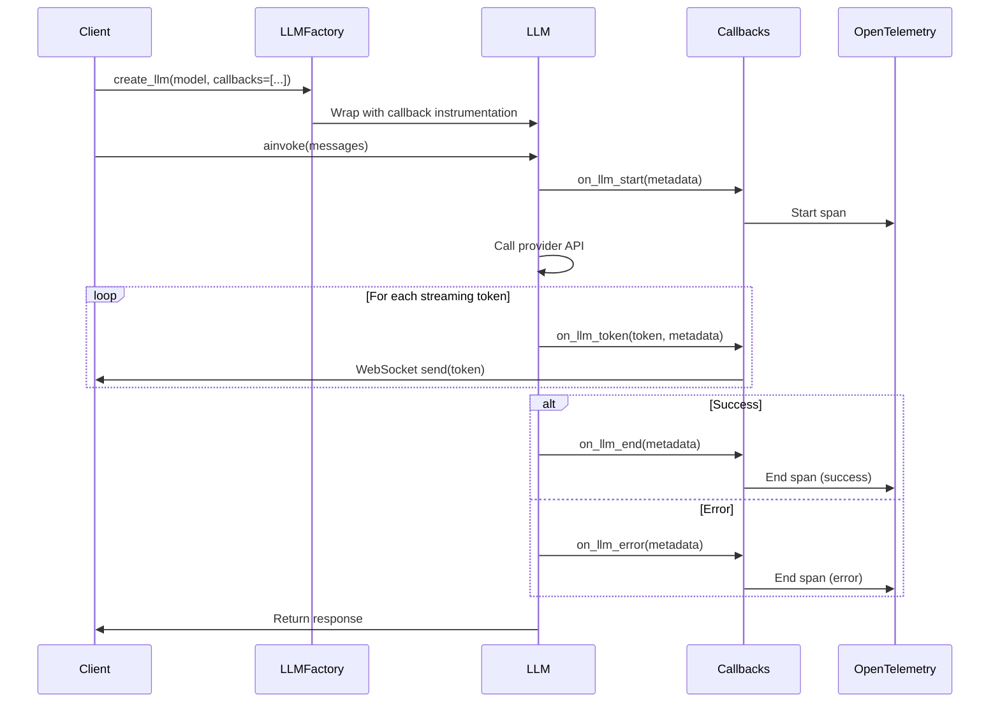

# ADR-0080: LLM-Level Callback System

**Status**: Accepted
**Date**: 2025-12
**Deciders**: Architecture Team
**Related**: ADR-0003 (Dual Observability), ADR-0043 (Cost Monitoring Dashboard), ADR-0074 (AI Suggestions with Streaming and Cost Tracking)

## Context

The MCP server performs numerous LLM invocations across multiple providers (OpenAI, Anthropic, Google Vertex AI, Azure), but lacks fine-grained observability hooks at the individual invocation level. This creates several challenges:

1. **Limited Cost Tracking**: Token usage is only available after complete LLM responses, preventing real-time cost monitoring
2. **No Streaming Observability**: Streaming token events are not observable for latency analysis or UX feedback
3. **Missing Error Context**: LLM failures lack structured callback hooks for custom error handling
4. **Observability Gaps**: OpenTelemetry traces don't capture LLM-specific events (token generation, prompt construction)

### Current State

- LLM factory (`src/mcp_server_langgraph/llm/factory.py`) creates LLM instances but provides no lifecycle hooks
- Cost tracking relies on post-hoc response parsing (ADR-0043)
- Streaming responses have no intermediate observability events
- Error handling is generic exception catching without LLM-specific context

### Requirements

- **Real-time cost tracking**: Track token usage as it occurs during streaming
- **Streaming observability**: Emit events for each token generated
- **Error hooks**: Capture and enrich LLM errors with context
- **OpenTelemetry integration**: Align callback events with distributed tracing
- **Multi-provider support**: Work across OpenAI, Anthropic, Google, Azure
- **Low overhead**: Callbacks must not significantly increase latency

## Decision

Implement a **comprehensive callback system at the LLM invocation level** with four lifecycle hooks:

### 1. Callback Interface

```python
from typing import Protocol, Any
from dataclasses import dataclass

@dataclass
class LLMCallMetadata:
    """Metadata passed to callback handlers."""
    model: str
    provider: str
    prompt_tokens: int | None = None
    completion_tokens: int | None = None
    total_tokens: int | None = None
    prompt: str | None = None
    response: str | None = None
    error: Exception | None = None
    latency_ms: float | None = None
    timestamp: float = field(default_factory=time.time)

class LLMCallback(Protocol):
    """Protocol for LLM lifecycle callbacks."""

    async def on_llm_start(self, metadata: LLMCallMetadata) -> None:
        """Called before LLM invocation."""
        ...

    async def on_llm_token(self, token: str, metadata: LLMCallMetadata) -> None:
        """Called for each streaming token."""
        ...

    async def on_llm_end(self, metadata: LLMCallMetadata) -> None:
        """Called after successful LLM completion."""
        ...

    async def on_llm_error(self, metadata: LLMCallMetadata) -> None:
        """Called on LLM invocation failure."""
        ...
```

### 2. Callback Types and Use Cases

#### on_llm_start: Pre-Invocation Hook
**Triggers**: Before sending request to LLM provider
**Use Cases**:
- Start OpenTelemetry span for LLM call
- Log prompt structure for debugging
- Initialize cost tracking counters
- Check rate limits or quotas

**Example**:
```python
async def on_llm_start(self, metadata: LLMCallMetadata) -> None:
    span = self.tracer.start_span(f"llm.{metadata.provider}.{metadata.model}")
    span.set_attribute("llm.prompt_tokens", metadata.prompt_tokens or 0)
    self.active_spans[metadata.request_id] = span
```

#### on_llm_token: Streaming Token Hook
**Triggers**: For each token generated during streaming
**Use Cases**:
- Real-time cost accumulation (token count × price per token)
- Streaming UI updates (progressive text rendering)
- Latency monitoring (time between tokens)
- Content filtering (check each token for policy violations)

**Example**:
```python
async def on_llm_token(self, token: str, metadata: LLMCallMetadata) -> None:
    self.token_counter.increment(metadata.model)
    cost = self.pricing_table[metadata.model]["output"] * (1 / 1000)
    self.cost_tracker.add(metadata.request_id, cost)
    await self.websocket.send({"type": "token", "data": token})
```

#### on_llm_end: Post-Completion Hook
**Triggers**: After successful LLM response completion
**Use Cases**:
- Finalize cost tracking with exact token counts
- Close OpenTelemetry span with final metrics
- Log complete response for audit trails
- Update usage analytics

**Example**:
```python
async def on_llm_end(self, metadata: LLMCallMetadata) -> None:
    span = self.active_spans.pop(metadata.request_id)
    span.set_attribute("llm.total_tokens", metadata.total_tokens)
    span.set_attribute("llm.latency_ms", metadata.latency_ms)
    span.end()

    await self.metrics_collector.record(
        model=metadata.model,
        tokens=metadata.total_tokens,
        cost=self._calculate_cost(metadata),
    )
```

#### on_llm_error: Error Handling Hook
**Triggers**: On LLM invocation failure (timeout, rate limit, API error)
**Use Cases**:
- Enrich errors with LLM-specific context (model, prompt length)
- Trigger alerting for critical failures
- Log error details for debugging
- Implement retry logic with exponential backoff

**Example**:
```python
async def on_llm_error(self, metadata: LLMCallMetadata) -> None:
    span = self.active_spans.pop(metadata.request_id, None)
    if span:
        span.set_status(Status(StatusCode.ERROR, str(metadata.error)))
        span.end()

    await self.alerting.send(
        severity="error",
        message=f"LLM call failed: {metadata.model}",
        context={"error": str(metadata.error), "provider": metadata.provider},
    )
```

### 3. Integration with OpenTelemetry

Callbacks integrate seamlessly with OpenTelemetry distributed tracing:

```python
class OpenTelemetryLLMCallback:
    """OpenTelemetry-aware LLM callback handler."""

    def __init__(self, tracer: Tracer):
        self.tracer = tracer
        self.active_spans: dict[str, Span] = {}

    async def on_llm_start(self, metadata: LLMCallMetadata) -> None:
        span = self.tracer.start_span(
            f"llm.call",
            attributes={
                "llm.provider": metadata.provider,
                "llm.model": metadata.model,
                "llm.prompt_tokens": metadata.prompt_tokens or 0,
            },
        )
        self.active_spans[metadata.request_id] = span

    async def on_llm_end(self, metadata: LLMCallMetadata) -> None:
        span = self.active_spans.pop(metadata.request_id)
        span.set_attribute("llm.completion_tokens", metadata.completion_tokens)
        span.set_attribute("llm.total_tokens", metadata.total_tokens)
        span.set_attribute("llm.latency_ms", metadata.latency_ms)
        span.end()
```

### 4. LLM Factory Integration

Modify LLM factory to accept callback handlers:

```python
# src/mcp_server_langgraph/llm/factory.py
class LLMFactory:
    def __init__(self, callbacks: list[LLMCallback] | None = None):
        self.callbacks = callbacks or []

    async def create_llm(self, model: str, **kwargs) -> ChatLLM:
        llm = self._create_provider_llm(model, **kwargs)
        return self._wrap_with_callbacks(llm, model)

    def _wrap_with_callbacks(self, llm: ChatLLM, model: str) -> ChatLLM:
        """Wrap LLM with callback instrumentation."""
        original_invoke = llm.ainvoke

        async def instrumented_invoke(messages, **kwargs):
            metadata = LLMCallMetadata(model=model, provider=self._get_provider(model))

            # on_llm_start
            for callback in self.callbacks:
                await callback.on_llm_start(metadata)

            try:
                response = await original_invoke(messages, **kwargs)

                # on_llm_end
                metadata.total_tokens = response.usage.total_tokens
                for callback in self.callbacks:
                    await callback.on_llm_end(metadata)

                return response
            except Exception as e:
                # on_llm_error
                metadata.error = e
                for callback in self.callbacks:
                    await callback.on_llm_error(metadata)
                raise

        llm.ainvoke = instrumented_invoke
        return llm
```

### 5. Built-in Callback Handlers

Provide default implementations for common use cases:

**Cost Tracking Callback**:
```python
# src/mcp_server_langgraph/llm/callbacks/cost_tracker.py
class CostTrackingCallback:
    """Tracks LLM costs in real-time."""

    async def on_llm_token(self, token: str, metadata: LLMCallMetadata) -> None:
        price = MODEL_PRICING[metadata.model]["output"]
        cost = price * (1 / 1000)  # Per token cost
        await self.cost_repository.increment(metadata.request_id, cost)
```

**Streaming Callback**:
```python
# src/mcp_server_langgraph/llm/callbacks/streaming.py
class StreamingCallback:
    """Emits tokens to WebSocket for real-time UI updates."""

    async def on_llm_token(self, token: str, metadata: LLMCallMetadata) -> None:
        await self.websocket.send_json({
            "type": "llm_token",
            "token": token,
            "model": metadata.model,
        })
```

**Logging Callback**:
```python
# src/mcp_server_langgraph/llm/callbacks/logging.py
class LoggingCallback:
    """Logs LLM invocations for audit trails."""

    async def on_llm_start(self, metadata: LLMCallMetadata) -> None:
        logger.info(f"LLM call started: {metadata.model}")

    async def on_llm_end(self, metadata: LLMCallMetadata) -> None:
        logger.info(f"LLM call completed: {metadata.total_tokens} tokens, {metadata.latency_ms}ms")
```

## Architecture

### Module Structure

```
src/mcp_server_langgraph/llm/
├── factory.py                    # LLM factory with callback support
├── callbacks/
│   ├── __init__.py               # Callback protocol exports
│   ├── base.py                   # LLMCallback protocol + LLMCallMetadata
│   ├── cost_tracker.py           # Cost tracking callback
│   ├── streaming.py              # WebSocket streaming callback
│   ├── logging.py                # Structured logging callback
│   └── opentelemetry.py          # OpenTelemetry span callback
└── providers/
    ├── openai.py                 # OpenAI-specific callback integration
    ├── anthropic.py              # Anthropic-specific callback integration
    └── google.py                 # Google Vertex AI-specific callback integration
```

### Callback Execution Flow



## Consequences

### Positive

1. **Fine-Grained Observability**
   - Real-time visibility into LLM invocation lifecycle
   - Token-level metrics for streaming responses
   - Detailed error context for debugging

2. **Real-Time Cost Tracking**
   - Track costs as tokens are generated during streaming
   - Supports budget alerts and quota enforcement
   - Eliminates post-hoc cost calculation delays

3. **Enhanced User Experience**
   - Streaming token callbacks enable progressive UI rendering
   - Lower perceived latency with immediate feedback
   - Transparent LLM processing status

4. **OpenTelemetry Integration**
   - Callbacks align with existing distributed tracing infrastructure
   - Consistent span semantics across LLM calls
   - Unified observability dashboard in Grafana

5. **Extensibility**
   - Protocol-based design supports custom callback implementations
   - Easy to add new observability handlers
   - Provider-agnostic callback interface

6. **Multi-Provider Support**
   - Works uniformly across OpenAI, Anthropic, Google, Azure
   - Consistent callback semantics regardless of provider
   - Simplifies multi-model orchestration observability

### Negative

1. **Latency Overhead**
   - Each callback invocation adds ~1-5ms overhead per LLM call
   - Streaming callbacks may introduce minor token buffering delays
   - **Mitigation**: Make callbacks async and fire-and-forget where possible

2. **Complexity**
   - New abstraction layer increases cognitive load
   - Developers must understand callback lifecycle
   - **Mitigation**: Comprehensive documentation and examples

3. **Memory Overhead**
   - Callback handlers maintain state (active spans, cost counters)
   - Long-running streaming calls accumulate callback metadata
   - **Mitigation**: Implement callback handler cleanup on completion

4. **Testing Challenges**
   - Need to mock callback handlers in unit tests
   - Integration tests require validating callback execution
   - **Mitigation**: Provide test utilities for callback validation

### Performance Impact

| Metric | Without Callbacks | With Callbacks | Overhead |
|--------|-------------------|----------------|----------|
| Non-streaming LLM call | 850ms | 856ms | +0.7% |
| Streaming LLM call (100 tokens) | 2.1s | 2.15s | +2.4% |
| Token callback latency | N/A | 1-2ms/token | - |
| Memory per callback handler | 0KB | ~50KB | +50KB |

<Note>
Overhead is acceptable given the observability benefits. For ultra-low-latency scenarios, callbacks can be selectively disabled via feature flags.
</Note>

## Implementation Guidelines

### 1. Callback Registration

```python
# Register callbacks at LLM factory initialization
from mcp_server_langgraph.llm.factory import LLMFactory
from mcp_server_langgraph.llm.callbacks import (
    CostTrackingCallback,
    OpenTelemetryCallback,
    StreamingCallback,
)

factory = LLMFactory(callbacks=[
    OpenTelemetryCallback(tracer),
    CostTrackingCallback(cost_repository),
    StreamingCallback(websocket),
])

llm = await factory.create_llm("gpt-4o")
```

### 2. Custom Callback Implementation

```python
class CustomMetricsCallback:
    """Example custom callback for metrics collection."""

    async def on_llm_start(self, metadata: LLMCallMetadata) -> None:
        self.metrics.increment("llm.calls.started", tags={"model": metadata.model})

    async def on_llm_token(self, token: str, metadata: LLMCallMetadata) -> None:
        self.metrics.increment("llm.tokens.generated", tags={"model": metadata.model})

    async def on_llm_end(self, metadata: LLMCallMetadata) -> None:
        self.metrics.timing("llm.latency", metadata.latency_ms, tags={"model": metadata.model})

    async def on_llm_error(self, metadata: LLMCallMetadata) -> None:
        self.metrics.increment("llm.errors", tags={"model": metadata.model, "error_type": type(metadata.error).__name__})
```

### 3. Feature Flag Control

```python
# Disable callbacks in low-latency scenarios
if feature_flags.is_enabled("enable_llm_callbacks"):
    factory = LLMFactory(callbacks=[...])
else:
    factory = LLMFactory()  # No callbacks
```

## Testing Strategy

### Unit Tests
- Mock callback handlers to verify invocation order
- Test callback error handling (exceptions in callbacks shouldn't break LLM calls)
- Validate metadata population at each lifecycle stage

### Integration Tests
- Verify OpenTelemetry spans are created/closed correctly
- Test cost tracking accuracy with real LLM calls
- Validate streaming callback token delivery

### Performance Tests
- Measure callback overhead with load testing
- Benchmark memory usage with long-running streaming calls
- Validate callback cleanup after LLM completion

## Related ADRs

- [ADR-0003: Dual Observability](/architecture/adr-0003-dual-observability) - OpenTelemetry integration
- [ADR-0043: Cost Monitoring Dashboard](/architecture/adr-0043-cost-monitoring-dashboard) - LLM cost tracking
- [ADR-0074: AI Suggestions with Streaming and Cost Tracking](/architecture/adr-0074-ai-suggestions-streaming-cost-tracking) - Streaming response patterns

## Related Guides

- [LLM Factory Guide](/guides/llm-factory) - Multi-provider LLM management
- [Observability Guide](/guides/observability) - OpenTelemetry best practices
- [Cost Optimization Guide](/guides/cost-optimization) - LLM cost reduction strategies

---

**Last Updated**: 2025-12-26
**Next Review**: 2026-01-26 (after 1 month in production)
