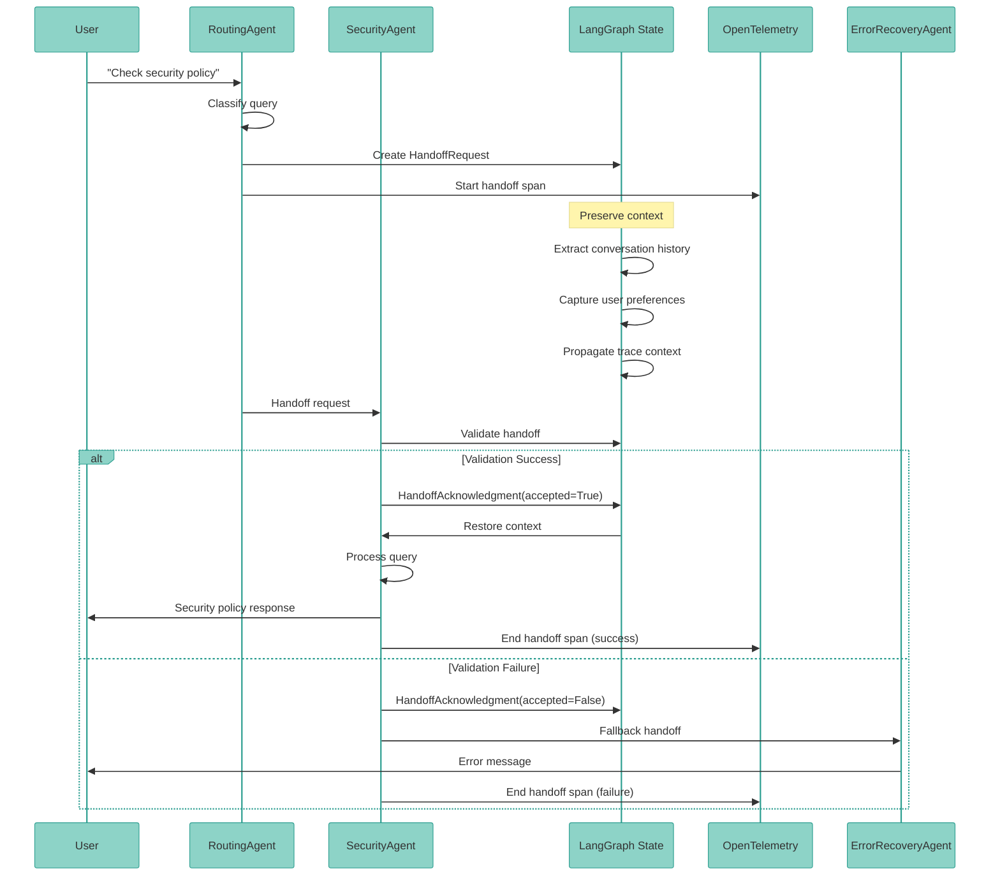

# 81. Handoff Pattern for Multi-Agent

Date: 2025-12

## Status

Accepted

## Category

Architecture & Multi-Agent Systems

## Context

Multi-agent systems require standardized mechanisms for transferring control and context between specialized agents. Without a formal handoff protocol, the following challenges arise:

1. **Context Loss**: Critical state information is lost during agent transitions
2. **Unclear Boundaries**: No explicit signal when one agent completes and another begins
3. **Error Propagation**: Failed handoffs cascade without proper error handling
4. **Debugging Complexity**: Difficult to trace conversation flow across multiple agents
5. **Inconsistent Patterns**: Ad-hoc handoff implementations lead to maintenance burden

**Real-World Scenarios**:
- Routing agent hands off to specialized domain agent (e.g., security, deployment, analytics)
- Research agent passes findings to code generation agent
- Planning agent transitions to execution agent with task breakdown
- Error recovery agent takes over when primary agent fails

**Problem Statement**:
Without a standardized handoff protocol, multi-agent systems experience:
- Dropped context during transitions (conversation history, user preferences, intermediate results)
- Silent failures when target agents are unavailable
- No audit trail for agent transitions
- Inconsistent state management patterns

## Decision

Implement a **formal handoff pattern** for agent-to-agent transitions based on LangGraph's interrupt/resume mechanism and message passing.

### 1. Handoff Protocol Components

#### A. Handoff Request (Source Agent)

**Definition**: Source agent signals intention to transfer control to target agent.

```python
from typing import Literal, TypedDict
from dataclasses import dataclass

@dataclass
class HandoffRequest:
    """Request to hand off conversation to another agent."""
    source_agent: str          # Agent initiating handoff
    target_agent: str          # Agent to receive handoff
    reason: str                # Why handoff is needed
    context: dict[str, Any]    # Preserved state
    priority: Literal["normal", "high", "urgent"] = "normal"
    fallback_agent: str | None = None  # Fallback if target unavailable
```

**Pattern**:
```python
# Source agent logic
async def routing_agent_node(state: AgentState):
    """Route to specialized agent based on query analysis."""

    # Analyze query
    domain = classify_query(state["messages"])

    if domain == "security":
        # Prepare handoff to security specialist
        handoff = HandoffRequest(
            source_agent="routing_agent",
            target_agent="security_agent",
            reason="Security-related query detected",
            context={
                "query_classification": domain,
                "user_context": state.get("user_context", {}),
                "conversation_history": state["messages"][-5:],  # Last 5 messages
            },
            fallback_agent="general_agent"
        )

        # Signal handoff
        return {
            "handoff_request": handoff,
            "next_agent": "security_agent"
        }
```

#### B. Context Preservation (State Management)

**Definition**: Critical state passed from source to target agent.

**Preserved Elements**:
```python
class HandoffContext(TypedDict):
    """Context preserved during agent handoff."""

    # Conversation state
    conversation_history: list[BaseMessage]  # Recent messages
    user_intent: str | None                  # Inferred user goal

    # Agent state
    intermediate_results: dict[str, Any]     # Partial results from source agent
    checkpoints: list[str]                   # Completed steps

    # User context
    user_preferences: dict[str, Any]         # User settings
    session_metadata: dict[str, Any]         # Session info

    # Observability
    trace_id: str                            # Distributed trace ID
    span_context: dict[str, Any]             # OpenTelemetry span
```

**Pattern**:
```python
def preserve_context(state: AgentState, handoff: HandoffRequest) -> dict[str, Any]:
    """Extract and preserve context for handoff."""

    return {
        "conversation_history": state["messages"][-10:],  # Last 10 messages
        "user_intent": state.get("user_intent"),
        "intermediate_results": state.get("results", {}),
        "checkpoints": state.get("completed_steps", []),
        "user_preferences": state.get("user_preferences", {}),
        "session_metadata": {
            "session_id": state.get("session_id"),
            "timestamp": datetime.utcnow().isoformat(),
        },
        "trace_id": state.get("trace_id"),
        "span_context": get_current_span_context(),
    }
```

#### C. Handoff Acknowledgment (Target Agent)

**Definition**: Target agent confirms receipt and validates handoff.

```python
@dataclass
class HandoffAcknowledgment:
    """Acknowledgment from target agent."""
    target_agent: str
    source_agent: str
    accepted: bool
    validation_errors: list[str] | None = None
    ready_at: datetime | None = None
```

**Pattern**:
```python
async def security_agent_node(state: AgentState):
    """Security specialist agent with handoff acknowledgment."""

    handoff = state.get("handoff_request")

    if handoff:
        # Validate handoff
        errors = validate_handoff_context(handoff.context)

        if errors:
            return {
                "handoff_ack": HandoffAcknowledgment(
                    target_agent="security_agent",
                    source_agent=handoff.source_agent,
                    accepted=False,
                    validation_errors=errors
                ),
                "next_agent": handoff.fallback_agent or "error_agent"
            }

        # Accept handoff
        ack = HandoffAcknowledgment(
            target_agent="security_agent",
            source_agent=handoff.source_agent,
            accepted=True,
            ready_at=datetime.utcnow()
        )

        # Restore context and proceed
        restored_state = restore_context(handoff.context)
        return {
            "handoff_ack": ack,
            **restored_state,
            "agent_status": "processing"
        }
```

#### D. Fallback Handling (Error Recovery)

**Definition**: Graceful degradation when target agent unavailable.

```python
async def handoff_with_fallback(
    state: AgentState,
    handoff: HandoffRequest
) -> AgentState:
    """Execute handoff with fallback logic."""

    try:
        # Attempt primary handoff
        target_available = await check_agent_availability(handoff.target_agent)

        if not target_available:
            logger.warning(
                f"Target agent {handoff.target_agent} unavailable, "
                f"using fallback {handoff.fallback_agent}"
            )

            if handoff.fallback_agent:
                handoff.target_agent = handoff.fallback_agent
            else:
                # No fallback, return to source agent with error
                return {
                    "error": f"Agent {handoff.target_agent} unavailable",
                    "next_agent": handoff.source_agent,
                    "handoff_status": "failed"
                }

        # Execute handoff
        result = await execute_handoff(state, handoff)
        return result

    except Exception as e:
        logger.error(f"Handoff failed: {e}")

        # Track failure metric
        metrics.record_handoff_failure(
            source=handoff.source_agent,
            target=handoff.target_agent,
            error=str(e)
        )

        # Fallback to error recovery agent
        return {
            "error": str(e),
            "next_agent": "error_recovery_agent",
            "handoff_status": "failed",
            "original_handoff": handoff
        }
```

### 2. State Management During Handoff

**State Transition Pattern**:

```python
# Before handoff
{
    "messages": [...],
    "current_agent": "routing_agent",
    "user_context": {...},
    "results": {...}
}

# During handoff
{
    "messages": [...],
    "current_agent": "routing_agent",
    "handoff_request": HandoffRequest(...),
    "handoff_context": {...},
    "next_agent": "security_agent"
}

# After handoff
{
    "messages": [...],
    "current_agent": "security_agent",
    "previous_agent": "routing_agent",
    "handoff_ack": HandoffAcknowledgment(...),
    "restored_context": {...},
    "user_context": {...},
    "results": {...}
}
```

### 3. Observability: Trace Context Propagation

**OpenTelemetry Integration**:

```python
from opentelemetry import trace
from opentelemetry.trace.propagation.tracecontext import TraceContextTextMapPropagator

def create_handoff_span(handoff: HandoffRequest) -> trace.Span:
    """Create OpenTelemetry span for handoff."""

    tracer = trace.get_tracer(__name__)

    with tracer.start_as_current_span(
        f"handoff.{handoff.source_agent}_to_{handoff.target_agent}",
        kind=trace.SpanKind.INTERNAL
    ) as span:
        # Add handoff attributes
        span.set_attribute("handoff.source_agent", handoff.source_agent)
        span.set_attribute("handoff.target_agent", handoff.target_agent)
        span.set_attribute("handoff.reason", handoff.reason)
        span.set_attribute("handoff.priority", handoff.priority)

        if handoff.fallback_agent:
            span.set_attribute("handoff.fallback_agent", handoff.fallback_agent)

        # Propagate trace context
        carrier = {}
        TraceContextTextMapPropagator().inject(carrier)
        handoff.context["trace_context"] = carrier

        return span

# Usage in agent node
async def routing_agent_node(state: AgentState):
    handoff = HandoffRequest(...)

    # Create handoff span
    with create_handoff_span(handoff):
        # Handoff logic
        result = await execute_handoff(state, handoff)

    return result
```

**Distributed Tracing Example**:
```
Trace: user_query_analysis
├── Span: routing_agent.analyze_query [100ms]
├── Span: handoff.routing_agent_to_security_agent [20ms]
│   ├── Span: validate_handoff_context [5ms]
│   └── Span: preserve_context [15ms]
├── Span: security_agent.process_query [300ms]
│   ├── Span: restore_context [10ms]
│   ├── Span: openfga_check [50ms]
│   └── Span: generate_response [240ms]
└── Span: handoff.security_agent_to_routing_agent [15ms]
```

### 4. Metrics and Monitoring

**Key Metrics**:

```python
# Handoff success rate
handoff_success_total = Counter(
    "agent_handoff_success_total",
    "Total successful agent handoffs",
    ["source_agent", "target_agent"]
)

handoff_failure_total = Counter(
    "agent_handoff_failure_total",
    "Total failed agent handoffs",
    ["source_agent", "target_agent", "error_type"]
)

# Handoff latency
handoff_duration_seconds = Histogram(
    "agent_handoff_duration_seconds",
    "Duration of agent handoffs",
    ["source_agent", "target_agent"],
    buckets=[0.01, 0.05, 0.1, 0.5, 1.0, 2.0, 5.0]
)

# Context preservation size
handoff_context_size_bytes = Histogram(
    "agent_handoff_context_size_bytes",
    "Size of preserved context during handoff",
    ["source_agent", "target_agent"],
    buckets=[100, 500, 1000, 5000, 10000, 50000, 100000]
)

# Fallback usage
handoff_fallback_total = Counter(
    "agent_handoff_fallback_total",
    "Total handoffs using fallback agent",
    ["source_agent", "primary_target", "fallback_target"]
)
```

## Architecture

### LangGraph Integration

```python
from langgraph.graph import StateGraph, END
from langgraph.checkpoint.redis import RedisSaver

# Define agent graph with handoff
builder = StateGraph(AgentState)

# Add agent nodes
builder.add_node("routing_agent", routing_agent_node)
builder.add_node("security_agent", security_agent_node)
builder.add_node("deployment_agent", deployment_agent_node)
builder.add_node("error_recovery_agent", error_recovery_agent_node)

# Define handoff routing
def route_after_handoff(state: AgentState) -> str:
    """Route to next agent based on handoff request."""

    handoff = state.get("handoff_request")
    if not handoff:
        return END

    # Track handoff metric
    metrics.record_handoff(
        source=handoff.source_agent,
        target=handoff.target_agent
    )

    return handoff.target_agent

# Add conditional edges for handoff
builder.add_conditional_edges(
    "routing_agent",
    route_after_handoff,
    {
        "security_agent": "security_agent",
        "deployment_agent": "deployment_agent",
        END: END
    }
)

# Enable checkpointing for handoff recovery
checkpointer = RedisSaver(redis_client)
graph = builder.compile(checkpointer=checkpointer)
```

### Handoff Flow Diagram



## Consequences

### Positive

1. **Clean Agent Boundaries**
   - Explicit handoff points make agent responsibilities clear
   - Easier to reason about multi-agent flow
   - Reduced coupling between agents

2. **Context Preservation**
   - No information loss during transitions
   - Conversation history maintained across agents
   - User preferences propagated automatically

3. **Debuggable Flows**
   - OpenTelemetry traces show complete agent journey
   - Handoff metrics identify bottlenecks
   - Failure points clearly attributed to source/target

4. **Graceful Degradation**
   - Fallback agents prevent complete failures
   - Partial success possible even if target unavailable
   - Error recovery agent handles edge cases

5. **Testability**
   - Handoff protocol can be unit tested
   - Mock agents can simulate handoff scenarios
   - Integration tests verify end-to-end flow

6. **Observability**
   - Distributed tracing across agent boundaries
   - Handoff latency and success rate metrics
   - Context size monitoring prevents bloat

### Negative

1. **Increased Complexity**
   - Additional abstraction layer for handoffs
   - More state to manage during transitions
   - Learning curve for new developers

2. **Performance Overhead**
   - Context serialization/deserialization cost
   - Additional validation logic
   - Trace propagation adds latency (~5-20ms)

3. **State Management Burden**
   - Need to carefully design what context to preserve
   - Risk of passing too much state (memory bloat)
   - Risk of passing too little state (context loss)

4. **Testing Overhead**
   - Need to test handoff scenarios
   - Mock agents for testing
   - Integration tests for multi-agent flows

### Mitigations

1. **Documentation**: Comprehensive handoff pattern guide with examples
2. **Helper Functions**: Utility functions for common handoff scenarios
3. **Validation**: Automated checks for handoff context size and completeness
4. **Monitoring**: Alerting on handoff failures and high latency
5. **Testing**: 40+ unit tests, 15+ integration tests for handoff scenarios

## Implementation Checklist

- [ ] Define `HandoffRequest` and `HandoffAcknowledgment` dataclasses
- [ ] Implement `preserve_context()` and `restore_context()` utilities
- [ ] Add `handoff_with_fallback()` error handling
- [ ] Integrate OpenTelemetry handoff spans
- [ ] Add handoff metrics (success, failure, latency, context size)
- [ ] Update LangGraph routing to support handoff edges
- [ ] Create handoff integration tests
- [ ] Document handoff patterns in developer guide
- [ ] Add handoff examples to agent templates

## Performance Expectations

| Metric | Target | Measurement |
|--------|--------|-------------|
| Handoff latency | < 50ms | P95 histogram |
| Context size | < 10KB | Median histogram |
| Success rate | > 99% | Counter ratio |
| Fallback usage | < 5% | Counter percentage |
| Trace propagation | 100% | Sampled traces |

## Related ADRs

- [ADR-0078: Multi-Agent Orchestrator Patterns](/architecture/adr-0078-multi-agent-orchestrator-patterns)
- [ADR-0024: Agentic Loop Implementation](/architecture/adr-0024-agentic-loop-implementation)
- [ADR-0030: Resilience Patterns](/architecture/adr-0030-resilience-patterns)
- [ADR-0003: Dual Observability](/architecture/adr-0003-dual-observability)

## Related Guides

- [Multi-Agent Orchestrators Guide](/guides/multi-agent-orchestrators)
- [LangGraph Integration](/integrations/langgraph)
- [Observability Guide](/guides/observability)

## References

- [LangGraph Conditional Edges](https://langchain-ai.github.io/langgraph/how-tos/branching/)
- [OpenTelemetry Context Propagation](https://opentelemetry.io/docs/concepts/context-propagation/)
- [Multi-Agent Systems Best Practices](https://www.anthropic.com/research/building-effective-agents)

---

**Last Updated**: 2025-12-26
**Next Review**: 2026-01-26 (after 1 month in production)
