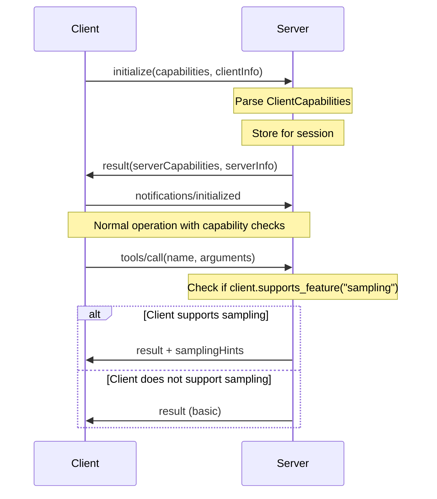

# 82. MCP Client Capabilities

Date: 2025-12

## Status

Accepted

## Category

Architecture & Integration (CRITICAL)

## Context

The Model Context Protocol (MCP) version 2025-11-25 introduces a **client capabilities negotiation** mechanism during the initialization handshake. This enables servers to understand what features a connecting client supports and adapt their behavior accordingly.

**Why Client Capabilities Matter**:

Different MCP clients have varying levels of feature support:
- **Full-featured clients** (Claude Desktop, Claude.ai): Support tools, resources, prompts, sampling, elicitation
- **Minimal clients** (CLI tools, custom implementations): May only support basic tool calling
- **Specialized clients** (monitoring agents): May support resource subscription but not prompts
- **Future clients**: May introduce new experimental capabilities

Without capability negotiation, servers must either:
1. **Assume all features** - Risk errors when clients don't support them
2. **Provide minimal features** - Limit functionality even for advanced clients
3. **Version-specific logic** - Create brittle, hard-to-maintain code

**Current Implementation Gap**:

Our MCP server implementation (`src/mcp_server_langgraph/mcp/client/protocol.py`) currently:
- ✅ Sends client capabilities during initialization (`roots`, `sampling`)
- ✅ Parses server capabilities from initialize response
- ❌ **Does not adapt behavior based on client capabilities** when acting as a server
- ❌ **Does not track or use client capabilities** for feature degradation
- ❌ **No capability-based feature gating** in tool/resource/prompt endpoints

**MCP Protocol Specification (2025-11-25)**:

```python
# From initialize request params
{
  "protocolVersion": "2025-11-25",
  "capabilities": {
    "roots": {"listChanged": false},        # Client supports roots/list
    "sampling": {},                         # Client supports sampling/createMessage
    "elicitation": {},                      # Client supports elicitation workflow
    "experimental": {                       # Non-standard capabilities
      "customFeature": {}
    }
  },
  "clientInfo": {
    "name": "claude-desktop",
    "version": "1.0.0"
  }
}
```

## Decision

Implement comprehensive **client capabilities negotiation and feature degradation** to ensure interoperability with diverse MCP clients while maximizing feature availability.

### Core Components

#### 1. Client Capability Tracking

**Location**: `src/mcp_server_langgraph/mcp/server/capabilities.py`

**Purpose**: Parse and track client capabilities during initialization.

```python
from dataclasses import dataclass, field
from typing import Any


@dataclass
class RootsCapability:
    """Client support for roots/list endpoint."""
    enabled: bool = True
    list_changed: bool = False  # Supports roots/list/changed notifications


@dataclass
class SamplingCapability:
    """Client support for sampling/createMessage."""
    enabled: bool = True
    # Additional sampling params could be added here


@dataclass
class ElicitationCapability:
    """Client support for elicitation workflow."""
    enabled: bool = True


@dataclass
class ClientCapabilities:
    """Parsed client capabilities from initialize request."""

    protocol_version: str
    client_name: str
    client_version: str
    client_description: str | None = None

    # Core capabilities
    roots: RootsCapability = field(default_factory=RootsCapability)
    sampling: SamplingCapability = field(default_factory=SamplingCapability)
    elicitation: ElicitationCapability = field(default_factory=ElicitationCapability)

    # Experimental/custom capabilities
    experimental: dict[str, dict[str, Any]] = field(default_factory=dict)

    @classmethod
    def from_initialize_params(cls, params: dict[str, Any]) -> "ClientCapabilities":
        """Parse client capabilities from initialize request params.

        Args:
            params: The 'params' field from initialize request

        Returns:
            ClientCapabilities with parsed capabilities
        """
        capabilities = params.get("capabilities", {})
        client_info = params.get("clientInfo", {})

        # Parse roots capability
        roots_cap_dict = capabilities.get("roots", {})
        roots = RootsCapability(
            enabled=bool(roots_cap_dict),
            list_changed=roots_cap_dict.get("listChanged", False) if roots_cap_dict else False,
        )

        # Parse sampling capability
        sampling_cap_dict = capabilities.get("sampling", {})
        sampling = SamplingCapability(enabled=bool(sampling_cap_dict))

        # Parse elicitation capability
        elicitation_cap_dict = capabilities.get("elicitation", {})
        elicitation = ElicitationCapability(enabled=bool(elicitation_cap_dict))

        # Extract experimental capabilities
        experimental = capabilities.get("experimental", {})

        return cls(
            protocol_version=params.get("protocolVersion", "unknown"),
            client_name=client_info.get("name", "unknown"),
            client_version=client_info.get("version", "unknown"),
            client_description=client_info.get("description"),
            roots=roots,
            sampling=sampling,
            elicitation=elicitation,
            experimental=experimental,
        )

    def supports_feature(self, feature: str) -> bool:
        """Check if client supports a specific feature.

        Args:
            feature: Feature name (e.g., 'roots', 'sampling', 'elicitation')

        Returns:
            True if client supports the feature
        """
        capability = getattr(self, feature, None)
        if capability is None:
            return False
        return getattr(capability, "enabled", False)

    def has_experimental(self, feature: str) -> bool:
        """Check if client has a specific experimental capability.

        Args:
            feature: Experimental feature name

        Returns:
            True if client declares the experimental capability
        """
        return feature in self.experimental
```

#### 2. Capability-Based Feature Degradation

**Location**: Extend `src/mcp_server_langgraph/mcp/server/mcp_server.py`

**Pattern**: Add capability checks before using advanced features.

```python
from mcp_server_langgraph.mcp.server.capabilities import ClientCapabilities


class MCPServer:
    """MCP Server with capability negotiation."""

    def __init__(self):
        self._client_capabilities: ClientCapabilities | None = None

    async def handle_initialize(self, params: dict[str, Any]) -> dict[str, Any]:
        """Handle initialize request and parse client capabilities."""
        # Parse client capabilities
        self._client_capabilities = ClientCapabilities.from_initialize_params(params)

        # Log capabilities for observability
        logger.info(
            "Client connected",
            extra={
                "client_name": self._client_capabilities.client_name,
                "client_version": self._client_capabilities.client_version,
                "protocol_version": self._client_capabilities.protocol_version,
                "supports_roots": self._client_capabilities.supports_feature("roots"),
                "supports_sampling": self._client_capabilities.supports_feature("sampling"),
                "supports_elicitation": self._client_capabilities.supports_feature("elicitation"),
            },
        )

        # Return server capabilities
        return {
            "protocolVersion": MCP_PROTOCOL_VERSION,
            "capabilities": self._get_server_capabilities(),
            "serverInfo": {
                "name": "mcp-server-langgraph",
                "version": __version__,
            },
        }

    async def handle_tools_call(self, params: dict[str, Any]) -> dict[str, Any]:
        """Execute a tool with capability-based features."""
        tool_name = params["name"]
        arguments = params.get("arguments", {})

        # Execute tool
        result = await self._execute_tool(tool_name, arguments)

        # If client supports sampling, offer to refine result via LLM
        if self._client_capabilities and self._client_capabilities.supports_feature("sampling"):
            # Optional: Include sampling suggestions
            result["_meta"] = {
                "samplingHints": {
                    "modelPreferences": ["claude-3-5-sonnet-20241022"],
                    "temperature": 0.7,
                }
            }

        return result

    async def handle_resource_read(self, params: dict[str, Any]) -> dict[str, Any]:
        """Read a resource with capability-based notifications."""
        uri = params["uri"]

        # Read resource
        content = await self._read_resource(uri)

        # If client supports roots notifications, check if we should send update
        if (
            self._client_capabilities
            and self._client_capabilities.roots.enabled
            and self._client_capabilities.roots.list_changed
        ):
            # Client wants notifications about roots changes
            # (Could trigger background notification here)
            pass

        return {"contents": [content]}
```

#### 3. Capability Negotiation Flow

**Initialization Sequence**:



### Capabilities Covered

| Capability | Description | Feature Degradation Strategy |
|------------|-------------|------------------------------|
| **roots** | Client supports `roots/list` endpoint | If disabled: Skip sending root filesystem notifications |
| **roots.listChanged** | Client supports `roots/list/changed` notifications | If disabled: Don't send notifications when roots change |
| **sampling** | Client supports `sampling/createMessage` (LLM integration) | If disabled: Don't include sampling hints in responses |
| **elicitation** | Client supports elicitation workflow | If disabled: Don't attempt interactive elicitation |
| **experimental.{name}** | Client has experimental capability | If absent: Don't use experimental feature |

### Feature Degradation When Capability Absent

**Example: Tool Call Response**

```python
# Full-featured client (supports sampling)
{
  "content": [{"type": "text", "text": "Result: ..."}],
  "isError": false,
  "_meta": {
    "samplingHints": {
      "modelPreferences": ["claude-3-5-sonnet-20241022"],
      "systemPrompt": "Use this tool result to answer the user's question."
    }
  }
}

# Minimal client (no sampling support)
{
  "content": [{"type": "text", "text": "Result: ..."}],
  "isError": false
}
```

**Example: Resource Notifications**

```python
# Client with roots.listChanged = true
# → Server sends notifications when roots change
await send_notification("notifications/roots/list_changed")

# Client with roots.listChanged = false
# → Server does NOT send notifications (client doesn't support them)
```

### Security & Validation

1. **Capability Verification**: Always check `_client_capabilities` before using advanced features
2. **Protocol Version Compatibility**: Reject clients with incompatible protocol versions
3. **Unknown Capabilities**: Ignore unknown experimental capabilities (forward compatibility)
4. **Capability Spoofing**: Capabilities are declarative only; gracefully handle client failures

```python
def validate_protocol_version(client_version: str) -> bool:
    """Check if client protocol version is compatible.

    Args:
        client_version: Protocol version from client

    Returns:
        True if compatible, False otherwise
    """
    # Support exact match or backward-compatible versions
    supported_versions = ["2025-11-25", "2024-11-05"]  # Example
    return client_version in supported_versions
```

## Consequences

### Positive

1. **Interoperability**: Works seamlessly with diverse MCP clients (Claude Desktop, CLI tools, custom clients)
2. **Feature Maximization**: Advanced clients get full features, minimal clients still work
3. **Forward Compatibility**: New experimental capabilities can be tested without breaking old clients
4. **Protocol Compliance**: Adheres to MCP 2025-11-25 specification
5. **Better UX**: Clients get features they can actually use, avoiding errors from unsupported features
6. **Observability**: Can track which client capabilities are actually used in production

### Negative

1. **Complexity**: Must check capabilities before using advanced features
2. **Testing Burden**: Need to test with multiple client capability combinations
3. **Documentation**: Must document which features require which capabilities
4. **Maintenance**: As protocol evolves, must update capability checks

### Neutral

1. **Performance**: Capability checks add negligible overhead (in-memory lookup)
2. **Backward Compatibility**: Existing clients continue to work (graceful degradation)
3. **Feature Flags**: Can combine with feature flags for gradual rollout

## Implementation Details

### Files to Create

```
src/mcp_server_langgraph/mcp/server/
└── capabilities.py              # ClientCapabilities, capability dataclasses
```

### Files to Modify

```
src/mcp_server_langgraph/mcp/server/mcp_server.py    # Add capability tracking
src/mcp_server_langgraph/mcp/client/protocol.py      # Document client capabilities we send
```

### Test Coverage

**Unit Tests** (`tests/unit/mcp/test_client_capabilities.py`):
```python
def test_parse_full_capabilities():
    """Test parsing client with all capabilities enabled."""
    ...

def test_parse_minimal_capabilities():
    """Test parsing client with no capabilities."""
    ...

def test_supports_feature_returns_true_for_enabled():
    """Test supports_feature returns True for enabled capability."""
    ...

def test_supports_feature_returns_false_for_disabled():
    """Test supports_feature returns False for missing capability."""
    ...

def test_has_experimental_detects_custom_capability():
    """Test has_experimental detects experimental capability."""
    ...

def test_backward_compatible_with_old_clients():
    """Test graceful handling of clients without capabilities field."""
    ...
```

**Integration Tests** (`tests/integration/contract/test_mcp_capability_negotiation.py`):
```python
@pytest.mark.contract
async def test_initialize_with_full_capabilities():
    """Test server accepts client with all capabilities."""
    ...

@pytest.mark.contract
async def test_initialize_with_minimal_capabilities():
    """Test server accepts minimal client (no capabilities)."""
    ...

@pytest.mark.contract
async def test_tool_call_respects_sampling_capability():
    """Test tool response includes sampling hints only if client supports it."""
    ...

@pytest.mark.contract
async def test_resource_notifications_honor_list_changed():
    """Test roots/list_changed notifications sent only if supported."""
    ...
```

## Related ADRs

- [ADR-0081: Handoff Pattern Multi-Agent](/architecture/adr-0081-handoff-pattern-multi-agent) - Multi-agent coordination relies on capability negotiation
- [ADR-0079: Multi-Framework Tool Parity](/architecture/adr-0079-multi-framework-tool-parity) - Tool interoperability benefits from capability checks
- [ADR-0004: MCP Streamable HTTP](/architecture/adr-0004-mcp-streamable-http) - Transport layer for capability negotiation

## Related Guides

- [MCP Protocol Reference](/integrations/mcp-protocol)
- [MCP Server Implementation Guide](/guides/mcp-server)
- [Client Integration Guide](/guides/client-integration)

## References

- [MCP Protocol Specification 2025-11-25](https://spec.modelcontextprotocol.io/specification/2025-11-25/)
- [MCP Client Capabilities Schema](https://spec.modelcontextprotocol.io/specification/2025-11-25/schema/#definitions/ClientCapabilities)
- [MCP Initialization Handshake](https://spec.modelcontextprotocol.io/specification/2025-11-25/basic/lifecycle/#initialization)

---

**Last Updated**: 2025-12-26
**Next Review**: 2026-01-26 (after 1 month of client diversity testing)
