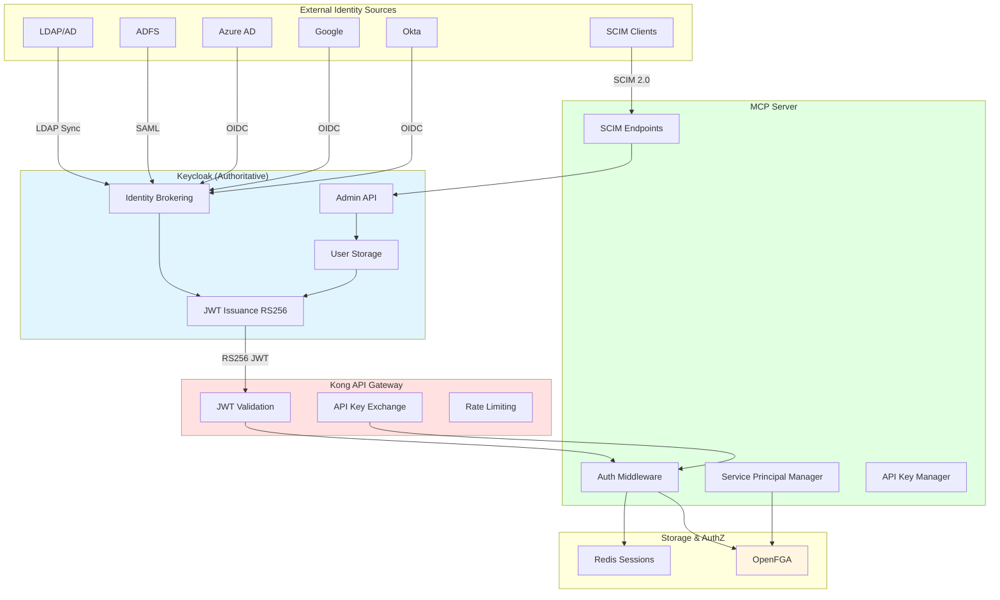

# Keycloak JWT Authentication Architecture - Overview

Complete enterprise-grade authentication and identity management architecture with Keycloak as the authoritative identity provider.

## Executive Summary

This implementation provides a **production-ready authentication system** with:

- ✅ **Keycloak as Single Source of Truth** - All identity centralized
- ✅ **JWT Standardization** - All auth methods produce JWTs
- ✅ **Service Principals** - Long-lived credentials for batch jobs
- ✅ **API Key Management** - Legacy support with JWT exchange
- ✅ **Identity Federation** - LDAP, SAML, OIDC integration
- ✅ **SCIM 2.0 Provisioning** - Automated user management
- ✅ **Kong JWT Validation** - High-performance gateway validation
- ✅ **OpenFGA Permission Inheritance** - Service principals inherit user permissions
- ✅ **Hybrid Session Model** - Stateless users + stateful services

## Architecture Diagram

## Quick Links

### Documentation
- [Deployment Guide](/deployment/keycloak-jwt-deployment)
- [Service Principals Guide](/guides/service-principals)
- [API Key Management](/guides/api-key-management)
- [Identity Federation](/guides/identity-federation-quickstart)
- [SCIM Provisioning](/guides/scim-provisioning)

### Architecture Decision Records
- [ADR-0031: Keycloak as Authoritative Identity](/architecture/adr-0031-keycloak-authoritative-identity)
- [ADR-0032: JWT Standardization](/architecture/adr-0032-jwt-standardization)
- [ADR-0033: Service Principal Design](/architecture/adr-0033-service-principal-design)
- [ADR-0034: API Key to JWT Exchange](/architecture/adr-0034-api-key-jwt-exchange)
- [ADR-0035: Kong JWT Validation](/architecture/adr-0035-kong-jwt-validation)
- [ADR-0036: Hybrid Session Model](/architecture/adr-0036-hybrid-session-model)
- [ADR-0037: Identity Federation](/architecture/adr-0037-identity-federation)
- [ADR-0038: SCIM Implementation](/architecture/adr-0038-scim-implementation)
- [ADR-0039: OpenFGA Permission Inheritance](/architecture/adr-0039-openfga-permission-inheritance)

## Key Design Decisions

| Decision | ADR | Rationale |
|----------|-----|-----------|
| Keycloak as authoritative source | ADR-0031 | Single source of truth, enterprise federation |
| JWT standardization | ADR-0032 | Consistent auth, stateless validation |
| Service principal design | ADR-0033 | Long-running tasks, permission delegation |
| API key→JWT exchange | ADR-0034 | Legacy support + JWT standard |
| Kong JWT validation | ADR-0035 | High performance, no custom plugin |
| Hybrid session model | ADR-0036 | Stateless users, stateful services |
| Identity federation | ADR-0037 | Enterprise integration |
| SCIM implementation | ADR-0038 | Automated provisioning |
| Permission inheritance | ADR-0039 | Service acting as user |

## Getting Started

1. Review [ADR-0031](/architecture/adr-0031-keycloak-authoritative-identity) through [ADR-0039](/architecture/adr-0039-openfga-permission-inheritance)
2. Follow [Deployment Guide](/deployment/keycloak-jwt-deployment)
3. Configure identity providers per [Federation Guide](/guides/identity-federation-quickstart)
4. Create service principals per [Service Principals Guide](/guides/service-principals)
5. Generate API keys per [API Key Guide](/guides/api-key-management)

## Support

- GitHub Issues: [Report bugs](https://github.com/vishnu2kmohan/mcp-server-langgraph/issues)
- Discussions: [Ask questions](https://github.com/vishnu2kmohan/mcp-server-langgraph/discussions)
