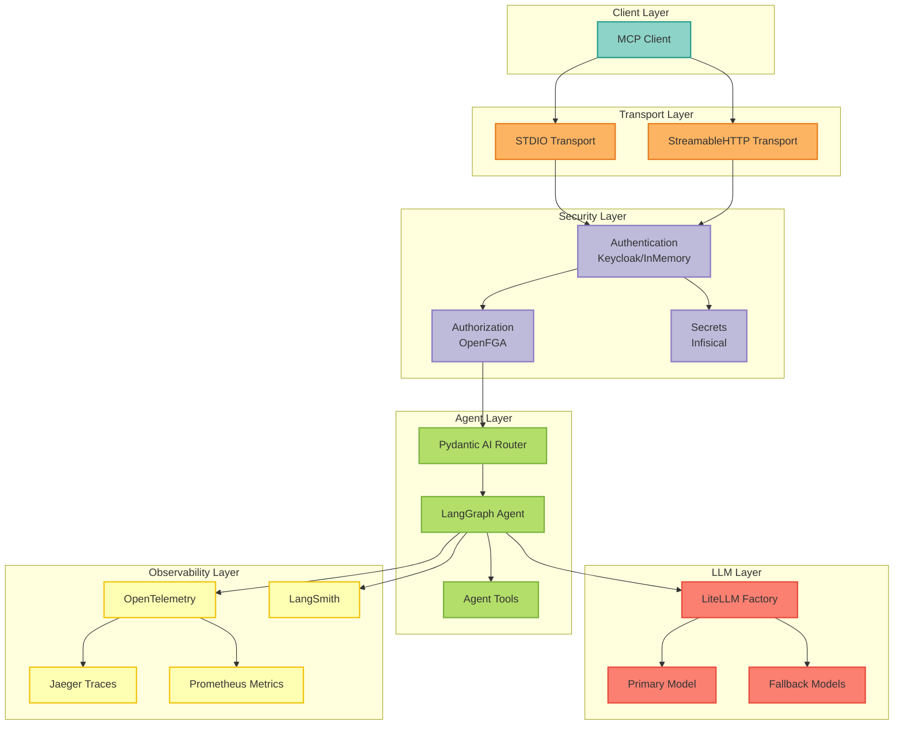

### Introduction

This section documents the architectural decisions made throughout the development of MCP Server with LangGraph. Each Architecture Decision Record (ADR) captures the context, decision, consequences, and alternatives considered for significant technical choices.

<Info>
  **What is an ADR?** Architecture Decision Records document important architectural decisions along with their context and consequences, providing historical insight for current and future maintainers.
</Info>

### Architecture Decision Records

We maintain **63 ADRs** organized into seven categories:

<Note>
  **New in v3.0**: 10 new ADRs (ADRs 31-39) document our enterprise authentication architecture with Keycloak, service principals, API keys, identity federation, and SCIM provisioning. See [Keycloak JWT Architecture Overview](/architecture/keycloak-jwt-architecture-overview) for details.
</Note>

#### Core Architecture (ADRs 1-5)

These foundational decisions shape the entire system:

<CardGroup cols={2}>
  <Card title="ADR-0001: Multi-Provider LLM" icon="brain" href="/architecture/adr-0001-llm-multi-provider">
    LiteLLM for unified access to 100+ LLM providers
  </Card>
  <Card title="ADR-0002: OpenFGA Authorization" icon="shield" href="/architecture/adr-0002-openfga-authorization">
    Fine-grained relationship-based access control
  </Card>
  <Card title="ADR-0003: Dual Observability" icon="chart-line" href="/architecture/adr-0003-dual-observability">
    OpenTelemetry + LangSmith for complete visibility
  </Card>
  <Card title="ADR-0004: MCP StreamableHTTP" icon="globe" href="/architecture/adr-0004-mcp-streamable-http">
    Production-ready HTTP transport protocol
  </Card>
  <Card title="ADR-0005: Pydantic AI Integration" icon="code" href="/architecture/adr-0005-pydantic-ai-integration">
    Type-safe agent responses and routing
  </Card>
</CardGroup>

#### Authentication & Sessions (ADRs 6-7)

Security and session management patterns:

<CardGroup cols={2}>
  <Card title="ADR-0006: Session Storage" icon="database" href="/architecture/adr-0006-session-storage-architecture">
    Pluggable session backends (InMemory, Redis)
  </Card>
  <Card title="ADR-0007: Auth Providers" icon="key" href="/architecture/adr-0007-authentication-provider-pattern">
    Flexible authentication (InMemory, Keycloak)
  </Card>
</CardGroup>

#### Infrastructure & Deployment (ADRs 8-9, 13, 20-21, 27-28, 30)

Infrastructure, deployment, and operational decisions:

<CardGroup cols={3}>
  <Card title="ADR-0008: Infisical Secrets" icon="lock" href="/architecture/adr-0008-infisical-secrets-management">
    Centralized secrets management
  </Card>
  <Card title="ADR-0009: Feature Flags" icon="flag" href="/architecture/adr-0009-feature-flag-system">
    Gradual rollout and experimentation
  </Card>
  <Card title="ADR-0013: Multi-Deployment" icon="cloud" href="/architecture/adr-0013-multi-deployment-target-strategy">
    Support for Docker, K8s, Cloud Run, LangGraph Platform
  </Card>
  <Card title="ADR-0020: Dual Transport" icon="arrows-split-up-and-left" href="/architecture/adr-0020-dual-mcp-transport-protocol">
    STDIO + StreamableHTTP for flexibility
  </Card>
  <Card title="ADR-0021: CI/CD Pipeline" icon="circle-nodes" href="/architecture/adr-0021-cicd-pipeline-strategy">
    Automated testing and deployment
  </Card>
  <Card title="ADR-0027: Rate Limiting" icon="gauge-high" href="/architecture/adr-0027-rate-limiting-strategy">
    API protection and traffic control
  </Card>
  <Card title="ADR-0028: Caching Strategy" icon="layer-group" href="/architecture/adr-0028-caching-strategy">
    Multi-layer performance optimization
  </Card>
  <Card title="ADR-0030: Resilience Patterns" icon="shield-halved" href="/architecture/adr-0030-resilience-patterns">
    Circuit breakers and retry policies
  </Card>
</CardGroup>

#### Development & Quality (ADRs 10, 14-19, 22-26, 29)

Code quality, testing, and development practices:

<CardGroup cols={3}>
  <Card title="ADR-0010: Functional API" icon="sitemap" href="/architecture/adr-0010-langgraph-functional-api">
    LangGraph functional over object-oriented
  </Card>
  <Card title="ADR-0014: Type Safety" icon="check-double" href="/architecture/adr-0014-pydantic-type-safety">
    Strict typing with Pydantic
  </Card>
  <Card title="ADR-0015: Checkpointing" icon="bookmark" href="/architecture/adr-0015-memory-checkpointing">
    Stateful conversation persistence
  </Card>
  <Card title="ADR-0016: Property Testing" icon="flask" href="/architecture/adr-0016-property-based-testing-strategy">
    Hypothesis for edge case discovery
  </Card>
  <Card title="ADR-0017: Error Handling" icon="triangle-exclamation" href="/architecture/adr-0017-error-handling-strategy">
    Consistent error patterns
  </Card>
  <Card title="ADR-0018: Versioning" icon="tag" href="/architecture/adr-0018-semantic-versioning-strategy">
    Semantic versioning strategy
  </Card>
  <Card title="ADR-0019: Async-First" icon="bolt" href="/architecture/adr-0019-async-first-architecture">
    Async by default for scalability
  </Card>
  <Card title="ADR-0022: Distributed Checkpointing" icon="database" href="/architecture/adr-0022-distributed-conversation-checkpointing">
    Redis-backed conversation state
  </Card>
  <Card title="ADR-0023: Anthropic Tool Design" icon="toolbox" href="/architecture/adr-0023-anthropic-tool-design-best-practices">
    Best practices for tool implementations
  </Card>
  <Card title="ADR-0024: Agentic Loop" icon="rotate" href="/architecture/adr-0024-agentic-loop-implementation">
    Gather-Action-Verify-Repeat cycle
  </Card>
  <Card title="ADR-0025: Anthropic Enhancements" icon="sparkles" href="/architecture/adr-0025-anthropic-best-practices-enhancements">
    Advanced best practices implementation
  </Card>
  <Card title="ADR-0026: Lazy Observability" icon="eye-slash" href="/architecture/adr-0026-lazy-observability-initialization">
    On-demand telemetry initialization
  </Card>
  <Card title="ADR-0029: Custom Exceptions" icon="circle-exclamation" href="/architecture/adr-0029-custom-exception-hierarchy">
    Domain-specific error handling
  </Card>
</CardGroup>

#### Compliance & Templates (ADRs 11-12)

Compliance frameworks and project templating:

<CardGroup cols={2}>
  <Card title="ADR-0011: Cookiecutter Template" icon="cookie-bite" href="/architecture/adr-0011-cookiecutter-template-strategy">
    Reusable project template
  </Card>
  <Card title="ADR-0012: Compliance Framework" icon="file-contract" href="/architecture/adr-0012-compliance-framework-integration">
    Built-in GDPR, SOC 2, HIPAA support
  </Card>
</CardGroup>

### ADR Index

Quick reference table of all architectural decisions:

| # | Title | Category | Status | Date |
|---|-------|----------|--------|------|
| [0001](/architecture/adr-0001-llm-multi-provider) | Multi-Provider LLM Support via LiteLLM | Core | Accepted | 2025-10-11 |
| [0002](/architecture/adr-0002-openfga-authorization) | Fine-Grained Authorization with OpenFGA | Core | Accepted | 2025-10-11 |
| [0003](/architecture/adr-0003-dual-observability) | Dual Observability: OpenTelemetry + LangSmith | Core | Accepted | 2025-10-11 |
| [0004](/architecture/adr-0004-mcp-streamable-http) | MCP StreamableHTTP Transport Protocol | Core | Accepted | 2025-10-11 |
| [0005](/architecture/adr-0005-pydantic-ai-integration) | Type-Safe Agent Responses with Pydantic AI | Core | Accepted | 2025-10-11 |
| [0006](/architecture/adr-0006-session-storage-architecture) | Pluggable Session Storage Architecture | Auth | Accepted | 2025-10-13 |
| [0007](/architecture/adr-0007-authentication-provider-pattern) | Pluggable Authentication Provider Pattern | Auth | Accepted | 2025-10-13 |
| [0008](/architecture/adr-0008-infisical-secrets-management) | Infisical for Secrets Management | Infrastructure | Accepted | 2025-10-13 |
| [0009](/architecture/adr-0009-feature-flag-system) | Feature Flag System for Gradual Rollouts | Infrastructure | Accepted | 2025-10-13 |
| [0010](/architecture/adr-0010-langgraph-functional-api) | LangGraph Functional API over Object-Oriented | Development | Accepted | 2025-10-13 |
| [0011](/architecture/adr-0011-cookiecutter-template-strategy) | Cookiecutter Template for Project Generation | Compliance | Accepted | 2025-10-13 |
| [0012](/architecture/adr-0012-compliance-framework-integration) | Built-In Compliance Framework (GDPR, SOC 2, HIPAA) | Compliance | Accepted | 2025-10-13 |
| [0013](/architecture/adr-0013-multi-deployment-target-strategy) | Multi-Deployment Target Strategy | Infrastructure | Accepted | 2025-10-13 |
| [0014](/architecture/adr-0014-pydantic-type-safety) | Pydantic Type Safety Strategy | Development | Accepted | 2025-10-13 |
| [0015](/architecture/adr-0015-memory-checkpointing) | Memory Checkpointing for Stateful Agents | Development | Accepted | 2025-10-13 |
| [0016](/architecture/adr-0016-property-based-testing-strategy) | Property-Based Testing with Hypothesis | Development | Accepted | 2025-10-13 |
| [0017](/architecture/adr-0017-error-handling-strategy) | Error Handling Strategy | Development | Accepted | 2025-10-13 |
| [0018](/architecture/adr-0018-semantic-versioning-strategy) | Semantic Versioning Strategy | Development | Accepted | 2025-10-13 |
| [0019](/architecture/adr-0019-async-first-architecture) | Async-First Architecture | Development | Accepted | 2025-10-13 |
| [0020](/architecture/adr-0020-dual-mcp-transport-protocol) | Dual MCP Transport Protocol (STDIO + StreamableHTTP) | Infrastructure | Accepted | 2025-10-13 |
| [0021](/architecture/adr-0021-cicd-pipeline-strategy) | CI/CD Pipeline Strategy | Infrastructure | Accepted | 2025-10-13 |
| [0022](/architecture/adr-0022-distributed-conversation-checkpointing) | Distributed Conversation Checkpointing with Redis | Development | Accepted | 2025-10-15 |
| [0023](/architecture/adr-0023-anthropic-tool-design-best-practices) | Anthropic Tool Design Best Practices | Development | Accepted | 2025-10-17 |
| [0024](/architecture/adr-0024-agentic-loop-implementation) | Agentic Loop Implementation (Gather-Action-Verify-Repeat) | Development | Accepted | 2025-10-17 |
| [0025](/architecture/adr-0025-anthropic-best-practices-enhancements) | Anthropic Best Practices - Advanced Enhancements | Development | Accepted | 2025-10-17 |
| [0026](/architecture/adr-0026-lazy-observability-initialization) | Lazy Observability Initialization | Development | Accepted | 2025-10-17 |
| [0027](/architecture/adr-0027-rate-limiting-strategy) | Rate Limiting Strategy for API Protection | Infrastructure | Accepted | 2025-10-20 |
| [0028](/architecture/adr-0028-caching-strategy) | Multi-Layer Caching Strategy | Infrastructure | Accepted | 2025-10-20 |
| [0029](/architecture/adr-0029-custom-exception-hierarchy) | Custom Exception Hierarchy | Development | Accepted | 2025-10-20 |
| [0030](/architecture/adr-0030-resilience-patterns) | Resilience Patterns for Production Systems | Infrastructure | Accepted | 2025-10-20 |
| [0031](/architecture/adr-0031-keycloak-authoritative-identity) | Keycloak as Authoritative Identity Provider | Auth | Accepted | 2025-10-23 |
| [0032](/architecture/adr-0032-jwt-standardization) | JWT Standardization for Multi-Component Auth | Auth | Accepted | 2025-10-23 |
| [0033](/architecture/adr-0033-service-principal-design) | Service Principal Design for Machine-to-Machine Auth | Auth | Accepted | 2025-10-23 |
| [0034](/architecture/adr-0034-api-key-jwt-exchange) | API Key to JWT Exchange Pattern | Auth | Accepted | 2025-10-23 |
| [0035](/architecture/adr-0035-kong-jwt-validation) | Kong Gateway for JWT Validation | Auth | Accepted | 2025-10-23 |
| [0036](/architecture/adr-0036-hybrid-session-model) | Hybrid Session Model (Stateless JWT + Stateful Redis) | Auth | Accepted | 2025-10-23 |
| [0037](/architecture/adr-0037-identity-federation) | Identity Federation with External IDPs | Auth | Accepted | 2025-10-23 |
| [0038](/architecture/adr-0038-scim-implementation) | SCIM 2.0 Implementation for User Provisioning | Auth | Accepted | 2025-10-23 |
| [0039](/architecture/adr-0039-openfga-permission-inheritance) | OpenFGA Permission Inheritance Model | Auth | Accepted | 2025-10-23 |
| [0040](/architecture/adr-0040-gcp-gke-autopilot-deployment) | GCP GKE Autopilot Deployment Strategy | Infrastructure | Accepted | 2025-10-25 |
| [0041](/architecture/adr-0041-postgresql-gdpr-storage) | PostgreSQL for GDPR-Compliant Storage | Infrastructure | Accepted | 2025-10-30 |
| [0042](/architecture/adr-0042-dependency-injection-configuration-fixes) | Dependency Injection Configuration Fixes | Infrastructure | Accepted | 2025-01-28 |
| [0043](/architecture/adr-0043-cost-monitoring-dashboard) | Cost Monitoring Dashboard for LLM Usage | Infrastructure | Accepted | 2025-11-02 |
| [0044](/architecture/adr-0044-test-infrastructure-quick-wins) | Test Infrastructure Quick Wins (Phase 1) | Development | Accepted | 2025-11-06 |
| [0045](/architecture/adr-0045-test-infrastructure-phase-2-foundation) | Test Infrastructure Phase 2 - Real Infrastructure Foundation | Development | Accepted | 2025-11-06 |
| [0046](/architecture/adr-0046-deployment-configuration-tdd-infrastructure) | Deployment Configuration TDD Infrastructure | Infrastructure | Accepted | 2025-11-06 |
| [0047](/architecture/adr-0047-visual-workflow-builder) | Visual Workflow Builder (Future) | Development | Proposed | 2025-11-02 |
| [0048](/architecture/adr-0048-postgres-storage-integration-tests) | PostgreSQL Storage Integration Tests | Development | Accepted | 2025-11-06 |
| [0052](/architecture/adr-0052-pytest-xdist-isolation-strategy) | Pytest-xdist Isolation Strategy with Worker-Scoped Resources | Development | Accepted | 2025-01-11 |

### Design Principles

Based on our ADRs, these principles guide our architecture:

<AccordionGroup>
  <Accordion title="Flexibility Over Lock-In">
    Use pluggable abstractions (LiteLLM, session storage, auth providers) to avoid vendor lock-in and enable easy switching between providers.
  </Accordion>

  <Accordion title="Production-Ready Defaults">
    Every feature is designed for production use: proper error handling, observability, security, and scalability built-in.
  </Accordion>

  <Accordion title="Type Safety First">
    Leverage Python's type system with Pydantic for runtime validation and static analysis with mypy strict mode.
  </Accordion>

  <Accordion title="Async by Default">
    All I/O operations are async for better scalability and resource utilization in production deployments.
  </Accordion>

  <Accordion title="Observable Systems">
    Dual observability (OpenTelemetry + LangSmith) ensures complete visibility into both infrastructure and LLM behavior.
  </Accordion>

  <Accordion title="Security & Compliance">
    Enterprise-grade security (JWT, OpenFGA, Infisical) and built-in compliance frameworks (GDPR, SOC 2, HIPAA).
  </Accordion>

  <Accordion title="Developer Experience">
    Well-documented decisions, comprehensive testing, clear error messages, and developer-friendly tooling.
  </Accordion>

  <Accordion title="Progressive Enhancement">
    Feature flags enable gradual rollouts and A/B testing without deployments.
  </Accordion>
</AccordionGroup>

### System Architecture


### When to Create an ADR

Create a new ADR when making decisions about:

- **Technology Choices**: Selecting frameworks, libraries, or services
- **Architectural Patterns**: Adopting new patterns or changing existing ones
- **Cross-Cutting Concerns**: Security, observability, error handling
- **Integration Strategies**: How components interact with each other
- **Deployment Approaches**: Infrastructure and deployment methodologies
- **Quality Practices**: Testing strategies, code quality standards

### ADR Template

When creating a new ADR, use this structure:

```markdown
## [Number]. [Title]

Date: YYYY-MM-DD

### Status

[Proposed | Accepted | Deprecated | Superseded]

### Context

What problem are we solving? What constraints exist?

### Decision

What solution did we choose and why?

### Consequences

#### Positive Consequences
- Benefits of this decision

#### Negative Consequences
- Drawbacks and limitations

#### Neutral Consequences
- Trade-offs

### Alternatives Considered

1. **Alternative 1**
   - Description
   - Why rejected

### References

- Related documentation
- External resources
```

### Related Documentation

<CardGroup cols={2}>
  <Card title="Development Guide" icon="code" href="/advanced/development-setup">
    Set up your development environment
  </Card>
  <Card title="Testing Guide" icon="vial" href="/advanced/testing">
    Comprehensive testing strategy
  </Card>
  <Card title="Deployment Guide" icon="rocket" href="/deployment/overview">
    Deploy to various platforms
  </Card>
  <Card title="Security Guide" icon="shield" href="/security/overview">
    Security best practices
  </Card>
</CardGroup>

---

<Note>
  **Questions about our architecture?** Open a discussion on [GitHub](https://github.com/vishnu2kmohan/mcp-server-langgraph/discussions) or review individual ADRs for detailed rationale.
</Note>
