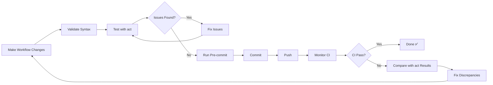

# Testing GitHub Actions Workflows Locally with act

## Overview

This guide explains how to test GitHub Actions workflows locally using `act` before pushing changes to GitHub, preventing CI failures and wasted CI minutes.

## Why Test Workflows Locally?

### Benefits

- **Catch issues before CI**: Find missing dependencies, syntax errors, configuration mistakes
- **Save CI minutes**: Avoid wasting GitHub Actions minutes on fixable issues
- **Faster feedback**: Test in seconds vs. minutes waiting for CI
- **Better confidence**: Know changes work before pushing

### Real Example from This Project

**Recent Issue**: E2E tests failing with `ModuleNotFoundError: No module named 'black'`

**What Happened**:
```bash
# CI workflow used:
uv sync  # Missing --extra dev --extra builder

# E2E tests import builder modules
import mcp_server_langgraph.builder.codegen.generator
# generator.py imports black ❌ ModuleNotFoundError

# Result: 40 E2E tests + 100+ other tests failed in CI
```
**If We Had Tested with act**:
```bash
$ act push -W .github/workflows/e2e-tests.yaml -j e2e-tests

... (workflow runs locally)
ModuleNotFoundError: No module named 'black'  ← CAUGHT LOCALLY ✅

# Fix: Add --extra dev --extra builder
# Retest with act
# Push when working ✅
```

**Savings**: ~30 min of debugging + wasted CI minutes

---

## Quick Start

### Prerequisites

1. **Docker Running**:
   ```bash
   docker ps  # Should show running containers or empty list
   ```

2. **act Installed**:
   ```bash
   act --version  # Should show version info
   ```

### Basic Workflow Testing

```bash
# Navigate to project root
cd /home/vishnu/git/vishnu2kmohan/mcp-server-langgraph

# Test a specific workflow
act push -W .github/workflows/ci.yaml -j test

# Or use Makefile shortcuts
make validate-workflows     # Fast: Validate YAML syntax only
make test-workflow-ci       # Test ci.yaml
make test-workflows         # Test all critical workflows
```
---

## Common Testing Patterns

### 1. Validate Workflow Syntax Only (Fast)

```bash
# Python-based validation (instant)
make validate-workflows

# act list (shows what would run)
act push -W .github/workflows/ci.yaml --list
```

**Use when**: Quick syntax check before detailed testing

---

### 2. Test Specific Job (Recommended)

```bash
# Test only the 'test' job in ci.yaml
act push -W .github/workflows/ci.yaml -j test

# Test with specific matrix value
act push -W .github/workflows/ci.yaml -j test --matrix python-version:3.12
```
**Use when**: Modified specific job, want fast feedback

---

### 3. Test Full Workflow

```bash
# Run entire workflow
act push -W .github/workflows/ci.yaml
```

**Use when**: Testing workflow-level changes (triggers, dependencies)

---

### 4. Test Different Events

```bash
# Test pull_request trigger
act pull_request -W .github/workflows/ci.yaml

# Test schedule trigger
act schedule -W .github/workflows/quality-tests.yaml

# Test workflow_dispatch (manual trigger)
act workflow_dispatch -W .github/workflows/deploy-staging-gke.yaml
```
---

## Testing Workflow Changes - Complete Example

### Scenario: Adding New Dependency

**Step 1: Make Changes**

```yaml
# .github/workflows/ci.yaml
- name: Install dependencies
  run: |
    uv sync --extra dev --extra builder  # ← Added --extra flags
```

**Step 2: Validate Syntax**

```bash
make validate-workflows
# Output: ✓ ci.yaml (valid)
```
**Step 3: Test with act**

```bash
# Test the specific job that changed
act push -W .github/workflows/ci.yaml -j test

# Watch for:
# ✅ "uv sync --extra dev --extra builder" executes
# ✅ Dependencies install successfully
# ✅ Tests can import modules
# ❌ Any ModuleNotFoundError or command not found errors
```

**Step 4: Fix Issues Found**

If act shows errors:
```bash
# Example: Missing jq
Step: Run skipped test tracker
| jq: command not found  ← FOUND THE ISSUE

# Fix in workflow file:
- name: Install jq
  run: sudo apt-get update && sudo apt-get install -y jq

# Retest with act:
act push -W .github/workflows/track-skipped-tests.yaml -j track-skipped-tests
# ✅ Now works!
```
**Step 5: Commit & Push**

```bash
git add .github/workflows/
git commit -m "fix: add missing dependencies to CI workflow"
git push origin main

# Monitor CI (should match act results)
gh run watch
```

---

## Common Issues and Solutions

### Issue #1: Docker Not Running

**Symptom**:
```bash
Cannot connect to the Docker daemon
```

**Solution**:
```bash
# Linux
sudo systemctl start docker

# macOS
open -a Docker

# Verify
docker ps
```

---

### Issue #2: Container Image Not Found

**Symptom**:
```text
Error: image not found: catthehacker/ubuntu:act-latest
```
**Solution**:
```bash
# Pull image manually
docker pull catthehacker/ubuntu:act-latest

# Or use different image in .actrc:
# -P ubuntu-latest=ghcr.io/catthehacker/ubuntu:act-22.04
```

---

### Issue #3: Workflow Runs But Fails Due to Missing Infrastructure

**Symptom**:
```python
Tests fail with connection errors to PostgreSQL/Redis/etc.
```

**Expected Behavior**: This is normal! act can't run full test infrastructure.

**What to Check**:
- ✅ Dependency installation succeeds
- ✅ Test collection works (no import errors)
- ⚠️ Test execution may fail (infrastructure missing - OK)

**Focus on**: Setup steps, not test results

---

### Issue #4: Secrets Not Available

**Symptom**:
```yaml
Error: secret MY_SECRET not found
```

**Solution**:
```bash
# Create .secrets file (gitignored)
cat > .secrets <<EOF
GITHUB_TOKEN=ghp_your_token_here
GCP_PROJECT_ID=your-project-id
EOF

# Test with secrets
act push -W .github/workflows/deploy-staging-gke.yaml --secret-file .secrets
```
---

## Makefile Integration

### Available Commands

```bash
# Validate all workflow syntax (fast - 2 seconds)
make validate-workflows

# Test critical workflows with act (~2-5 min first time, ~30sec after)
make test-workflows

# Test specific workflow
make test-workflow-ci          # Test ci.yaml
make test-workflow-e2e-tests   # Test e2e-tests.yaml
make test-workflow-quality-tests  # Test quality-tests.yaml

# See what would run without executing
make act-dry-run
```

---

## What to Look For During Testing

### ✅ Success Indicators

```python
[Run unit tests]
| uv sync --extra dev --extra builder
| ✓ Dependencies installed from lockfile with dev+builder extras
|
| pytest -n auto -m unit --cov
| ============================= test session starts ==============================
| ... tests running ...
```

**Good signs**:
- Dependencies install without errors
- No "ModuleNotFoundError"
- No "command not found"
- Tests collect successfully

---

### ❌ Failure Indicators to Fix

```
| pip install requests  ← Should be: uv pip install OR uv sync --group
| /bin/bash: jq: command not found  ← Missing: sudo apt-get install -y jq
| python scripts/ci/check-links.py  ← Should be: uv run python scripts/...
| ModuleNotFoundError: No module named 'black'  ← Missing: --extra builder
```

---

### ⚠️ Expected Failures (Can Ignore)

```
| ERROR tests/e2e/test_full_user_journey.py - ConnectionError: PostgreSQL not available
```

**Why it's OK**: Test infrastructure (Postgres, Redis, etc.) not running in act environment.

**What to verify**: Tests COLLECT without import errors, even if they skip/fail during execution.

---

## Performance Tips

### Faster Testing

```bash
# Reuse containers (already set in .actrc)
act push -W .github/workflows/ci.yaml --reuse

# Skip image pull if already have it
act push -W .github/workflows/ci.yaml --pull=false

# Test only changed files (manual)
act push -W .github/workflows/ci.yaml -j test --env CHANGED_FILES=src/core/agent.py
```
### Parallel Testing

```bash
# Test multiple workflows in parallel
act push -W .github/workflows/ci.yaml -j test &
act push -W .github/workflows/e2e-tests.yaml -j e2e-tests &
wait

echo "All tests complete"
```

---

## act Configuration Reference

### .actrc File

Located at: `/home/vishnu/.config/act/actrc`

```bash
# Use medium Docker image (best balance)
-P ubuntu-latest=catthehacker/ubuntu:act-latest

# Match CI architecture
--container-architecture linux/amd64

# Environment variables
--env OTEL_SDK_DISABLED=true
--env TESTING=true

# Artifacts
--artifact-server-path /tmp/act-artifacts

# Secrets (if .secrets file exists)
--secret-file .secrets

# Reuse containers for speed
--reuse
```
### .secrets File (Optional)

Create `.secrets` for workflows that need credentials:

```bash
GITHUB_TOKEN=ghp_your_personal_access_token
GCP_PROJECT_ID=your-gcp-project-id
GCP_SERVICE_ACCOUNT=deployer@project.iam.gserviceaccount.com
```

**Important**: `.secrets` is gitignored - never commit it!

---

## Integration with Development Workflow

### Recommended Process


### Before Every Workflow Commit:

1. ✅ **Validate**: `make validate-workflows`
2. ✅ **Test with act**: `act push -W .github/workflows/YOUR_FILE.yaml -j JOB_NAME`
3. ✅ **Fix any issues** found by act
4. ✅ **Run pre-commit**: `pre-commit run --all-files`
5. ✅ **Commit**: `git commit -m "..."`
6. ✅ **Push**: `git push`
7. ✅ **Monitor**: `gh run watch`

---

## Troubleshooting

### act Command Not Found

```bash
# Install act
brew install act  # macOS
curl https://raw.githubusercontent.com/nektos/act/master/install.sh | sudo bash  # Linux

# Verify
act --version
```

### Workflow Not Found

```bash
# Use full path from repo root
cd /home/vishnu/git/vishnu2kmohan/mcp-server-langgraph
act push -W .github/workflows/ci.yaml
```
### Too Slow

```bash
# Use dry-run mode (fast)
act push -W .github/workflows/ci.yaml -n

# Or just list jobs
act push -W .github/workflows/ci.yaml --list
```

---

## Advanced Usage

### Testing with Different Runner Images

```bash
# GitHub official images (exact match, large)
act -P ubuntu-latest=ghcr.io/catthehacker/ubuntu:act-22.04

# Minimal image (fast, may not have all tools)
act -P ubuntu-latest=node:16-buster-slim
```
### Debugging Specific Steps

```bash
# Run workflow with verbose output
act push -W .github/workflows/ci.yaml -j test -v

# Even more verbose
act push -W .github/workflows/ci.yaml -j test -vv
```

### Testing Locally Modified Workflows Without Committing

```bash
# act automatically uses working directory files
# No need to commit to test changes!

vim .github/workflows/ci.yaml  # Make changes
act push -W .github/workflows/ci.yaml  # Test immediately
# Fix, test again, repeat until working
git commit  # Only commit when act tests pass
```

---

## Success Metrics

Track these to measure effectiveness:

| Metric | Target | Current |
|--------|--------|---------|
| **Workflow changes tested with act before commit** | 100% | ~0% → 100% (new policy) |
| **CI failures from preventable issues** | &lt;5% | Reducing |
| **Time to detect issues** | &lt;5 min (local) | Was: 10+ min (CI) |
| **CI minutes wasted** | &lt;50 min/month | Reducing |

---

## Resources

- **act Documentation**: https://nektosact.com/
- **act GitHub**: https://github.com/nektos/act
- **Makefile Targets**: Run `make help` and look for "Workflow Testing"
- **Project CI/CD Guide**: [CI/CD Troubleshooting](/ci-cd-troubleshooting)

---

**Last Updated**: 2025-11-02
**Status**: Active - Required for all workflow changes
**Tool Version**: act v0.2+ recommended
