## Framework Decision Matrix

Choosing the right agent framework depends on your team, requirements, and constraints. This guide helps you make an informed decision based on comparisons with frameworks we've thoroughly researched: CrewAI, OpenAI AgentKit, Google ADK, Claude Agent SDK, LangGraph Cloud, and Microsoft Agent Framework.

## Quick Decision Tree

Use this interactive decision tree to find the best framework for your needs:

```mermaid
flowchart TD
    Start([Start: Choose Framework]) --> DevQ{Developer or<br/>Non-Developer?}

    DevQ -->|Non-Developer<br/>No Coding| AgentKit[OpenAI AgentKit<br/>✓ Visual builder<br/>✓ No-code required]
    DevQ -->|Developer<br/>Python Skills| ProdQ{Production or<br/>Prototype?}

    ProdQ -->|Prototyping<br/>Learning| CrewAI[CrewAI<br/>✓ Fast getting started<br/>✓ Excellent docs<br/>✓ Role-based teams]
    ProdQ -->|Production<br/>Deployment| EnterpriseQ{Enterprise<br/>Requirements?}

    EnterpriseQ -->|Yes<br/>Security, Compliance,<br/>Multi-Cloud| MCPServer[MCP Server with LangGraph<br/>✓ Enterprise-grade security<br/>✓ Multi-cloud deployment<br/>✓ Full observability]
    EnterpriseQ -->|No<br/>Simple use case| Simple{Quick Deploy<br/>or Self-Host?}
    EnterpriseQ -->|Specific Cloud<br/>Already Using| CloudQ{Which Cloud<br/>Platform?}

    Simple -->|Quick Deploy| LGCloud[LangGraph Cloud<br/>✓ 2-min deployment<br/>✓ Managed service]
    Simple -->|Self-Host| CrewAI2[CrewAI<br/>✓ Easy setup<br/>✓ Good for learning]

    CloudQ -->|Google Cloud<br/>GCP/Vertex AI| GoogleADK[Google ADK<br/>✓ Vertex AI integration<br/>✓ Multi-agent hierarchies]
    CloudQ -->|Microsoft Azure<br/>.NET/C#| MSAgent[Microsoft Agent Framework<br/>✓ Azure integration<br/>✓ Dynamic collaboration]
    CloudQ -->|AWS<br/>Amazon| AWSChoice[MCP Server with LangGraph<br/>✓ EKS support<br/>✓ AWS Bedrock ready]

    %% ColorBrewer2 Set3 palette - each component type uniquely colored
    classDef mcpStyle fill:#b3de69,stroke:#7cb342,stroke-width:3px,color:#333
    classDef alternativeStyle fill:#80b1d3,stroke:#3498db,stroke-width:2px,color:#333
    classDef competitorStyle fill:#fdb462,stroke:#e67e22,stroke-width:2px,color:#333
    classDef decisionStyle fill:#ffffb3,stroke:#f1c40f,stroke-width:2px,color:#333
    classDef startStyle fill:#8dd3c7,stroke:#2a9d8f,stroke-width:3px,color:#333

    class MCPServer,AWSChoice mcpStyle
    class LGCloud,GoogleADK,MSAgent alternativeStyle
    class CrewAI,CrewAI2,AgentKit competitorStyle
    class DevQ,ProdQ,EnterpriseQ,Simple,CloudQ decisionStyle
    class Start startStyle
```

<Info>
  **Legend:** 🟢 MCP Server with LangGraph | 🔵 Alternative Frameworks | 🟠 Competitor Frameworks
</Info>

## Framework Comparison Matrix

### By Primary Use Case

| Use Case | Best Framework | Alternative |
|----------|----------------|-------------|
| **Enterprise Production** | MCP Server with LangGraph | Google ADK |
| **Quick Prototyping** | CrewAI | OpenAI AgentKit |
| **Non-Developer** | OpenAI AgentKit | MCP Server (visual builder coming) |
| **Healthcare/HIPAA** | MCP Server with LangGraph | - |
| **Financial/SOC 2** | MCP Server with LangGraph | - |
| **Google Cloud** | Google ADK | MCP Server with LangGraph |
| **Azure Cloud** | Microsoft Agent Framework | MCP Server with LangGraph |
| **Multi-Cloud** | MCP Server with LangGraph | - |
| **RAG-Heavy** | LlamaIndex | MCP Server with LangGraph |
| **Claude-Only** | Claude Agent SDK | MCP Server with LangGraph |
| **OpenAI-Only** | OpenAI AgentKit | LangGraph Cloud |
| **Cost-Sensitive** | MCP Server with LangGraph (self-host) | CrewAI |
| **Role-Based Teams** | CrewAI | MCP Server with LangGraph |

### By Team Type

<Tabs>
  <Tab title="Startup Team (2-5 people)">
    **Characteristics:**
    - Limited resources
    - Need to move fast
    - Cost-sensitive
    - May not have DevOps

    **Recommended:**

    **1. MCP Server with LangGraph** (if you have a developer)
    - Deploy to LangGraph Cloud (2 min, free tier)
    - Migrate to self-hosted as you scale
    - Avoid vendor lock-in from day 1

    **2. CrewAI** (if you want simpler)
    - Fastest getting started
    - Great learning resources
    - Free open-source

    **3. OpenAI AgentKit** (if non-technical)
    - Visual builder
    - No code needed
    - Quick demos
  </Tab>

  <Tab title="Enterprise Team (50+ people)">
    **Characteristics:**
    - Security requirements
    - Compliance needed (GDPR, HIPAA, SOC 2)
    - Multi-team deployment
    - DevOps team available

    **Recommended:**

    **1. MCP Server with LangGraph** (clear winner)
    - JWT + Keycloak + SSO
    - OpenFGA authorization
    - Complete audit logging
    - Multi-cloud deployment
    - Production observability

    **2. Google ADK** (if Google Cloud only)
    - Good Google integration
    - Agent Engine (managed)
    - But: vendor lock-in

    **Avoid:**
    - CrewAI (lacks enterprise features)
    - OpenAI AgentKit (beta, limited security)
  </Tab>

  <Tab title="Product Team (no developers)">
    **Characteristics:**
    - Marketers, designers, PMs
    - No coding experience
    - Need visual tools
    - Quick demos/prototypes

    **Recommended:**

    **1. OpenAI AgentKit** (perfect fit)
    - Visual Agent Builder
    - Drag-and-drop
    - No code needed
    - ChatKit for embedding

    **2. MCP Server with LangGraph** (if dev support available)
    - Developer sets up infrastructure
    - Product team configures agents
    - More powerful but needs dev help

    **Avoid:**
    - Code-first frameworks
  </Tab>

  <Tab title="Developer Team (10-50 people)">
    **Characteristics:**
    - Multiple developers
    - Want code control
    - Need testability
    - CI/CD requirements

    **Recommended:**

    **1. MCP Server with LangGraph**
    - Code-first development
    - Type safety (Pydantic)
    - Testable (437 tests included)
    - CI/CD ready
    - Version control friendly

    **2. LangGraph Cloud**
    - Same LangGraph benefits
    - Simpler deployment
    - But: vendor lock-in

    **Avoid:**
    - Visual-only tools (limited flexibility)
  </Tab>
</Tabs>

### By Technical Requirements

<AccordionGroup>
  <Accordion title="Multi-LLM Support Required">
    **Need:** Support for multiple LLM providers (not locked to one vendor)

    **Best Choice: MCP Server with LangGraph**
    - 100+ providers via LiteLLM
    - Automatic fallback/retry
    - Cost optimization (use cheapest model)
    - Provider independence

    **Alternatives:**
    - CrewAI: Good multi-LLM support
    - Google ADK: 200+ providers via LiteLLM

    **Avoid:**
    - OpenAI AgentKit (OpenAI only)
    - Claude Agent SDK (Claude only)
  </Accordion>

  <Accordion title="Enterprise Security & Compliance">
    **Need:** JWT, SSO, RBAC, Audit Logging, GDPR/HIPAA/SOC 2

    **Best Choice: MCP Server with LangGraph**
    - JWT authentication
    - Keycloak SSO integration
    - OpenFGA authorization (Zanzibar model)
    - Complete audit logging
    - GDPR, HIPAA, SOC 2 ready
    - Network policies
    - Secrets management (Infisical)

    **Alternatives:**
    - Google ADK: Good (if Google Cloud)

    **Avoid:**
    - CrewAI (no enterprise security)
    - OpenAI AgentKit (basic auth only)
    - LangGraph Cloud (limited compliance controls)
  </Accordion>

  <Accordion title="Multi-Cloud Deployment">
    **Need:** Deploy on GCP, AWS, Azure, or on-premises

    **Best Choice: MCP Server with LangGraph**
    - GKE, EKS, AKS support
    - Terraform modules included
    - Helm charts for K8s
    - Cloud Run (GCP)
    - ECS (AWS)
    - Container Instances (Azure)
    - On-premises Kubernetes

    **Alternatives:**
    - None (most frameworks are single-cloud or platform-only)

    **Avoid:**
    - Google ADK (Google Cloud only)
    - Microsoft Agent Framework (Azure-focused)
    - OpenAI AgentKit (OpenAI Platform only)
    - LangGraph Cloud (platform only)
  </Accordion>

  <Accordion title="Complete Observability">
    **Need:** Tracing, metrics, logs, dashboards, alerts

    **Best Choice: MCP Server with LangGraph**
    - **Dual Stack:**
      - LangSmith (LLM tracing, cost tracking)
      - OpenTelemetry (distributed tracing)
    - Prometheus metrics
    - Pre-built Grafana dashboards
    - Jaeger tracing
    - Alert manager
    - Structured logging

    **Alternatives:**
    - LangGraph Cloud: LangSmith only
    - OpenAI AgentKit: Evals only

    **Avoid:**
    - CrewAI (basic logging)
  </Accordion>

  <Accordion title="Cost Optimization">
    **Need:** Minimize costs at scale (&gt;1M requests/month)

    **Best Choice: MCP Server with LangGraph**
    - Self-host (10-50x cheaper than managed)
    - Multi-LLM (use cheaper models)
    - Cloud Run: $500/mo for 1M requests
    - Kubernetes: $1,000/mo for 10M requests

    **Comparison:**
    - OpenAI AgentKit: $5,000/mo for 1M requests
    - LangGraph Cloud: $5,000/mo for 1M requests
    - MCP Server (self-hosted): $500/mo for 1M requests

    **Winner: MCP Server with LangGraph (10x cheaper)**
  </Accordion>
</AccordionGroup>

## Decision Scenarios

### Scenario 1: Healthcare Startup

**Requirements:**
- HIPAA compliance
- Patient data protection
- Audit trails
- Private cloud deployment

**Recommendation: MCP Server with LangGraph**

**Why:**
- ✅ HIPAA-ready architecture
- ✅ Complete audit logging
- ✅ Private cloud deployment
- ✅ Network isolation (Kubernetes)
- ✅ Data residency controls

**Deployment:**
- GKE (Google Cloud, HIPAA-compliant region)
- OR EKS (AWS, HIPAA-compliant region)
- OpenFGA for patient data access control
- Infisical for secrets management

---

### Scenario 2: Marketing Team Building Content Agents

**Requirements:**
- Non-technical team
- Quick demos needed
- Visual workflow design
- Low volume

**Recommendation: OpenAI AgentKit**

**Why:**
- ✅ Visual Agent Builder (no code)
- ✅ Drag-and-drop workflow
- ✅ Quick prototyping
- ✅ ChatKit for embedding
- ✅ Design is free

**Deployment:**
- OpenAI Platform (one-click)
- Pay only for API usage

---

### Scenario 3: Enterprise Customer Support (High Volume)

**Requirements:**
- 10M requests/month
- Multi-region deployment
- SSO integration
- Cost optimization

**Recommendation: MCP Server with LangGraph**

**Why:**
- ✅ Cost: $1,000/mo (vs $50,000/mo on Platform)
- ✅ Keycloak SSO
- ✅ Multi-region (GKE, EKS, AKS)
- ✅ Auto-scaling
- ✅ Complete observability

**Deployment:**
- Kubernetes multi-region
- LiteLLM with fallback (Gemini → Claude → GPT)
- Grafana dashboards for support metrics

---

### Scenario 4: Research Team Exploring Agents

**Requirements:**
- Learning/experimentation
- Multiple team members (students/researchers)
- Limited budget
- Need good documentation

**Recommendation: CrewAI**

**Why:**
- ✅ Easiest getting started
- ✅ Excellent learning resources (learn.crewai.com)
- ✅ Role-based model (intuitive)
- ✅ Free open-source
- ✅ 100,000+ certified developers

**Deployment:**
- Local development
- Docker for team sharing

---

### Scenario 5: Google Cloud Native Company

**Requirements:**
- Already on Google Cloud
- Using Vertex AI
- Gemini models
- Agent hierarchies needed

**Recommendation: Google ADK OR MCP Server with LangGraph**

**Why Google ADK:**
- ✅ Native Google Cloud integration
- ✅ Vertex AI Agent Engine
- ✅ Gemini optimized
- ✅ A2A protocol support

**Why MCP Server with LangGraph:**
- ✅ Also supports Google Cloud (GKE, Cloud Run)
- ✅ Multi-cloud (avoid lock-in)
- ✅ More mature (LangGraph 1.0)
- ✅ Complete observability

**Decision:** If 100% sure you'll stay on Google Cloud → Google ADK. Otherwise → MCP Server with LangGraph.

---

### Scenario 6: Financial Services (Compliance Critical)

**Requirements:**
- SOC 2 compliance
- Audit trails
- Data residency (EU)
- Fine-grained permissions

**Recommendation: MCP Server with LangGraph**

**Why:**
- ✅ SOC 2 ready (complete audit logging)
- ✅ OpenFGA (fine-grained permissions)
- ✅ Deploy in EU region (GKE/EKS)
- ✅ Network isolation
- ✅ Secrets management (Infisical)
- ✅ Binary authorization (GKE)

**Deployment:**
- GKE (europe-west1)
- OR EKS (eu-central-1)
- Keycloak for identity
- OpenFGA for permissions

## Framework Strengths Summary

### MCP Server with LangGraph

**Best For:**
- Enterprise production deployments
- Regulated industries (healthcare, finance)
- Multi-cloud requirements
- High-volume applications (&gt;1M requests/mo)
- Cost optimization needs
- Complete observability requirements

**Strengths:**
- Production-ready from day one
- Enterprise security (JWT, OpenFGA, Keycloak)
- Multi-cloud deployment (GCP, AWS, Azure)
- 100+ LLM providers
- Dual observability (LangSmith + OTEL)
- Cost-effective at scale (self-hosting)
- Complete documentation

**Limitations:**
- Steeper learning curve (graph concepts)
- Requires infrastructure knowledge
- More complex setup (but documented)

---

### CrewAI

**Best For:**
- Rapid prototyping
- Learning/experimentation
- Role-based agent workflows
- Small teams (2-5 agents)

**Strengths:**
- Easiest getting started
- Excellent documentation (learn.crewai.com)
- Intuitive role-based model
- Fast execution (5.76x vs LangGraph in some cases)
- Great community (100K+ devs)

**Limitations:**
- Lacks enterprise security
- No production deployment guides
- Scaling requires meticulous effort
- No built-in observability

---

### OpenAI AgentKit

**Best For:**
- Non-technical users
- Visual workflow design
- Quick demos/prototypes
- Embedding chat (ChatKit)

**Strengths:**
- Visual Agent Builder (no code)
- Drag-and-drop workflows
- Easy for non-developers
- Connector registry (centralized)
- Evals framework

**Limitations:**
- OpenAI models only (vendor lock-in)
- Cannot self-host
- Still in beta
- Expensive at scale
- Limited enterprise security

---

### Google ADK

**Best For:**
- Google Cloud native companies
- Gemini model focus
- Multi-agent hierarchies
- A2A protocol needs

**Strengths:**
- Excellent Google Cloud integration
- Vertex AI Agent Engine
- 200+ LLM providers via LiteLLM
- Hierarchical multi-agent
- Audio/video streaming

**Limitations:**
- Google Cloud lock-in
- Relatively new (v1.0 in 2025)
- Less community adoption
- Limited documentation

---

### LangGraph Cloud

**Best For:**
- Serverless-only preference
- No DevOps team
- Quick prototyping
- Low volume (&lt;100K requests/mo)

**Strengths:**
- 2-minute deployment
- Fully managed
- LangSmith integration
- Automatic scaling

**Limitations:**
- Platform lock-in
- Expensive at scale
- Limited enterprise security
- No self-hosting option

---

### Claude Agent SDK

**Best For:**
- Claude models exclusively
- Code-heavy agent tasks
- Automatic context management

**Strengths:**
- Excellent Claude integration
- Automatic context management
- Production infrastructure (from Claude Code)
- TypeScript + Python SDKs

**Limitations:**
- Claude models only
- Requires Pro subscription
- Newer ecosystem
- Limited deployment options

## Migration Paths Between Frameworks

### From Prototype to Production

**Prototyped with CrewAI → Production with MCP Server with LangGraph**

<Steps>
  <Step title="Map Roles to Graph Nodes">
    Convert CrewAI agent roles to LangGraph nodes
  </Step>
  <Step title="Add Enterprise Features">
    Configure JWT, OpenFGA, observability
  </Step>
  <Step title="Deploy">
    Start with LangGraph Platform, migrate to K8s
  </Step>
</Steps>

**Prototyped with OpenAI AgentKit → Production with MCP Server with LangGraph**

<Steps>
  <Step title="Export Visual Workflows">
    Document Agent Builder node configurations
  </Step>
  <Step title="Recreate in LangGraph">
    Map visual nodes to Python code
  </Step>
  <Step title="Add Multi-LLM Support">
    Replace OpenAI-only with LiteLLM
  </Step>
  <Step title="Deploy">
    Self-host for cost optimization
  </Step>
</Steps>

## Pricing Comparison Calculator

### Cost per 1M Requests/Month

| Framework | Infrastructure | LLM Costs | Total | Notes |
|-----------|---------------|-----------|-------|-------|
| **OpenAI AgentKit** | $0 | $5,000 | **$5,000** | GPT-4 + web search |
| **LangGraph Cloud** | $5,000 | $0 | **$5,000** | Node execution fees |
| **MCP Server (Cloud Run)** | $500 | $7.50 | **$507** | Gemini Flash |
| **MCP Server (Kubernetes)** | $300 | $7.50 | **$307** | Gemini Flash |
| **CrewAI (self-hosted)** | $200 | $7.50 | **$207** | Compute + Gemini |
| **Google ADK (Agent Engine)** | $1,000 | $10 | **$1,010** | Gemini Pro |

**Winner for Cost: MCP Server with LangGraph (10-16x cheaper at scale)**

## Final Recommendations

### Choose MCP Server with LangGraph If:

✅ Any of these apply:
- Going to production
- Enterprise/compliance requirements
- High volume (&gt;1M requests/mo)
- Multi-cloud needed
- Cost optimization critical
- Complete observability needed
- Developer team available

### Choose CrewAI If:

✅ All of these apply:
- Prototyping/learning
- No enterprise requirements
- Small team (2-5 agents)
- Role-based model fits
- Python developers

### Choose OpenAI AgentKit If:

✅ Any of these apply:
- Non-technical team
- Need visual builder
- OpenAI commitment OK
- Low volume
- Quick demos needed

### Choose Google ADK If:

✅ All of these apply:
- 100% Google Cloud
- Gemini models priority
- Google Cloud lock-in acceptable
- Multi-agent hierarchies needed

### Choose LangGraph Cloud If:

✅ All of these apply:
- Serverless only (never self-host)
- Low volume (&lt;100K/mo)
- No DevOps team
- LangChain lock-in acceptable

## Still Not Sure?

<CardGroup cols={2}>
  <Card title="Try MCP Server with LangGraph" icon="rocket" href="/getting-started/quickstart">
    Get started in 5 minutes
  </Card>
  <Card title="Read Detailed Comparisons" icon="chart-line">
    - [vs CrewAI](/comparisons/vs-crewai)
    - [vs LangGraph Cloud](/comparisons/vs-langgraph-cloud)
    - [vs OpenAI AgentKit](/comparisons/vs-openai-agentkit)
  </Card>
  <Card title="Ask the Community" icon="comments" href="https://github.com/vishnu2kmohan/mcp-server-langgraph/discussions">
    Get help choosing in GitHub Discussions
  </Card>
  <Card title="Decision Flowchart" icon="diagram-project">
    **Start Here:**
    1. Developer? → Yes
    2. Production? → Yes
    3. Enterprise? → Yes

    **Result: MCP Server with LangGraph**
  </Card>
</CardGroup>

---

<Info>
  **Honest Advice:** Most teams will eventually need production features (security, observability, scaling). Starting with MCP Server with LangGraph saves migration effort later, even if the initial learning curve is steeper.
</Info>
