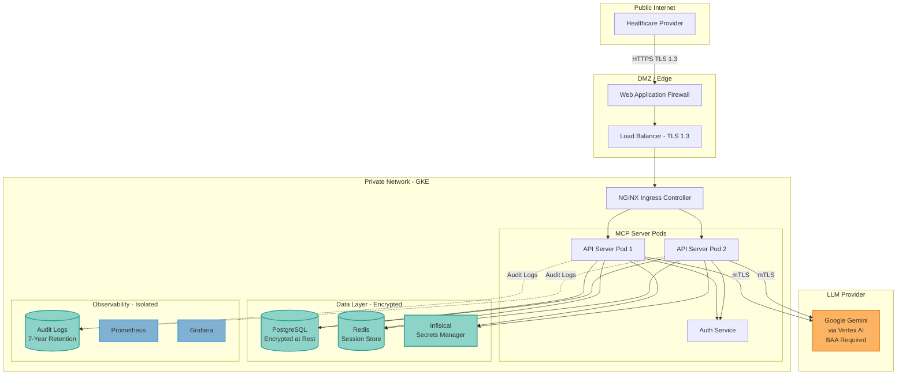

## Overview

This guide provides a comprehensive framework for deploying **HIPAA-compliant** AI agents using MCP Server with LangGraph. It covers technical controls, administrative safeguards, and documentation required for healthcare applications handling Protected Health Information (PHI).

<Warning>
**Legal Disclaimer**: This guide provides technical implementation guidance but is not legal advice. Consult with your legal counsel and compliance team before deploying healthcare applications. HIPAA compliance requires both technical and administrative controls, policies, and procedures.
</Warning>

---

## HIPAA Readiness Overview

MCP Server with LangGraph provides the **technical foundation** for HIPAA compliance, but achieving full compliance requires:

1. **Technical Safeguards** (Covered in this guide)
2. **Administrative Safeguards** (Policies, training, risk assessment)
3. **Physical Safeguards** (Data center security, device management)
4. **Business Associate Agreements** (BAAs with vendors)
5. **Breach Notification Procedures**

**Status**: MCP Server is **HIPAA-ready** (technical controls in place). You must implement administrative and physical safeguards based on your organization's requirements.

---

## Technical Safeguards

### 1. Access Control (§164.312(a)(1))

**Requirement**: Implement technical policies and procedures for electronic information systems that maintain ePHI to allow access only to those persons or software programs that have been granted access rights.

#### MCP Server Implementation

<Tabs>
  <Tab title="Authentication">
    **JWT-Based Authentication:**

    ```yaml
    # config/auth.yaml
    authentication:
      jwt:
        enabled: true
        secret: ${JWT_SECRET}  # Stored in Infisical
        issuer: "mcp-server-prod"
        audience: "healthcare-agents"
        expiration: 3600  # 1 hour
        refresh_enabled: true
        refresh_expiration: 86400  # 24 hours

      mfa:
        enabled: true  # REQUIRED for HIPAA
        providers:
          - totp
          - webauthn
        grace_period: 0  # No grace period
    ```

    **Keycloak SSO Integration:**

    ```yaml
    # config/keycloak.yaml
    keycloak:
      realm: healthcare
      server_url: https://auth.healthcare.example.com
      client_id: mcp-server
      client_secret: ${KEYCLOAK_CLIENT_SECRET}

      # HIPAA requirements
      require_mfa: true
      session_timeout: 900  # 15 minutes
      idle_timeout: 300  # 5 minutes
      max_sessions_per_user: 1  # Single session
    ```
  </Tab>

  <Tab title="Authorization">
    **OpenFGA (Zanzibar Model):**

    ```python
    # Fine-grained access control for PHI
    from openfga import OpenFGAClient

    # Define authorization model
    model = """
    model
      schema 1.1

    type user

    type patient
      relations
        define viewer: [user]
        define editor: [user]
        define owner: [user]

    type medical_record
      relations
        define patient: [patient]
        define viewer: [user] or viewer from patient
        define editor: [user] or editor from patient
        define can_view: viewer
        define can_edit: editor
    """

    # Check access before serving PHI
    async def check_phi_access(user_id: str, record_id: str, action: str):
        allowed = await openfga_client.check(
            user=f"user:{user_id}",
            relation=f"can_{action}",
            object=f"medical_record:{record_id}"
        )
        return allowed
    ```

    **Role-Based Access Control:**

    ```yaml
    # config/rbac.yaml
    roles:
      healthcare_provider:
        permissions:
          - phi:read
          - phi:write
          - patient:diagnose

      nurse:
        permissions:
          - phi:read
          - patient:update_vitals

      administrative:
        permissions:
          - phi:read  # Limited to billing PHI only
          - patient:schedule

      patient:
        permissions:
          - phi:read_own  # Only their own records
    ```
  </Tab>

  <Tab title="Session Management">
    **Automatic Session Timeouts:**

    ```python
    # src/middleware/session.py
    from datetime import datetime, timedelta

    class HIPAASessionMiddleware:
        """Enforce HIPAA session timeout requirements."""

        MAX_SESSION_DURATION = timedelta(minutes=15)
        IDLE_TIMEOUT = timedelta(minutes=5)

        async def __call__(self, request, call_next):
            session = request.state.session

            # Check session age
            if session.created_at + self.MAX_SESSION_DURATION < datetime.utcnow():
                return JSONResponse(
                    status_code=401,
                    content={"error": "Session expired (max duration)"}
                )

            # Check idle time
            if session.last_activity + self.IDLE_TIMEOUT < datetime.utcnow():
                await self.revoke_session(session.id)
                return JSONResponse(
                    status_code=401,
                    content={"error": "Session expired (idle timeout)"}
                )

            # Update last activity
            session.last_activity = datetime.utcnow()
            response = await call_next(request)
            return response
    ```
  </Tab>
</Tabs>

---

### 2. Audit Controls (§164.312(b))

**Requirement**: Implement hardware, software, and/or procedural mechanisms that record and examine activity in information systems that contain or use ePHI.

#### Comprehensive Audit Logging

<Tabs>
  <Tab title="Audit Log Configuration">
    ```yaml
    # config/audit.yaml
    audit_logging:
      enabled: true
      retention_days: 2555  # 7 years (HIPAA requirement)

      events:
        # Authentication events
        - user_login
        - user_logout
        - failed_login_attempt
        - mfa_challenge
        - password_reset

        # Authorization events
        - phi_access_granted
        - phi_access_denied
        - permission_change

        # Data events
        - phi_read
        - phi_create
        - phi_update
        - phi_delete
        - phi_export

        # System events
        - configuration_change
        - user_created
        - user_deleted
        - role_assigned

      output:
        - type: postgresql
          table: audit_logs
          encrypted: true

        - type: siem
          endpoint: https://siem.healthcare.example.com
          protocol: syslog

        - type: s3
          bucket: hipaa-audit-logs
          encryption: AES-256
          lifecycle: 2555_days
    ```
  </Tab>

  <Tab title="Audit Log Format">
    ```json
    {
      "timestamp": "2025-11-02T14:32:15.123Z",
      "event_id": "evt_7k9m2n4p",
      "event_type": "phi_read",
      "user": {
        "id": "user_abc123",
        "email": "dr.smith@hospital.example.com",
        "role": "healthcare_provider",
        "ip_address": "10.0.1.45",
        "user_agent": "Mozilla/5.0...",
        "mfa_verified": true
      },
      "resource": {
        "type": "medical_record",
        "id": "record_xyz789",
        "patient_id": "patient_456",
        "classification": "PHI"
      },
      "action": {
        "operation": "read",
        "result": "success",
        "authorization_method": "openfga",
        "access_granted_by": "viewer_relation"
      },
      "context": {
        "agent_workflow": "diagnosis_assistant",
        "tool_used": "ehr_integration",
        "llm_provider": "gemini-2.0-pro",
        "tokens_processed": 1250
      },
      "metadata": {
        "request_id": "req_1a2b3c",
        "session_id": "sess_x7y8z9",
        "trace_id": "trace_lmn456"
      }
    }
    ```
  </Tab>

  <Tab title="Audit Query Examples">
    ```sql
    -- Find all PHI access by user in last 30 days
    SELECT
      timestamp,
      event_type,
      resource->>'patient_id' as patient_id,
      action->>'result' as result
    FROM audit_logs
    WHERE user->>'id' = 'user_abc123'
      AND event_type IN ('phi_read', 'phi_update', 'phi_delete')
      AND timestamp >= NOW() - INTERVAL '30 days'
    ORDER BY timestamp DESC;

    -- Detect unauthorized access attempts
    SELECT
      user->>'email' as user_email,
      resource->>'id' as resource_id,
      COUNT(*) as failed_attempts
    FROM audit_logs
    WHERE event_type = 'phi_access_denied'
      AND timestamp >= NOW() - INTERVAL '1 hour'
    GROUP BY user->>'email', resource->>'id'
    HAVING COUNT(*) >= 3;

    -- Compliance report: All PHI access in date range
    SELECT
      DATE(timestamp) as access_date,
      user->>'role' as user_role,
      COUNT(*) as access_count,
      COUNT(DISTINCT resource->>'patient_id') as unique_patients
    FROM audit_logs
    WHERE event_type IN ('phi_read', 'phi_update')
      AND timestamp BETWEEN '2025-10-01' AND '2025-10-31'
    GROUP BY DATE(timestamp), user->>'role'
    ORDER BY access_date, user_role;
    ```
  </Tab>
</Tabs>

---

### 3. Integrity Controls (§164.312(c)(1))

**Requirement**: Implement policies and procedures to protect ePHI from improper alteration or destruction.

#### Data Integrity Implementation

```python
# src/middleware/integrity.py
import hashlib
import hmac
from datetime import datetime

class DataIntegrityMiddleware:
    """Ensure PHI integrity with cryptographic hashing."""

    def compute_integrity_hash(self, data: dict, secret: bytes) -> str:
        """Compute HMAC-SHA256 hash of PHI data."""
        canonical = json.dumps(data, sort_keys=True)
        return hmac.new(secret, canonical.encode(), hashlib.sha256).hexdigest()

    async def store_phi(self, patient_id: str, data: dict):
        """Store PHI with integrity hash."""
        # Compute integrity hash
        integrity_hash = self.compute_integrity_hash(
            data,
            secret=self.get_secret_key()
        )

        # Store with metadata
        record = {
            "patient_id": patient_id,
            "data": data,
            "integrity_hash": integrity_hash,
            "created_at": datetime.utcnow().isoformat(),
            "created_by": self.current_user.id,
            "version": 1
        }

        await self.db.medical_records.insert_one(record)
        return record

    async def verify_phi_integrity(self, record: dict) -> bool:
        """Verify PHI has not been tampered with."""
        stored_hash = record.get("integrity_hash")
        computed_hash = self.compute_integrity_hash(
            record["data"],
            secret=self.get_secret_key()
        )

        if stored_hash != computed_hash:
            # Log integrity violation
            await self.audit_log.critical(
                event="integrity_violation",
                record_id=record["_id"],
                patient_id=record["patient_id"]
            )
            return False

        return True
```

---

### 4. Transmission Security (§164.312(e)(1))

**Requirement**: Implement technical security measures to guard against unauthorized access to ePHI that is being transmitted over an electronic communications network.

#### Encryption in Transit

```yaml
# config/tls.yaml
tls:
  # Require TLS 1.3 (HIPAA best practice)
  min_version: "1.3"
  cipher_suites:
    - TLS_AES_256_GCM_SHA384
    - TLS_CHACHA20_POLY1305_SHA256
    - TLS_AES_128_GCM_SHA256

  # Certificate management
  cert_file: /secrets/tls/cert.pem
  key_file: /secrets/tls/key.pem
  ca_file: /secrets/tls/ca.pem

  # mTLS for service-to-service
  mutual_tls:
    enabled: true
    verify_client_cert: true
    allowed_dns_names:
      - "*.healthcare.example.com"

# Kubernetes Ingress
apiVersion: networking.k8s.io/v1
kind: Ingress
metadata:
  name: mcp-server-hipaa
  annotations:
    nginx.ingress.kubernetes.io/ssl-protocols: "TLSv1.3"
    nginx.ingress.kubernetes.io/ssl-ciphers: "TLS_AES_256_GCM_SHA384:TLS_CHACHA20_POLY1305_SHA256"
    nginx.ingress.kubernetes.io/force-ssl-redirect: "true"
spec:
  tls:
    - hosts:
        - agents.healthcare.example.com
      secretName: tls-cert
```

---

### 5. Encryption at Rest (§164.312(a)(2)(iv))

**Requirement**: Implement a mechanism to encrypt and decrypt ePHI (addressable).

#### Database Encryption

```yaml
# PostgreSQL encryption configuration
# postgresql.conf
ssl = on
ssl_cert_file = '/var/lib/postgresql/server.crt'
ssl_key_file = '/var/lib/postgresql/server.key'
ssl_ca_file = '/var/lib/postgresql/root.crt'

# Enable transparent data encryption (TDE)
# For Google Cloud SQL
resource "google_sql_database_instance" "hipaa_db" {
  name = "mcp-server-hipaa"

  settings {
    tier = "db-n1-standard-4"

    # Encryption at rest
    database_flags {
      name  = "cloudsql.enable_pgaudit"
      value = "on"
    }

    backup_configuration {
      enabled = true
      binary_log_enabled = false  # PostgreSQL
      point_in_time_recovery_enabled = true
    }

    # Encrypt backups
    disk_encryption_configuration {
      kms_key_name = "projects/PROJECT_ID/locations/us-central1/keyRings/hipaa/cryptoKeys/phi-db"
    }
  }
}
```

#### Application-Level Encryption

```python
# src/encryption/phi_encryption.py
from cryptography.fernet import Fernet
from typing import Any, Dict

class PHIEncryption:
    """Application-level encryption for sensitive PHI fields."""

    def __init__(self, encryption_key: bytes):
        self.cipher = Fernet(encryption_key)

    def encrypt_sensitive_fields(self, record: Dict[str, Any]) -> Dict[str, Any]:
        """Encrypt sensitive PHI fields before storage."""
        sensitive_fields = [
            "ssn",
            "date_of_birth",
            "medical_record_number",
            "diagnosis",
            "medications",
            "test_results"
        ]

        encrypted_record = record.copy()

        for field in sensitive_fields:
            if field in record and record[field]:
                # Encrypt field value
                plaintext = json.dumps(record[field]).encode()
                encrypted = self.cipher.encrypt(plaintext)
                encrypted_record[field] = {
                    "_encrypted": True,
                    "_value": encrypted.decode()
                }

        return encrypted_record

    def decrypt_sensitive_fields(self, record: Dict[str, Any]) -> Dict[str, Any]:
        """Decrypt sensitive PHI fields after retrieval."""
        decrypted_record = record.copy()

        for field, value in record.items():
            if isinstance(value, dict) and value.get("_encrypted"):
                # Decrypt field value
                encrypted = value["_value"].encode()
                plaintext = self.cipher.decrypt(encrypted)
                decrypted_record[field] = json.loads(plaintext)

        return decrypted_record
```

---

## Business Associate Agreement (BAA) Template

### Required BAAs

You must obtain BAAs from all vendors that handle PHI:

<Tabs>
  <Tab title="Cloud Provider BAAs">
    **Required Vendors:**

    - ✅ **Google Cloud Platform** - [BAA available](https://cloud.google.com/terms/hipaa)
    - ✅ **Amazon Web Services (AWS)** - [BAA available](https://aws.amazon.com/compliance/hipaa-compliance/)
    - ✅ **Microsoft Azure** - [BAA available](https://azure.microsoft.com/en-us/support/legal/)

    **LLM Provider BAAs:**

    - ✅ **Anthropic (Claude)** - [BAA available for Enterprise](https://www.anthropic.com/hipaa)
    - ✅ **Google (Gemini via Vertex AI)** - Covered under GCP BAA
    - ⚠️ **OpenAI** - No BAA available (do not use for PHI)
    - ⚠️ **AWS Bedrock** - BAA available (verify model-specific coverage)
  </Tab>

  <Tab title="BAA Template">
    ```markdown
    # Business Associate Agreement (BAA) Template

    This Business Associate Agreement ("Agreement") is entered into as of [DATE]
    by and between:

    **Covered Entity**: [Healthcare Organization Name]
    **Business Associate**: [Vendor Name]

    ## 1. Definitions

    Terms used, but not otherwise defined, shall have the same meaning as those
    terms in HIPAA and the HIPAA Regulations.

    ## 2. Obligations and Activities of Business Associate

    Business Associate agrees to:

    a) Not use or disclose PHI other than as permitted by this Agreement or as
       required by law;

    b) Use appropriate safeguards to prevent use or disclosure of PHI other than
       as provided for by this Agreement;

    c) Implement administrative, physical, and technical safeguards that reasonably
       and appropriately protect the confidentiality, integrity, and availability
       of ePHI;

    d) Report to Covered Entity any use or disclosure of PHI not provided for by
       this Agreement within 24 hours of discovery;

    e) Ensure that any subcontractors that create, receive, maintain, or transmit
       PHI on behalf of Business Associate agree to the same restrictions;

    f) Make PHI available to individuals in accordance with 45 CFR § 164.524;

    g) Make PHI available to the Secretary of HHS for purposes of determining
       Covered Entity's compliance with HIPAA;

    h) Return or destroy all PHI upon termination of this Agreement;

    i) Maintain and make available audit logs for a minimum of seven (7) years.

    ## 3. Permitted Uses and Disclosures

    Business Associate may use or disclose PHI to perform functions, activities,
    or services for, or on behalf of, Covered Entity as specified in the Services
    Agreement.

    ## 4. Term and Termination

    **Term**: This Agreement shall become effective on [DATE] and shall terminate
    on [DATE] or upon termination of the Services Agreement.

    **Termination for Cause**: Covered Entity may immediately terminate this
    Agreement if Business Associate violates a material term of this Agreement.

    ## 5. Breach Notification

    Business Associate shall notify Covered Entity within 24 hours of discovery
    of any breach of unsecured PHI.

    ---

    Covered Entity: ________________________   Date: __________

    Business Associate: ____________________   Date: __________
    ```
  </Tab>
</Tabs>

---

## HIPAA Compliance Checklist

### Pre-Deployment Checklist

<Steps>
  <Step title="Risk Assessment">
    **Complete Security Risk Assessment**

    - [ ] Identify all systems that store, process, or transmit ePHI
    - [ ] Document potential threats and vulnerabilities
    - [ ] Assess likelihood and impact of threats
    - [ ] Document existing security measures
    - [ ] Identify gaps and create remediation plan
    - [ ] Assign risk scores to each identified risk
    - [ ] Obtain executive approval for risk acceptance

    **Documentation**: Store in `docs/compliance/risk-assessment-YYYY.pdf`
  </Step>

  <Step title="Technical Safeguards">
    **Implement Required Technical Controls**

    - [ ] Enable JWT authentication with MFA
    - [ ] Configure OpenFGA for fine-grained authorization
    - [ ] Enable comprehensive audit logging (7-year retention)
    - [ ] Implement encryption in transit (TLS 1.3)
    - [ ] Enable encryption at rest (database and application-level)
    - [ ] Configure automatic session timeouts (15 min max, 5 min idle)
    - [ ] Enable integrity controls (HMAC-SHA256 hashing)
    - [ ] Implement secure key management (Infisical/Vault)
    - [ ] Deploy network segmentation (Kubernetes NetworkPolicies)
    - [ ] Enable backup encryption and disaster recovery

    **Verification**: Run `make hipaa-compliance-check`
  </Step>

  <Step title="Administrative Safeguards">
    **Establish Policies and Procedures**

    - [ ] Designate HIPAA Privacy Officer
    - [ ] Designate HIPAA Security Officer
    - [ ] Create workforce security policies
    - [ ] Implement workforce training program
    - [ ] Establish access authorization procedures
    - [ ] Create incident response plan
    - [ ] Develop breach notification procedures
    - [ ] Implement sanction policy for violations
    - [ ] Create business continuity plan
    - [ ] Establish vendor management procedures

    **Documentation**: Store in `docs/compliance/policies/`
  </Step>

  <Step title="Business Associate Agreements">
    **Obtain Required BAAs**

    - [ ] Cloud provider (GCP/AWS/Azure)
    - [ ] LLM provider (Anthropic/Google)
    - [ ] Database provider (if using managed service)
    - [ ] Monitoring/observability provider (LangSmith)
    - [ ] Secret management provider (Infisical)
    - [ ] Any other vendors accessing PHI

    **Documentation**: Store signed BAAs in secure location
  </Step>

  <Step title="Testing and Validation">
    **Verify Compliance Controls**

    - [ ] Penetration testing completed
    - [ ] Vulnerability scanning completed
    - [ ] Audit log review (sample transactions)
    - [ ] Access control testing (positive and negative cases)
    - [ ] Encryption verification (in transit and at rest)
    - [ ] Backup and recovery testing
    - [ ] Incident response drill
    - [ ] Disaster recovery drill

    **Documentation**: Store test results in `docs/compliance/testing/`
  </Step>

  <Step title="Documentation Review">
    **Prepare for Audit**

    - [ ] Security Risk Assessment
    - [ ] Policies and Procedures Manual
    - [ ] BAAs (all vendors)
    - [ ] Workforce Training Records
    - [ ] System Configuration Documentation
    - [ ] Audit Log Samples
    - [ ] Incident Response Plan
    - [ ] Breach Notification Procedures
    - [ ] Disaster Recovery Plan
    - [ ] Penetration Test Results

    **Organization**: Create compliance binder (physical or digital)
  </Step>
</Steps>

---

## Deployment Architecture for HIPAA

### Reference Architecture



---

## Monitoring and Alerting

### HIPAA-Specific Alerts

```yaml
# prometheus/alerts/hipaa.yaml
groups:
  - name: hipaa_compliance
    interval: 60s
    rules:
      # Unauthorized access attempts
      - alert: UnauthorizedPHIAccess
        expr: rate(audit_log_events{event_type="phi_access_denied"}[5m]) > 5
        for: 1m
        annotations:
          summary: "High rate of unauthorized PHI access attempts"
          description: "{{ $value }} unauthorized access attempts in the last 5 minutes"
        labels:
          severity: critical
          compliance: hipaa

      # Failed authentication
      - alert: FailedLoginAttempts
        expr: rate(audit_log_events{event_type="failed_login_attempt"}[5m]) > 10
        for: 2m
        annotations:
          summary: "High rate of failed login attempts"
          description: "Possible brute force attack detected"
        labels:
          severity: warning
          compliance: hipaa

      # Audit log gaps
      - alert: AuditLogGap
        expr: absent_over_time(audit_log_events[10m])
        for: 5m
        annotations:
          summary: "Audit logging not functioning"
          description: "No audit logs received in the last 10 minutes"
        labels:
          severity: critical
          compliance: hipaa

      # Encryption failures
      - alert: EncryptionFailure
        expr: rate(encryption_errors_total[5m]) > 0
        for: 1m
        annotations:
          summary: "PHI encryption failures detected"
          description: "{{ $value }} encryption errors in the last 5 minutes"
        labels:
          severity: critical
          compliance: hipaa

      # Session timeout violations
      - alert: SessionTimeoutViolation
        expr: active_sessions_duration_seconds > 900  # 15 minutes
        annotations:
          summary: "Active session exceeds HIPAA timeout requirement"
          description: "Session {{ $labels.session_id }} has been active for {{ $value }}s"
        labels:
          severity: warning
          compliance: hipaa
```

---

## Breach Response Procedure

### Incident Response Plan

<AccordionGroup>
  <Accordion title="Step 1: Detection and Containment (< 1 hour)">
    **Immediate Actions:**

    1. **Detect**: Automated alert or manual discovery
    2. **Isolate**: Quarantine affected systems immediately
    3. **Preserve Evidence**: Take snapshots, preserve logs
    4. **Notify**: Alert HIPAA Security Officer

    **Technical Response:**
    ```bash
    # Isolate compromised pod
    kubectl cordon node-123
    kubectl drain node-123 --ignore-daemonsets

    # Preserve evidence
    kubectl logs pod-123 > incident-$(date +%Y%m%d-%H%M%S).log
    kubectl exec pod-123 -- tar czf /tmp/forensics.tar.gz /var/log /app

    # Revoke compromised credentials
    kubectl delete secret compromised-secret
    ```

    **Documentation**: Create incident ticket in `incidents/INC-YYYYMMDD-001`
  </Accordion>

  <Accordion title="Step 2: Assessment (< 24 hours)">
    **Determine Breach Scope:**

    - Number of individuals affected
    - Types of PHI involved (SSN, diagnosis, etc.)
    - When breach occurred
    - How breach occurred
    - Who had unauthorized access

    **Query Audit Logs:**
    ```sql
    -- Find all PHI accessed by unauthorized user
    SELECT
      resource->>'patient_id' as patient_id,
      resource->>'type' as phi_type,
      timestamp
    FROM audit_logs
    WHERE user->>'id' = 'compromised_user_id'
      AND timestamp BETWEEN 'breach_start' AND 'breach_end'
      AND event_type IN ('phi_read', 'phi_export');
    ```

    **Risk Assessment**: Determine if breach notification required
  </Accordion>

  <Accordion title="Step 3: Notification (< 60 days)">
    **Notification Requirements (if ≥500 individuals affected):**

    - **Individuals**: Written notification within 60 days
    - **HHS**: Notification within 60 days
    - **Media**: Notification if in same state/jurisdiction

    **Notification Content Must Include:**
    - Description of what happened
    - Types of PHI involved
    - Steps individuals should take
    - What organization is doing
    - Contact information for questions

    **Template**: Use `docs/compliance/breach-notification-template.md`
  </Accordion>

  <Accordion title="Step 4: Remediation and Prevention">
    **Root Cause Analysis:**

    - Identify how breach occurred
    - Document vulnerabilities exploited
    - Assess control failures

    **Corrective Actions:**

    - Patch vulnerabilities
    - Update access controls
    - Enhance monitoring
    - Additional training
    - Policy updates

    **Documentation**: Create post-incident report
  </Accordion>
</AccordionGroup>

---

## Frequently Asked Questions

<AccordionGroup>
  <Accordion title="Is MCP Server HIPAA-certified?">
    **No**. There is no official "HIPAA certification." HIPAA compliance is achieved by:

    1. **Implementing technical safeguards** (MCP Server provides these)
    2. **Establishing administrative controls** (your organization's responsibility)
    3. **Maintaining physical security** (your data center / cloud provider)
    4. **Obtaining BAAs** (your legal/procurement responsibility)

    **MCP Server is HIPAA-ready**: We provide the technical foundation, but full compliance requires your organization's policies, procedures, and BAAs.
  </Accordion>

  <Accordion title="Which LLM providers can I use for PHI?">
    **Safe for PHI (with BAA):**
    - ✅ Anthropic Claude (Enterprise plan with BAA)
    - ✅ Google Gemini via Vertex AI (covered under GCP BAA)
    - ✅ AWS Bedrock models (verify specific model coverage in BAA)

    **NOT safe for PHI:**
    - ❌ OpenAI (no BAA available)
    - ❌ Ollama/local models (unless you have proper controls)

    **Recommendation**: Use Google Gemini via Vertex AI for HIPAA deployments (covered under GCP BAA, cost-effective).
  </Accordion>

  <Accordion title="What is the minimum retention period for audit logs?">
    **HIPAA Requirement**: 7 years from date of creation or last effective date

    **MCP Server Default**: 2,555 days (7 years) configured in `audit.yaml`

    **Storage Recommendation**: Use encrypted S3/GCS with lifecycle policies for cost-effective long-term storage.
  </Accordion>

  <Accordion title="Do I need to encrypt PHI at the application level?">
    **Not required, but strongly recommended.**

    **HIPAA Addressable**: Encryption at rest is "addressable" (not mandatory if justified)

    **Best Practice**: Use both database encryption AND application-level encryption for defense in depth:
    - Database encryption protects against storage layer breaches
    - Application encryption protects against database compromises

    **MCP Server**: Provides application-level encryption utilities in `src/encryption/`
  </Accordion>

  <Accordion title="What happens if I have a breach?">
    **Required Actions:**

    1. **Contain** the breach immediately (< 1 hour)
    2. **Assess** scope and risk (< 24 hours)
    3. **Notify** affected individuals (< 60 days if ≥500 people)
    4. **Report** to HHS (< 60 days if ≥500 people)
    5. **Remediate** vulnerabilities
    6. **Document** everything

    **Penalties**: $100 to $50,000 per violation (up to $1.5M per year)

    **Best Defense**: Prevention through proper controls and regular audits
  </Accordion>
</AccordionGroup>

---

## Next Steps

<CardGroup cols={2}>
  <Card title="GDPR Compliance" icon="shield-halved" href="/compliance/gdpr-compliance">
    European data protection requirements
  </Card>
  <Card title="SOC 2 Compliance" icon="file-shield" href="/compliance/soc2-compliance">
    Security controls for service organizations
  </Card>
  <Card title="Production Deployment" icon="rocket" href="/deployment/kubernetes">
    Deploy HIPAA-compliant infrastructure
  </Card>
  <Card title="Security Best Practices" icon="lock" href="/guides/security-best-practices">
    Additional security hardening
  </Card>
</CardGroup>

---

<Warning>
**Final Reminder**: This guide provides technical implementation guidance. Achieving HIPAA compliance requires:
- Legal review of policies and procedures
- Workforce training and awareness
- Regular security assessments and audits
- Business Associate Agreements with all vendors
- Incident response planning and testing

Consult with legal counsel and compliance experts before handling PHI in production.
</Warning>
