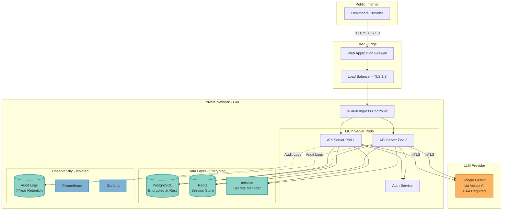

## Deployment Architecture for HIPAA

### Reference Architecture



---

## Monitoring and Alerting

### HIPAA-Specific Alerts

```yaml
# prometheus/alerts/hipaa.yaml
groups:
  - name: hipaa_compliance
    interval: 60s
    rules:
      # Unauthorized access attempts
      - alert: UnauthorizedPHIAccess
        expr: rate(audit_log_events{event_type="phi_access_denied"}[5m]) > 5
        for: 1m
        annotations:
          summary: "High rate of unauthorized PHI access attempts"
          description: "{{ $value }} unauthorized access attempts in the last 5 minutes"
        labels:
          severity: critical
          compliance: hipaa

      # Failed authentication
      - alert: FailedLoginAttempts
        expr: rate(audit_log_events{event_type="failed_login_attempt"}[5m]) > 10
        for: 2m
        annotations:
          summary: "High rate of failed login attempts"
          description: "Possible brute force attack detected"
        labels:
          severity: warning
          compliance: hipaa

      # Audit log gaps
      - alert: AuditLogGap
        expr: absent_over_time(audit_log_events[10m])
        for: 5m
        annotations:
          summary: "Audit logging not functioning"
          description: "No audit logs received in the last 10 minutes"
        labels:
          severity: critical
          compliance: hipaa

      # Encryption failures
      - alert: EncryptionFailure
        expr: rate(encryption_errors_total[5m]) > 0
        for: 1m
        annotations:
          summary: "PHI encryption failures detected"
          description: "{{ $value }} encryption errors in the last 5 minutes"
        labels:
          severity: critical
          compliance: hipaa

      # Session timeout violations
      - alert: SessionTimeoutViolation
        expr: active_sessions_duration_seconds > 900  # 15 minutes
        annotations:
          summary: "Active session exceeds HIPAA timeout requirement"
          description: "Session {{ $labels.session_id }} has been active for {{ $value }}s"
        labels:
          severity: warning
          compliance: hipaa
```

---


## Next Steps

<CardGroup cols={2}>
  <Card title="Technical Safeguards" icon="shield" href="./technical-safeguards">
    Implement security measures
  </Card>
  <Card title="Compliance Checklist" icon="list-check" href="./compliance-checklist">
    Verify deployment compliance
  </Card>
  <Card title="Back to Overview" icon="arrow-left" href="./overview">
    Return to HIPAA overview
  </Card>
</CardGroup>
