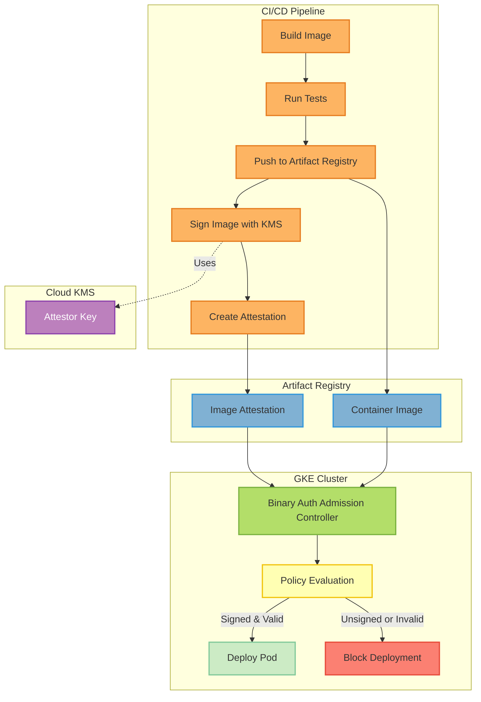

## Overview

**Binary Authorization** is a deploy-time security control that ensures only trusted container images run on GKE. Images must be cryptographically signed and verified before deployment, preventing supply chain attacks and unauthorized images.

<CardGroup cols={2}>
  <Card title="Image Signing" icon="signature">
    CI/CD signs images with KMS keys
  </Card>
  <Card title="Policy Enforcement" icon="shield-check">
    GKE blocks unsigned images
  </Card>
  <Card title="Attestations" icon="certificate">
    Proof of CI/CD approval
  </Card>
  <Card title="Audit Trail" icon="list-check">
    All denials logged to Cloud Logging
  </Card>
</CardGroup>

---

## Why Binary Authorization?

<AccordionGroup>
  <Accordion title="Prevent Unauthorized Images">
    **Threat**: Attacker pushes malicious image to registry

    **Protection**: Only images signed by your CI/CD can deploy

    **Example blocked scenarios**:
    - Directly pushed images (bypassing CI/CD)
    - Images from unknown registries
    - Tampered images (signature verification fails)
  </Accordion>

  <Accordion title="Supply Chain Security">
    **Compliance**: SLSA Level 3, SOC 2, HIPAA

    **Requirement**: Prove images were built by authorized systems

    **Binary Auth provides**:
    - Cryptographic proof of build provenance
    - Attestations from CI/CD pipeline
    - Immutable audit trail
  </Accordion>

  <Accordion title="Multi-Environment Control">
    **Problem**: Dev images shouldn't reach production

    **Solution**: Different attestors per environment

    **Implementation**:
    - Dev: Allow all (no signing)
    - Staging: Require staging attestor (audit mode)
    - Prod: Require prod attestor (enforcing mode)
  </Accordion>

  <Accordion title="Incident Response">
    **Scenario**: Compromised CI/CD pipeline

    **Response**: Revoke KMS key, all signed images instantly blocked

    **Recovery**: Create new KMS key, re-sign trusted images
  </Accordion>
</AccordionGroup>

---

## Architecture



**Flow**:
1. CI/CD builds and tests image
2. Push image to Artifact Registry
3. Sign image digest with KMS key
4. Create attestation (proof of signature)
5. On deployment, GKE checks attestation
6. If valid → Deploy; If invalid → Block

---

## Quick Setup (20 minutes)

<Steps>
  <Step title="Enable APIs">
    ```bash
    gcloud services enable \
      binaryauthorization.googleapis.com \
      containeranalysis.googleapis.com \
      containerscanning.googleapis.com \
      --project=PROJECT_ID
    ```
  </Step>

  <Step title="Run Setup Script">
    ```bash
    ./deployments/security/binary-authorization/setup-binary-auth.sh \
      PROJECT_ID production
    ```

    **What it creates**:
    - KMS key ring and signing key
    - Container Analysis note
    - Attestor resource
    - Binary Authorization policy
  </Step>

  <Step title="Enable on GKE Cluster">
    <Tabs>
      <Tab title="Terraform">
        ```hcl terraform/environments/gcp-prod/terraform.tfvars
        enable_binary_authorization    = true
        binary_authorization_mode      = "ENFORCING"
        ```

        ```bash
        terraform apply
        ```
      </Tab>

      <Tab title="gcloud CLI">
        ```bash
        gcloud container clusters update CLUSTER_NAME \
          --enable-binauthz \
          --region=us-central1 \
          --project=PROJECT_ID
        ```
      </Tab>
    </Tabs>
  </Step>

  <Step title="Sign First Image">
    ```bash
    ./deployments/security/binary-authorization/sign-image.sh \
      PROJECT_ID production \
      us-central1-docker.pkg.dev/PROJECT_ID/mcp-production/mcp-server-langgraph:v1.0.0
    ```

    Creates attestation for the image.
  </Step>

  <Step title="Verify Policy">
    ```bash
    # Try deploying unsigned image (should fail)
    kubectl run test --image=nginx:latest

    # Should see error:
    # Error: admission webhook denied the request

    # Deploy signed image (should succeed)
    kubectl apply -k deployments/overlays/production-gke
    ```
  </Step>
</Steps>

---

## Policy Configuration

### Policy Modes

<Tabs>
  <Tab title="Enforcing (Production)">
    ```yaml
    evaluationMode: REQUIRE_ATTESTATION
    enforcementMode: ENFORCING_MODE
    ```

    **Behavior**: **Blocks** unsigned images

    **Use case**: Production environments

    **Risk**: Zero tolerance for unsigned images
  </Tab>

  <Tab title="Audit (Staging)">
    ```yaml
    evaluationMode: REQUIRE_ATTESTATION
    enforcementMode: DRYRUN_AUDIT_LOG_ONLY
    ```

    **Behavior**: **Logs** violations, doesn't block

    **Use case**: Testing Binary Auth before production

    **Benefit**: Safe migration path
  </Tab>

  <Tab title="Disabled (Development)">
    ```yaml
    evaluationMode: ALWAYS_ALLOW
    ```

    **Behavior**: All images allowed

    **Use case**: Development environments

    **Risk**: No protection
  </Tab>
</Tabs>

### Environment-Specific Policies

<CodeGroup>
```yaml Production Policy
apiVersion: binaryauthorization.googleapis.com/v1
kind: Policy
metadata:
  name: production-policy
spec:
  globalPolicyEvaluationMode: ENABLE
  defaultAdmissionRule:
    evaluationMode: REQUIRE_ATTESTATION
    enforcementMode: ENFORCING_MODE
    requireAttestationsBy:
      - projects/PROJECT_ID/attestors/production-attestor

  # Exception for system images
  clusterAdmissionRules:
    us-central1.production-mcp-server-langgraph-gke:
      evaluationMode: REQUIRE_ATTESTATION
      enforcementMode: ENFORCING_MODE
      requireAttestationsBy:
        - projects/PROJECT_ID/attestors/production-attestor

  # Allow GKE system images
  admissionWhitelistPatterns:
    - namePattern: gcr.io/gke-release/*
    - namePattern: gke.gcr.io/*
    - namePattern: k8s.gcr.io/*
```

```yaml Staging Policy
apiVersion: binaryauthorization.googleapis.com/v1
kind: Policy
metadata:
  name: staging-policy
spec:
  defaultAdmissionRule:
    evaluationMode: REQUIRE_ATTESTATION
    enforcementMode: DRYRUN_AUDIT_LOG_ONLY  # Audit mode
    requireAttestationsBy:
      - projects/PROJECT_ID/attestors/staging-attestor

  admissionWhitelistPatterns:
    - namePattern: gcr.io/gke-release/*
```

```yaml Development Policy
apiVersion: binaryauthorization.googleapis.com/v1
kind: Policy
metadata:
  name: dev-policy
spec:
  defaultAdmissionRule:
    evaluationMode: ALWAYS_ALLOW  # No restrictions
    enforcementMode: ENFORCING_MODE
```
</CodeGroup>

---

## Image Signing in CI/CD

### GitHub Actions Integration

<CodeGroup>
```yaml .github/workflows/deploy-production-gke.yaml
name: Deploy to Production GKE
on:
  push:
    tags:
      - 'v*'

jobs:
  build-sign-deploy:
    runs-on: ubuntu-latest
    permissions:
      contents: read
      id-token: write  # For Workload Identity Federation

    steps:
      - uses: actions/checkout@v4

      - name: Authenticate to GCP
        uses: google-github-actions/auth@v2
        with:
          workload_identity_provider: 'projects/PROJECT_NUMBER/locations/global/workloadIdentityPools/github/providers/github'
          service_account: 'github-actions@PROJECT_ID.iam.gserviceaccount.com'

      - name: Configure Docker for Artifact Registry
        run: gcloud auth configure-docker us-central1-docker.pkg.dev

      - name: Build Image
        run: |
          docker build -t us-central1-docker.pkg.dev/PROJECT_ID/mcp-production/mcp-server-langgraph:${{ github.ref_name }} .

      - name: Push Image
        run: |
          docker push us-central1-docker.pkg.dev/PROJECT_ID/mcp-production/mcp-server-langgraph:${{ github.ref_name }}

      - name: Sign Image
        run: |
          IMAGE_URL="us-central1-docker.pkg.dev/PROJECT_ID/mcp-production/mcp-server-langgraph:${{ github.ref_name }}"
          IMAGE_DIGEST=$(gcloud artifacts docker images describe $IMAGE_URL --format='get(image_summary.digest)')

          # Create attestation
          gcloud beta container binauthz attestations sign-and-create \
            --artifact-url="us-central1-docker.pkg.dev/PROJECT_ID/mcp-production/mcp-server-langgraph@${IMAGE_DIGEST}" \
            --attestor=production-attestor \
            --attestor-project=PROJECT_ID \
            --keyversion-project=PROJECT_ID \
            --keyversion-location=us-central1 \
            --keyversion-keyring=production-binauthz \
            --keyversion-key=attestor-key \
            --keyversion=1

      - name: Deploy to GKE
        run: |
          kubectl apply -k deployments/overlays/production-gke
```

```bash Manual Signing Script
#!/bin/bash
# deployments/security/binary-authorization/sign-image.sh

PROJECT_ID="$1"
ENVIRONMENT="$2"
IMAGE_URL="$3"

# Get image digest
IMAGE_DIGEST=$(gcloud artifacts docker images describe "$IMAGE_URL" \
  --format='get(image_summary.digest)')

# Extract registry and image name
REGISTRY=$(echo "$IMAGE_URL" | cut -d'/' -f1)
REPO_PATH=$(echo "$IMAGE_URL" | cut -d':' -f1 | cut -d'/' -f2-)

ARTIFACT_URL="${REGISTRY}/${REPO_PATH}@${IMAGE_DIGEST}"

echo "Signing image: $ARTIFACT_URL"

# Create attestation
gcloud beta container binauthz attestations sign-and-create \
  --artifact-url="$ARTIFACT_URL" \
  --attestor="${ENVIRONMENT}-attestor" \
  --attestor-project="$PROJECT_ID" \
  --keyversion-project="$PROJECT_ID" \
  --keyversion-location=us-central1 \
  --keyversion-keyring="${ENVIRONMENT}-binauthz" \
  --keyversion-key=attestor-key \
  --keyversion=1

echo "✅ Image signed successfully"
```
</CodeGroup>

---

## Verification & Troubleshooting

### Check Policy Status

```bash
# View current policy
gcloud container binauthz policy export

# Check attestor
gcloud container binauthz attestors describe production-attestor \
  --project=PROJECT_ID

# List attestations for image
gcloud container binauthz attestations list \
  --artifact-url="us-central1-docker.pkg.dev/PROJECT_ID/mcp-production/mcp-server-langgraph@sha256:ABC123" \
  --attestor=production-attestor \
  --attestor-project=PROJECT_ID
```

### View Denials in Logs

```bash
# Check Binary Auth denials
gcloud logging read \
  'protoPayload.serviceName="binaryauthorization.googleapis.com" AND protoPayload.response.allow=false' \
  --limit=50 \
  --format=json

# Denied image details
gcloud logging read \
  'resource.type="k8s_cluster" AND protoPayload.request.spec.containers[].image=~"mcp-server"' \
  --limit=10
```

### Common Issues

<AccordionGroup>
  <Accordion title="Error: Image not attested">
    **Symptom**: Deployment blocked with "image not attested by projects/PROJECT/attestors/production-attestor"

    **Cause**: Image hasn't been signed by CI/CD

    **Solution**:
    ```bash
    # Verify attestation exists
    gcloud container binauthz attestations list \
      --artifact-url=IMAGE_URL@DIGEST \
      --attestor=production-attestor

    # If missing, sign manually
    ./deployments/security/binary-authorization/sign-image.sh \
      PROJECT_ID production IMAGE_URL
    ```
  </Accordion>

  <Accordion title="Error: Attestor not found">
    **Symptom**: "attestor not found: projects/PROJECT/attestors/production-attestor"

    **Cause**: Attestor resource not created

    **Solution**:
    ```bash
    # Re-run setup
    ./deployments/security/binary-authorization/setup-binary-auth.sh \
      PROJECT_ID production
    ```
  </Accordion>

  <Accordion title="GKE system images blocked">
    **Symptom**: System pods (kube-proxy, node-exporter) failing to start

    **Cause**: Missing admission whitelist patterns

    **Solution**: Add to policy:
    ```yaml
    admissionWhitelistPatterns:
      - namePattern: gcr.io/gke-release/*
      - namePattern: gke.gcr.io/*
      - namePattern: k8s.gcr.io/*
    ```
  </Accordion>

  <Accordion title="KMS permission denied">
    **Symptom**: CI/CD can't sign images - "Permission denied on KMS key"

    **Solution**:
    ```bash
    # Grant CI/CD service account KMS permissions
    gcloud kms keys add-iam-policy-binding attestor-key \
      --location=us-central1 \
      --keyring=production-binauthz \
      --member="serviceAccount:github-actions@PROJECT_ID.iam.gserviceaccount.com" \
      --role="roles/cloudkms.signerVerifier" \
      --project=PROJECT_ID
    ```
  </Accordion>
</AccordionGroup>

---

## Security Best Practices

<Check>**Separate keys per environment**</Check>

```bash
# Production key
production-binauthz/attestor-key

# Staging key (different key ring)
staging-binauthz/attestor-key

# Development (no signing required)
```

**Benefit**: Key compromise doesn't affect all environments

<Check>**Rotate KMS keys regularly**</Check>

```bash
# Create new key version (automatic rotation)
gcloud kms keys versions create \
  --location=us-central1 \
  --keyring=production-binauthz \
  --key=attestor-key
```

<Check>**Enable KMS key rotation policy**</Check>

```bash
gcloud kms keys update attestor-key \
  --location=us-central1 \
  --keyring=production-binauthz \
  --rotation-period=90d \
  --next-rotation-time=2025-04-01T00:00:00Z
```

<Check>**Audit attestations regularly**</Check>

```bash
# List all attestations in last 7 days
gcloud logging read \
  'protoPayload.serviceName="binaryauthorization.googleapis.com" AND protoPayload.methodName="google.cloud.binaryauthorization.v1.BinauthzManagementService.CreateAttestor"' \
  --freshness=7d
```

<Check>**Principle of least privilege**</Check>

```bash
# CI/CD SA: Only signer role (can create attestations)
gcloud kms keys add-iam-policy-binding attestor-key \
  --role=roles/cloudkms.signerVerifier \
  --member="serviceAccount:ci-cd@PROJECT.iam.gserviceaccount.com"

# GKE SA: Only verifier role (can check attestations)
# Automatic via Workload Identity
```

---

## Compliance & Auditing

### SOC 2 / HIPAA Requirements

<Tabs>
  <Tab title="Control Objectives Met">
    ✅ **CC6.1**: Logical access controls

    - Only signed images can deploy
    - Attestations prove CI/CD approval

    ✅ **CC6.6**: Logical access segregation

    - Production attestor separate from dev/staging
    - KMS keys isolated per environment

    ✅ **CC7.2**: System monitoring

    - All denials logged to Cloud Logging
    - Attestation creation audited

    ✅ **CC8.1**: Change management

    - All deployments require signed images
    - Git commit → CI/CD → Attestation chain
  </Tab>

  <Tab title="Audit Evidence">
    **Evidence 1**: Binary Authorization enabled

    ```bash
    gcloud container clusters describe CLUSTER_NAME \
      --format="get(binaryAuthorization)"
    # Output: evaluation_mode: REQUIRE_ATTESTATION
    ```

    **Evidence 2**: Attestation logs

    ```bash
    gcloud logging read \
      'protoPayload.serviceName="binaryauthorization.googleapis.com"' \
      --limit=100 --format=json > attestation-audit.json
    ```

    **Evidence 3**: Denied deployments

    ```bash
    gcloud logging read \
      'protoPayload.response.allow=false' \
      --limit=50 --format=json > denials-audit.json
    ```
  </Tab>
</Tabs>

### SLSA Level 3 Compliance

Binary Authorization helps achieve **SLSA Level 3** (Supply Chain Levels for Software Artifacts):

| Requirement | Implementation |
|-------------|----------------|
| **Provenance** | Attestations prove build provenance |
| **Non-falsifiable** | KMS signatures can't be forged |
| **Auditable** | All attestations logged |
| **Hermetic** | Only CI/CD can create attestations |

---

## Migration Path

<Steps>
  <Step title="1. Enable in Audit Mode (Dev)">
    ```bash
    # Development cluster - audit only
    gcloud container clusters update mcp-dev-gke \
      --binauthz-evaluation-mode=POLICY_BINDINGS \
      --region=us-central1
    ```

    No enforcement, just logging.
  </Step>

  <Step title="2. Test Signing in CI/CD">
    Add signing step to CI/CD, verify attestations created.

    Monitor for 1 week, ensure no failures.
  </Step>

  <Step title="3. Enable Audit Mode (Staging)">
    ```bash
    # Staging cluster - audit mode
    # Terraform: binary_authorization_mode = "DRYRUN_AUDIT_LOG_ONLY"
    terraform apply
    ```

    Monitor denials, fix any unsigned images.
  </Step>

  <Step title="4. Enable Enforcing (Production)">
    ```bash
    # Production cluster - enforcing
    # Terraform: binary_authorization_mode = "ENFORCING"
    terraform apply
    ```

    **Only after**:
    - All images signed
    - No denials in staging for 2 weeks
    - Rollback plan tested
  </Step>
</Steps>

---

## Related Documentation

<CardGroup cols={2}>
  <Card title="GKE Production" icon="kubernetes" href="/deployment/kubernetes/gke-production">
    Production deployment with Binary Auth enabled
  </Card>
  <Card title="Security Hardening" icon="shield-halved" href="/security/gcp-security-hardening">
    Complete 67-control security framework
  </Card>
  <Card title="GitOps (ArgoCD)" icon="code-branch" href="/deployment/gitops-argocd">
    Automated deployments with image signing
  </Card>
  <Card title="CI/CD Pipeline" icon="github" href="https://github.com/vishnu2kmohan/mcp-server-langgraph/blob/main/.github/workflows/deploy-production-gke.yaml">
    GitHub Actions with Binary Auth integration
  </Card>
</CardGroup>

---

## Next Steps

<Steps>
  <Step title="Set Up Binary Authorization">
    ```bash
    ./deployments/security/binary-authorization/setup-binary-auth.sh PROJECT_ID production
    ```
  </Step>

  <Step title="Integrate with CI/CD">
    Add image signing step to GitHub Actions workflow
  </Step>

  <Step title="Enable on Cluster">
    ```hcl
    enable_binary_authorization = true
    binary_authorization_mode = "ENFORCING"
    ```
  </Step>

  <Step title="Monitor Denials">
    ```bash
    gcloud logging read 'protoPayload.response.allow=false' --limit=10
    ```
  </Step>
</Steps>
