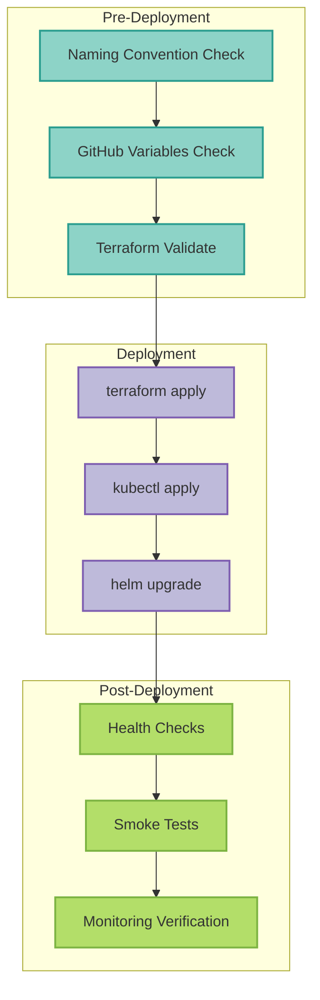

# Infrastructure Deployment Checklist



## Overview

This checklist ensures reproducible and idempotent infrastructure deployments following the standardized naming convention: `{environment}-mcp-server-langgraph-{resource-type}`.

**Last Updated:** 2025-11-05
**Status:** ✅ Validated with staging rebuild

---

## Pre-Deployment Validation

### 1. Naming Convention Compliance

Run this validation before any infrastructure changes:

```bash
# Check for legacy naming patterns
! grep -r "mcp-staging-cluster\|mcp-prod-gke\|mcp-dev-cluster" \
  terraform/environments/ .github/workflows/deploy-*.yaml deployments/overlays/ || \
  echo "❌ FAIL: Legacy naming found"

# Verify new naming in active configs
grep -r "staging-mcp-server-langgraph-gke\|production-mcp-server-langgraph-gke" \
  .github/workflows/deploy-*.yaml terraform/environments/gcp-*/main.tf && \
  echo "✅ PASS: New naming present"
```

### 2. GitHub Variables Check

```bash
gh variable list | grep -E "GKE_.*_CLUSTER|NAMESPACE"
# Should show:
# - GKE_STAGING_CLUSTER: staging-mcp-server-langgraph-gke
# - GKE_PROD_CLUSTER: production-mcp-server-langgraph-gke
# - STAGING_NAMESPACE: staging-mcp-server-langgraph
# - PRODUCTION_NAMESPACE: production-mcp-server-langgraph
```

---

[... rest of INFRASTRUCTURE-DEPLOYMENT-CHECKLIST.md content continues ...]

---

**Last Validated:** 2025-11-05 (Staging rebuild from scratch succeeded)
