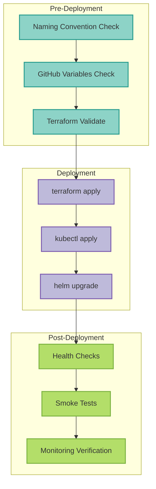

# Infrastructure Deployment Checklist



## Overview

This checklist ensures reproducible and idempotent infrastructure deployments following the standardized naming convention: `{environment}-mcp-server-langgraph-{resource-type}`.

**Last Updated:** 2025-11-05
**Status:** ✅ Validated with staging rebuild

---

## Pre-Deployment Validation

### 1. Naming Convention Compliance

Run this validation before any infrastructure changes:

```bash
# Check for legacy naming patterns
! grep -r "mcp-staging-cluster\|mcp-prod-gke\|mcp-dev-cluster" \
  terraform/environments/ .github/workflows/deploy-*.yaml deployments/overlays/ || \
  echo "❌ FAIL: Legacy naming found"

# Verify new naming in active configs
grep -r "staging-mcp-server-langgraph-gke\|production-mcp-server-langgraph-gke" \
  .github/workflows/deploy-*.yaml terraform/environments/gcp-*/main.tf && \
  echo "✅ PASS: New naming present"
```

### 2. GitHub Variables Check

```bash
gh variable list | grep -E "GKE_.*_CLUSTER|NAMESPACE"
# Should show:
# - GKE_STAGING_CLUSTER: staging-mcp-server-langgraph-gke
# - GKE_PROD_CLUSTER: production-mcp-server-langgraph-gke
# - STAGING_NAMESPACE: staging-mcp-server-langgraph
# - PRODUCTION_NAMESPACE: production-mcp-server-langgraph
```

---

### 2. GKE Autopilot Compliance (for GKE deployments)

- [ ] **Run automated validation**
  ```bash
  python3 scripts/validate_gke_autopilot_compliance.py deployments/overlays/&lt;overlay-name&gt;
  ```

- [ ] **CPU limit/request ratio ≤ 4.0**
  - Formula: `cpu_limit / cpu_request`
  - Example valid: 1000m / 250m = 4.0 ✅
  - Example invalid: 1000m / 200m = 5.0 ❌

- [ ] **Memory limit/request ratio ≤ 4.0**
  - Formula: `memory_limit / memory_request`

- [ ] **CPU/Memory within allowed ranges**
  - CPU: min 50m, max 4 cores
  - Memory: min 64Mi, max 8Gi

### 3. Security Configuration

- [ ] **If readOnlyRootFilesystem = true**
  - [ ] `/tmp` is mounted as writable volume
  - [ ] All application writable paths have volume mounts
  - [ ] Tested in development environment first

- [ ] **No privileged containers** (unless required)

- [ ] **Non-root user specified**
  ```yaml
  securityContext:
    runAsNonRoot: true
    runAsUser: &lt;uid&gt;
  ```

- [ ] **Capabilities dropped**
  ```yaml
  securityContext:
    capabilities:
      drop:
      - ALL
  ```

### 4. Resource Specifications

- [ ] **All containers have resource requests and limits**
  ```yaml
  resources:
    requests:
      cpu: &lt;value&gt;
      memory: &lt;value&gt;
    limits:
      cpu: &lt;value&gt;
      memory: &lt;value&gt;
  ```

- [ ] **Resource requests are realistic**
  - Based on actual usage patterns
  - Not over-provisioned
  - Not under-provisioned

- [ ] **Ephemeral storage specified if needed**
  ```yaml
  resources:
    requests:
      ephemeral-storage: 1Gi
    limits:
      ephemeral-storage: 2Gi
  ```

### 5. Environment Variables

- [ ] **No env vars with both `value` and `valueFrom`**
  ```yaml
  # INVALID:
  env:
  - name: MY_VAR
    value: "something"
    valueFrom:  # Cannot have both!
      secretKeyRef:
        name: my-secret
        key: my-key

  # VALID:
  env:
  - name: MY_VAR
    valueFrom:
      secretKeyRef:
        name: my-secret
        key: my-key
  ```

- [ ] **All valueFrom sources have exactly one key**
  - `configMapKeyRef` OR `secretKeyRef` OR `fieldRef` (not multiple)

- [ ] **All referenced secrets exist**
  ```bash
  kubectl get secret &lt;secret-name&gt; -n &lt;namespace&gt;
  ```

- [ ] **All referenced configmaps exist**
  ```bash
  kubectl get configmap &lt;configmap-name&gt; -n &lt;namespace&gt;
  ```

### 6. Health Probes

- [ ] **Liveness probe configured**
  ```yaml
  livenessProbe:
    httpGet:
      path: /health/live
      port: 8000
    initialDelaySeconds: 30
    periodSeconds: 10
  ```

- [ ] **Readiness probe configured**
  ```yaml
  readinessProbe:
    httpGet:
      path: /health/ready
      port: 8000
    initialDelaySeconds: 10
    periodSeconds: 5
  ```

- [ ] **Probe endpoints exist and are accessible**
  - Test endpoint returns 200 OK when healthy
  - Endpoint doesn't require authentication

- [ ] **initialDelaySeconds is sufficient for app startup**

- [ ] **Timeout and period values are appropriate**

### 7. Volumes and Storage

- [ ] **All required volumes are defined**
  ```yaml
  volumes:
  - name: tmp
    emptyDir: {}
  ```

- [ ] **All volume mounts reference existing volumes**

- [ ] **PersistentVolumeClaims exist and are bound**
  ```bash
  kubectl get pvc -n &lt;namespace&gt;
  ```

- [ ] **Storage class is available**
  ```bash
  kubectl get storageclass
  ```

### 8. Networking

- [ ] **Service exists for deployment (if needed)**
  ```bash
  kubectl get service -n &lt;namespace&gt;
  ```

- [ ] **Service ports match container ports**

- [ ] **Network policies allow required traffic**
  ```bash
  kubectl get networkpolicy -n &lt;namespace&gt;
  ```

- [ ] **Ingress configured correctly (if needed)**

### 9. IAM and Permissions

- [ ] **ServiceAccount exists**
  ```bash
  kubectl get serviceaccount -n &lt;namespace&gt;
  ```

- [ ] **Workload Identity configured (for GCP)**
  ```yaml
  metadata:
    annotations:
      iam.gke.io/gcp-service-account: &lt;gcp-sa&gt;@&lt;project&gt;.iam.gserviceaccount.com
  ```

- [ ] **GCP service account has required IAM roles**
  ```bash
  gcloud iam service-accounts get-iam-policy &lt;sa-email&gt;
  ```

- [ ] **Workload Identity binding configured**
  ```bash
  gcloud iam service-accounts add-iam-policy-binding &lt;sa-email&gt; \
    --role roles/iam.workloadIdentityUser \
    --member "serviceAccount:&lt;project&gt;.svc.id.goog[&lt;namespace&gt;/&lt;ksa&gt;]"
  ```

### 10. Image Configuration

- [ ] **Image tag is immutable (not `latest`)**
  - Use specific version tags or commit SHAs

- [ ] **Image exists in registry**
  ```bash
  docker pull &lt;image&gt;:&lt;tag&gt;
  ```

- [ ] **Image pull secrets configured (if private registry)**

- [ ] **imagePullPolicy set appropriately**
  - `Always` for staging/production
  - `IfNotPresent` for development

---

## Post-Deployment Validation

### 1. Immediate Checks (0-5 minutes)

- [ ] **All pods are Running**
  ```bash
  kubectl get pods -n &lt;namespace&gt;
  ```

- [ ] **No restarts occurring**
  ```bash
  watch kubectl get pods -n &lt;namespace&gt;
  ```

- [ ] **Check logs for startup errors**
  ```bash
  kubectl logs &lt;pod-name&gt; -n &lt;namespace&gt;
  ```

- [ ] **Health checks passing**
  ```bash
  kubectl describe pod &lt;pod-name&gt; -n &lt;namespace&gt; | grep -A 5 "Readiness:"
  ```

### 2. Short-term Monitoring (5-30 minutes)

- [ ] **Pods remain stable (no CrashLoopBackOff)**

- [ ] **Memory/CPU usage is reasonable**
  ```bash
  kubectl top pods -n &lt;namespace&gt;
  ```

- [ ] **No errors in application logs**

- [ ] **Metrics are being collected**

- [ ] **External dependencies are reachable**
  - Database connections working
  - External API calls succeeding

### 3. Functional Testing

- [ ] **Application endpoints are accessible**
  ```bash
  kubectl port-forward &lt;pod&gt; 8080:8080 -n &lt;namespace&gt;
  curl http://localhost:8080/health
  ```

- [ ] **Core functionality works**
  - Test critical user flows
  - Verify data persistence
  - Check integrations

- [ ] **Performance is acceptable**
  - Response times normal
  - No unusual latency

### 4. Long-term Monitoring (24-48 hours)

- [ ] **Set up alerts for**:
  - Pod restarts
  - OOM kills
  - Probe failures
  - Error rate increases

- [ ] **Monitor resource usage trends**

- [ ] **Check for memory leaks**

- [ ] **Verify log aggregation working**

---

## Rollback Procedure

If issues are detected post-deployment:

### 1. Quick Rollback
```bash
# Rollback to previous revision
kubectl rollout undo deployment/&lt;deployment&gt; -n &lt;namespace&gt;

# Verify rollback succeeded
kubectl rollout status deployment/&lt;deployment&gt; -n &lt;namespace&gt;
```

### 2. Rollback to Specific Revision
```bash
# List revisions
kubectl rollout history deployment/&lt;deployment&gt; -n &lt;namespace&gt;

# Rollback to specific revision
kubectl rollout undo deployment/&lt;deployment&gt; --to-revision=&lt;revision&gt; -n &lt;namespace&gt;
```

### 3. Rollback with Kustomize
```bash
# Revert Git changes
git revert &lt;commit-hash&gt;

# Reapply previous configuration
kubectl apply -k deployments/overlays/&lt;overlay&gt; --namespace=&lt;namespace&gt;
```

---

## Tools and Scripts

### Available Tools:
1. `scripts/validate_gke_autopilot_compliance.py` - Validation script
2. `tests/regression/test_pod_deployment_regression.py` - Regression tests
3. `.githooks/pre-commit` - Pre-commit validation hook
4. `.github/workflows/validate-k8s-configs.yml` - CI/CD pipeline

### Usage Examples:
```bash
# Validate before deploying
python3 scripts/validate_gke_autopilot_compliance.py deployments/overlays/production-gke

# Run all regression tests
pytest tests/regression/ -v

# Install pre-commit hook
git config core.hooksPath .githooks
```

---

## Common Mistakes to Avoid

1. ❌ **Deploying without validation**
   - Always run validation script first

2. ❌ **Enabling readOnlyRootFilesystem without testing**
   - Test in development first
   - Ensure all writable paths are mounted

3. ❌ **Not checking CPU/memory ratios on GKE Autopilot**
   - Ratio must be ≤ 4.0

4. ❌ **Using `latest` image tag**
   - Use specific versions or commit SHAs

5. ❌ **Not testing rollback procedure**
   - Verify you can rollback before deploying

6. ❌ **Insufficient health probe delays**
   - Account for slow application startup

7. ❌ **Missing IAM permissions**
   - Verify service account permissions before deploying

8. ❌ **Not monitoring after deployment**
   - Watch pods for at least 10 minutes

9. ❌ **Forgetting to delete old ReplicaSets**
   - Clean up after successful deployment

10. ❌ **Not documenting changes**
    - Always document what was changed and why

---

## Emergency Contacts

- **Platform Team**: @platform-team
- **On-Call Engineer**: Check PagerDuty
- **Documentation**: See [Troubleshooting Guide](/troubleshooting/overview#deployment-problems)

---

## Related Documentation

- [Troubleshooting Guide - Deployment Problems](/troubleshooting/overview#deployment-problems)
- [GKE Autopilot Best Practices](https://cloud.google.com/kubernetes-engine/docs/concepts/autopilot-overview)
- [ADR-0040: GCP GKE Autopilot Deployment](/architecture/adr-0040-gcp-gke-autopilot-deployment)
- [ADR-0054: Pod Failure Prevention Framework](/architecture/adr-0054-pod-failure-prevention-framework)

---

**Last Validated:** 2025-11-12 (Staging rebuild from scratch succeeded)
