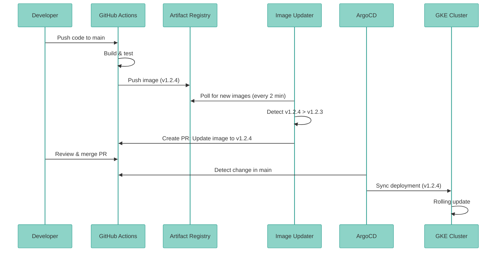

## Overview

**ArgoCD** enables GitOps-based continuous delivery for MCP Server, automatically syncing Kubernetes resources from Git to multiple GKE clusters. Changes in Git trigger automated deployments with rollback capabilities.

<CardGroup cols={2}>
  <Card title="Multi-Cluster" icon="layer-group">
    Manage dev, staging, prod from one ArgoCD instance
  </Card>
  <Card title="Auto-Sync" icon="arrows-rotate">
    Git commits trigger automated deployments
  </Card>
  <Card title="Image Updater" icon="docker">
    Auto-update images from Artifact Registry
  </Card>
  <Card title="Workload Identity" icon="shield-halved">
    Keyless authentication with GCP
  </Card>
</CardGroup>

---

## GitOps Benefits

<AccordionGroup>
  <Accordion title="Single Source of Truth">
    **Git** is the authoritative source for all deployments.

    - No manual `kubectl apply`
    - Full audit trail (Git history)
    - Easy rollback (`git revert`)
  </Accordion>

  <Accordion title="Automated Deployment">
    **ArgoCD watches Git** and auto-syncs to clusters.

    - Merge PR → Automatic deployment
    - Reduced manual errors
    - Consistent across environments
  </Accordion>

  <Accordion title="Multi-Cluster Management">
    **One ArgoCD instance** manages all clusters.

    - Dev, staging, prod from single UI
    - ApplicationSets for environment parity
    - Centralized observability
  </Accordion>

  <Accordion title="Image Automation">
    **ArgoCD Image Updater** detects new images.

    - Monitors Artifact Registry
    - Creates PRs with new image tags
    - Semantic versioning support
  </Accordion>
</AccordionGroup>

---

## Architecture

```mermaid
flowchart TB
    subgraph "Git Repository"
        A[GitHub: main branch]
        B[deployments/overlays/production-gke/]
        C[deployments/overlays/staging-gke/]
        D[deployments/overlays/dev-gke/]
    end

    subgraph "ArgoCD (Management Cluster)"
        E[ArgoCD Server]
        F[ApplicationSet Controller]
        G[Image Updater]
    end

    subgraph "GKE Clusters"
        H[Dev Cluster]
        I[Staging Cluster]
        J[Production Cluster]
    end

    subgraph "Artifact Registry"
        K[Container Images]
    end

    A --> E
    E --> F
    F -->|Sync| H
    F -->|Sync| I
    F -->|Sync| J

    G -->|Watch| K
    G -->|Update PR| A

    B --> J
    C --> I
    D --> H

    %% ColorBrewer2 Set3 palette - each component type uniquely colored
    classDef gitStyle fill:#8dd3c7,stroke:#2a9d8f,stroke-width:2px,color:#333
    classDef argocdStyle fill:#fdb462,stroke:#e67e22,stroke-width:2px,color:#333
    classDef clusterStyle fill:#b3de69,stroke:#7cb342,stroke-width:2px,color:#333
    classDef registryStyle fill:#80b1d3,stroke:#3498db,stroke-width:2px,color:#333

    class A,B,C,D gitStyle
    class E,F,G argocdStyle
    class H,I,J clusterStyle
    class K registryStyle
```bash
**Flow**:
1. Developer pushes code → GitHub
2. CI/CD builds image → Artifact Registry
3. ArgoCD Image Updater detects new image
4. Creates PR with updated image tag
5. After PR merge, ArgoCD syncs to cluster

---

## Quick Setup (15 minutes)

<Steps>
  <Step title="Run Setup Script">
    ```bash
    ./deployments/argocd/setup-argocd-gcp.sh YOUR_PROJECT_ID
    ```

    **What it does**:
    - Installs ArgoCD in `argocd` namespace
    - Installs ArgoCD Image Updater
    - Configures Workload Identity
    - Sets up GCP service account with registry access
  </Step>

  <Step title="Get ArgoCD Admin Password">
    ```bash
    kubectl -n argocd get secret argocd-initial-admin-secret \
      -o jsonpath="{.data.password}" | base64 -d
    ```

    Copy the password for login.
  </Step>

  <Step title="Access ArgoCD UI">
    <Tabs>
      <Tab title="Port Forward (Quick)">
        ```bash
        kubectl port-forward svc/argocd-server -n argocd 8080:443
        ```

        Open: https://localhost:8080

        Login:
        - Username: `admin`
        - Password: (from Step 2)
      </Tab>

      <Tab title="Ingress (Production)">
        ```yaml argocd-ingress.yaml
        apiVersion: networking.k8s.io/v1
        kind: Ingress
        metadata:
          name: argocd-server
          namespace: argocd
          annotations:
            cert-manager.io/cluster-issuer: letsencrypt-prod
            nginx.ingress.kubernetes.io/ssl-passthrough: "true"
            nginx.ingress.kubernetes.io/backend-protocol: "HTTPS"
        spec:
          ingressClassName: nginx
          tls:
          - hosts:
            - argocd.example.com
            secretName: argocd-tls
          rules:
          - host: argocd.example.com
            http:
              paths:
              - path: /
                pathType: Prefix
                backend:
                  service:
                    name: argocd-server
                    port:
                      number: 443
        ```

        ```bash
        kubectl apply -f argocd-ingress.yaml
        ```
      </Tab>
    </Tabs>
  </Step>

  <Step title="Add GKE Clusters">
    <Tabs>
      <Tab title="Using argocd CLI">
        ```bash
        # Get cluster contexts
        gcloud container clusters get-credentials mcp-dev-gke \
          --region us-central1 --project YOUR_PROJECT_ID
        gcloud container clusters get-credentials mcp-staging-gke \
          --region us-central1 --project YOUR_PROJECT_ID
        gcloud container clusters get-credentials production-mcp-server-langgraph-gke \
          --region us-central1 --project YOUR_PROJECT_ID

        # Install argocd CLI
        brew install argocd  # macOS
        # or: curl -sSL -o argocd https://github.com/argoproj/argo-cd/releases/latest/download/argocd-linux-amd64

        # Login
        argocd login localhost:8080 --username admin --password PASSWORD

        # Add clusters
        argocd cluster add gke_YOUR_PROJECT_ID_us-central1_mcp-dev-gke --name gcp-dev
        argocd cluster add gke_YOUR_PROJECT_ID_us-central1_mcp-staging-gke --name gcp-staging
        argocd cluster add gke_YOUR_PROJECT_ID_us-central1_production-mcp-server-langgraph-gke --name gcp-production
        ```
      </Tab>

      <Tab title="Using Secrets (Declarative)">
        ```bash
        # Generate cluster secret YAML
        kubectl config view --minify --flatten \
          --context=gke_YOUR_PROJECT_ID_us-central1_production-mcp-server-langgraph-gke > prod-cluster.yaml

        # Apply to ArgoCD namespace
        kubectl apply -f deployments/argocd/gcp-multi-cluster-setup.yaml
        ```

        Update the cluster endpoints and CA certs in the YAML first.
      </Tab>
    </Tabs>
  </Step>

  <Step title="Deploy ApplicationSet">
    ```bash
    # Edit cluster endpoints in the file
    vim deployments/argocd/gcp-multi-cluster-setup.yaml

    # Apply ApplicationSet
    kubectl apply -f deployments/argocd/gcp-multi-cluster-setup.yaml
    ```

    Creates 3 Applications (dev, staging, prod) from one definition.
  </Step>

  <Step title="Verify Sync">
    ```bash
    # List applications
    argocd app list

    # Check sync status
    argocd app get mcp-server-gcp-production

    # View in UI
    # https://localhost:8080
    ```

    <Check>All apps should show **Synced** and **Healthy**</Check>
  </Step>
</Steps>

---

## ApplicationSet for Multi-Environment

### Configuration

<CodeGroup>
```yaml ApplicationSet Definition
apiVersion: argoproj.io/v1alpha1
kind: ApplicationSet
metadata:
  name: mcp-server-gcp-environments
  namespace: argocd
spec:
  generators:
    - list:
        elements:
          - cluster: gcp-dev
            url: https://GCP_DEV_ENDPOINT
            namespace: mcp-dev
            overlay: dev-gke
            replicas: "1"

          - cluster: gcp-staging
            url: https://GCP_STAGING_ENDPOINT
            namespace: staging-mcp-server-langgraph
            overlay: staging-gke
            replicas: "2"

          - cluster: gcp-production
            url: https://GCP_PROD_ENDPOINT
            namespace: production-mcp-server-langgraph
            overlay: production-gke
            replicas: "3"

  template:
    metadata:
      name: 'mcp-server-{{cluster}}'
    spec:
      source:
        repoURL: https://github.com/vishnu2kmohan/mcp-server-langgraph
        targetRevision: main
        path: 'deployments/overlays/{{overlay}}'

      destination:
        server: '{{url}}'
        namespace: '{{namespace}}'

      syncPolicy:
        automated:
          prune: true      # Delete resources removed from Git
          selfHeal: true   # Revert manual changes

        retry:
          limit: 5
          backoff:
            duration: 5s
            maxDuration: 3m
```

```yaml Generated Applications
# ArgoCD generates 3 Applications:

1. mcp-server-gcp-dev
   - Cluster: gcp-dev
   - Path: deployments/overlays/dev-gke
   - Namespace: mcp-dev

2. mcp-server-gcp-staging
   - Cluster: gcp-staging
   - Path: deployments/overlays/staging-gke
   - Namespace: mcp-staging

3. mcp-server-gcp-production
   - Cluster: gcp-production
   - Path: deployments/overlays/production-gke
   - Namespace: mcp-production
```
</CodeGroup>

### Sync Policies

<Tabs>
  <Tab title="Automated (Recommended)">
    ```yaml
    syncPolicy:
      automated:
        prune: true      # Auto-delete removed resources
        selfHeal: true   # Revert manual kubectl changes
    ```

    **Behavior**:
    - Git commit → Automatic deployment
    - Manual changes reverted within 3 minutes
    - Resources removed from Git are deleted

    **Best for**: Staging, production (strict GitOps)
  </Tab>

  <Tab title="Manual">
    ```yaml
    syncPolicy:
      automated: null  # No automation
    ```

    **Behavior**:
    - Git changes detected but **not** auto-applied
    - Click "Sync" in UI to deploy
    - Allows manual intervention

    **Best for**: Development, testing
  </Tab>

  <Tab title="Hybrid">
    ```yaml
    syncPolicy:
      automated:
        prune: false     # Don't auto-delete
        selfHeal: true   # But revert manual changes
    ```

    **Behavior**:
    - Auto-sync new changes
    - Don't delete resources
    - Revert manual edits

    **Best for**: Migration period
  </Tab>
</Tabs>

---

## ArgoCD Image Updater

### Purpose

Automatically update container image tags when new versions are pushed to Artifact Registry.

### Configuration

<Steps>
  <Step title="Configure Registry Access">
    ```yaml argocd-image-updater-config.yaml
    apiVersion: v1
    kind: ConfigMap
    metadata:
      name: argocd-image-updater-config
      namespace: argocd
    data:
      registries.conf: |
        registries:
        - name: gcp-artifact-registry
          api_url: https://us-central1-docker.pkg.dev
          prefix: us-central1-docker.pkg.dev
          credentials: ext:/scripts/gcp-credentials.sh
          default: true
    ```

    Workload Identity handles authentication automatically.
  </Step>

  <Step title="Annotate Application">
    ```yaml
    apiVersion: argoproj.io/v1alpha1
    kind: Application
    metadata:
      name: mcp-server-production-gke
      namespace: argocd
      annotations:
        # Image to watch
        argocd-image-updater.argoproj.io/image-list: |
          mcp-server=us-central1-docker.pkg.dev/PROJECT_ID/mcp-production/mcp-server-langgraph

        # Update strategy: semver (respect semantic versioning)
        argocd-image-updater.argoproj.io/mcp-server.update-strategy: semver

        # Only allow stable versions (v1.2.3, not v1.2.3-beta)
        argocd-image-updater.argoproj.io/mcp-server.allow-tags: regexp:^v?[0-9]+\.[0-9]+\.[0-9]+$

        # Write changes back to Git
        argocd-image-updater.argoproj.io/write-back-method: git
        argocd-image-updater.argoproj.io/write-back-target: kustomization
    ```
  </Step>

  <Step title="Update Strategy Options">
    <Tabs>
      <Tab title="Semver (Recommended)">
        ```yaml
        argocd-image-updater.argoproj.io/mcp-server.update-strategy: semver
        argocd-image-updater.argoproj.io/mcp-server.allow-tags: regexp:^v?[0-9]+\.[0-9]+\.[0-9]+$
        ```

        **Behavior**: Upgrades to latest stable semver tag (v1.2.3 → v1.2.4)

        **Skips**: Pre-releases (v1.2.3-beta, v1.2.3-rc1)
      </Tab>

      <Tab title="Latest">
        ```yaml
        argocd-image-updater.argoproj.io/mcp-server.update-strategy: latest
        ```

        **Behavior**: Always use latest image (by timestamp)

        **Risk**: May deploy unstable builds
      </Tab>

      <Tab title="Digest">
        ```yaml
        argocd-image-updater.argoproj.io/mcp-server.update-strategy: digest
        ```

        **Behavior**: Pin to specific image SHA256 digest

        **Best for**: Maximum reproducibility
      </Tab>
    </Tabs>
  </Step>
</Steps>

### Workflow



---

## Deployment Patterns

### Progressive Delivery

<Steps>
  <Step title="1. Deploy to Dev (Automatic)">
    ```bash
    git push origin main
    ```

    ArgoCD auto-syncs to dev cluster within 3 minutes.
  </Step>

  <Step title="2. Promote to Staging (Manual Sync)">
    ```bash
    # Option 1: argocd CLI
    argocd app sync mcp-server-gcp-staging

    # Option 2: UI
    # Click "Sync" in ArgoCD UI for staging app
    ```

    Validates in production-like environment.
  </Step>

  <Step title="3. Promote to Production (Approval Required)">
    <Tabs>
      <Tab title="Via GitHub Actions">
        ```yaml .github/workflows/promote-to-prod.yaml
        name: Promote to Production
        on:
          workflow_dispatch:
            inputs:
              version:
                description: 'Version to promote'
                required: true

        jobs:
          promote:
            runs-on: ubuntu-latest
            environment: production  # Requires approval
            steps:
              - uses: actions/checkout@v4

              - name: Update production overlay
                run: |
                  cd deployments/overlays/production-gke
                  kustomize edit set image \
                    mcp-server=us-central1-docker.pkg.dev/PROJECT_ID/mcp-production/mcp-server-langgraph:${{ github.event.inputs.version }}

              - name: Commit and push
                run: |
                  git config user.name "GitHub Actions"
                  git config user.email "actions@github.com"
                  git commit -am "Promote v${{ github.event.inputs.version }} to production"
                  git push
        ```

        Requires manual approval in GitHub.
      </Tab>

      <Tab title="Via ArgoCD Sync Waves">
        ```yaml
        apiVersion: argoproj.io/v1alpha1
        kind: Application
        metadata:
          annotations:
            argocd.argoproj.io/sync-wave: "10"  # Deploy after wave 0-9
        ```

        Controls deployment order across applications.
      </Tab>
    </Tabs>
  </Step>
</Steps>

### Canary Deployment

Use Flagger with ArgoCD for automated canary analysis:

```yaml
apiVersion: flagger.app/v1beta1
kind: Canary
metadata:
  name: mcp-server-canary
  namespace: production-mcp-server-langgraph
spec:
  targetRef:
    apiVersion: apps/v1
    kind: Deployment
    name: production-mcp-server-langgraph
  progressDeadlineSeconds: 600
  service:
    port: 8000
  analysis:
    interval: 1m
    threshold: 5
    maxWeight: 50
    stepWeight: 10
    metrics:
    - name: request-success-rate
      thresholdRange:
        min: 99
      interval: 1m
    - name: request-duration
      thresholdRange:
        max: 500
      interval: 1m
```bash
**Flow**:
1. ArgoCD syncs new version
2. Flagger creates canary deployment (10% traffic)
3. Monitors metrics for 1 minute
4. If healthy, increases to 20%, 30%, ... 100%
5. If unhealthy, auto-rollback

---

## Monitoring & Troubleshooting

### Application Health

<Tabs>
  <Tab title="Via CLI">
    ```bash
    # List all apps
    argocd app list

    # Get detailed status
    argocd app get mcp-server-gcp-production

    # View sync history
    argocd app history mcp-server-gcp-production

    # View logs
    argocd app logs mcp-server-gcp-production
    ```
  </Tab>

  <Tab title="Via UI">
    Navigate to: https://argocd.example.com

    **Application View**:
    - Green = Synced & Healthy
    - Yellow = Syncing or Progressing
    - Red = Degraded or Out of Sync

    **Resource Tree**:
    - Visualizes all Kubernetes resources
    - Click resource for events/logs
    - Diff view shows Git vs. cluster state
  </Tab>
</Tabs>

### Common Issues

<AccordionGroup>
  <Accordion title="Application stuck in 'Progressing'">
    **Symptom**: Application shows "Progressing" for &gt;10 minutes

    **Causes**:
    - Deployment rollout waiting for pods
    - Resource quota exceeded
    - Image pull errors

    **Solution**:
    ```bash
    # Check pod status
    kubectl get pods -n production-mcp-server-langgraph

    # View pod events
    kubectl describe pod POD_NAME -n production-mcp-server-langgraph

    # Check ArgoCD sync logs
    argocd app logs mcp-server-gcp-production
    ```
  </Accordion>

  <Accordion title="Out of Sync despite automated sync">
    **Symptom**: App shows "OutOfSync" with automated sync enabled

    **Causes**:
    - Manual `kubectl` changes (selfHeal disabled)
    - Ignored differences (e.g., replicas managed by HPA)
    - Sync failed due to error

    **Solution**:
    ```bash
    # Force sync
    argocd app sync mcp-server-gcp-production --force

    # View diff
    argocd app diff mcp-server-gcp-production

    # Ignore specific fields
    argocd app set mcp-server-gcp-production \
      --ignore-difference group=apps,kind=Deployment,jsonPointers=/spec/replicas
    ```
  </Accordion>

  <Accordion title="Image Updater not detecting new images">
    **Symptom**: New images pushed to Artifact Registry, but no PR created

    **Checks**:
    ```bash
    # View Image Updater logs
    kubectl logs -n argocd deployment/argocd-image-updater

    # Check Workload Identity
    kubectl describe sa argocd-image-updater -n argocd

    # Verify GCP SA permissions
    gcloud projects get-iam-policy PROJECT_ID \
      --flatten="bindings[].members" \
      --filter="bindings.members:argocd-sa"
    ```

    **Common fix**: Grant `roles/artifactregistry.reader` to GCP SA
  </Accordion>

  <Accordion title="Cluster not reachable">
    **Symptom**: ArgoCD can't connect to GKE cluster

    **Solution**:
    ```bash
    # Re-add cluster
    argocd cluster add CONTEXT_NAME --name gcp-production

    # Update cluster secret with new endpoint/cert
    kubectl edit secret gcp-production-cluster -n argocd
    ```
  </Accordion>
</AccordionGroup>

---

## Security Best Practices

<Check>**Enable RBAC** for ArgoCD users</Check>

```yaml
apiVersion: v1
kind: ConfigMap
metadata:
  name: argocd-rbac-cm
  namespace: argocd
data:
  policy.csv: |
    # Developers: read-only access
    p, role:developers, applications, get, */*, allow
    p, role:developers, applications, sync, dev/*, allow
    g, engineering@example.com, role:developers

    # DevOps: full access to staging/prod
    p, role:devops, applications, *, */*, allow
    p, role:devops, clusters, *, *, allow
    g, devops@example.com, role:devops
```

<Check>**Use Workload Identity** (no service account keys)</Check>

Already configured by setup script.

<Check>**Enable audit logging**</Check>

```yaml
apiVersion: v1
kind: ConfigMap
metadata:
  name: argocd-cm
  namespace: argocd
data:
  audit.log.enabled: "true"
  audit.log.maxsize: "100"  # MB
  audit.log.maxage: "30"    # days
```
<Check>**Restrict allowed Git repos**</Check>

```yaml
apiVersion: v1
kind: ConfigMap
metadata:
  name: argocd-cm
  namespace: argocd
data:
  repositories: |
    - url: https://github.com/vishnu2kmohan/mcp-server-langgraph
      name: mcp-server-langgraph
    # Deny all others
```

---

## Related Documentation

<CardGroup cols={2}>
  <Card title="GKE Production" icon="kubernetes" href="/deployment/kubernetes/gke-production">
    Production deployment with Kustomize overlays
  </Card>
  <Card title="Binary Authorization" icon="file-signature" href="/deployment/binary-authorization">
    Image signing for secure deployments
  </Card>
  <Card title="CI/CD Pipeline" icon="code-branch" href="https://github.com/vishnu2kmohan/mcp-server-langgraph/blob/main/.github/workflows/deploy-production-gke.yaml">
    GitHub Actions workflow with ArgoCD
  </Card>
  <Card title="Operations Runbooks" icon="book-medical" href="/deployment/operations/gke-runbooks">
    Incident response and troubleshooting
  </Card>
</CardGroup>

---

## Next Steps

<Steps>
  <Step title="Install ArgoCD">
    ```bash
    ./deployments/argocd/setup-argocd-gcp.sh PROJECT_ID
    ```
  </Step>

  <Step title="Add Clusters">
    ```bash
    argocd cluster add CONTEXT --name gcp-production
    ```
  </Step>

  <Step title="Deploy ApplicationSet">
    ```bash
    kubectl apply -f deployments/argocd/gcp-multi-cluster-setup.yaml
    ```
  </Step>

  <Step title="Configure Image Updater">
    Add annotations to Application for automatic image updates
  </Step>

  <Step title="Enable Monitoring">
    [Operations Guide →](/deployment/operations/gke-runbooks)
  </Step>
</Steps>
