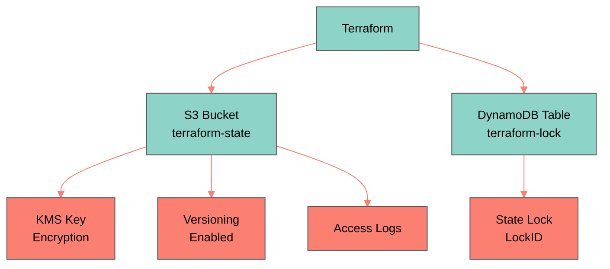

# AWS Backend Setup

Configure S3 bucket and DynamoDB table for Terraform remote state management with encryption, versioning, and state locking.

## Overview

Terraform backend stores infrastructure state in S3 with DynamoDB for state locking, preventing concurrent modifications.

<Card title="Benefits">
  - **Team collaboration**: Shared state across team members
  - **State locking**: Prevents concurrent modifications
  - **Version history**: S3 versioning for rollback capability
  - **Encryption**: KMS encryption for sensitive data
  - **Audit trail**: Access logging for compliance
</Card>

## Architecture


## Quick Setup

<Steps>
  <Step title="Navigate to backend setup">
    ```bash
    cd terraform/backend-setup
    ```
  </Step>

  <Step title="Create terraform.tfvars">
    ```hcl
    project_name = "mcp-langgraph"
    environment  = "prod"
    region       = "us-east-1"
    ```
  </Step>

  <Step title="Initialize and deploy">
    ```bash
    terraform init
    terraform plan
    terraform apply
    ```

    **Creates**:
    - S3 bucket: `mcp-langgraph-terraform-state-prod`
    - DynamoDB table: `mcp-langgraph-terraform-lock-prod`
    - KMS key for encryption
    - S3 bucket for access logs
  </Step>

  <Step title="Note the outputs">
    ```bash
    terraform output
    ```

    Save these values for backend configuration:
    - `state_bucket_name`
    - `lock_table_name`
  </Step>
</Steps>

## Backend Configuration

### For Environment Deployments

```hcl
# terraform/environments/prod/main.tf
terraform {
  backend "s3" {
    bucket         = "mcp-langgraph-terraform-state-prod"
    key            = "prod/terraform.tfstate"
    region         = "us-east-1"
    dynamodb_table = "mcp-langgraph-terraform-lock-prod"
    encrypt        = true
  }
}
```

### Initialize Backend

```bash
cd terraform/environments/prod
terraform init

# You'll see:
# Initializing the backend...
# Successfully configured the backend "s3"!
```
## Features

### S3 State Bucket

<Tabs>
  <Tab title="Versioning">
    **Enabled** for rollback capability

    ```bash
    # List all versions
    aws s3api list-object-versions \
      --bucket mcp-langgraph-terraform-state-prod \
      --prefix prod/terraform.tfstate

    # Restore previous version if needed
    aws s3api copy-object \
      --bucket mcp-langgraph-terraform-state-prod \
      --copy-source mcp-langgraph-terraform-state-prod/prod/terraform.tfstate?versionId=VERSION_ID \
      --key prod/terraform.tfstate
    ```
  </Tab>

  <Tab title="Encryption">
    **KMS encryption** at rest

    ```hcl
    resource "aws_s3_bucket_server_side_encryption_configuration" "state" {
      bucket = aws_s3_bucket.terraform_state.id

      rule {
        apply_server_side_encryption_by_default {
          kms_master_key_id = aws_kms_key.terraform_state.arn
          sse_algorithm     = "aws:kms"
        }
      }
    }
    ```
  </Tab>

  <Tab title="Access Logging">
    **All access logged** to separate bucket

    ```bash
    # View access logs
    aws s3 ls s3://mcp-langgraph-terraform-logs-prod/
    ```
  </Tab>

  <Tab title="Lifecycle">
    **Old versions** deleted after 90 days

    ```hcl
    resource "aws_s3_bucket_lifecycle_configuration" "state" {
      bucket = aws_s3_bucket.terraform_state.id

      rule {
        id     = "delete-old-versions"
        status = "Enabled"

        noncurrent_version_expiration {
          days = 90
        }
      }
    }
    ```
  </Tab>
</Tabs>

### DynamoDB Lock Table

<Tabs>
  <Tab title="State Locking">
    Prevents concurrent Terraform runs

    ```bash
    # Check for active locks
    aws dynamodb scan \
      --table-name mcp-langgraph-terraform-lock-prod \
      --query "Items[].LockID.S"

    # Should be empty when no terraform running
    ```
  </Tab>

  <Tab title="On-Demand Billing">
    **Pay per request** (no capacity planning)

    ```hcl
    resource "aws_dynamodb_table" "terraform_lock" {
      name         = "${var.project_name}-terraform-lock-${var.environment}"
      billing_mode = "PAY_PER_REQUEST"

      hash_key = "LockID"

      attribute {
        name = "LockID"
        type = "S"
      }
    }
    ```

    **Cost**: ~$0.01/month (minimal usage)
  </Tab>
</Tabs>

## Multiple Environments

### Separate State Per Environment

```bash
# Production
terraform {
  backend "s3" {
    bucket = "mcp-langgraph-terraform-state-prod"
    key    = "prod/terraform.tfstate"
    # ...
  }
}

# Staging
terraform {
  backend "s3" {
    bucket = "mcp-langgraph-terraform-state-staging"
    key    = "staging/terraform.tfstate"
    # ...
  }
}

# Development
terraform {
  backend "s3" {
    bucket = "mcp-langgraph-terraform-state-dev"
    key    = "dev/terraform.tfstate"
    # ...
  }
}
```

### Same Bucket, Different Keys

```bash
terraform {
  backend "s3" {
    bucket = "mcp-langgraph-terraform-state"
    key    = "${environment}/terraform.tfstate"  # Variable not allowed here
    # Must hardcode environment name in each environment's config
  }
}
```

## Security Best Practices

<AccordionGroup>
  <Accordion title="Bucket Policy">
    Restrict access to authorized users only

    ```json
    {
      "Version": "2012-10-17",
      "Statement": [
        {
          "Effect": "Allow",
          "Principal": {
            "AWS": [
              "arn:aws:iam::123456789012:user/terraform-admin",
              "arn:aws:iam::123456789012:role/github-actions"
            ]
          },
          "Action": [
            "s3:GetObject",
            "s3:PutObject",
            "s3:DeleteObject"
          ],
          "Resource": "arn:aws:s3:::mcp-langgraph-terraform-state-prod/*"
        }
      ]
    }
    ```
  </Accordion>

  <Accordion title="DynamoDB Permissions">
    Minimal permissions for state locking

    ```json
    {
      "Version": "2012-10-17",
      "Statement": [
        {
          "Effect": "Allow",
          "Action": [
            "dynamodb:PutItem",
            "dynamodb:GetItem",
            "dynamodb:DeleteItem"
          ],
          "Resource": "arn:aws:dynamodb:us-east-1:123456789012:table/mcp-langgraph-terraform-lock-prod"
        }
      ]
    }
    ```
  </Accordion>

  <Accordion title="MFA Delete">
    Require MFA to delete state versions

    ```bash
    # Enable MFA delete (requires root account)
    aws s3api put-bucket-versioning \
      --bucket mcp-langgraph-terraform-state-prod \
      --versioning-configuration Status=Enabled,MFADelete=Enabled \
      --mfa "arn:aws:iam::123456789012:mfa/root-account-mfa-device XXXXXX"
    ```
  </Accordion>
</AccordionGroup>

## Disaster Recovery

### State Backup

<Steps>
  <Step title="Manual backup">
    ```bash
    # Download current state
    aws s3 cp s3://mcp-langgraph-terraform-state-prod/prod/terraform.tfstate \
      ./terraform.tfstate.backup-$(date +%Y%m%d)
    ```
  </Step>

  <Step title="Cross-region replication">
    ```hcl
    resource "aws_s3_bucket_replication_configuration" "state" {
      bucket = aws_s3_bucket.terraform_state.id
      role   = aws_iam_role.replication.arn

      rule {
        id     = "replicate-state"
        status = "Enabled"

        destination {
          bucket        = aws_s3_bucket.terraform_state_replica.arn
          storage_class = "STANDARD_IA"

          encryption_configuration {
            replica_kms_key_id = aws_kms_key.replica.arn
          }
        }
      }
    }
    ```
  </Step>
</Steps>

### State Recovery

<Steps>
  <Step title="List versions">
    ```bash
    aws s3api list-object-versions \
      --bucket mcp-langgraph-terraform-state-prod \
      --prefix prod/terraform.tfstate \
      --query 'Versions[].[VersionId,LastModified,IsLatest]' \
      --output table
    ```
  </Step>

  <Step title="Restore specific version">
    ```bash
    # Download specific version
    aws s3api get-object \
      --bucket mcp-langgraph-terraform-state-prod \
      --key prod/terraform.tfstate \
      --version-id VERSION_ID \
      terraform.tfstate.restored

    # Upload as current version
    aws s3 cp terraform.tfstate.restored \
      s3://mcp-langgraph-terraform-state-prod/prod/terraform.tfstate
    ```
  </Step>

  <Step title="Verify state">
    ```bash
    cd terraform/environments/prod
    terraform init
    terraform plan  # Should show no changes if restored correctly
    ```
  </Step>
</Steps>

## Troubleshooting

<AccordionGroup>
  <Accordion title="Error: Failed to get existing workspaces">
    **Cause**: S3 bucket doesn't exist or no access

    **Solution**:
    ```bash
    # Verify bucket exists
    aws s3 ls s3://mcp-langgraph-terraform-state-prod

    # Check IAM permissions
    aws iam get-user
    aws iam list-user-policies --user-name YOUR_USER
    ```
  </Accordion>

  <Accordion title="Error: Error acquiring the state lock">
    **Cause**: Previous Terraform run didn't release lock (e.g., Ctrl+C during apply)

    **Solution**:
    ```bash
    # Check for stuck lock
    aws dynamodb scan \
      --table-name mcp-langgraph-terraform-lock-prod

    # Force unlock (use with caution!)
    terraform force-unlock LOCK_ID
    ```
  </Accordion>

  <Accordion title="Error: NoSuchBucket: The specified bucket does not exist">
    **Cause**: Backend not created yet

    **Solution**:
    ```bash
    # Run backend setup first
    cd terraform/backend-setup
    terraform init
    terraform apply
    ```
  </Accordion>
</AccordionGroup>

## Cost

| Component | Monthly Cost | Notes |
|-----------|--------------|-------|
| **S3 Storage** | ~$0.02 | ~1 MB state file |
| **S3 Requests** | ~$0.01 | Minimal GET/PUT |
| **DynamoDB** | ~$0.01 | Pay-per-request |
| **KMS** | $1.00 | First 20K requests/month free |
| **Total** | **~$1.04/month** | Negligible cost |

## Related Documentation

<CardGroup cols={2}>
  <Card title="Terraform AWS" icon="code" href="/deployment/infrastructure/terraform-aws">
    AWS infrastructure modules
  </Card>
  <Card title="EKS Production" icon="kubernetes" href="/deployment/kubernetes/eks-production">
    Production deployment guide
  </Card>
  <Card title="GCP Backend" icon="google" href="/deployment/infrastructure/backend-setup">
    GCP backend setup (GCS + Cloud Storage)
  </Card>
</CardGroup>
