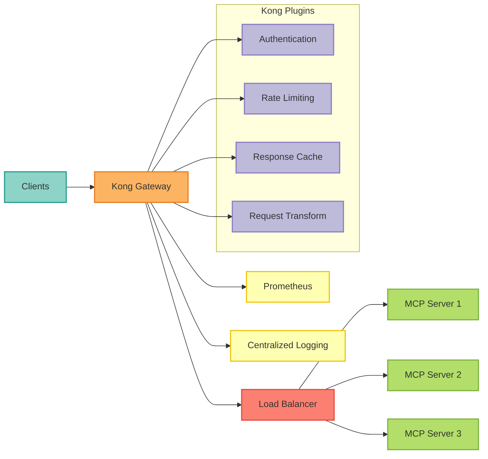

### Overview

Kong Gateway provides enterprise-grade API management with advanced features including rate limiting, authentication, request transformation, caching, and observability. This guide covers deploying Kong as the API gateway for your MCP Server.

<Info>
Kong Gateway sits between clients and your MCP Server, handling cross-cutting concerns like authentication, rate limiting, and monitoring.
</Info>

### Architecture


### Features

<CardGroup cols={2}>
  <Card title="Authentication" icon="key">
    - JWT verification
    - OAuth 2.0 / OIDC
    - API keys
    - Basic auth
    - LDAP integration
  </Card>

  <Card title="Rate Limiting" icon="gauge">
    - Per-consumer limits
    - Per-route limits
    - Advanced quotas
    - Redis-backed
    - GraphQL rate limiting
  </Card>

  <Card title="Security" icon="shield">
    - IP restriction
    - CORS
    - Request validation
    - Bot detection
    - CSRF protection
  </Card>

  <Card title="Traffic Control" icon="traffic-light">
    - Load balancing
    - Circuit breakers
    - Request transformation
    - Response caching
    - Canary deployments
  </Card>
</CardGroup>

### Quick Start

<Tabs>
  <Tab title="Docker Compose">
    ```yaml
    # docker-compose.yml
    version: '3.8'

    services:
      kong-database:
        image: postgres:15-alpine
        environment:
          POSTGRES_USER: kong
          POSTGRES_DB: kong
          POSTGRES_PASSWORD: kongpass
        volumes:
          - kong-db-data:/var/lib/postgresql/data
        healthcheck:
          test: ["CMD", "pg_isready", "-U", "kong"]
          interval: 10s
          timeout: 5s
          retries: 5

      kong-migrations:
        image: kong/kong-gateway:3.5
        command: kong migrations bootstrap
        environment:
          KONG_DATABASE: postgres
          KONG_PG_HOST: kong-database
          KONG_PG_USER: kong
          KONG_PG_PASSWORD: kongpass
        depends_on:
          kong-database:
            condition: service_healthy

      kong:
        image: kong/kong-gateway:3.5
        environment:
          KONG_DATABASE: postgres
          KONG_PG_HOST: kong-database
          KONG_PG_USER: kong
          KONG_PG_PASSWORD: kongpass
          KONG_PROXY_ACCESS_LOG: /dev/stdout
          KONG_ADMIN_ACCESS_LOG: /dev/stdout
          KONG_PROXY_ERROR_LOG: /dev/stderr
          KONG_ADMIN_ERROR_LOG: /dev/stderr
          KONG_ADMIN_LISTEN: 0.0.0.0:8001
          KONG_ADMIN_GUI_URL: http://localhost:8002
        ports:
          - "8000:8000"   # Proxy HTTP
          - "8443:8443"   # Proxy HTTPS
          - "8001:8001"   # Admin API
          - "8002:8002"   # Admin GUI
        depends_on:
          kong-database:
            condition: service_healthy
          kong-migrations:
            condition: service_completed_successfully

      mcp-server-langgraph:
        image: mcp-server-langgraph:latest
        environment:
          - AUTH_PROVIDER=keycloak
          - LLM_PROVIDER=anthropic
        ports:
          - "8080:8000"

    volumes:
      kong-db-data:
```
    **Start services**:
    ```bash
    docker compose up -d

    # Wait for Kong to be ready
    curl -i http://localhost:8001/

    # Access Kong Manager (GUI)
    open http://localhost:8002
    ```
  </Tab>

  <Tab title="Kubernetes (Helm)">
    ```bash
    # Add Kong Helm repo
    helm repo add kong https://charts.konghq.com
    helm repo update

    # Install Kong
    helm install kong kong/kong \
      --namespace kong \
      --create-namespace \
      --set ingressController.enabled=true \
      --set ingressController.installCRDs=false \
      --set postgresql.enabled=true \
      --set env.database=postgres \
      --set env.pg_user=kong \
      --set env.pg_password=kongpass

    # Wait for deployment
    kubectl wait --for=condition=available --timeout=300s \
      deployment/kong-kong -n kong

    # Check status
    kubectl get pods -n kong
    kubectl get svc -n kong
    ```
    **Access Kong**:
    ```bash
    # Port forward Kong admin API
    kubectl port-forward -n kong svc/kong-kong-admin 8001:8001

    # Test
    curl http://localhost:8001/
    ```
  </Tab>

  <Tab title="Cloud (AWS)">
    **Using AWS Marketplace AMI**:
    ```bash
    # Launch EC2 instance with Kong AMI
    # OR use Terraform:

    # main.tf
    resource "aws_instance" "kong" {
      ami           = "ami-kong-gateway"  # Kong official AMI
      instance_type = "t3.large"

      user_data = <<-EOF
        #!/bin/bash
        export KONG_DATABASE=postgres
        export KONG_PG_HOST=${aws_db_instance.kong.address}
        export KONG_PG_USER=kong
        export KONG_PG_PASSWORD=${var.db_password}

        kong migrations bootstrap
        kong start
      EOF
    }

    resource "aws_db_instance" "kong" {
      allocated_storage    = 20
      engine               = "postgres"
      engine_version       = "15"
      instance_class       = "db.t3.medium"
      db_name              = "kong"
      username             = "kong"
      password             = var.db_password
    }
    ```
  </Tab>
</Tabs>

### Configuration

#### Create Service

```bash
## Add MCP Server as a service
curl -X POST http://localhost:8001/services \
  --data name=mcp-server-langgraph \
  --data url=http://mcp-server-langgraph:8000

## Or using decK (declarative config)
cat > kong.yaml << 'EOF'
_format_version: "3.0"

services:
- name: mcp-server-langgraph
  url: http://mcp-server-langgraph:8000
  protocol: http
  retries: 3
  connect_timeout: 60000
  write_timeout: 60000
  read_timeout: 60000
EOF

deck sync -s kong.yaml
```
#### Create Routes

```bash
## Create route for /message endpoint
curl -X POST http://localhost:8001/services/mcp-server-langgraph/routes \
  --data paths[]=/message \
  --data methods[]=POST

## Create route for /auth
curl -X POST http://localhost:8001/services/mcp-server-langgraph/routes \
  --data paths[]=/auth \
  --data methods[]=POST

## Using decK
cat >> kong.yaml << 'EOF'
  routes:
  - name: message
    paths:
    - /message
    methods:
    - POST
    strip_path: false

  - name: auth
    paths:
    - /auth
    methods:
    - POST
    strip_path: false

  - name: health
    paths:
    - /health
    methods:
    - GET
    strip_path: false
EOF

deck sync -s kong.yaml
```
### Plugins

#### JWT Authentication

```bash
## Enable JWT plugin
curl -X POST http://localhost:8001/services/mcp-server-langgraph/plugins \
  --data name=jwt \
  --data config.claims_to_verify=exp \
  --data config.key_claim_name=kid \
  --data config.secret_is_base64=false

## Create consumer
curl -X POST http://localhost:8001/consumers \
  --data username=api-client

## Add JWT credentials
curl -X POST http://localhost:8001/consumers/api-client/jwt \
  --data key=my-key-id \
  --data algorithm=HS256 \
  --data secret=my-secret-key

## Test
TOKEN=$(echo -n '{"kid":"my-key-id","alg":"HS256","typ":"JWT"}' | base64 -w0).$(echo -n '{"iss":"api-client","exp":9999999999}' | base64 -w0)
SIGNATURE=$(echo -n "$TOKEN" | openssl dgst -sha256 -hmac "my-secret-key" -binary | base64 -w0)

curl http://localhost:8000/message \
  -H "Authorization: Bearer ${TOKEN}.${SIGNATURE}" \
  -d '{"query":"Hello"}'
```
#### Rate Limiting

```bash
## Global rate limiting
curl -X POST http://localhost:8001/plugins \
  --data name=rate-limiting \
  --data config.minute=100 \
  --data config.hour=5000 \
  --data config.policy=redis \
  --data config.redis.host=redis \
  --data config.redis.port=6379

## Per-consumer rate limiting
curl -X POST http://localhost:8001/plugins \
  --data name=rate-limiting-advanced \
  --data config.limit[]=100 \
  --data config.window_size[]=60 \
  --data config.identifier=consumer \
  --data config.sync_rate=-1 \
  --data config.namespace=rate-limit \
  --data config.strategy=redis \
  --data config.redis.host=redis

## Using decK
cat >> kong.yaml << 'EOF'
plugins:
- name: rate-limiting
  config:
    minute: 100
    hour: 5000
    policy: redis
    redis:
      host: redis
      port: 6379
EOF
```
#### CORS

```bash
## Enable CORS
curl -X POST http://localhost:8001/services/mcp-server-langgraph/plugins \
  --data name=cors \
  --data config.origins=https://yourdomain.com \
  --data config.methods=GET,POST,PUT,DELETE \
  --data config.headers=Accept,Authorization,Content-Type \
  --data config.exposed_headers=X-Auth-Token \
  --data config.credentials=true \
  --data config.max_age=3600

## Using decK
cat >> kong.yaml << 'EOF'
  plugins:
  - name: cors
    config:
      origins:
      - https://yourdomain.com
      methods:
      - GET
      - POST
      credentials: true
      max_age: 3600
EOF
```
#### Response Caching

```bash
## Enable proxy cache
curl -X POST http://localhost:8001/services/mcp-server-langgraph/plugins \
  --data name=proxy-cache \
  --data config.response_code[]=200 \
  --data config.response_code[]=301 \
  --data config.response_code[]=404 \
  --data config.request_method[]=GET \
  --data config.content_type[]=application/json \
  --data config.cache_ttl=300 \
  --data config.strategy=redis \
  --data config.redis.host=redis

## Vary cache by header
  --data config.vary_headers[]=Authorization
```
#### Request Transformation

```bash
## Add/modify request headers
curl -X POST http://localhost:8001/services/mcp-server-langgraph/plugins \
  --data name=request-transformer \
  --data config.add.headers[]=X-API-Version:2.0 \
  --data config.add.headers[]=X-Gateway:Kong \
  --data config.remove.headers[]=X-Sensitive-Header

## Transform request body
curl -X POST http://localhost:8001/services/mcp-server-langgraph/plugins \
  --data name=request-transformer-advanced \
  --data config.add.body[]=source:kong-gateway
```
#### Logging

```bash
## HTTP log
curl -X POST http://localhost:8001/plugins \
  --data name=http-log \
  --data config.http_endpoint=http://logstash:8080/logs \
  --data config.method=POST \
  --data config.timeout=1000 \
  --data config.keepalive=60000

## File log
curl -X POST http://localhost:8001/plugins \
  --data name=file-log \
  --data config.path=/tmp/kong.log

## Datadog
curl -X POST http://localhost:8001/plugins \
  --data name=datadog \
  --data config.host=datadog-agent \
  --data config.port=8125 \
  --data config.metrics[]=request_count \
  --data config.metrics[]=latency \
  --data config.metrics[]=request_size \
  --data config.metrics[]=response_size
```
### Advanced Features

#### Load Balancing

```yaml
## kong.yaml
upstreams:
- name: langgraph-upstream
  algorithm: round-robin
  slots: 100
  healthchecks:
    active:
      healthy:
        interval: 5
        successes: 2
      unhealthy:
        interval: 5
        http_failures: 3
        timeouts: 3
      http_path: /health
      timeout: 1
      concurrency: 10
    passive:
      healthy:
        successes: 2
      unhealthy:
        http_failures: 3

  targets:
  - target: langgraph-1:8000
    weight: 100
  - target: langgraph-2:8000
    weight: 100
  - target: langgraph-3:8000
    weight: 100

services:
- name: mcp-server-langgraph
  host: langgraph-upstream
  protocol: http
```
#### Circuit Breaker

```bash
## Enable circuit breaker
curl -X POST http://localhost:8001/services/mcp-server-langgraph/plugins \
  --data name=circuit-breaker \
  --data config.error_threshold=50 \
  --data config.error_threshold_percentage=0.5 \
  --data config.minimum_request=10 \
  --data config.window_size=60 \
  --data config.half_open_requests=5 \
  --data config.retry_after=30
```
#### Request Validation

```bash
## JSON Schema validation
curl -X POST http://localhost:8001/services/mcp-server-langgraph/plugins \
  --data name=request-validator \
  --data config.version=draft4 \
  --data config.body_schema='{"type":"object","properties":{"query":{"type":"string","minLength":1,"maxLength":10000}},"required":["query"]}'
```
#### Canary Deployment

```yaml
## kong.yaml
services:
- name: langgraph-stable
  url: http://langgraph-v1:8000
  routes:
  - name: stable-route
    paths:
    - /message
    plugins:
    - name: request-termination
      enabled: false  # Allow through

- name: langgraph-canary
  url: http://langgraph-v2:8000
  routes:
  - name: canary-route
    paths:
    - /message
    plugins:
    - name: canary
      config:
        start: 0.1  # 10% traffic to canary
        duration: 3600  # Ramp up over 1 hour
        steps: 10
```
### Monitoring

#### Prometheus Plugin

```bash
## Enable Prometheus plugin
curl -X POST http://localhost:8001/plugins \
  --data name=prometheus

## Scrape metrics
curl http://localhost:8001/metrics

## Example metrics:
## kong_http_requests_total{service="mcp-server-langgraph",route="message",code="200"} 1234
## kong_latency_ms{type="request",service="mcp-server-langgraph"} 45.2
## kong_bandwidth_bytes{type="ingress",service="mcp-server-langgraph"} 1024000
```
**Prometheus config**:
```yaml
## prometheus.yml
scrape_configs:
- job_name: 'kong'
  static_configs:
  - targets: ['kong:8001']
  metrics_path: /metrics
```
#### Grafana Dashboard

```json
{
  "dashboard": {
    "title": "Kong Gateway",
    "panels": [
      {
        "title": "Request Rate",
        "targets": [{
          "expr": "rate(kong_http_requests_total[5m])"
        }]
      },
      {
        "title": "Latency p95",
        "targets": [{
          "expr": "histogram_quantile(0.95, kong_latency_ms_bucket)"
        }]
      },
      {
        "title": "Error Rate",
        "targets": [{
          "expr": "rate(kong_http_requests_total{code=~\"5..\"}[5m])"
        }]
      }
    ]
  }
}
```
#### Distributed Tracing

```bash
## Enable Zipkin tracing
curl -X POST http://localhost:8001/plugins \
  --data name=zipkin \
  --data config.http_endpoint=http://zipkin:9411/api/v2/spans \
  --data config.sample_ratio=1.0

## Or Jaeger
curl -X POST http://localhost:8001/plugins \
  --data name=opentelemetry \
  --data config.endpoint=http://jaeger:4318/v1/traces \
  --data config.resource_attributes.service.name=kong-gateway
```
### Security

#### IP Restriction

```bash
## Whitelist IPs
curl -X POST http://localhost:8001/services/mcp-server-langgraph/plugins \
  --data name=ip-restriction \
  --data config.allow[]=10.0.0.0/8 \
  --data config.allow[]=172.16.0.0/12 \
  --data config.allow[]=192.168.1.100

## Blacklist IPs
curl -X POST http://localhost:8001/services/mcp-server-langgraph/plugins \
  --data name=ip-restriction \
  --data config.deny[]=1.2.3.4
```
#### Bot Detection

```bash
## Enable bot detection
curl -X POST http://localhost:8001/plugins \
  --data name=bot-detection \
  --data config.allow[]=googlebot \
  --data config.allow[]=bingbot \
  --data config.deny[]=malicious-bot
```
#### Request Size Limiting

```bash
## Limit request body size
curl -X POST http://localhost:8001/services/mcp-server-langgraph/plugins \
  --data name=request-size-limiting \
  --data config.allowed_payload_size=10  # MB
```
### Production Deployment

#### High Availability

```yaml
## Kubernetes deployment
apiVersion: apps/v1
kind: Deployment
metadata:
  name: kong
  namespace: kong
spec:
  replicas: 3
  strategy:
    type: RollingUpdate
    rollingUpdate:
      maxUnavailable: 1
      maxSurge: 1

  template:
    spec:
      affinity:
        podAntiAffinity:
          preferredDuringSchedulingIgnoredDuringExecution:
          - weight: 100
            podAffinityTerm:
              labelSelector:
                matchLabels:
                  app: kong
              topologyKey: kubernetes.io/hostname

      containers:
      - name: kong
        image: kong/kong-gateway:3.5
        resources:
          requests:
            cpu: 1000m
            memory: 2Gi
          limits:
            cpu: 4000m
            memory: 4Gi

        readinessProbe:
          httpGet:
            path: /status
            port: 8001
          initialDelaySeconds: 10
          periodSeconds: 5

        livenessProbe:
          httpGet:
            path: /status
            port: 8001
          initialDelaySeconds: 30
          periodSeconds: 10
```
#### Database HA

```yaml
## PostgreSQL with replication
apiVersion: postgresql.cnpg.io/v1
kind: Cluster
metadata:
  name: kong-db
spec:
  instances: 3
  primaryUpdateStrategy: unsupervised

  postgresql:
    parameters:
      max_connections: "200"
      shared_buffers: "256MB"

  bootstrap:
    initdb:
      database: kong
      owner: kong

  backup:
    barmanObjectStore:
      destinationPath: s3://my-backups/kong
      s3Credentials:
        accessKeyId:
          name: aws-creds
          key: ACCESS_KEY_ID
        secretAccessKey:
          name: aws-creds
          key: SECRET_ACCESS_KEY
```
### Troubleshooting

<AccordionGroup>
  <Accordion title="Kong not starting">
    **Check logs**:
    ```bash
    # Docker
    docker compose logs kong

    # Kubernetes
    kubectl logs -l app=kong -n kong

    # Common issues:
    # 1. Database connection failed
    # 2. Migrations not run
    # 3. Port conflicts
    ```
    **Fix**:
    ```bash
    # Re-run migrations
    docker compose run --rm kong kong migrations bootstrap

    # Or in Kubernetes
    kubectl exec -it kong-0 -n kong -- kong migrations bootstrap
    ```
  </Accordion>

  <Accordion title="502 Bad Gateway">
    **Debug**:
    ```bash
    # Check upstream health
    curl http://localhost:8001/upstreams/langgraph-upstream/health

    # Check service
    curl http://localhost:8001/services/mcp-server-langgraph

    # Test upstream directly
    curl http://mcp-server-langgraph:8000/health
    ```
    **Fix**:
    ```bash
    # Update service URL
    curl -X PATCH http://localhost:8001/services/mcp-server-langgraph \
      --data url=http://correct-host:8000

    # Check network connectivity
    kubectl exec -it kong-0 -n kong -- curl http://mcp-server-langgraph:8000/health
    ```
  </Accordion>

  <Accordion title="Rate limit not working">
    **Verify**:
    ```bash
    # Check plugin enabled
    curl http://localhost:8001/plugins | jq '.data[] | select(.name=="rate-limiting")'

    # Check Redis connection
    kubectl exec -it kong-0 -n kong -- redis-cli -h redis ping

    # Test rate limit
    for i in {1..110}; do
      curl -i http://localhost:8000/message -d '{"query":"test"}'
    done
    # Should see 429 after limit reached
    ```
  </Accordion>
</AccordionGroup>

### Next Steps

<CardGroup cols={2}>
  <Card title="Kubernetes Deployment" icon="dharmachakra" href="/deployment/kubernetes">
    Deploy to Kubernetes
  </Card>
  <Card title="Security Best Practices" icon="shield" href="/security/best-practices">
    Secure your gateway
  </Card>
  <Card title="Monitoring" icon="chart-line" href="/guides/observability">
    Monitor Kong metrics
  </Card>
  <Card title="Production Checklist" icon="clipboard-check" href="/deployment/production-checklist">
    Pre-deployment verification
  </Card>
</CardGroup>

---

<Check>
**Enterprise-Grade API Gateway**: Kong provides robust API management for production deployments!
</Check>
