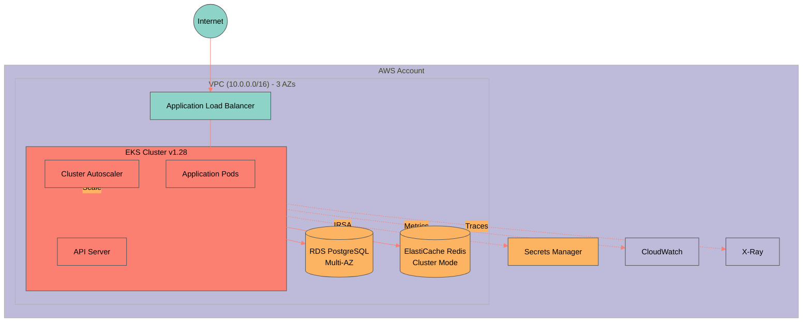

# EKS Production Deployment

Complete guide to deploying mcp-server-langgraph on AWS EKS with production-grade infrastructure, security, and observability.

## Overview

This deployment achieves **96/100 infrastructure maturity** with:

<CardGroup cols={2}>
  <Card title="Infrastructure as Code" icon="code">
    Terraform modules for VPC, EKS, RDS, ElastiCache
  </Card>
  <Card title="High Availability" icon="server">
    Multi-AZ across all services with automatic failover
  </Card>
  <Card title="Security First" icon="shield-halved">
    IRSA, encryption everywhere, network isolation
  </Card>
  <Card title="Cost Optimized" icon="dollar-sign">
    ~$803/month (60% savings vs. defaults)
  </Card>
</CardGroup>

### What You'll Deploy



---

## Prerequisites

<Steps>
  <Step title="AWS Account Setup">
    <Check>AWS account with admin access</Check>
    <Check>AWS CLI installed and configured (`aws configure`)</Check>
    <Check>Account limits: 5 VPCs, 20 EIPs, 100 security groups per region</Check>
  </Step>

  <Step title="Local Tools">
    ```bash
    # Install required tools
    brew install terraform kubectl awscli

    # Verify versions
    terraform version  # >= 1.5.0
    kubectl version --client  # >= 1.27.0
    aws --version  # >= 2.13.0
    ```
  </Step>

  <Step title="Repository">
    ```bash
    git clone https://github.com/vishnu2kmohan/mcp-server-langgraph
    cd mcp-server-langgraph
    ```
  </Step>
</Steps>

---

## Deployment Architecture

### Infrastructure Layers

<Tabs>
  <Tab title="Layer 1: Networking">
    **VPC Module** (`terraform/modules/vpc`)

    - 3 Availability Zones (us-east-1a/b/c)
    - Public subnets (/20) for load balancers
    - Private subnets (/18) for workloads
    - NAT Gateways (multi-AZ)
    - VPC Endpoints (S3, ECR, CloudWatch)
    - VPC Flow Logs

    **Capacity**: 16,384 IPs per private subnet (~300 EKS nodes per AZ)
  </Tab>

  <Tab title="Layer 2: Compute">
    **EKS Module** (`terraform/modules/eks`)

    **Control Plane**:
    - Kubernetes 1.28
    - Multi-AZ (AWS managed)
    - All 5 log types enabled
    - KMS encryption for secrets

    **Node Groups**:
    1. **General**: t3.xlarge, 2-10 nodes, on-demand
    2. **Compute**: c6i.4xlarge, 0-20 nodes, on-demand
    3. **Spot**: mixed types, 0-10 nodes, 70-90% savings

    **Addons**:
    - VPC CNI with IRSA
    - CoreDNS
    - kube-proxy
    - EBS CSI Driver
  </Tab>

  <Tab title="Layer 3: Data">
    **RDS Module** (`terraform/modules/rds`)

    - PostgreSQL 15.4
    - db.t3.medium Multi-AZ
    - 100 GB gp3 storage (auto-scaling to 1 TB)
    - 30-day backup retention
    - Performance Insights
    - CloudWatch alarms

    **ElastiCache Module** (`terraform/modules/elasticache`)

    - Redis 7.0
    - cache.r6g.large nodes
    - Standard mode (2 nodes) or Cluster mode (9 nodes)
    - Multi-AZ with automatic failover
    - 7-day snapshot retention
  </Tab>

  <Tab title="Layer 4: Security">
    **IAM & Encryption**:
    - IRSA for pod-to-AWS authentication
    - KMS encryption for secrets, RDS, ElastiCache
    - No long-lived IAM keys in pods
    - IAM roles with least-privilege policies

    **Network Security**:
    - Private subnets only (no public IPs on pods)
    - Security groups with minimal ingress
    - VPC endpoints for AWS API calls
    - Network policies for pod-to-pod traffic
  </Tab>
</Tabs>

---

## Step-by-Step Deployment

### Phase 1: Terraform Backend (5 minutes)

<Steps>
  <Step title="Initialize backend">
    ```bash
    cd terraform/backend-setup
    ```

    Edit `variables.tf` or create `terraform.tfvars`:
    ```hcl
    project_name = "mcp-langgraph"
    environment  = "prod"
    region       = "us-east-1"
    ```
  </Step>

  <Step title="Deploy backend">
    ```bash
    terraform init
    terraform plan
    terraform apply
    ```

    **Creates**:
    - S3 bucket: `mcp-langgraph-terraform-state-prod`
    - DynamoDB table: `mcp-langgraph-terraform-lock-prod`
    - Access logging bucket
  </Step>

  <Step title="Note outputs">
    ```bash
    terraform output
    ```

    Save the S3 bucket name and DynamoDB table name for next phase.
  </Step>
</Steps>

### Phase 2: Infrastructure Deployment (20-25 minutes)

<Steps>
  <Step title="Configure environment">
    ```bash
    cd ../../environments/prod
    ```

    Create `terraform.tfvars`:
    ```hcl
    # Project configuration
    project_name = "mcp-langgraph"
    environment  = "prod"
    region       = "us-east-1"

    # VPC configuration
    vpc_cidr           = "10.0.0.0/16"
    availability_zones = ["us-east-1a", "us-east-1b", "us-east-1c"]
    single_nat_gateway = false  # Multi-AZ NAT for HA

    # EKS configuration
    cluster_name       = "mcp-langgraph-prod"
    kubernetes_version = "1.28"

    # Node groups
    enable_general_node_group       = true
    general_node_group_desired_size = 3
    general_node_group_min_size     = 2
    general_node_group_max_size     = 10
    general_node_group_instance_types = ["t3.xlarge"]

    enable_spot_node_group       = true
    spot_node_group_desired_size = 2

    # RDS configuration
    rds_instance_class         = "db.t3.medium"
    rds_allocated_storage      = 100
    rds_multi_az               = true
    rds_backup_retention_days  = 30

    # ElastiCache configuration
    elasticache_node_type            = "cache.r6g.large"
    elasticache_cluster_mode_enabled = false  # Standard mode
    elasticache_num_cache_nodes      = 2

    # IRSA
    create_application_irsa_role = true
    application_service_account_name = "mcp-server-langgraph"
    application_service_account_namespace = "mcp-server-langgraph"

    tags = {
      Environment = "production"
      ManagedBy   = "terraform"
      Project     = "mcp-langgraph"
    }
    ```
  </Step>

  <Step title="Initialize Terraform">
    ```bash
    terraform init \
      -backend-config="bucket=mcp-langgraph-terraform-state-prod" \
      -backend-config="key=prod/terraform.tfstate" \
      -backend-config="region=us-east-1" \
      -backend-config="dynamodb_table=mcp-langgraph-terraform-lock-prod"
    ```
  </Step>

  <Step title="Plan deployment">
    ```bash
    terraform plan -out=tfplan
    ```

    **Review**:
    - ~50 resources will be created
    - VPC, subnets, NAT gateways
    - EKS cluster and node groups
    - RDS instance
    - ElastiCache cluster
    - IAM roles and policies
  </Step>

  <Step title="Deploy infrastructure">
    ```bash
    terraform apply tfplan
    ```

    **Duration**: 20-25 minutes
    - VPC: ~2 minutes
    - EKS control plane: ~10 minutes
    - Node groups: ~8 minutes
    - RDS Multi-AZ: ~12 minutes (parallel with EKS)
    - ElastiCache: ~5 minutes (parallel with EKS)
  </Step>

  <Step title="Save outputs">
    ```bash
    terraform output > outputs.txt

    # Important outputs:
    terraform output -raw cluster_endpoint
    terraform output -raw cluster_certificate_authority_data
    terraform output -raw application_irsa_role_arn
    terraform output -raw db_instance_endpoint
    terraform output -raw elasticache_configuration_endpoint
    ```
  </Step>
</Steps>

### Phase 3: Kubernetes Configuration (10 minutes)

<Steps>
  <Step title="Configure kubectl">
    ```bash
    aws eks update-kubeconfig \
      --region us-east-1 \
      --name mcp-langgraph-prod \
      --alias mcp-prod

    # Verify connection
    kubectl get nodes
    kubectl get pods -A
    ```
  </Step>

  <Step title="Create namespace">
    ```bash
    kubectl create namespace mcp-server-langgraph

    # Apply Pod Security Standards
    kubectl label namespace mcp-server-langgraph \
      pod-security.kubernetes.io/enforce=restricted \
      pod-security.kubernetes.io/audit=restricted \
      pod-security.kubernetes.io/warn=restricted
    ```
  </Step>

  <Step title="Create service account with IRSA">
    ```yaml
    # k8s/service-account.yaml
    apiVersion: v1
    kind: ServiceAccount
    metadata:
      name: mcp-server-langgraph
      namespace: mcp-server-langgraph
      annotations:
        eks.amazonaws.com/role-arn: arn:aws:iam::ACCOUNT_ID:role/mcp-langgraph-prod-application
    ```

    ```bash
    kubectl apply -f k8s/service-account.yaml
    ```
  </Step>

  <Step title="Create database secrets">
    ```bash
    # Get RDS password from Terraform output
    DB_PASSWORD=$(terraform output -raw db_instance_password)
    DB_ENDPOINT=$(terraform output -raw db_instance_endpoint)

    kubectl create secret generic database-credentials \
      --namespace=mcp-server-langgraph \
      --from-literal=host=$DB_ENDPOINT \
      --from-literal=port=5432 \
      --from-literal=database=mcp_langgraph \
      --from-literal=username=mcp_langgraph \
      --from-literal=password=$DB_PASSWORD
    ```
  </Step>

  <Step title="Create Redis secrets">
    ```bash
    REDIS_ENDPOINT=$(terraform output -raw elasticache_configuration_endpoint)
    REDIS_AUTH_TOKEN=$(terraform output -raw elasticache_auth_token)

    kubectl create secret generic redis-credentials \
      --namespace=mcp-server-langgraph \
      --from-literal=host=$REDIS_ENDPOINT \
      --from-literal=port=6379 \
      --from-literal=auth-token=$REDIS_AUTH_TOKEN
    ```
  </Step>
</Steps>

### Phase 4: Deploy Application (5 minutes)

<Steps>
  <Step title="Build and push container image">
    ```bash
    # Authenticate to ECR
    aws ecr get-login-password --region us-east-1 | \
      docker login --username AWS --password-stdin ACCOUNT_ID.dkr.ecr.us-east-1.amazonaws.com

    # Build image
    docker build -t mcp-server-langgraph:v1.0.0 .

    # Tag for ECR
    docker tag mcp-server-langgraph:v1.0.0 \
      ACCOUNT_ID.dkr.ecr.us-east-1.amazonaws.com/mcp-server-langgraph:v1.0.0

    # Push to ECR
    docker push ACCOUNT_ID.dkr.ecr.us-east-1.amazonaws.com/mcp-server-langgraph:v1.0.0
    ```
  </Step>

  <Step title="Deploy using Kustomize">
    ```bash
    kubectl apply -k deployments/kubernetes/overlays/production-eks
    ```

    **Or manually**:
    ```bash
    kubectl apply -f k8s/deployment.yaml
    kubectl apply -f k8s/service.yaml
    kubectl apply -f k8s/ingress.yaml
    ```
  </Step>

  <Step title="Verify deployment">
    ```bash
    # Check pod status
    kubectl get pods -n mcp-server-langgraph

    # Check logs
    kubectl logs -f deployment/mcp-server-langgraph -n mcp-server-langgraph

    # Check IRSA
    kubectl describe pod POD_NAME -n mcp-server-langgraph | grep "AWS_ROLE_ARN"
    ```
  </Step>

  <Step title="Verify database connection">
    ```bash
    kubectl exec -it deployment/mcp-server-langgraph -n mcp-server-langgraph -- \
      psql -h $DB_ENDPOINT -U mcp_langgraph -d mcp_langgraph -c "SELECT version();"
    ```
  </Step>
</Steps>

### Phase 5: Monitoring & Auto-scaling (10 minutes)

<Steps>
  <Step title="Deploy Cluster Autoscaler">
    ```bash
    kubectl apply -f https://raw.githubusercontent.com/kubernetes/autoscaler/master/cluster-autoscaler/cloudprovider/aws/examples/cluster-autoscaler-autodiscover.yaml

    # Annotate service account with IRSA role
    kubectl annotate serviceaccount cluster-autoscaler \
      -n kube-system \
      eks.amazonaws.com/role-arn=arn:aws:iam::ACCOUNT_ID:role/mcp-langgraph-prod-cluster-autoscaler

    # Set cluster name
    kubectl set image deployment cluster-autoscaler \
      -n kube-system \
      cluster-autoscaler=k8s.gcr.io/autoscaling/cluster-autoscaler:v1.28.0

    kubectl set env deployment/cluster-autoscaler \
      -n kube-system \
      AWS_REGION=us-east-1
    ```
  </Step>

  <Step title="Deploy Metrics Server">
    ```bash
    kubectl apply -f https://github.com/kubernetes-sigs/metrics-server/releases/latest/download/components.yaml

    # Verify
    kubectl get deployment metrics-server -n kube-system
    ```
  </Step>

  <Step title="Configure HPA">
    ```yaml
    apiVersion: autoscaling/v2
    kind: HorizontalPodAutoscaler
    metadata:
      name: mcp-server-langgraph
      namespace: mcp-server-langgraph
    spec:
      scaleTargetRef:
        apiVersion: apps/v1
        kind: Deployment
        name: mcp-server-langgraph
      minReplicas: 3
      maxReplicas: 20
      metrics:
      - type: Resource
        resource:
          name: cpu
          target:
            type: Utilization
            averageUtilization: 70
      - type: Resource
        resource:
          name: memory
          target:
            type: Utilization
            averageUtilization: 80
    ```

    ```bash
    kubectl apply -f k8s/hpa.yaml
    ```
  </Step>

  <Step title="Configure CloudWatch Container Insights">
    ```bash
    # Deploy Fluent Bit
    kubectl apply -f https://raw.githubusercontent.com/aws-samples/amazon-cloudwatch-container-insights/latest/k8s-deployment-manifest-templates/deployment-mode/daemonset/container-insights-monitoring/quickstart/cwagent-fluent-bit-quickstart.yaml

    # Verify
    kubectl get pods -n amazon-cloudwatch
    ```
  </Step>
</Steps>

---

## Production Checklist

<AccordionGroup>
  <Accordion title="Security">
    <Check>IRSA configured for all service accounts (no IAM keys)</Check>
    <Check>Secrets stored in AWS Secrets Manager (not in code)</Check>
    <Check>Network policies applied for pod-to-pod traffic</Check>
    <Check>Pod Security Standards enforced (restricted)</Check>
    <Check>RDS and ElastiCache in private subnets only</Check>
    <Check>Encryption enabled for all data at rest (KMS)</Check>
    <Check>TLS enforced for all in-transit data</Check>
    <Check>Security groups follow least-privilege principle</Check>
    <Check>CloudTrail enabled for audit logging</Check>
    <Check>MFA required for AWS console access</Check>
  </Accordion>

  <Accordion title="High Availability">
    <Check>Multi-AZ deployment for all services</Check>
    <Check>RDS Multi-AZ with automatic failover</Check>
    <Check>ElastiCache Multi-AZ with automatic failover</Check>
    <Check>At least 2 replicas for application pods</Check>
    <Check>Pod Disruption Budgets configured</Check>
    <Check>Topology spread constraints configured</Check>
    <Check>Health checks configured (liveness/readiness probes)</Check>
    <Check>Load balancer health checks configured</Check>
  </Accordion>

  <Accordion title="Monitoring & Observability">
    <Check>CloudWatch Container Insights enabled</Check>
    <Check>CloudWatch alarms for RDS (CPU, memory, storage, connections)</Check>
    <Check>CloudWatch alarms for ElastiCache (CPU, memory, evictions)</Check>
    <Check>CloudWatch alarms for EKS (node health, pod restarts)</Check>
    <Check>X-Ray tracing configured for distributed tracing</Check>
    <Check>Application logs shipped to CloudWatch Logs</Check>
    <Check>Metrics Server deployed for HPA</Check>
    <Check>Cluster Autoscaler deployed and configured</Check>
  </Accordion>

  <Accordion title="Backup & Disaster Recovery">
    <Check>RDS automated backups enabled (30-day retention)</Check>
    <Check>RDS final snapshot on deletion enabled</Check>
    <Check>ElastiCache automated snapshots enabled (7-day retention)</Check>
    <Check>Terraform state versioning enabled in S3</Check>
    <Check>Terraform state encrypted with KMS</Check>
    <Check>Disaster recovery runbook documented</Check>
    <Check>RTO/RPO targets defined</Check>
    <Check>Backup restore procedures tested</Check>
  </Accordion>

  <Accordion title="Cost Optimization">
    <Check>Spot instances configured for fault-tolerant workloads</Check>
    <Check>Cluster Autoscaler removing idle nodes</Check>
    <Check>HPA scaling pods based on utilization</Check>
    <Check>VPC endpoints configured (save 70% on data transfer)</Check>
    <Check>RDS storage auto-scaling enabled</Check>
    <Check>CloudWatch Logs retention configured (not infinite)</Check>
    <Check>Cost allocation tags applied to all resources</Check>
    <Check>AWS Cost Explorer monitoring enabled</Check>
  </Accordion>
</AccordionGroup>

---

## Post-Deployment Operations

### Accessing the Cluster

```bash
# Configure kubectl
aws eks update-kubeconfig --region us-east-1 --name mcp-langgraph-prod

# Get cluster info
kubectl cluster-info

# Get nodes
kubectl get nodes -o wide

# Get all resources
kubectl get all -A
```

### Viewing Logs

```bash
# Application logs
kubectl logs -f deployment/mcp-server-langgraph -n mcp-server-langgraph

# System logs (control plane)
# Available in CloudWatch Logs: /aws/eks/mcp-langgraph-prod/cluster

# Node logs
kubectl logs -n kube-system -l k8s-app=aws-node
```

### Scaling

```bash
# Manual pod scaling
kubectl scale deployment mcp-server-langgraph -n mcp-server-langgraph --replicas=5

# Manual node scaling (via Terraform)
# Edit terraform.tfvars:
general_node_group_desired_size = 5
terraform apply

# View HPA status
kubectl get hpa -n mcp-server-langgraph

# View Cluster Autoscaler logs
kubectl logs -f deployment/cluster-autoscaler -n kube-system
```

### Updating

```bash
# Update application
kubectl set image deployment/mcp-server-langgraph \
  -n mcp-server-langgraph \
  mcp-server-langgraph=ACCOUNT_ID.dkr.ecr.us-east-1.amazonaws.com/mcp-server-langgraph:v1.1.0

# Rollback
kubectl rollout undo deployment/mcp-server-langgraph -n mcp-server-langgraph

# Check rollout status
kubectl rollout status deployment/mcp-server-langgraph -n mcp-server-langgraph
```

---

## Troubleshooting

See [EKS Runbooks](/deployment/operations/eks-runbooks) for detailed troubleshooting procedures.

**Common issues**:

<AccordionGroup>
  <Accordion title="Pods pending with 'Insufficient CPU'">
    **Cause**: Not enough node capacity

    **Solution**: Cluster Autoscaler will add nodes automatically. Check:
    ```bash
    kubectl describe pods -n mcp-server-langgraph
    kubectl logs -f deployment/cluster-autoscaler -n kube-system
    ```
  </Accordion>

  <Accordion title="Can't pull images from ECR">
    **Cause**: Missing VPC CNI IRSA permissions

    **Solution**:
    ```bash
    kubectl describe daemonset aws-node -n kube-system | grep role-arn
    # Should show IRSA annotation
    ```
  </Accordion>

  <Accordion title="Can't access Secrets Manager">
    **Cause**: Missing IRSA role or incorrect ARN

    **Solution**:
    ```bash
    kubectl describe pod POD_NAME -n mcp-server-langgraph | grep AWS_ROLE_ARN
    # Should show: arn:aws:iam::ACCOUNT:role/mcp-langgraph-prod-application
    ```
  </Accordion>
</AccordionGroup>

---

## Cost Estimate

**Production deployment (~$803/month)**:

| Service | Configuration | Monthly Cost |
|---------|---------------|--------------|
| EKS Control Plane | 1 cluster | $73.00 |
| EC2 Instances | 3×t3.xlarge general nodes | $295.20 |
| EC2 Instances | 2×t3.large spot nodes | $14.60 |
| RDS PostgreSQL | db.t3.medium Multi-AZ | $157.56 |
| ElastiCache Redis | 2×cache.r6g.large | $109.50 |
| NAT Gateway | 3×Multi-AZ | $97.20 |
| VPC Endpoints | 6 endpoints | $21.60 |
| EBS Volumes | 5×100GB gp3 | $40.00 |
| CloudWatch | Logs + metrics | ~$15.00 |
| **Total** | | **~$823.66** |

<Tip>
**Cost Savings**: Enable spot instances, use single NAT gateway in dev/staging, right-size node types, enable Cluster Autoscaler.
</Tip>

---

## Related Documentation

<CardGroup cols={2}>
  <Card title="Terraform AWS" icon="code" href="/deployment/infrastructure/terraform-aws">
    Complete Terraform module documentation
  </Card>
  <Card title="EKS Runbooks" icon="book" href="/deployment/operations/eks-runbooks">
    Operational runbooks and troubleshooting
  </Card>
  <Card title="AWS Security Hardening" icon="shield-halved" href="/security/aws-security-hardening">
    Security configuration and best practices
  </Card>
  <Card title="Cost Optimization" icon="dollar-sign" href="/deployment/cost-optimization">
    AWS cost optimization strategies
  </Card>
</CardGroup>

---

## Next Steps

<Steps>
  <Step title="Deploy Production">
    Follow this guide to deploy your production environment
  </Step>

  <Step title="Configure Monitoring">
    Set up CloudWatch dashboards and alarms
  </Step>

  <Step title="Enable Auto-scaling">
    Configure Cluster Autoscaler and HPA
  </Step>

  <Step title="Harden Security">
    Follow AWS Security Hardening guide
  </Step>

  <Step title="Set Up CI/CD">
    Configure GitHub Actions for automated deployments
  </Step>
</Steps>
