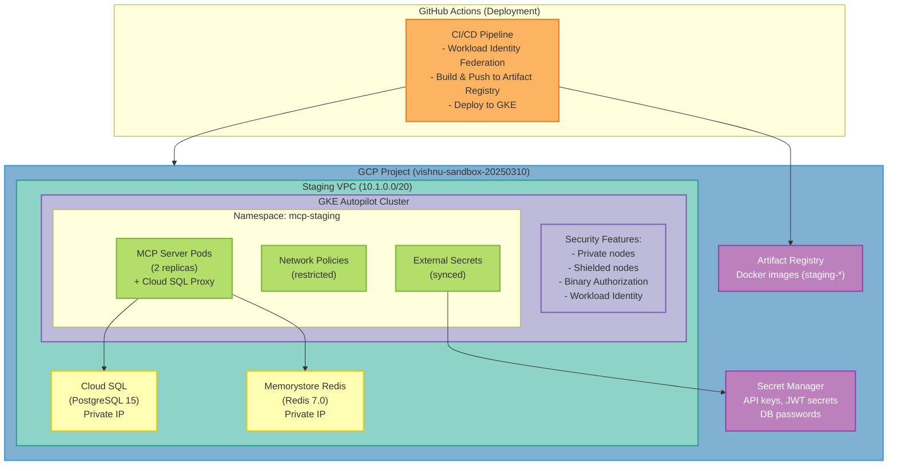

### Overview

This guide covers deploying the MCP Server to a production-grade staging environment on Google Kubernetes Engine (GKE) with:

- **🔒 Security Hardening**: Private nodes, Binary Authorization, Network Policies
- **🔑 Keyless Authentication**: Workload Identity Federation for GitHub Actions
- **🌐 Network Isolation**: Separate VPC from production
- **📊 Full Observability**: Cloud Logging, Monitoring, and Trace
- **🤖 Automated Deployments**: GitHub Actions with approval gates

<Info>
This is a production-ready staging environment suitable for pre-production testing and validation.
</Info>

### Architecture


### Prerequisites

- **GCP Project**: `vishnu-sandbox-20250310` (or your project ID)
- **gcloud CLI**: Installed and authenticated
- **kubectl**: Installed
- **GitHub Repository**: Access to repository settings

### Step 1: Infrastructure Setup

#### Automated Setup (Recommended)

Run the automated infrastructure setup script:

```bash
## Set your GCP project ID
export GCP_PROJECT_ID=vishnu-sandbox-20250310

## Run the setup script
./scripts/gcp/setup-staging-infrastructure.sh
```
This script will create:
- ✅ Staging VPC network (10.1.0.0/20)
- ✅ GKE Autopilot cluster with security hardening
- ✅ Cloud SQL PostgreSQL instance
- ✅ Memorystore Redis instance
- ✅ Workload Identity for pods
- ✅ GitHub Actions Workload Identity Federation
- ✅ Artifact Registry repository
- ✅ Secret Manager secrets

<Accordion title="Manual Infrastructure Setup (Advanced)">

If you prefer manual setup, follow these steps:

#### 1.1 Create VPC Network

```bash
## Create VPC
gcloud compute networks create staging-vpc \
  --subnet-mode=custom \
  --project=vishnu-sandbox-20250310

## Create subnet
gcloud compute networks subnets create staging-gke-subnet \
  --network=staging-vpc \
  --range=10.1.0.0/20 \
  --region=us-central1 \
  --secondary-range pods=10.2.0.0/16,services=10.3.0.0/16 \
  --enable-flow-logs \
  --enable-private-ip-google-access
```
#### 1.2 Create GKE Cluster

```bash
gcloud container clusters create-auto mcp-staging-cluster \
  --region=us-central1 \
  --network=staging-vpc \
  --subnetwork=staging-gke-subnet \
  --enable-private-nodes \
  --workload-pool=vishnu-sandbox-20250310.svc.id.goog \
  --enable-shielded-nodes \
  --shielded-secure-boot \
  --binauthz-evaluation-mode=PROJECT_SINGLETON_POLICY_ENFORCE
```
#### 1.3 Create Managed Services

See the [full setup script](https://github.com/vishnu2kmohan/mcp-server-langgraph/blob/main/scripts/gcp/setup-staging-infrastructure.sh) for complete Cloud SQL and Redis setup.

</Accordion>

#### Setup Output

After running the setup script, you'll receive:

```
━━━━━━━━━━━━━━━━━━━━━━━━━━━━━━━━━━━━━━━━━━━━━━━━━━━━━━━━━━━
Staging Infrastructure Setup Complete!
━━━━━━━━━━━━━━━━━━━━━━━━━━━━━━━━━━━━━━━━━━━━━━━━━━━━━━━━━━━

GitHub Actions Configuration:
  workload_identity_provider: 'projects/PROJECT_NUMBER/locations/global/...'
  service_account: 'mcp-staging-sa@vishnu-sandbox-20250310.iam.gserviceaccount.com'

Security Features Enabled:
  ✓ Private GKE nodes
  ✓ Shielded nodes with secure boot
  ✓ Binary authorization
  ✓ Workload Identity
  ✓ Network isolation (separate VPC)
```sql
**⚠️ Important**: Save the Workload Identity Provider value - you'll need it for GitHub Actions.

### Step 2: Update API Keys

Update the placeholder secrets with real API keys:

```

## Update Anthropic API key
echo -n "sk-ant-YOUR_REAL_KEY" | gcloud secrets versions add staging-anthropic-api-key --data-file=-

## Update Google API key
echo -n "YOUR_REAL_GOOGLE_KEY" | gcloud secrets versions add staging-google-api-key --data-file=-
```
### Step 3: Install External Secrets Operator

External Secrets Operator syncs secrets from GCP Secret Manager to Kubernetes:

```bash
## Install External Secrets Operator
helm repo add external-secrets https://charts.external-secrets.io
helm repo update

helm install external-secrets \
  external-secrets/external-secrets \
  --namespace external-secrets-system \
  --create-namespace \
  --set installCRDs=true
```
Verify installation:

```bash
kubectl get pods -n external-secrets-system
```

### Step 4: Configure GitHub Environment

#### 4.1 Create GitHub Environment

1. Go to your repository on GitHub
2. Navigate to **Settings** → **Environments**
3. Click **New environment**
4. Name it `staging`
5. Configure protection rules:

**Protection Rules:**
- ✅ **Required reviewers**: Add 1-2 reviewers
- ✅ **Wait timer**: 5 minutes (allows review before deployment)
- ✅ **Deployment branches**: `main`, `release/*`

#### 4.2 Update GitHub Workflow

Edit `.github/workflows/deploy-staging-gke.yaml` and replace `PROJECT_NUMBER` with your actual project number:

```yaml
## Get your project number:
gcloud projects describe vishnu-sandbox-20250310 --format="value(projectNumber)"

## Update these lines in the workflow:
workload_identity_provider: 'projects/YOUR_PROJECT_NUMBER/locations/global/workloadIdentityPools/github-actions-pool/providers/github-provider'
```
### Step 5: Deploy Application

#### First-Time Deployment (Manual)

For the first deployment, deploy manually to verify everything works:

```bash
## Get GKE credentials
gcloud container clusters get-credentials mcp-staging-cluster \
  --region=us-central1

## Verify connection
kubectl cluster-info

## Deploy application
kubectl apply -k deployments/overlays/staging-gke

## Watch deployment
kubectl rollout status deployment/staging-mcp-server-langgraph -n mcp-staging

## Verify pods
kubectl get pods -n mcp-staging
```
#### Automated Deployments (GitHub Actions)

Once manual deployment succeeds, GitHub Actions will handle future deployments:

**Triggered by:**
- ✅ Push to `main` branch
- ✅ Pre-release creation
- ✅ Manual workflow dispatch

**Deployment Flow:**
1. Build Docker image
2. Push to Artifact Registry
3. Deploy to GKE staging
4. Run smoke tests
5. Validate deployment
6. Auto-rollback on failure

### Step 6: Verify Deployment

#### Run Smoke Tests

```bash
./scripts/gcp/staging-smoke-tests.sh
```
Expected output:

```
━━━━━━━━━━━━━━━━━━━━━━━━━━━━━━━━━━━━━━━━━━━━━━━━━━━━━━━━
Smoke Test Summary
━━━━━━━━━━━━━━━━━━━━━━━━━━━━━━━━━━━━━━━━━━━━━━━━━━━━━━━━

Total Tests:  11
Passed:       11
Failed:       0

✓ All smoke tests passed!
```
#### Check Health Endpoints

```bash
## Port-forward to service
kubectl port-forward -n mcp-staging svc/staging-mcp-server-langgraph 8080:80

## Test endpoints
curl http://localhost:8080/health
curl http://localhost:8080/health/ready
curl http://localhost:8080/health/live
```
#### View Logs

**Cloud Logging** (recommended):

```bash
gcloud logging read \
  "resource.type=k8s_container
   resource.labels.cluster_name=mcp-staging-cluster
   resource.labels.namespace_name=mcp-staging" \
  --limit=50 \
  --format=json
```
**Kubectl logs**:

```bash
kubectl logs -n mcp-staging -l app=mcp-server-langgraph --tail=100
```
### Security Features

#### Network Isolation

- **Separate VPC**: Staging has its own VPC (10.1.0.0/20)
- **Network Policies**: Restrict pod-to-pod and egress traffic
- **Private GKE nodes**: Nodes have no public IP addresses

Verify network policies:

```bash
kubectl get networkpolicies -n mcp-staging
```
#### Workload Identity

Pods authenticate as GCP service accounts without keys:

```bash
## Verify Workload Identity annotation
kubectl describe sa mcp-server-langgraph -n mcp-staging | grep iam.gke.io

## Test from pod
kubectl run -it --rm test \
  --image=google/cloud-sdk:slim \
  --serviceaccount=mcp-server-langgraph \
  --namespace=mcp-staging \
  -- gcloud auth list
```
#### Binary Authorization

Only signed/approved images can be deployed:

```bash
## Check Binary Authorization status
gcloud container clusters describe mcp-staging-cluster \
  --region=us-central1 \
  --format='value(binaryAuthorization)'
```
#### Secret Management

Secrets are stored in GCP Secret Manager and synced via External Secrets:

```bash
## List secrets in Secret Manager
gcloud secrets list --filter="name:staging-*"

## View External Secrets sync status
kubectl get externalsecrets -n mcp-staging
```
### Monitoring & Observability

#### Cloud Console Dashboards

**Access monitoring in Cloud Console:**
- [Kubernetes Engine Workloads](https://console.cloud.google.com/kubernetes/workload?project=vishnu-sandbox-20250310)
- [Cloud Logging](https://console.cloud.google.com/logs?project=vishnu-sandbox-20250310)
- [Cloud Monitoring](https://console.cloud.google.com/monitoring?project=vishnu-sandbox-20250310)

#### Key Metrics

Monitor these metrics in Cloud Monitoring:

- `kubernetes.io/container/cpu/core_usage_time` - CPU usage
- `kubernetes.io/container/memory/used_bytes` - Memory usage
- `kubernetes.io/pod/network/received_bytes_count` - Network traffic
- Custom metrics: `custom.googleapis.com/mcp-staging/*`

#### Set Up Alerts

Create alert policies for:

```bash
## CPU usage > 80%
## Memory usage > 80%
## Pod restart count > 5
## Deployment replica mismatch
## Cloud SQL connection failures
```
### Troubleshooting

<AccordionGroup>
  <Accordion title="Pods not starting" icon="circle-exclamation">
    **Check pod status:**
    ```bash
    kubectl describe pod <pod-name> -n mcp-staging
    ```
    **Common issues:**
    - Image pull errors: Check Artifact Registry permissions
    - Cloud SQL proxy fails: Verify service account has `cloudsql.client` role
    - Secrets not found: Check External Secrets sync status
  </Accordion>

  <Accordion title="External Secrets not syncing" icon="shield-exclamation">
    **Check ExternalSecret status:**
    ```bash
    kubectl describe externalsecret mcp-staging-secrets -n mcp-staging
    ```
    **Common fixes:**
    - Verify Workload Identity binding
    - Check secret exists in Secret Manager
    - Ensure service account has `secretAccessor` role
  </Accordion>

  <Accordion title="Cloud SQL connection fails" icon="database">
    **Check Cloud SQL proxy logs:**
    ```bash
    kubectl logs -n mcp-staging <pod-name> -c cloud-sql-proxy
    ```
    **Verify connection:**
    ```bash
    # From inside pod
    kubectl exec -it <pod-name> -n mcp-staging -- \
      nc -zv 127.0.0.1 5432
    ```
  </Accordion>

  <Accordion title="Network policies blocking traffic" icon="network-wired">
    **List network policies:**
    ```bash
    kubectl get networkpolicies -n mcp-staging
    ```
    **Temporarily disable for testing:**
    ```bash
    kubectl delete networkpolicy <policy-name> -n mcp-staging
    # Re-apply when done testing
    ```
  </Accordion>
</AccordionGroup>

### Rollback Procedures

#### Automatic Rollback

GitHub Actions automatically rolls back on deployment failure.

#### Manual Rollback

```bash
## Rollback to previous version
kubectl rollout undo deployment/staging-mcp-server-langgraph -n mcp-staging

## Rollback to specific revision
kubectl rollout history deployment/staging-mcp-server-langgraph -n mcp-staging
kubectl rollout undo deployment/staging-mcp-server-langgraph -n mcp-staging --to-revision=3

## Verify rollback
kubectl rollout status deployment/staging-mcp-server-langgraph -n mcp-staging
```
### Cost Optimization

#### Current Costs (Estimated)

| Resource | Tier | Monthly Cost |
|----------|------|--------------|
| GKE Autopilot | 2-3 pods avg | ~$100 |
| Cloud SQL | db-custom-1-4096 | ~$40 |
| Memorystore Redis | 2GB standard | ~$50 |
| Networking | VPC, egress | ~$20 |
| **Total** | | **~$210/month** |

#### Optimization Tips

<CardGroup cols={2}>
  <Card title="Use Autopilot" icon="wand-magic-sparkles">
    GKE Autopilot optimizes resource usage automatically. You only pay for pod resources, not node overhead.
  </Card>

  <Card title="Rightsize Resources" icon="gauge">
    Review resource requests/limits:
    ```bash
    kubectl top pods -n mcp-staging
    ```
    Adjust in `deployment-patch.yaml` if needed.
  </Card>

  <Card title="Use Preemptible Nodes" icon="dollar-sign">
    Not recommended for staging, but possible for dev environments.
  </Card>

  <Card title="Monitor Egress" icon="cloud-arrow-down">
    Excessive egress to LLM APIs can increase costs. Consider:
    - Caching responses
    - Request batching
    - Rate limiting
  </Card>
</CardGroup>

### Next Steps

<CardGroup cols={2}>
  <Card title="Production Deployment" icon="rocket" href="/deployment/kubernetes/gke">
    Deploy to production GKE
  </Card>

  <Card title="Monitoring Setup" icon="chart-line" href="/deployment/monitoring">
    Advanced monitoring and alerting
  </Card>

  <Card title="Disaster Recovery" icon="life-ring" href="/deployment/disaster-recovery">
    Backup and recovery procedures
  </Card>

  <Card title="CI/CD Guide" icon="code-branch" href="/reference/development/ci-cd">
    Complete CI/CD pipeline documentation
  </Card>
</CardGroup>

---

<Check>
**Staging Deployment Complete!** Your production-grade staging environment is ready for testing.
</Check>
