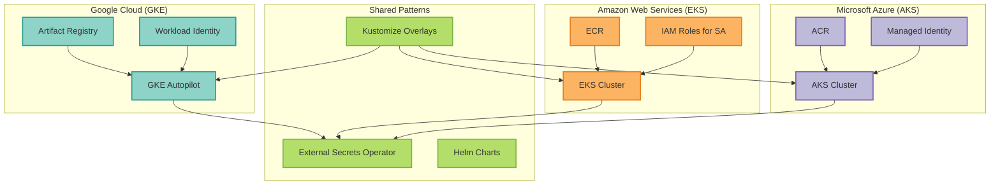

# EKS and AKS Deployment Guide - Lessons from GKE

This document provides comprehensive guidance for deploying to AWS EKS and Azure AKS, incorporating all lessons learned from GKE deployment troubleshooting to prevent similar issues.



## Table of Contents

- [Overview](#overview)
- [Critical Lessons from GKE](#critical-lessons-from-gke)
- [EKS Deployment Guide](#eks-deployment-guide)
- [AKS Deployment Guide](#aks-deployment-guide)
- [Common Kubernetes Issues](#common-kubernetes-issues)
- [Prevention Checklist](#prevention-checklist)

---

## Overview

This guide ensures that the 11 issues encountered during GKE deployment **do not occur** on EKS or AKS deployments.

### GKE Issues Resolved

1. ✅ Pre-commit Python version mismatch (3.11 vs 3.12)
2. ✅ Docker build disk space exhaustion
3. ✅ External Secrets Operator CRD API version mismatch (v1beta1 vs v1)
4. ✅ RBAC permission denied errors (unused Role/RoleBinding resources)
5. ✅ GKE Autopilot CPU constraints (pod anti-affinity requires 500m minimum)
6. ✅ Environment variable value/valueFrom conflict (Kustomize merge issue)
7. ✅ Client-side vs server-side kubectl validation (CRDs not recognized)
8. ✅ Namespace creation ordering (must exist before resources)
9. ✅ ConfigMap generator behavior (create vs merge)
10. ✅ External Secrets Operator installation permissions
11. ✅ Unused RBAC resources requiring elevated IAM permissions

---

## Critical Lessons from GKE

### 1. **kubectl Validation: Always Use Server-Side Dry-Run**

❌ **WRONG** (Client-side - doesn't see CRDs):
```
- name: Validate manifests
  run: |
    kubectl apply --dry-run=client -f /tmp/manifests.yaml
```
✅ **CORRECT** (Server-side - validates against actual cluster):
```
- name: Validate manifests
  run: |
    kubectl apply --dry-run=server -f /tmp/manifests.yaml
```

**Why**: Client-side validation only uses kubectl's built-in schemas. It cannot validate:
- Custom Resource Definitions (CRDs)
- External Secrets Operator resources
- Any custom operators

**Applies to**: ✅ EKS, ✅ AKS, ✅ All Kubernetes platforms

---

### 2. **External Secrets Operator: Check API Version**

❌ **WRONG** (Assumes v1beta1):
```yaml
apiVersion: external-secrets.io/v1beta1
kind: ExternalSecret
```
✅ **CORRECT** (Verify installed version first):
```bash
# Check what version is installed
kubectl api-resources | grep externalsecret

# If output shows 'v1', use:
apiVersion: external-secrets.io/v1
kind: ExternalSecret
```

**Prevention**:
1. Always check installed CRD version: `kubectl api-resources | grep <resource-type>`
2. Match manifest API version to cluster API version
3. ESO v0.9+ uses `v1` (not `v1beta1`)

**Applies to**: ✅ EKS, ✅ AKS (if using External Secrets Operator)

---

### 3. **Environment Variables: Use ConfigMap Patches, Not Deployment Values**

❌ **WRONG** (Creates value/valueFrom conflict):
```yaml
# deployment-patch.yaml
env:
- name: LLM_PROVIDER
  value: "google"  # ❌ Conflicts if base uses valueFrom
```
✅ **CORRECT** (Override ConfigMap data):
```yaml
# configmap-patch.yaml
data:
  llm_provider: "google"  # ✅ Properly overrides base ConfigMap
```

**Why**: When base deployment uses `valueFrom: configMapKeyRef` and overlay adds `value:`, Kustomize merges both creating invalid Kubernetes manifest (cannot have both `value` and `valueFrom`).

**Applies to**: ✅ EKS, ✅ AKS, ✅ All Kustomize-based deployments

---

### 4. **RBAC Resources: Remove Unused Kubernetes RBAC**

❌ **WRONG** (Include unused RBAC resources):
```yaml
# deployments/base/serviceaccount.yaml
---
apiVersion: rbac.authorization.k8s.io/v1
kind: Role
metadata:
  name: mcp-server-langgraph
rules:
- apiGroups: [""]
  resources: ["configmaps", "secrets"]
  verbs: ["get", "list", "watch"]
---
apiVersion: rbac.authorization.k8s.io/v1
kind: RoleBinding
# ...
```
**Problem**: If application doesn't use Kubernetes API, these resources:
- Require elevated IAM permissions to deploy (container.admin, EKS Cluster Admin, AKS RBAC Admin)
- Violate least privilege principle
- Increase attack surface

✅ **CORRECT** (Only include ServiceAccount):
```yaml
# deployments/base/serviceaccount.yaml
apiVersion: v1
kind: ServiceAccount
metadata:
  name: mcp-server-langgraph
  annotations:
    # Platform-specific workload identity annotations
    iam.gke.io/gcp-service-account: SA@PROJECT.iam.gserviceaccount.com
    eks.amazonaws.com/role-arn: arn:aws:iam::ACCOUNT:role/ROLE
    azure.workload.identity/client-id: "CLIENT_ID"
```

**Why**:
- Application uses External Secrets Operator (ESO handles secret access)
- Application doesn't use Kubernetes API directly
- No need for in-cluster RBAC permissions

**How to Verify**:
1. Search codebase for `kubernetes.client` or `@kubernetes/client-node`
2. If not found, remove Role and RoleBinding
3. Keep only ServiceAccount with workload identity annotations

**IAM Permissions Required** (after RBAC removal):
- **GCP**: `roles/container.developer` (sufficient for workload deployment)
- **AWS**: `AmazonEKSWorkerNodePolicy` + ECR access
- **Azure**: `Azure Kubernetes Service Cluster User Role`

**Applies to**: ✅ EKS, ✅ AKS, ✅ All platforms (universal best practice)

---

### 5. **Namespace Creation: Always Create Before Validation**

❌ **WRONG** (Namespace created during deployment):
```
- name: Deploy
  run: |
    kubectl create namespace staging-mcp-server-langgraph
    kubectl apply -k deployments/overlays/staging
```
✅ **CORRECT** (Namespace created before validation):
```
- name: Create namespace
  run: |
    kubectl create namespace staging-mcp-server-langgraph --dry-run=client -o yaml | kubectl apply -f -

- name: Validate manifests
  run: |
    kubectl apply --dry-run=server -f /tmp/manifests.yaml

- name: Deploy
  run: |
    kubectl apply -k deployments/overlays/staging
```

**Why**:
- Enables rollback (namespace exists even if deployment fails)
- Allows validation to succeed (resources reference the namespace)
- Idempotent (`--dry-run=client -o yaml | kubectl apply` won't fail if exists)

**Applies to**: ✅ EKS, ✅ AKS, ✅ All Kubernetes platforms

---

### 6. **Managed Kubernetes CPU/Memory Constraints**

**GKE Autopilot**:
- Minimum 500m CPU when using pod anti-affinity
- Minimum 250m CPU otherwise
- Validates via admission webhook (GKE Warden)

**EKS Fargate**:
- Minimum 250m CPU
- CPU/memory must match specific combinations
- Validates at pod scheduling time

**AKS**:
- More flexible, but validate resource quotas
- Check node pool constraints

**Prevention**:
```yaml
# Always set explicit resource requests/limits
resources:
  requests:
    cpu: 500m  # Safe minimum for all platforms
    memory: 512Mi
  limits:
    cpu: 1000m
    memory: 1Gi
```
**Applies to**: ✅ EKS (Fargate), ✅ AKS, ✅ All managed Kubernetes

---

## EKS Deployment Guide

### Prerequisites

1. **AWS IAM Configuration**:
   ```bash
   # Create OIDC provider for GitHub Actions
   aws iam create-open-id-connect-provider \
     --url https://token.actions.githubusercontent.com \
     --client-id-list sts.amazonaws.com

   # Create IAM role for GitHub Actions
   aws iam create-role \
     --role-name github-actions-eks-deploy \
     --assume-role-policy-document file://trust-policy.json

   # Attach required policies
   aws iam attach-role-policy \
     --role-name github-actions-eks-deploy \
     --policy-arn arn:aws:iam::aws:policy/AmazonEKSClusterPolicy
   ```

2. **IRSA (IAM Roles for Service Accounts)**:
   ```bash
   # Create IAM role for application pods
   eksctl create iamserviceaccount \
     --name=mcp-server-langgraph \
     --namespace=mcp-staging \
     --cluster=staging-mcp-server-langgraph-gke \
     --attach-policy-arn=arn:aws:iam::aws:policy/AmazonS3ReadOnlyAccess \
     --approve
   ```

3. **External Secrets Operator**:
   ```bash
   # Install ESO with Helm
   helm repo add external-secrets https://charts.external-secrets.io
   helm upgrade --install external-secrets \
     external-secrets/external-secrets \
     --namespace external-secrets-system \
     --create-namespace \
     --set installCRDs=true
   ```

### Workflow Template (`.github/workflows/deploy-staging-eks.yaml`)

```yaml
name: Deploy to EKS Staging

on:
  push:
    branches: [main]
  workflow_dispatch:

permissions:
  contents: read
  id-token: write

env:
  AWS_REGION: us-east-1
  EKS_CLUSTER: staging-mcp-server-langgraph-gke
  NAMESPACE: mcp-staging
  DEPLOYMENT_NAME: staging-mcp-server-langgraph

jobs:
  deploy-staging:
    name: Deploy to EKS Staging
    runs-on: ubuntu-latest
    steps:
      - name: Checkout code
        uses: actions/checkout@v5

      # Authenticate to AWS
      - name: Configure AWS credentials
        uses: aws-actions/configure-aws-credentials@v4
        with:
          role-to-assume: arn:aws:iam::ACCOUNT_ID:role/github-actions-eks-deploy
          aws-region: ${{ env.AWS_REGION }}

      # Get EKS credentials
      - name: Get EKS kubeconfig
        run: |
          aws eks update-kubeconfig \
            --name ${{ env.EKS_CLUSTER }} \
            --region ${{ env.AWS_REGION }}

      # Verify cluster access
      - name: Verify cluster access
        run: |
          kubectl cluster-info
          kubectl get nodes

      # Install kustomize
      - name: Install kustomize
        run: |
          curl -s "https://raw.githubusercontent.com/kubernetes-sigs/kustomize/master/hack/install_kustomize.sh" | bash
          sudo mv kustomize /usr/local/bin/
          kustomize version

      # CRITICAL: Verify External Secrets Operator
      - name: Verify External Secrets Operator
        run: |
          echo "Verifying External Secrets Operator..."
          kubectl get deployment -n external-secrets-system external-secrets

          # Check API version
          ESO_VERSION=$(kubectl api-resources | grep "externalsecrets " | awk '{print $3}')
          echo "ESO API version: $ESO_VERSION"

          # Verify CRDs
          kubectl get crd externalsecrets.external-secrets.io
          kubectl get crd secretstores.external-secrets.io
          kubectl get crd clustersecretstores.external-secrets.io

      # CRITICAL: Create namespace before validation
      - name: Create namespace
        run: |
          kubectl create namespace ${{ env.NAMESPACE }} --dry-run=client -o yaml | kubectl apply -f -
          echo "✓ Namespace created/verified"

      # Update image tag
      - name: Update image tag
        working-directory: deployments/overlays/staging-eks
        run: |
          kustomize edit set image \
            mcp-server-langgraph=ACCOUNT_ID.dkr.ecr.us-east-1.amazonaws.com/mcp-staging:${{ github.sha }}

      # CRITICAL: Use server-side validation
      - name: Validate manifests
        run: |
          echo "Validating manifests..."
          kubectl kustomize deployments/overlays/staging-eks > /tmp/staging-manifests.yaml
          kubectl apply --dry-run=server -f /tmp/staging-manifests.yaml

      # Deploy
      - name: Deploy to staging
        run: |
          kubectl apply -k deployments/overlays/staging-eks

      # Wait for rollout
      - name: Wait for rollout
        run: |
          kubectl rollout status deployment/${{ env.DEPLOYMENT_NAME }} \
            -n ${{ env.NAMESPACE }} \
            --timeout=10m
```

**Key Differences from GKE**:
- Authentication: `configure-aws-credentials` instead of `google-github-actions/auth`
- Kubeconfig: `aws eks update-kubeconfig` instead of `get-gke-credentials`
- Image registry: ECR instead of Artifact Registry
- ServiceAccount annotation: `eks.amazonaws.com/role-arn` instead of `iam.gke.io/gcp-service-account`

**Same Critical Patterns** (from GKE fixes):
- ✅ Server-side validation (`--dry-run=server`)
- ✅ Namespace creation before validation
- ✅ ESO verification (not installation)
- ✅ Kustomize installation

---

## AKS Deployment Guide

### Prerequisites

1. **Azure Workload Identity**:
   ```bash
   # Create managed identity
   az identity create \
     --name mcp-server-langgraph \
     --resource-group mcp-staging-rg

   # Create federated credential for GitHub Actions
   az identity federated-credential create \
     --name github-actions-federated \
     --identity-name mcp-server-langgraph \
     --resource-group mcp-staging-rg \
     --issuer https://token.actions.githubusercontent.com \
     --subject repo:OWNER/REPO:ref:refs/heads/main \
     --audience api://AzureADTokenExchange
   ```

2. **RBAC Permissions**:
   ```bash
   # Grant AKS cluster admin role
   az role assignment create \
     --assignee CLIENT_ID \
     --role "Azure Kubernetes Service RBAC Cluster Admin" \
     --scope /subscriptions/SUB_ID/resourceGroups/RG/providers/Microsoft.ContainerService/managedClusters/CLUSTER
   ```

3. **External Secrets Operator**:
   ```bash
   # Install ESO
   helm repo add external-secrets https://charts.external-secrets.io
   helm upgrade --install external-secrets \
     external-secrets/external-secrets \
     --namespace external-secrets-system \
     --create-namespace \
     --set installCRDs=true
   ```

### Workflow Template (`.github/workflows/deploy-staging-aks.yaml`)

```yaml
name: Deploy to AKS Staging

on:
  push:
    branches: [main]
  workflow_dispatch:

permissions:
  contents: read
  id-token: write

env:
  AZURE_SUBSCRIPTION_ID: SUB_ID
  RESOURCE_GROUP: mcp-staging-rg
  AKS_CLUSTER: staging-mcp-server-langgraph-gke
  NAMESPACE: mcp-staging
  DEPLOYMENT_NAME: staging-mcp-server-langgraph

jobs:
  deploy-staging:
    name: Deploy to AKS Staging
    runs-on: ubuntu-latest
    steps:
      - name: Checkout code
        uses: actions/checkout@v5

      # Authenticate to Azure
      - name: Azure Login
        uses: azure/login@v2
        with:
          client-id: ${{ secrets.AZURE_CLIENT_ID }}
          tenant-id: ${{ secrets.AZURE_TENANT_ID }}
          subscription-id: ${{ secrets.AZURE_SUBSCRIPTION_ID }}

      # Get AKS credentials
      - name: Get AKS credentials
        run: |
          az aks get-credentials \
            --resource-group ${{ env.RESOURCE_GROUP }} \
            --name ${{ env.AKS_CLUSTER }} \
            --overwrite-existing

      # Verify cluster access
      - name: Verify cluster access
        run: |
          kubectl cluster-info
          kubectl get nodes

      # Install kustomize
      - name: Install kustomize
        run: |
          curl -s "https://raw.githubusercontent.com/kubernetes-sigs/kustomize/master/hack/install_kustomize.sh" | bash
          sudo mv kustomize /usr/local/bin/
          kustomize version

      # CRITICAL: Verify External Secrets Operator
      - name: Verify External Secrets Operator
        run: |
          echo "Verifying External Secrets Operator..."
          kubectl get deployment -n external-secrets-system external-secrets

          # Check API version
          ESO_VERSION=$(kubectl api-resources | grep "externalsecrets " | awk '{print $3}')
          echo "ESO API version: $ESO_VERSION"

          # Verify CRDs
          kubectl get crd externalsecrets.external-secrets.io
          kubectl get crd secretstores.external-secrets.io
          kubectl get crd clustersecretstores.external-secrets.io

      # CRITICAL: Create namespace before validation
      - name: Create namespace
        run: |
          kubectl create namespace ${{ env.NAMESPACE }} --dry-run=client -o yaml | kubectl apply -f -
          echo "✓ Namespace created/verified"

      # Update image tag
      - name: Update image tag
        working-directory: deployments/overlays/staging-aks
        run: |
          kustomize edit set image \
            mcp-server-langgraph=REGISTRY.azurecr.io/mcp-staging:${{ github.sha }}

      # CRITICAL: Use server-side validation
      - name: Validate manifests
        run: |
          echo "Validating manifests..."
          kubectl kustomize deployments/overlays/staging-aks > /tmp/staging-manifests.yaml
          kubectl apply --dry-run=server -f /tmp/staging-manifests.yaml

      # Deploy
      - name: Deploy to staging
        run: |
          kubectl apply -k deployments/overlays/staging-aks

      # Wait for rollout
      - name: Wait for rollout
        run: |
          kubectl rollout status deployment/${{ env.DEPLOYMENT_NAME }} \
            -n ${{ env.NAMESPACE }} \
            --timeout=10m
```
**Key Differences from GKE**:
- Authentication: `azure/login@v2` instead of Google auth
- Kubeconfig: `az aks get-credentials` instead of `get-gke-credentials`
- Image registry: ACR instead of Artifact Registry
- ServiceAccount annotation: `azure.workload.identity/client-id` instead of GKE annotation

**Same Critical Patterns** (from GKE fixes):
- ✅ Server-side validation (`--dry-run=server`)
- ✅ Namespace creation before validation
- ✅ ESO verification (not installation)
- ✅ Kustomize installation

---

## Common Kubernetes Issues

### Issue 1: ConfigMap Generator Behavior

❌ **WRONG** (Merge when no base ConfigMap):
```yaml
configMapGenerator:
  - name: otel-collector-config
    behavior: merge  # ❌ Fails if base doesn't have this ConfigMap
```

✅ **CORRECT** (Create new ConfigMap):
```yaml
configMapGenerator:
  - name: otel-collector-config
    behavior: create  # ✅ Creates new ConfigMap in overlay
```
**Applies to**: ✅ EKS, ✅ AKS, ✅ All Kustomize deployments

---

### Issue 2: Disk Space for Docker Builds

**Enhanced Cleanup** (`.github/workflows/ci.yaml`):
```
- name: Free disk space
  run: |
    echo "=== Disk space before cleanup ==="
    df -h

    # Aggressive cleanup
    docker system prune -af --volumes
    sudo rm -rf /usr/share/dotnet /usr/local/lib/android /opt/ghc
    sudo rm -rf /usr/local/share/boost
    sudo rm -rf "$AGENT_TOOLSDIRECTORY"
    sudo apt-get clean
    sudo rm -rf /opt/hostedtoolcache/CodeQL
    sudo rm -rf /usr/local/.ghcup

    echo "=== Disk space after cleanup ==="
    df -h
```

**Applies to**: ✅ Universal (all platforms use same GitHub Actions runners)

---

### Issue 3: Pre-commit Python Version

**Align with GitHub Actions Runner**:
```yaml
# .pre-commit-config.yaml
- repo: https://github.com/psf/black
  rev: 25.9.0
  hooks:
    - id: black
      args: [--line-length=127]
      language_version: python3.12  # Match runner Python version
```
**Applies to**: ✅ Universal (all platforms use same runners)

---

### Issue 4: Strategic Merge Patch for Namespaces

❌ **WRONG** (Namespace in both base and overlay resources):
```yaml
# kustomization.yaml
resources:
  - ../../base
  - namespace.yaml  # ❌ Creates conflict with base namespace
```

✅ **CORRECT** (Namespace as patch):
```yaml
# kustomization.yaml
resources:
  - ../../base
  # namespace.yaml removed from resources

patches:
  - path: namespace.yaml
    target:
      kind: Namespace
      name: mcp-server-langgraph  # Replaces base namespace
```
**Applies to**: ✅ EKS, ✅ AKS, ✅ All Kustomize deployments

---

## Prevention Checklist

Use this checklist when creating EKS/AKS deployment workflows:

### ✅ **Workflow Configuration**

- [ ] Use **server-side validation**: `kubectl apply --dry-run=server`
- [ ] Create **namespace before validation**
- [ ] Install **kustomize** tool
- [ ] Verify **External Secrets Operator** is installed (if using)
- [ ] Check **ESO API version** matches cluster (`kubectl api-resources`)
- [ ] Set **proper RBAC permissions** (cluster admin, not just developer)
- [ ] Configure **platform-specific authentication** (IRSA for EKS, Workload Identity for AKS)

### ✅ **Kustomize Configuration**

- [ ] Use **strategic merge patches** for namespaces (not resources)
- [ ] Use **correct ConfigMap generator behavior** (`create` vs `merge`)
- [ ] Put **env var overrides in ConfigMap patches**, not deployment patches
- [ ] Avoid **value/valueFrom conflicts** in environment variables
- [ ] Set **explicit resource requests/limits** (minimum 500m CPU for safety)

### ✅ **CI/CD Pipeline**

- [ ] Include **enhanced disk cleanup** for Docker builds
- [ ] Align **pre-commit Python version** with runners (3.12)
- [ ] Use **Trivy SARIF fallback** for compliance scans
- [ ] Fix **TruffleHog base reference** for secret scanning
- [ ] Set **actual project/account IDs** (no placeholders)

### ✅ **External Secrets Operator**

- [ ] Install **ESO during infrastructure setup** (not in CI/CD)
- [ ] Use **correct API version** (`v1` for ESO 0.9+, check with `kubectl api-resources`)
- [ ] Verify **CRDs are installed** before deployment
- [ ] Configure **provider-specific auth** (Workload Identity for GCP, IRSA for AWS, Managed Identity for Azure)

### ✅ **Resource Specifications**

- [ ] Set **minimum 500m CPU** for containers with pod anti-affinity
- [ ] Define **resources for init containers**
- [ ] Check **platform-specific constraints** (GKE Autopilot, EKS Fargate, AKS quotas)
- [ ] Validate **with actual cluster** (server-side dry-run)

---

## Platform-Specific Quick Reference

| Aspect | GKE | EKS | AKS |
|--------|-----|-----|-----|
| **Auth Action** | `google-github-actions/auth@v3` | `aws-actions/configure-aws-credentials@v4` | `azure/login@v2` |
| **Kubeconfig** | `get-gke-credentials@v3` | `aws eks update-kubeconfig` | `az aks get-credentials` |
| **Workload Identity** | `iam.gke.io/gcp-service-account` | `eks.amazonaws.com/role-arn` | `azure.workload.identity/client-id` |
| **Registry** | Artifact Registry | ECR | ACR |
| **Admin Role** | `roles/container.admin` | `AmazonEKSClusterPolicy` | `AKS RBAC Cluster Admin` |
| **Secrets Provider** | GCP Secret Manager | AWS Secrets Manager | Azure Key Vault |
| **Min CPU (anti-affinity)** | 500m (Autopilot) | 250m (Fargate) | Flexible |
| **Validation** | Server-side dry-run | Server-side dry-run | Server-side dry-run |

---

## Testing Before Deployment

### Local Validation

```bash
# 1. Build manifests
kubectl kustomize deployments/overlays/staging-eks > /tmp/eks-manifests.yaml

# 2. Validate against actual cluster (CRITICAL - not client-side!)
kubectl apply --dry-run=server -f /tmp/eks-manifests.yaml

# 3. Check for warnings
# - RBAC permission errors
# - Resource constraint violations
# - CRD API version mismatches
# - Missing dependencies
```

### Pre-Deployment Verification

```bash
# 1. Verify cluster access
kubectl cluster-info

# 2. Check namespace exists
kubectl get namespace staging-mcp-server-langgraph || kubectl create namespace staging-mcp-server-langgraph

# 3. Verify External Secrets Operator
kubectl get deployment -n external-secrets-system external-secrets
kubectl api-resources | grep externalsecret

# 4. Check RBAC permissions
kubectl auth can-i create roles --namespace staging-mcp-server-langgraph
kubectl auth can-i create rolebindings --namespace staging-mcp-server-langgraph

# 5. Validate resource quotas
kubectl describe resourcequota -n staging-mcp-server-langgraph
```

---

## Summary of Applicable Fixes

### ✅ **UNIVERSAL** (Apply to ALL platforms)

1. **Pre-commit Python 3.12** - Already applied globally
2. **Enhanced disk cleanup** - Already in ci.yaml
3. **Trivy/TruffleHog fixes** - Already in gcp-compliance-scan.yaml
4. **ConfigMap env overrides** - Pattern for all Kustomize deployments
5. **Remove unused RBAC resources** - Security best practice (Issue #11)

### ✅ **KUBERNETES-SPECIFIC** (Apply to GKE, EKS, AKS)

1. **Server-side validation** - CRITICAL for all platforms
2. **Namespace pre-creation** - Required for all platforms
3. **Kustomize installation** - Required for all platforms
4. **ESO verification** - If using External Secrets
5. **ConfigMap generator behavior** - All Kustomize deployments
6. **Resource specifications** - Check platform-specific constraints
7. **Minimal IAM permissions** - No RBAC creation needed after removing unused resources

### ❌ **GCP-ONLY** (Different for EKS/AKS)

1. **Workload Identity** - Use IRSA (EKS) or Managed Identity (AKS)
2. **GCP project values** - Use AWS Account ID or Azure Subscription ID
3. **Artifact Registry** - Use ECR (EKS) or ACR (AKS)
4. **GKE Autopilot constraints** - Different for EKS Fargate and AKS

---

## Conclusion

All 11 critical lessons from GKE troubleshooting have been documented and templates provided for EKS and AKS. When creating actual EKS/AKS deployment workflows, use the templates above and follow the prevention checklist to avoid all issues encountered with GKE.

**Key Takeaways**:
1. Always use **server-side validation** for CRD support
2. Create **namespace before validation** for proper error handling
3. Use **ConfigMap patches** for environment variable overrides
4. Check **ESO API version** matches cluster
5. **Remove unused RBAC resources** - verify application needs before including
6. Grant **minimal IAM permissions** - only what's needed for deployment
7. Set **explicit resource requests** meeting platform constraints

**Next Steps** (when ready to deploy):
1. Create EKS overlay directory: `deployments/overlays/staging-eks/`
2. Create AKS overlay directory: `deployments/overlays/staging-aks/`
3. Copy templates from this guide
4. Adapt ServiceAccount annotations for IRSA/Managed Identity
5. Test with `kubectl apply --dry-run=server` before committing
