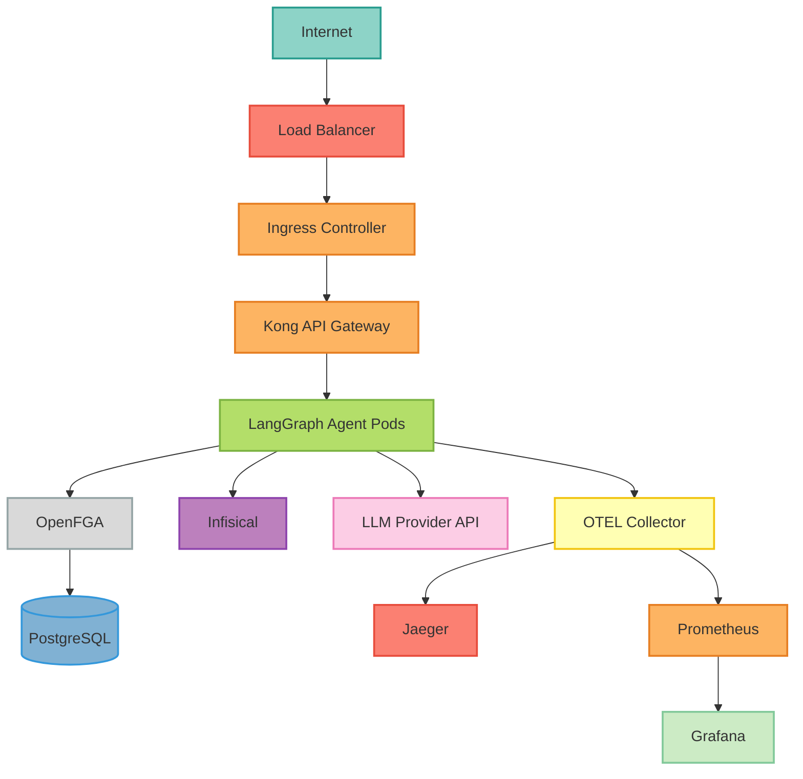

### Deployment Options

Choose the deployment method that best fits your needs:

<CardGroup cols={3}>
  <Card title="LangGraph Platform" icon="rocket" href="/deployment/langgraph-platform">
    One-command serverless deployment
    - **Best for**: Quick production deployments
    - **Complexity**: ★☆☆☆☆ Minimal
    - **Time**: ~2 minutes*
    - **Cost**: Pay-per-use
  </Card>

  <Card title="Google Cloud Run" icon="google" href="/deployment/cloud-run">
    GCP serverless container platform
    - **Best for**: GCP-native applications
    - **Complexity**: ★★☆☆☆ Low
    - **Time**: ~10 minutes*
    - **Cost**: Pay-per-use
  </Card>

  <Card title="Kubernetes" icon="dharmachakra" href="/deployment/kubernetes">
    Production-grade K8s deployment
    - **Best for**: Enterprise, self-hosted
    - **Complexity**: ★★★★☆ High
    - **Time**: ~1-2 hours*
    - **Cost**: Fixed + usage
  </Card>

  <Card title="Docker" icon="docker" href="/deployment/docker">
    Quick Docker Compose setup
    - **Best for**: Development, testing
    - **Complexity**: ★☆☆☆☆ Minimal
    - **Time**: ~15 minutes*
    - **Cost**: Hosting only
  </Card>

  <Card title="Helm" icon="cubes" href="/deployment/helm">
    Flexible Helm chart deployment
    - **Best for**: Customizable K8s
    - **Complexity**: ★★★☆☆ Medium
    - **Time**: ~30 minutes*
    - **Cost**: Fixed + usage
  </Card>

  <Card title="Kustomize" icon="layer-group" href="/deployment/kubernetes/kustomize">
    Environment-specific overlays
    - **Best for**: Multi-environment K8s
    - **Complexity**: ★★★☆☆ Medium
    - **Time**: ~45 minutes*
    - **Cost**: Fixed + usage
  </Card>
</CardGroup>

<Info>
  *Time estimates assume prerequisites are configured (accounts, credentials, CLI tools installed). First-time setup may take longer. See individual deployment guides for detailed requirements.
</Info>

### Platform Comparison

| Feature | LangGraph Platform | Cloud Run | Kubernetes | Docker |
|---------|-------------------|-----------|------------|--------|
| **Setup Time** | ~2 min* | ~10 min* | ~1-2 hrs* | ~15 min* |
| **Infrastructure** | ✅ None | ⚠️ Minimal | ❌ Complex | ⚠️ Basic |
| **Scaling** | ✅ Auto | ✅ Auto | ⚠️ Manual config | ❌ Manual |
| **LangSmith Integration** | ✅ Built-in | ⚠️ Manual | ⚠️ Manual | ⚠️ Manual |
| **Versioning** | ✅ Built-in | ⚠️ Manual | ⚠️ Manual | ❌ None |
| **Cost** | Pay-per-use | Pay-per-use | Fixed + usage | Hosting only |
| **Best For** | Quick production | GCP apps | Enterprise | Development |

*Time estimates with prerequisites configured. First-time setup takes longer.

<Note>
  **Recommendation**: Start with **LangGraph Platform** for fastest time-to-production, or **Cloud Run** if you're already on GCP. Use **Kubernetes** for enterprise self-hosted deployments.
</Note>

### Architecture


### Supported Platforms

<Tabs>
  <Tab title="Google Cloud">
    ### Google Kubernetes Engine (GKE)

    <Check>Fully supported and tested</Check>

    **Features**:
    - ✅ Autopilot and Standard clusters
    - ✅ Workload Identity for secrets
    - ✅ Cloud Armor for DDoS protection
    - ✅ Cloud Load Balancing
    - ✅ Managed Prometheus

    [Deploy to GKE →](/deployment/kubernetes/gke)
  </Tab>

  <Tab title="AWS">
    ### Amazon EKS

    <Check>Fully supported and tested</Check>

    **Features**:
    - ✅ Fargate and EC2 node groups
    - ✅ IAM for service accounts
    - ✅ AWS WAF integration
    - ✅ Application Load Balancer
    - ✅ CloudWatch integration

    [Deploy to EKS →](/deployment/kubernetes/eks)
  </Tab>

  <Tab title="Azure">
    ### Azure Kubernetes Service (AKS)

    <Check>Fully supported and tested</Check>

    **Features**:
    - ✅ Standard and Premium tiers
    - ✅ Azure AD integration
    - ✅ Azure Key Vault for secrets
    - ✅ Application Gateway
    - ✅ Azure Monitor

    [Deploy to AKS →](/deployment/kubernetes/aks)
  </Tab>

  <Tab title="Other">
    ### Other Platforms

    Also compatible with:
    - **Rancher** - Enterprise Kubernetes management
    - **VMware Tanzu** - Enterprise Kubernetes platform
    - **OpenShift** - Red Hat Kubernetes distribution
    - **On-Premises** - Self-managed Kubernetes
    - **DigitalOcean** - Managed Kubernetes
    - **Linode** - LKE (Linode Kubernetes Engine)

    Use the standard [Kubernetes guide](/deployment/kubernetes) for these platforms.
  </Tab>
</Tabs>

### Pre-Deployment Checklist

<Steps>
  <Step title="Review Security Audit">
    Run the security audit checklist:

    ```bash
    python scripts/validate_production.py --strict
    ```
    Ensure all checks pass before deploying.
  </Step>

  <Step title="Configure Secrets">
    Set up secrets management:
    - Configure Infisical project
    - Generate JWT secret: `openssl rand -base64 32`
    - Get LLM API keys
    - Setup OpenFGA store and model IDs

    See [Secrets Management](/guides/infisical-setup)
  </Step>

  <Step title="Build Container Image">
    ```bash
    docker build -t your-registry/mcp-server-langgraph:1.0.0 .
    docker push your-registry/mcp-server-langgraph:1.0.0
    ```

    Or use GitHub Actions for automated builds.
  </Step>

  <Step title="Prepare Infrastructure">
    - Provision Kubernetes cluster
    - Setup DNS records
    - Configure TLS certificates
    - Deploy monitoring stack
    - Setup OpenFGA with PostgreSQL backend
  </Step>

  <Step title="Review Configuration">
    Update configuration for production:
    - Set `ENVIRONMENT=production`
    - Configure resource limits
    - Enable autoscaling
    - Setup network policies
    - Configure ingress and TLS
  </Step>
</Steps>

### Quick Deploy (Docker)

For a quick test deployment:

```bash
## 1. Configure environment
cp .env.example .env.production
## Edit .env.production with your values

## 2. Start services
docker compose -f docker-compose.yml up -d

## 3. Verify
curl http://localhost:8000/health
```
### Production Deploy (Kubernetes)

For production deployment:

```bash
## 1. Create namespace
kubectl create namespace mcp-server-langgraph

## 2. Create secrets
kubectl create secret generic mcp-server-langgraph-secrets \
  --from-literal=jwt-secret-key="$(openssl rand -base64 32)" \
  --from-literal=google-api-key="YOUR_KEY" \
  -n mcp-server-langgraph

## 3. Deploy with Helm
helm upgrade --install mcp-server-langgraph ./helm/mcp-server-langgraph \
  --namespace mcp-server-langgraph \
  --values values-production.yaml \
  --wait

## 4. Verify deployment
kubectl rollout status deployment/mcp-server-langgraph -n mcp-server-langgraph
```
### Environment Configuration

<Tabs>
  <Tab title="Development">
    ```yaml
    environment: development
    replicaCount: 1
    autoscaling:
      enabled: false
    resources:
      limits:
        cpu: 500m
        memory: 512Mi
    ```
  </Tab>

  <Tab title="Staging">
    ```yaml
    environment: staging
    replicaCount: 2
    autoscaling:
      enabled: true
      minReplicas: 2
      maxReplicas: 5
    resources:
      limits:
        cpu: 1000m
        memory: 1Gi
    ```
  </Tab>

  <Tab title="Production">
    ```yaml
    environment: production
    replicaCount: 3
    autoscaling:
      enabled: true
      minReplicas: 3
      maxReplicas: 10
    resources:
      limits:
        cpu: 2000m
        memory: 2Gi
    podDisruptionBudget:
      enabled: true
      minAvailable: 2
    ```
  </Tab>
</Tabs>

### Monitoring & Observability

Deploy the monitoring stack:

```bash
## Prometheus + Grafana
helm install prometheus prometheus-community/kube-prometheus-stack \
  --namespace monitoring --create-namespace

## Jaeger
helm install jaeger jaegertracing/jaeger \
  --namespace monitoring

## OpenTelemetry Collector
kubectl apply -f kubernetes/otel-collector/
```
Access dashboards:
- **Grafana**: http://grafana.yourdomain.com (admin/admin)
- **Jaeger**: http://jaeger.yourdomain.com
- **Prometheus**: http://prometheus.yourdomain.com

### Scaling

#### Horizontal Pod Autoscaling

```yaml
apiVersion: autoscaling/v2
kind: HorizontalPodAutoscaler
metadata:
  name: mcp-server-langgraph
spec:
  scaleTargetRef:
    apiVersion: apps/v1
    kind: Deployment
    name: mcp-server-langgraph
  minReplicas: 3
  maxReplicas: 10
  metrics:
  - type: Resource
    resource:
      name: cpu
      target:
        type: Utilization
        averageUtilization: 70
  - type: Resource
    resource:
      name: memory
      target:
        type: Utilization
        averageUtilization: 80
```
#### Vertical Pod Autoscaling

```bash
kubectl apply -f kubernetes/vpa/
```

### High Availability

Ensure high availability with:

1. **Multiple Replicas**: Run at least 3 replicas
2. **Pod Disruption Budget**: Maintain minimum availability
3. **Multi-Zone Deployment**: Spread across availability zones
4. **Health Checks**: Liveness and readiness probes
5. **Graceful Shutdown**: Handle SIGTERM properly
6. **Circuit Breakers**: Fail fast with timeouts

### Disaster Recovery

<Steps>
  <Step title="Backup Strategy">
    - OpenFGA PostgreSQL database
    - Configuration and secrets
    - Persistent volumes
  </Step>

  <Step title="Recovery Procedure">
    - Restore database from backup
    - Redeploy application
    - Verify functionality
  </Step>

  <Step title="Testing">
    - Test disaster recovery quarterly
    - Document RTO/RPO
    - Update runbooks
  </Step>
</Steps>

### Security Hardening

Production security checklist:

- [ ] TLS enabled for all endpoints
- [ ] Network policies applied
- [ ] Pod security policies enforced
- [ ] RBAC configured with least privilege
- [ ] Secrets encrypted at rest
- [ ] Audit logging enabled
- [ ] Regular security scans
- [ ] Rate limiting configured

See [Security Best Practices](/security/best-practices)

### Cost Optimization

<Tabs>
  <Tab title="GKE">
    - Use Autopilot for hands-off management
    - Enable cluster autoscaling
    - Use preemptible nodes for dev/staging
    - Configure resource requests accurately
    - Use committed use discounts
  </Tab>

  <Tab title="EKS">
    - Use Fargate for variable workloads
    - Configure Karpenter for autoscaling
    - Use Spot instances for non-critical workloads
    - Right-size EC2 instances
    - Use Savings Plans
  </Tab>

  <Tab title="AKS">
    - Use B-series VMs for dev/test
    - Configure cluster autoscaler
    - Use Spot VMs for batch workloads
    - Optimize VM sizes
    - Use Azure Reserved Instances
  </Tab>
</Tabs>

### Next Steps

<CardGroup cols={2}>
  <Card title="Docker Deployment" icon="docker" href="/deployment/docker">
    Quick deployment guide
  </Card>
  <Card title="Kubernetes Setup" icon="dharmachakra" href="/deployment/kubernetes">
    Production Kubernetes deployment
  </Card>
  <Card title="Monitoring Setup" icon="chart-line" href="/deployment/monitoring">
    Configure observability
  </Card>
  <Card title="Security Guide" icon="shield" href="/security/overview">
    Production security hardening
  </Card>
</CardGroup>
