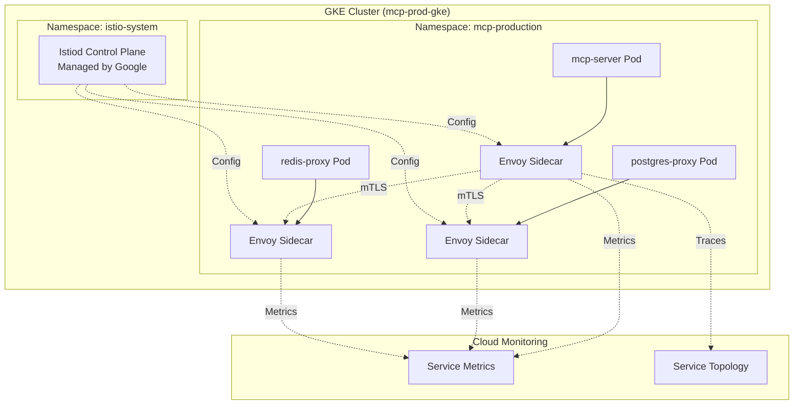

## Overview

**Anthos Service Mesh** (managed Istio) provides secure service-to-service communication, advanced traffic management, and deep observability for microservices on GKE. Fully managed by Google with automatic upgrades.

<CardGroup cols={2}>
  <Card title="Mutual TLS" icon="lock">
    Automatic encryption between services
  </Card>
  <Card title="Traffic Control" icon="route">
    Canary deployments, A/B testing, circuit breaking
  </Card>
  <Card title="Observability" icon="chart-line">
    Service topology, latency, error rates
  </Card>
  <Card title="Policy Enforcement" icon="shield-check">
    Fine-grained authorization, rate limiting
  </Card>
</CardGroup>

---

## Why Service Mesh?

<AccordionGroup>
  <Accordion title="Zero-Trust Networking">
    **Challenge**: By default, pods can talk to any other pod

    **Solution**: Service mesh enforces mTLS + authorization policies

    **Implementation**:
    ```yaml
    apiVersion: security.istio.io/v1beta1
    kind: PeerAuthentication
    metadata:
      name: default
      namespace: mcp-production
    spec:
      mtls:
        mode: STRICT  # All traffic must be mTLS
    ```

    **Result**: Encrypted, authenticated communication
  </Accordion>

  <Accordion title="Advanced Deployments">
    **Use cases**:
    - Canary releases (10% traffic to v2)
    - A/B testing (iOS users → v2)
    - Blue-green deployments
    - Circuit breaking (prevent cascading failures)

    **Without mesh**: Complex custom code

    **With mesh**: Declarative traffic rules
  </Accordion>

  <Accordion title="Service-Level Observability">
    **Built-in metrics**:
    - Request rate (QPS per service)
    - P50/P95/P99 latency
    - Success rate (% 2xx responses)
    - Service dependency graph

    **Without mesh**: Instrumentation code in every service

    **With mesh**: Automatic sidecar collection
  </Accordion>

  <Accordion title="Multi-Cluster Mesh">
    **Scenario**: Services across dev, staging, prod clusters

    **Capability**: Single mesh spanning clusters

    **Benefit**: Consistent policies, cross-cluster service discovery
  </Accordion>
</AccordionGroup>

---

## Architecture



**Components**:
- **Istiod**: Control plane (managed by Google, auto-upgraded)
- **Envoy sidecars**: Injected into each pod, handle traffic
- **Telemetry**: Metrics sent to Cloud Monitoring

---

## Quick Setup (30 minutes)

<Steps>
  <Step title="Enable APIs & Fleet Registration">
    ```bash
    ./deployments/service-mesh/anthos/setup-anthos-service-mesh.sh \
      PROJECT_ID mcp-prod-gke us-central1
    ```

    **What it does**:
    - Enables Anthos Service Mesh APIs
    - Registers cluster with GKE Fleet
    - Enables managed service mesh
    - Waits for control plane (~10-15 min)
  </Step>

  <Step title="Verify Installation">
    ```bash
    # Check mesh status
    gcloud container fleet mesh describe --project=PROJECT_ID

    # Should show:
    # state: ACTIVE
    # controlPlaneManagement: AUTOMATIC

    # Verify Istiod running
    kubectl get pods -n istio-system
    ```

    <Check>istiod pod should be Running</Check>
  </Step>

  <Step title="Enable Sidecar Injection">
    ```bash
    # Label namespace for automatic injection
    kubectl label namespace mcp-production istio-injection=enabled

    # Restart deployments to inject sidecars
    kubectl rollout restart deployment/production-mcp-server-langgraph \
      -n mcp-production
    ```
  </Step>

  <Step title="Verify Sidecars Injected">
    ```bash
    # Check pods have 2 containers (app + envoy)
    kubectl get pods -n mcp-production

    # Should show:
    # NAME                                   READY   STATUS
    # production-mcp-server-langgraph-...    2/2     Running
    #                                        ^^^
    #                                    app + sidecar

    # Describe pod to see istio-proxy container
    kubectl describe pod POD_NAME -n mcp-production | grep istio-proxy
    ```
  </Step>

  <Step title="Enable Strict mTLS">
    ```bash
    kubectl apply -f - <<EOF
    apiVersion: security.istio.io/v1beta1
    kind: PeerAuthentication
    metadata:
      name: default
      namespace: mcp-production
    spec:
      mtls:
        mode: STRICT
    EOF
    ```

    All traffic now encrypted with mTLS!
  </Step>

  <Step title="Verify mTLS">
    ```bash
    # Check Kiali dashboard or use istioctl
    istioctl proxy-config secret -n mcp-production POD_NAME

    # Should show TLS certificates
    ```
  </Step>
</Steps>

---

## Traffic Management

### Canary Deployment

Deploy new version to 10% of traffic:

<CodeGroup>
```yaml VirtualService (Traffic Split)
apiVersion: networking.istio.io/v1beta1
kind: VirtualService
metadata:
  name: mcp-server
  namespace: mcp-production
spec:
  hosts:
  - mcp-server
  http:
  - match:
    - headers:
        x-canary:
          exact: "true"
    route:
    - destination:
        host: mcp-server
        subset: v2
      weight: 100
  - route:
    - destination:
        host: mcp-server
        subset: v1
      weight: 90
    - destination:
        host: mcp-server
        subset: v2
      weight: 10  # 10% to canary
```

```yaml DestinationRule (Define Subsets)
apiVersion: networking.istio.io/v1beta1
kind: DestinationRule
metadata:
  name: mcp-server
  namespace: mcp-production
spec:
  host: mcp-server
  trafficPolicy:
    tls:
      mode: ISTIO_MUTUAL  # mTLS
  subsets:
  - name: v1
    labels:
      version: v1
  - name: v2
    labels:
      version: v2
```
</CodeGroup>

**Workflow**:
1. Deploy v2 with label `version: v2`
2. Apply VirtualService (10% → v2)
3. Monitor metrics for 30 minutes
4. If healthy, increase to 50%, then 100%
5. If unhealthy, revert to 0%

### Circuit Breaking

Prevent cascading failures:

```yaml
apiVersion: networking.istio.io/v1beta1
kind: DestinationRule
metadata:
  name: postgres-proxy
  namespace: mcp-production
spec:
  host: postgres-proxy
  trafficPolicy:
    connectionPool:
      tcp:
        maxConnections: 100
      http:
        http1MaxPendingRequests: 50
        http2MaxRequests: 100
        maxRequestsPerConnection: 2
    outlierDetection:
      consecutiveErrors: 5
      interval: 30s
      baseEjectionTime: 30s
      maxEjectionPercent: 50
```

**Behavior**: After 5 consecutive errors, eject pod for 30 seconds

### Retry Policy

```yaml
apiVersion: networking.istio.io/v1beta1
kind: VirtualService
metadata:
  name: mcp-server
spec:
  http:
  - route:
    - destination:
        host: mcp-server
    retries:
      attempts: 3
      perTryTimeout: 2s
      retryOn: 5xx,reset,connect-failure
```

---

## Security

### Strict mTLS

<Tabs>
  <Tab title="Cluster-Wide">
    ```yaml
    apiVersion: security.istio.io/v1beta1
    kind: PeerAuthentication
    metadata:
      name: default
      namespace: istio-system
    spec:
      mtls:
        mode: STRICT
    ```

    Applies to all namespaces.
  </Tab>

  <Tab title="Namespace-Specific">
    ```yaml
    apiVersion: security.istio.io/v1beta1
    kind: PeerAuthentication
    metadata:
      name: default
      namespace: mcp-production
    spec:
      mtls:
        mode: STRICT
    ```

    Only `mcp-production` namespace.
  </Tab>

  <Tab title="Permissive (Migration)">
    ```yaml
    spec:
      mtls:
        mode: PERMISSIVE  # Allow both mTLS and plaintext
    ```

    Use during migration, then switch to STRICT.
  </Tab>
</Tabs>

### Authorization Policies

**Deny-all by default**:

```yaml
apiVersion: security.istio.io/v1beta1
kind: AuthorizationPolicy
metadata:
  name: deny-all
  namespace: mcp-production
spec: {}  # Empty = deny all
```

**Allow specific service**:

```yaml
apiVersion: security.istio.io/v1beta1
kind: AuthorizationPolicy
metadata:
  name: allow-mcp-server
  namespace: mcp-production
spec:
  selector:
    matchLabels:
      app: postgres-proxy
  action: ALLOW
  rules:
  - from:
    - source:
        principals: ["cluster.local/ns/mcp-production/sa/mcp-server"]
    to:
    - operation:
        methods: ["GET", "POST"]
        paths: ["/api/*"]
```

**Result**: Only `mcp-server` SA can call `postgres-proxy`

---

## Observability

### Service Topology

**View in Google Cloud Console**:
```
Navigation → Anthos → Service Mesh → Topology
```

Shows:
- Service dependency graph
- Traffic flow between services
- Error rates per edge

### Metrics

<Tabs>
  <Tab title="Request Rate">
    ```promql
    rate(istio_requests_total{
      destination_service_name="mcp-server",
      destination_workload_namespace="mcp-production"
    }[1m])
    ```
  </Tab>

  <Tab title="Latency (P95)">
    ```promql
    histogram_quantile(0.95,
      rate(istio_request_duration_milliseconds_bucket{
        destination_service_name="mcp-server"
      }[1m])
    )
    ```
  </Tab>

  <Tab title="Error Rate">
    ```promql
    rate(istio_requests_total{
      destination_service_name="mcp-server",
      response_code=~"5.."
    }[1m])
    ```
  </Tab>
</Tabs>

### Dashboards

Import pre-built dashboards:

```bash
# Install Kiali (service mesh dashboard)
kubectl apply -f https://raw.githubusercontent.com/istio/istio/release-1.20/samples/addons/kiali.yaml

# Port-forward
kubectl port-forward svc/kiali -n istio-system 20001:20001

# Open http://localhost:20001
```

**Features**:
- Service graph visualization
- Traffic animation
- Configuration validation
- Distributed tracing

---

## Multi-Cluster Mesh

<Steps>
  <Step title="Register All Clusters">
    ```bash
    # Dev cluster
    gcloud container fleet memberships register mcp-dev-membership \
      --gke-cluster=us-central1/mcp-dev-gke \
      --project=PROJECT_ID

    # Staging cluster
    gcloud container fleet memberships register mcp-staging-membership \
      --gke-cluster=us-central1/mcp-staging-gke \
      --project=PROJECT_ID

    # Prod cluster (already registered)
    ```
  </Step>

  <Step title="Enable Mesh for All">
    ```bash
    gcloud container fleet mesh update \
      --management automatic \
      --memberships=mcp-dev-membership,mcp-staging-membership,mcp-prod-membership \
      --project=PROJECT_ID
    ```
  </Step>

  <Step title="Configure Cross-Cluster Service Discovery">
    ```yaml
    apiVersion: networking.istio.io/v1beta1
    kind: ServiceEntry
    metadata:
      name: external-staging-service
      namespace: mcp-production
    spec:
      hosts:
      - mcp-server.mcp-staging.svc.cluster.local
      location: MESH_INTERNAL
      ports:
      - number: 8000
        name: http
        protocol: HTTP
      resolution: DNS
    ```
  </Step>
</Steps>

**Use case**: Production can call staging services for integration testing

---

## Troubleshooting

<AccordionGroup>
  <Accordion title="Sidecar not injected">
    **Symptom**: Pod has 1/1 containers (should be 2/2)

    **Checks**:
    ```bash
    # Verify namespace labeled
    kubectl get namespace mcp-production --show-labels

    # Should see: istio-injection=enabled

    # Check injection status
    kubectl get mutatingwebhookconfigurations
    ```

    **Solution**: Label namespace and restart pods
  </Accordion>

  <Accordion title="mTLS connection failure">
    **Symptom**: Service A can't connect to Service B

    **Checks**:
    ```bash
    # Check PeerAuthentication
    kubectl get peerauthentication -n mcp-production

    # Check DestinationRule
    kubectl get destinationrule -n mcp-production

    # Verify certificates
    istioctl proxy-config secret POD_NAME -n mcp-production
    ```

    **Common fix**: Ensure both sides have sidecars injected
  </Accordion>

  <Accordion title="Control plane not ready">
    **Symptom**: Mesh status shows PROVISIONING for &gt;20 minutes

    **Solution**:
    ```bash
    # Check fleet status
    gcloud container fleet mesh describe --project=PROJECT_ID

    # View logs
    kubectl logs -n istio-system deployment/istiod

    # If stuck, re-enable
    gcloud container fleet mesh update \
      --management automatic \
      --memberships=MEMBERSHIP_NAME \
      --project=PROJECT_ID
    ```
  </Accordion>
</AccordionGroup>

---

## Best Practices

<Check>**Start with PERMISSIVE mTLS**, then move to STRICT</Check>

```yaml
# Week 1: Permissive (allow migration)
mtls:
  mode: PERMISSIVE

# Week 2: Strict (after all services have sidecars)
mtls:
  mode: STRICT
```

<Check>**Use namespace-scoped policies** for isolation</Check>

```yaml
# Production has strict mTLS
apiVersion: security.istio.io/v1beta1
kind: PeerAuthentication
metadata:
  name: default
  namespace: mcp-production
spec:
  mtls:
    mode: STRICT

# Dev can be permissive
apiVersion: security.istio.io/v1beta1
kind: PeerAuthentication
metadata:
  name: default
  namespace: mcp-dev
spec:
  mtls:
    mode: PERMISSIVE
```

<Check>**Enable resource limits** on sidecars</Check>

```yaml
apiVersion: v1
kind: ConfigMap
metadata:
  name: istio-sidecar-injector
  namespace: istio-system
data:
  values: |
    global:
      proxy:
        resources:
          requests:
            cpu: 100m
            memory: 128Mi
          limits:
            cpu: 500m
            memory: 256Mi
```

<Check>**Monitor mesh health** with SLIs</Check>

```yaml
# SLI: 99% of requests < 500ms
# SLI: 99.9% success rate (non-5xx)
# Alert if error budget depleted
```

---

## Related Documentation

<CardGroup cols={2}>
  <Card title="GKE Production" icon="kubernetes" href="/deployment/kubernetes/gke-production">
    Deploy with service mesh enabled
  </Card>
  <Card title="Security Hardening" icon="shield-halved" href="/security/gcp-security-hardening">
    mTLS as part of 67-control framework
  </Card>
  <Card title="Operations Runbooks" icon="book-medical" href="/deployment/operations/gke-runbooks">
    Service mesh troubleshooting
  </Card>
  <Card title="Monitoring" icon="chart-line" href="/deployment/monitoring">
    Service mesh metrics and alerting
  </Card>
</CardGroup>

---

## Next Steps

<Steps>
  <Step title="Install Anthos Service Mesh">
    ```bash
    ./deployments/service-mesh/anthos/setup-anthos-service-mesh.sh PROJECT_ID
    ```
  </Step>

  <Step title="Enable Sidecar Injection">
    ```bash
    kubectl label namespace mcp-production istio-injection=enabled
    kubectl rollout restart deployment -n mcp-production
    ```
  </Step>

  <Step title="Enable Strict mTLS">
    ```bash
    kubectl apply -f deployments/service-mesh/anthos/peer-authentication.yaml
    ```
  </Step>

  <Step title="Configure Traffic Rules">
    Set up canary deployments, circuit breaking, retries
  </Step>

  <Step title="Monitor Service Topology">
    Console → Anthos → Service Mesh → Topology
  </Step>
</Steps>
