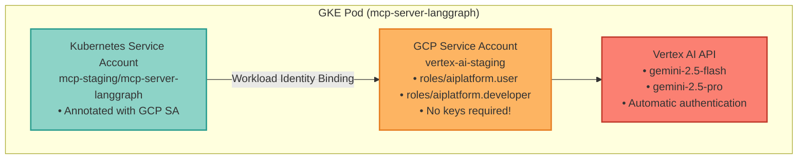
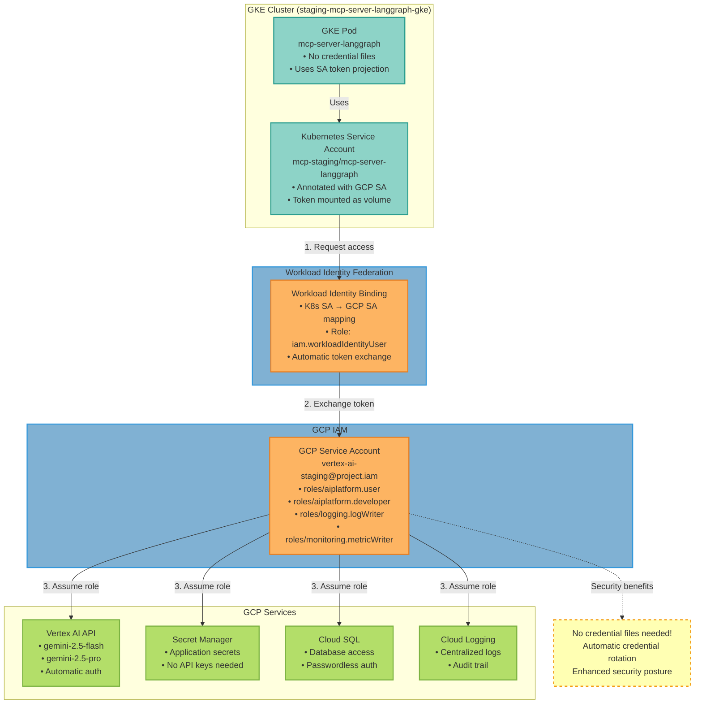

### Overview

This guide covers setting up **Vertex AI** with **Workload Identity Federation** on GKE for secure, keyless authentication. This approach eliminates the need for service account keys and provides automatic credential rotation.

<Info>
**Workload Identity** is the recommended way to access Google Cloud services from GKE. It provides better security than service account keys and simplifies credential management.
</Info>

### Architecture



### Workload Identity Integration Flow

This diagram shows the complete authentication flow from a GKE pod to GCP services using Workload Identity Federation, eliminating the need for credential files:



<Info>
**Key Benefits of Workload Identity:**
- **No credential files**: Kubernetes tokens are automatically exchanged for GCP credentials
- **Automatic rotation**: GCP handles credential rotation without manual intervention
- **Fine-grained access**: Each Kubernetes service account maps to a specific GCP service account with minimal permissions
- **Audit trail**: All GCP API calls are attributed to the specific service account identity
</Info>

### Prerequisites

Before starting, ensure you have:

- ✅ **GKE cluster** with Workload Identity enabled
- ✅ **Staging infrastructure** deployed (run `setup-staging-infrastructure.sh` first)
- ✅ **gcloud CLI** installed and authenticated
- ✅ **kubectl** installed and configured
- ✅ **Billing enabled** on your GCP project

### Quick Setup

#### Automated Setup (Recommended)

The easiest way to set up Vertex AI with Workload Identity:

```bash
## Run the automated setup script
./scripts/gcp/setup-vertex-ai-staging.sh
```

This script will:
1. ✅ Enable Vertex AI API
2. ✅ Create `vertex-ai-staging` service account
3. ✅ Grant necessary IAM permissions
4. ✅ Bind Kubernetes SA to GCP SA
5. ✅ Annotate Kubernetes service account
6. ✅ Verify configuration

<Accordion title="Manual Setup Steps (Advanced)">

If you prefer manual setup or need to understand each step:

#### Step 1: Enable Vertex AI API

```bash
gcloud services enable aiplatform.googleapis.com \
  --project=vishnu-sandbox-20250310
```
#### Step 2: Create Service Account

```bash
## Create service account
gcloud iam service-accounts create vertex-ai-staging \
  --display-name="Vertex AI Staging" \
  --description="Service account for Vertex AI access in staging" \
  --project=vishnu-sandbox-20250310
```

#### Step 3: Grant Permissions

```bash
PROJECT_ID="vishnu-sandbox-20250310"
SA_EMAIL="vertex-ai-staging@${PROJECT_ID}.iam.gserviceaccount.com"

## Vertex AI User (API access)
gcloud projects add-iam-policy-binding $PROJECT_ID \
  --member="serviceAccount:${SA_EMAIL}" \
  --role="roles/aiplatform.user"

## Vertex AI Developer (model management)
gcloud projects add-iam-policy-binding $PROJECT_ID \
  --member="serviceAccount:${SA_EMAIL}" \
  --role="roles/aiplatform.developer"

## Logging
gcloud projects add-iam-policy-binding $PROJECT_ID \
  --member="serviceAccount:${SA_EMAIL}" \
  --role="roles/logging.logWriter"

## Monitoring
gcloud projects add-iam-policy-binding $PROJECT_ID \
  --member="serviceAccount:${SA_EMAIL}" \
  --role="roles/monitoring.metricWriter"
```
#### Step 4: Setup Workload Identity Binding

```bash
## Allow Kubernetes SA to impersonate GCP SA
gcloud iam service-accounts add-iam-policy-binding \
  vertex-ai-staging@vishnu-sandbox-20250310.iam.gserviceaccount.com \
  --role="roles/iam.workloadIdentityUser" \
  --member="serviceAccount:vishnu-sandbox-20250310.svc.id.goog[mcp-staging/mcp-server-langgraph]"
```
#### Step 5: Annotate Kubernetes Service Account

```bash
kubectl annotate serviceaccount mcp-server-langgraph \
  -n staging-mcp-server-langgraph \
  iam.gke.io/gcp-service-account=vertex-ai-staging@vishnu-sandbox-20250310.iam.gserviceaccount.com \
  --overwrite
```
</Accordion>

### Configuration

#### Environment Variables

The deployment is configured with the following environment variables in `deployments/overlays/preview-gke/deployment-patch.yaml`:

```yaml
env:
  # LLM Provider
  - name: LLM_PROVIDER
    value: "google"  # Use "google" for both AI Studio and Vertex AI

  # Vertex AI Configuration
  - name: VERTEX_PROJECT
    value: "vishnu-sandbox-20250310"
  - name: VERTEX_LOCATION
    value: "us-central1"

  # Model Selection
  - name: MODEL_NAME
    value: "gemini-2.5-flash"  # or gemini-2.5-pro
```

#### Service Account Annotation

The Kubernetes service account is annotated to use Workload Identity:

```yaml
## deployments/overlays/preview-gke/serviceaccount-patch.yaml
apiVersion: v1
kind: ServiceAccount
metadata:
  name: mcp-server-langgraph
  annotations:
    iam.gke.io/gcp-service-account: vertex-ai-staging@vishnu-sandbox-20250310.iam.gserviceaccount.com
```
### Deployment

#### Deploy to Staging

After running the setup script, deploy the updated configuration:

```bash
## Apply the updated manifests
kubectl apply -k deployments/overlays/preview-gke

## Wait for rollout
kubectl rollout status deployment/mcp-server-langgraph -n staging-mcp-server-langgraph

## Verify pods are running
kubectl get pods -n staging-mcp-server-langgraph
```

### Verification

#### 1. Verify Workload Identity Binding

```bash
## Check GCP service account IAM policy
gcloud iam service-accounts get-iam-policy \
  vertex-ai-staging@vishnu-sandbox-20250310.iam.gserviceaccount.com

## Should include binding for:
## serviceAccount:vishnu-sandbox-20250310.svc.id.goog[mcp-staging/mcp-server-langgraph]
```
#### 2. Verify Kubernetes Annotation

```bash
## Check service account annotation
kubectl get serviceaccount mcp-server-langgraph -n staging-mcp-server-langgraph \
  -o jsonpath='{.metadata.annotations.iam\.gke\.io/gcp-service-account}'

## Expected output:
## vertex-ai-staging@vishnu-sandbox-20250310.iam.gserviceaccount.com
```

#### 3. Test Authentication from Pod

```bash
## Get a shell in the pod
POD_NAME=$(kubectl get pods -n staging-mcp-server-langgraph -l app=mcp-server-langgraph -o jsonpath='{.items[0].metadata.name}')

## Check active service account
kubectl exec -it $POD_NAME -n staging-mcp-server-langgraph -- gcloud auth list

## Expected output:
## ACTIVE  ACCOUNT
## *       vertex-ai-staging@vishnu-sandbox-20250310.iam.gserviceaccount.com
```
#### 4. Test Vertex AI Access

```python
## Test Vertex AI API access
kubectl exec -it $POD_NAME -n staging-mcp-server-langgraph -- python3 << 'EOF'
from google.cloud import aiplatform

aiplatform.init(
    project="vishnu-sandbox-20250310",
    location="us-central1"
)

## List models (should work without errors)
models = aiplatform.Model.list()
print(f"✓ Vertex AI access working! Found {len(models)} models")
EOF
```

#### 5. Test with LiteLLM

```python
## Test LLM integration
kubectl exec -it $POD_NAME -n staging-mcp-server-langgraph -- python3 << 'EOF'
from litellm import completion

response = completion(
    model="vertex_ai/gemini-2.5-flash",
    messages=[{"role": "user", "content": "Hello from Vertex AI via Workload Identity!"}],
    vertex_project="vishnu-sandbox-20250310",
    vertex_location="us-central1"
)

print(f"✓ LiteLLM integration working!")
print(f"Response: {response.choices[0].message.content}")
EOF
```
### Troubleshooting

<AccordionGroup>
  <Accordion title="Pod cannot authenticate" icon="user-lock">
    **Error**: `google.auth.exceptions.DefaultCredentialsError: Could not automatically determine credentials`

    **Solutions**:
    1. Verify Workload Identity is enabled on cluster:
       ```bash
       gcloud container clusters describe staging-mcp-server-langgraph-gke \
         --region=us-central1 \
         --format="value(workloadIdentityConfig.workloadPool)"
       ```
    2. Check service account annotation:
       ```bash
       kubectl describe sa mcp-server-langgraph -n staging-mcp-server-langgraph | grep Annotations
       ```
    3. Verify IAM binding:
       ```bash
       gcloud iam service-accounts get-iam-policy \
         vertex-ai-staging@vishnu-sandbox-20250310.iam.gserviceaccount.com
       ```
    4. Restart pods to pick up new annotation:
       ```bash
       kubectl rollout restart deployment/mcp-server-langgraph -n staging-mcp-server-langgraph
       ```
  </Accordion>

  <Accordion title="Permission denied errors" icon="shield-exclamation">
    **Error**: `403 Permission denied on resource project`

    **Solutions**:
    1. Verify service account has required roles:
       ```bash
       gcloud projects get-iam-policy vishnu-sandbox-20250310 \
         --flatten="bindings[].members" \
         --filter="bindings.members:serviceAccount:vertex-ai-staging@vishnu-sandbox-20250310.iam.gserviceaccount.com"
       ```
    2. Grant missing permissions:
       ```bash
       # Vertex AI User
       gcloud projects add-iam-policy-binding vishnu-sandbox-20250310 \
         --member="serviceAccount:vertex-ai-staging@vishnu-sandbox-20250310.iam.gserviceaccount.com" \
         --role="roles/aiplatform.user"

       # Vertex AI Developer
       gcloud projects add-iam-policy-binding vishnu-sandbox-20250310 \
         --member="serviceAccount:vertex-ai-staging@vishnu-sandbox-20250310.iam.gserviceaccount.com" \
         --role="roles/aiplatform.developer"
       ```
  </Accordion>

  <Accordion title="Model not found errors" icon="circle-question">
    **Error**: `404 The model requested does not exist`

    **Solutions**:
    1. Verify model name format for Vertex AI:
       ```python
       # Correct format
       model="vertex_ai/gemini-2.5-flash"

       # Also works (LiteLLM auto-detects)
       model="gemini-2.5-flash"
       ```
    2. Check available models:
       ```bash
       gcloud ai models list --region=us-central1
       ```
    3. Use supported model names:
       - `gemini-2.5-flash`
       - `gemini-2.5-pro`
  </Accordion>

  <Accordion title="Workload Identity not working" icon="link-slash">
    **Error**: Pod uses default compute service account instead of vertex-ai-staging

    **Solutions**:
    1. Ensure pod spec uses correct service account:
       ```yaml
       spec:
         serviceAccountName: mcp-server-langgraph  # Must match annotated SA
       ```
    2. Check if annotation was applied before pod creation:
       ```bash
       # Delete and recreate pod
       kubectl delete pod $POD_NAME -n staging-mcp-server-langgraph
       # Pod will be recreated by deployment
       ```
    3. Verify namespace has Workload Identity enabled:
       ```bash
       kubectl get namespace staging-mcp-server-langgraph -o yaml | grep workload-identity
       ```
  </Accordion>
</AccordionGroup>

### Security Considerations

#### Benefits of Workload Identity

<CardGroup cols={2}>
  <Card title="No Key Management" icon="key">
    No service account keys to create, rotate, or secure. Authentication is handled automatically by GKE.
  </Card>

  <Card title="Automatic Rotation" icon="arrows-rotate">
    Credentials are automatically rotated by Google Cloud. No manual intervention required.
  </Card>

  <Card title="Least Privilege" icon="shield-halved">
    Each pod gets only the permissions it needs via IAM bindings. No shared credentials.
  </Card>

  <Card title="Audit Trail" icon="clipboard-list">
    All API calls are logged with the service account identity. Easy to audit and monitor.
  </Card>
</CardGroup>

#### IAM Permissions

The `vertex-ai-staging` service account has been granted these roles:

| Role | Purpose | Permissions |
|------|---------|-------------|
| `roles/aiplatform.user` | Vertex AI API access | Call Vertex AI APIs, use models |
| `roles/aiplatform.developer` | Model management | Deploy models, manage endpoints |
| `roles/logging.logWriter` | Cloud Logging | Write logs to Cloud Logging |
| `roles/monitoring.metricWriter` | Monitoring | Write custom metrics |

#### Best Practices

- ✅ **Do**:
- Use Workload Identity for all GCP service access
- Grant minimum required permissions
- Monitor API usage and costs
- Set up quota alerts

- ❌ **Don't**:
- Create service account keys
- Grant overly broad permissions
- Share service accounts across environments
- Ignore quota warnings

### Cost Management

#### Vertex AI Pricing

Vertex AI charges per 1,000 characters (roughly equivalent to tokens):

| Model | Input (per 1M chars) | Output (per 1M chars) | Status |
|-------|---------------------|----------------------|--------|
| gemini-2.5-flash | $0.075 | $0.30 | ✅ Production-ready |
| gemini-2.5-pro | $0.625 | $5.00 | ✅ Production-ready |

<Note>
**gemini-2.5-flash and gemini-2.5-pro are production-grade** models recommended for enterprise deployments. They offer stable performance, SLA guarantees, and are suitable for production workloads. Other Gemini 2.5 variants (if any) may be experimental or preview releases.
</Note>

#### Setting Quotas

```bash
## Check current quota
gcloud ai quota list --region=us-central1

## Request quota increase (if needed)
gcloud ai quota update \
  --region=us-central1 \
  --model=gemini-2.5-flash \
  --limit=1000000  # 1M requests per day
```

#### Monitoring Costs

```bash
## View Vertex AI usage in Cloud Console
gcloud logging read \
  "resource.type=aiplatform.googleapis.com/Endpoint
   AND jsonPayload.request_response_time > 0" \
  --limit=50 \
  --format=json
```
### Migration from Google AI Studio

If you're currently using Google AI Studio API keys, here's how to migrate:

<Steps>
  <Step title="Update Environment Variables">
    Change from API key to Vertex AI configuration:

    **Before** (Google AI Studio):

    ```yaml
    env:
      - name: LLM_PROVIDER
        value: "google"
      - name: GOOGLE_API_KEY
        valueFrom:
          secretKeyRef:
            name: secrets
            key: google-api-key
    ```

    **After** (Vertex AI):

    ```yaml
    env:
      - name: LLM_PROVIDER
        value: "google"
      - name: VERTEX_PROJECT
        value: "vishnu-sandbox-20250310"
      - name: VERTEX_LOCATION
        value: "us-central1"
      # No API key needed!
    ```
  </Step>

  <Step title="Run Setup Script">
    ```bash
    ./scripts/gcp/setup-vertex-ai-staging.sh
    ```
  </Step>

  <Step title="Deploy Updated Configuration">
    ```bash
    kubectl apply -k deployments/overlays/preview-gke
    ```
  </Step>

  <Step title="Verify Migration">
    ```bash
    # Check authentication
    kubectl exec -it $POD_NAME -n staging-mcp-server-langgraph -- gcloud auth list

    # Test Vertex AI
    kubectl logs -n staging-mcp-server-langgraph $POD_NAME | grep "Vertex AI"
    ```
  </Step>
</Steps>

### Next Steps

<CardGroup cols={2}>
  <Card title="Google Gemini Guide" icon="google" href="/guides/google-gemini">
    Learn about Gemini model features and capabilities
  </Card>

  <Card title="GKE Staging Deployment" icon="kubernetes" href="/deployment/kubernetes/gke-staging">
    Complete GKE staging deployment guide
  </Card>

  <Card title="Observability" icon="chart-line" href="/guides/observability">
    Monitor Vertex AI usage and performance
  </Card>

  <Card title="Production Checklist" icon="clipboard-check" href="/deployment/production-checklist">
    Prepare for production deployment
  </Card>
</CardGroup>

---

<Check>
**Vertex AI with Workload Identity Configured!** Your staging environment now uses keyless authentication for secure, scalable AI access.
</Check>
