# GitHub Actions Workflow Dependency Diagram

> **TL;DR**: Visual representation of all 31 GitHub Actions workflows, their dependencies, and execution triggers.

## Overview

This diagram shows the relationships between GitHub Actions workflows in this project. Workflows are organized by trigger type and show dependencies where applicable.

---

## Main CI/CD Pipeline

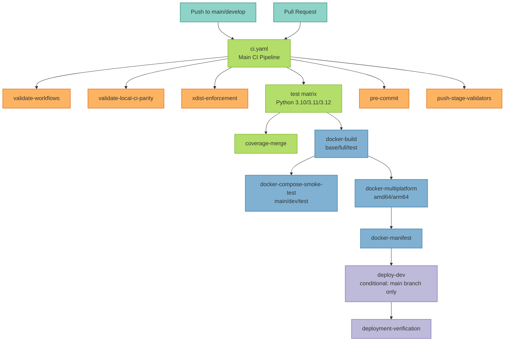

---

## Quality Testing Workflows

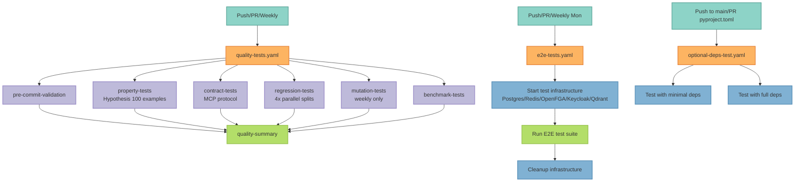

---

## Security & Compliance Workflows

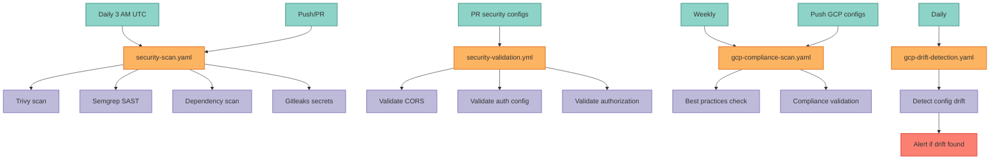

---

## Deployment Workflows

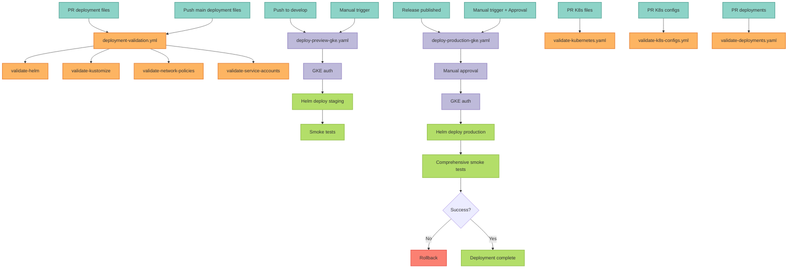

---

## Documentation Workflows

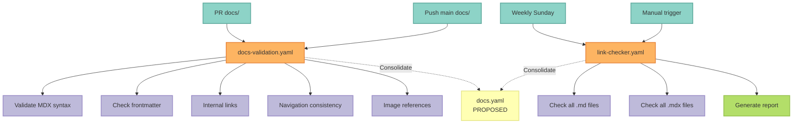

---

## Monitoring & Observability Workflows

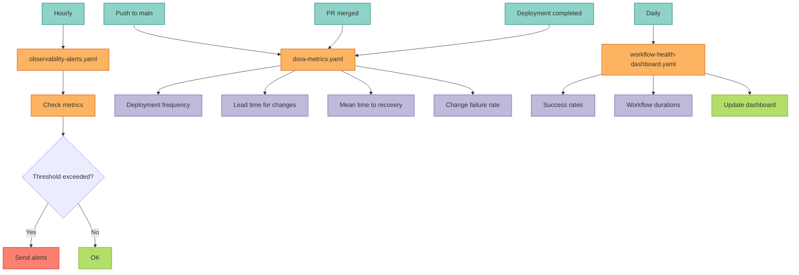

---

## Maintenance & Automation Workflows

```mermaid
%% ColorBrewer2 Set3 palette - each component type uniquely colored
flowchart TD
    %% Dependabot Auto-merge
    DepPR[Dependabot PR] --> DA[dependabot-automerge.yaml]
    DA --> CICheck{CI passed?}
    CICheck -->|Yes + Minor/Patch| Merge[Auto-merge]
    CICheck -->|No or Major| Manual[Manual review required]

    %% Stale Issues
    DailyStale[Daily] --> Stale[stale.yaml]
    Stale --> Find[Find stale issues/PRs<br/>60 days inactive]
    Find --> Mark[Mark as stale]
    Mark --> Wait[Wait 7 days]
    Wait --> Close{Activity?}
    Close -->|No| CloseDone[Close issue/PR]
    Close -->|Yes| Remove[Remove stale label]

    %% Track Skipped Tests
    PushMain2[Push to main] --> TST[track-skipped-tests.yaml]
    WeeklyTS[Weekly] --> TST
    TST --> FindSkip[Find skipped/xfail tests]
    FindSkip --> ReportTS[Generate report]

    %% Coverage Trend
    PushCov[Push to main] --> CovT[coverage-trend.yaml]
    PRCov[Pull request] --> CovT
    CovT --> Measure[Measure coverage]
    Measure --> Store[Store trend data]
    Store --> Analyze[Analyze trends]

    %% Performance Regression
    PushPerf[Push to main] --> PerfR[performance-regression.yaml]
    PRPerf[Pull request] --> PerfR
    PerfR --> Bench[Run benchmarks]
    Bench --> Compare[Compare to baseline]
    Compare --> Regress{Regression?}
    Regress -->|Yes| FailPR[Fail PR]
    Regress -->|No| Pass[Pass]

    %% Version Bump
    Rel[Release published] --> BV[bump-deployment-versions.yaml]
    ManualBV[Manual trigger] --> BV
    BV --> Update[Update version numbers]
    Update --> Commit[Commit changes]

    %% Weekly Reports
    WeeklyRep[Weekly Sunday 9 AM] --> WR[weekly-reports.yaml]
    WR --> CovReport[Coverage trends]
    WR --> DeployFreq[Deployment frequency]
    WR --> IssueVel[Issue/PR velocity]
    WR --> SecReport[Security scan results]
    WR --> SendReport[Send report]

    %% Release
    Tag[Push tag v*] --> Release[release.yaml]
    ManualRel[Manual trigger] --> Release
    Release --> Changelog[Generate changelog]
    Changelog --> GHRelease[Create GitHub release]
    GHRelease --> PublishImg[Publish Docker images]
    PublishImg --> DeployProd{Deploy to prod?}
    DeployProd -->|Yes| Deploy[Trigger production deployment]

    %% Cost Tracking
    DailyCost[Daily] --> Cost[cost-tracking.yaml]
    Cost --> GCPCost[Track GCP costs]
    Cost --> AWSCost[Track AWS costs]
    GCPCost --> CostReport[Generate cost report]
    AWSCost --> CostReport

    %% ColorBrewer Set3 Styling
    classDef clientStyle fill:#8dd3c7,stroke:#5fa99d,stroke-width:2px,color:#333
    classDef validationStyle fill:#fdb462,stroke:#e8873f,stroke-width:2px,color:#333
    classDef serviceStyle fill:#bebada,stroke:#9b8ec7,stroke-width:2px,color:#333
    classDef successStyle fill:#b3de69,stroke:#97c24f,stroke-width:2px,color:#333
    classDef storageStyle fill:#80b1d3,stroke:#5a91b8,stroke-width:2px,color:#333
    classDef errorStyle fill:#fb8072,stroke:#e85a4f,stroke-width:2px,color:#333

    class DepPR,DailyStale,PushMain2,WeeklyTS,PushCov,PRCov,PushPerf,PRPerf,Rel,ManualBV,WeeklyRep,Tag,ManualRel,DailyCost clientStyle
    class DA,Stale,TST,CovT,PerfR,BV,WR,Release,Cost validationStyle
    class Find,Mark,Wait,FindSkip,Measure,Store,Analyze,Bench,Compare,Update,Changelog,GHRelease,PublishImg,GCPCost,AWSCost serviceStyle
    class Merge,CloseDone,Remove,ReportTS,Pass,Commit,CovReport,DeployFreq,IssueVel,SecReport,SendReport,Deploy,CostReport successStyle
    class Manual,FailPR errorStyle
```

---

## Infrastructure Workflows

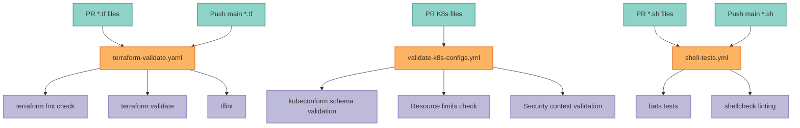

---

## Build & Hygiene Workflows

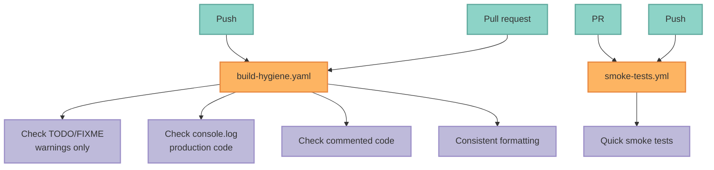

---

## Workflow Execution Frequency

### Continuous (On Every Push/PR)
- ci.yaml
- quality-tests.yaml
- deployment-validation.yml (if deployment files changed)
- security-scan.yaml
- docs-validation.yaml (if docs changed)
- build-hygiene.yaml

### Daily
- security-scan.yaml (3 AM UTC)
- gcp-drift-detection.yaml
- workflow-health-dashboard.yaml
- cost-tracking.yaml
- stale.yaml

### Weekly
- quality-tests.yaml (Sunday 12 AM UTC)
- e2e-tests.yaml (Monday 2 AM UTC)
- gcp-compliance-scan.yaml
- track-skipped-tests.yaml
- weekly-reports.yaml (Sunday 9 AM UTC)
- link-checker.yaml (Sunday)

### Hourly
- observability-alerts.yaml

### On-Demand (Manual/Conditional)
- deploy-preview-gke.yaml (push to develop OR manual)
- deploy-production-gke.yaml (release OR manual with approval)
- release.yaml (tag push OR manual)
- bump-deployment-versions.yaml (release OR manual)
- dependabot-automerge.yaml (Dependabot PR only)

---

## Workflow Dependencies & Blocking

### Blocking Workflows (Must Pass for Merge)
- ci.yaml
- quality-tests.yaml
- deployment-validation.yml (if deployment files changed)
- security-scan.yaml
- build-hygiene.yaml

### Informational Workflows (Don't Block)
- weekly-reports.yaml
- cost-tracking.yaml
- dora-metrics.yaml
- observability-alerts.yaml
- stale.yaml

### Required for Deployment
- ci.yaml (test job must pass)
- deployment-validation.yml (if deployment files changed)
- security-scan.yaml (HIGH/CRITICAL findings must be addressed)

---

## Consolidation Roadmap

### Phase 1: Documentation Workflows
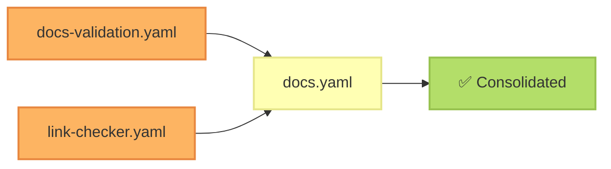

### Phase 2: Security Workflows
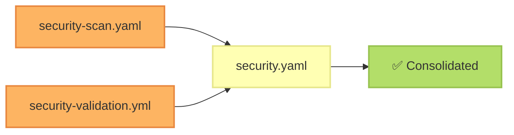

### Phase 3: Deployment Validation Workflows
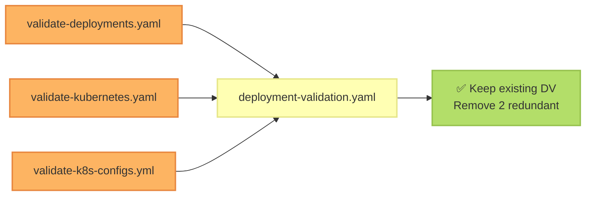

---

## Performance Optimization Opportunities

### Parallel Execution
Currently parallelized:
- test job (3 Python versions)
- docker-build (3 image variants)
- docker-compose-smoke-test (3 configs)
- docker-multiplatform (2 architectures)
- regression-tests (4 splits via pytest-split)

### Caching Improvements
Current caching:
- Python dependencies (uv cache)
- Docker layer caching
- Workflow-level caching

Potential improvements:
- Cache test results for unchanged files
- Cache build artifacts between jobs
- Shared cache across workflows

### Workflow Reusability
Extract to reusable workflows:
- setup-python-deps (already a composite action)
- docker-build-and-push pattern
- deploy-to-gke pattern
- run-tests-with-coverage pattern

---

## Related Documentation

- **Workflows Reference**: [WORKFLOWS.mdx](./workflows) - Detailed workflow documentation
- **Commands Reference**: [COMMANDS.mdx](./commands) - All Makefile targets
- **Validation Strategy**: [VALIDATION_STRATEGY.mdx](./validation-strategy) - Tiered validation approach
- **CI Configuration**: `.github/workflows/` - Workflow source files
- **Composite Actions**: `.github/actions/` - Reusable action components

---

**Last Updated**: 2025-11-16 (CI/CD Optimization - Phase 5)
**Total Workflows**: 31 workflows
**Version**: 1.0.0
**Status**: Active
