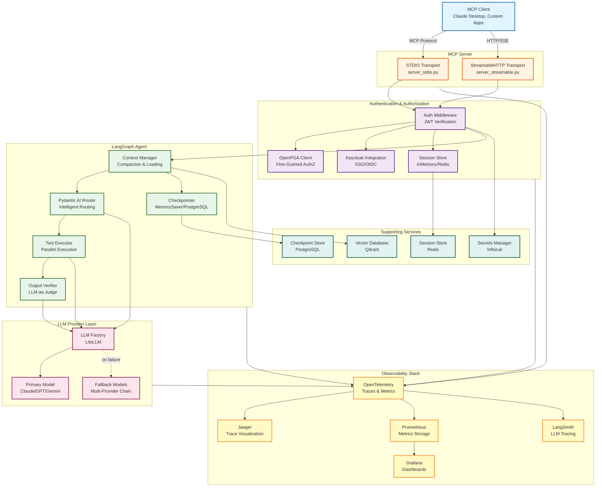
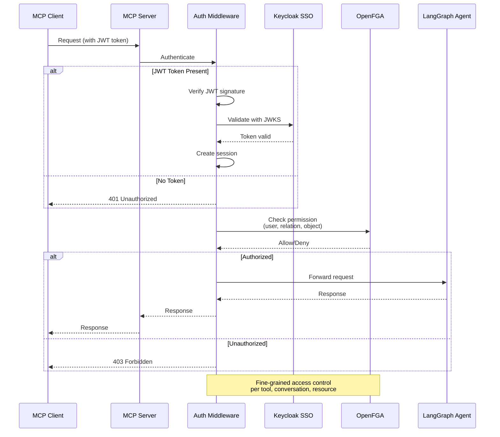
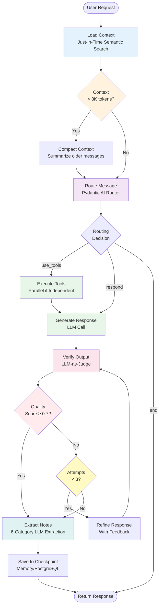
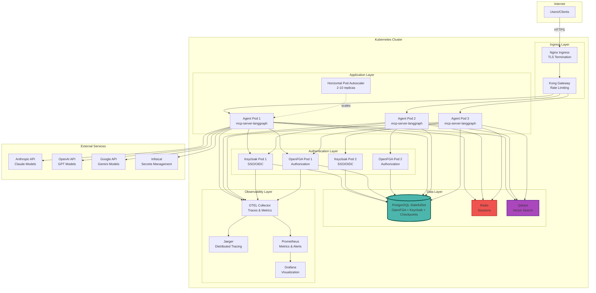
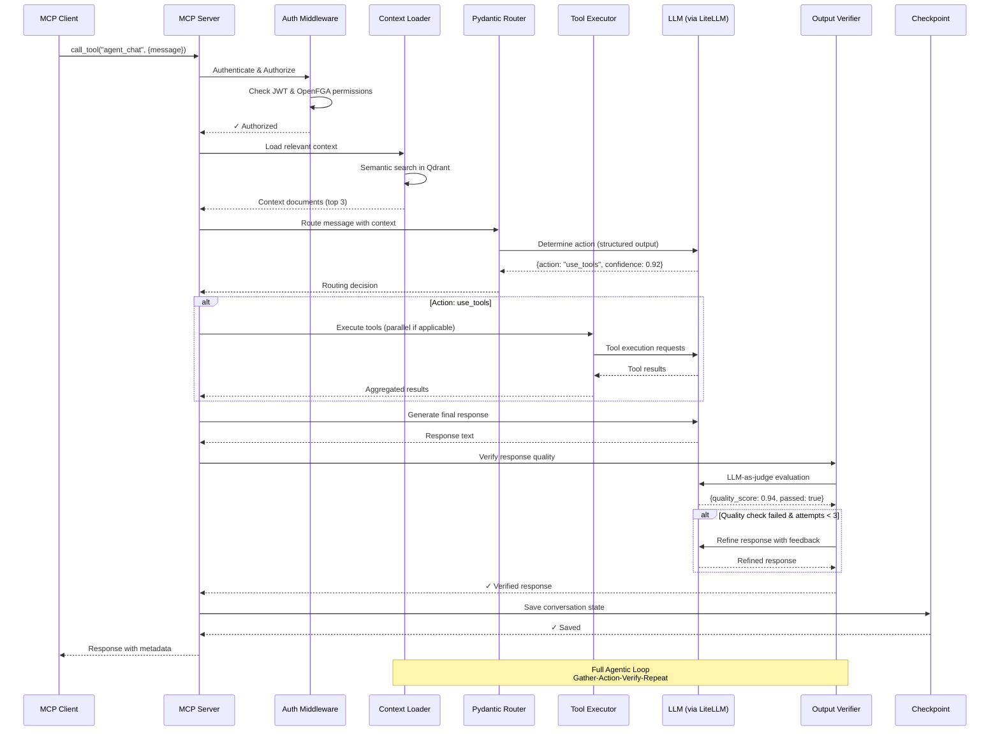
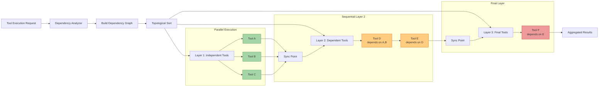
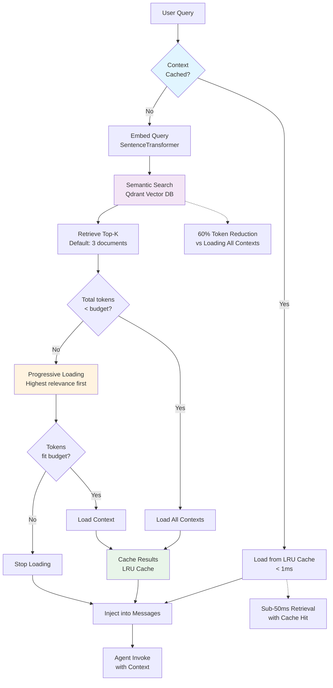
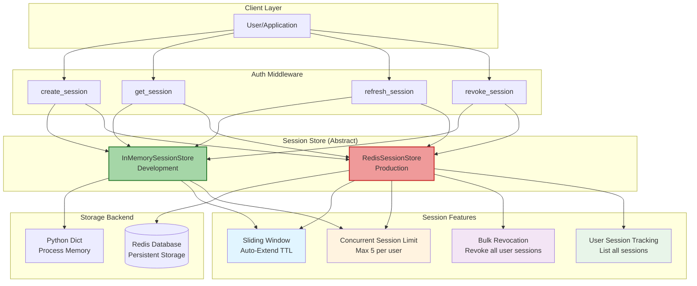
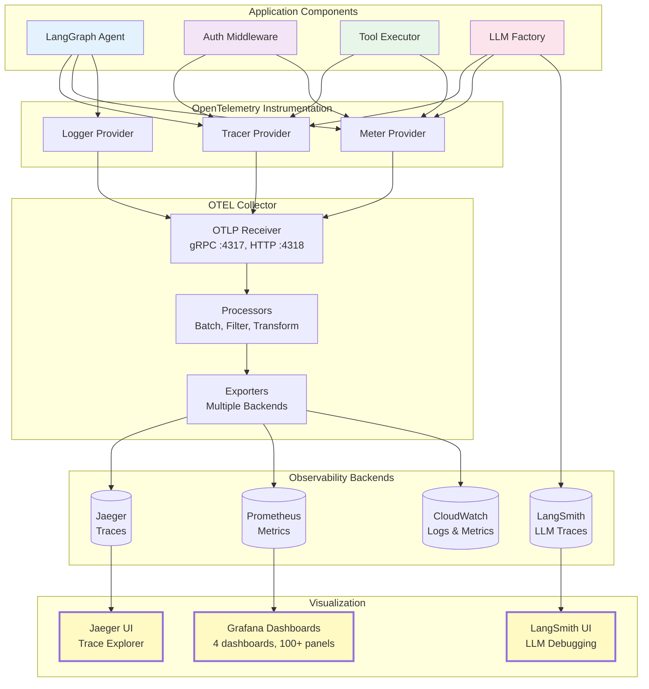

# System Architecture Diagram

This file contains Mermaid diagrams for the MCP Server LangGraph system architecture.

## High-Level System Architecture



## Authentication Flow



## Agentic Loop Workflow



## Deployment Architecture (Kubernetes)



## Data Flow - MCP Tool Execution



## Parallel Tool Execution



## Context Loading Strategy



## Session Management Architecture



## LLM Provider Fallback Chain

```mermaid
flowchart LR
    Request[LLM Request] --> Primary{Primary Model<br/>Available?}

    Primary -->|Success| Response[Return Response]
    Primary -->|Failure| Log1[Log Failure]

    Log1 --> Fallback1{Fallback 1<br/>Available?}
    Fallback1 -->|Success| Response
    Fallback1 -->|Failure| Log2[Log Failure]

    Log2 --> Fallback2{Fallback 2<br/>Available?}
    Fallback2 -->|Success| Response
    Fallback2 -->|Failure| Log3[Log Failure]

    Log3 --> Fallback3{Fallback 3<br/>Available?}
    Fallback3 -->|Success| Response
    Fallback3 -->|Failure| Error[All Models Failed<br/>Return Error]

    Response --> Metrics[Record Metrics<br/>Provider, Latency, Tokens]
    Error --> Metrics

    Metrics --> Alert{Multiple<br/>Failures?}
    Alert -->|Yes| Notify[Alert Ops Team<br/>Provider Outage]
    Alert -->|No| End([End])
    Notify --> End

    style Primary fill:#e3f2fd,stroke:#01579b,stroke-width:2px
    style Fallback1 fill:#fff3e0,stroke:#e65100,stroke-width:2px
    style Fallback2 fill:#f3e5f5,stroke:#4a148c,stroke-width:2px
    style Fallback3 fill:#e8f5e9,stroke:#1b5e20,stroke-width:2px
    style Error fill:#ffcdd2,stroke:#b71c1c,stroke-width:3px
    style Response fill:#c5e1a5,stroke:#33691e,stroke-width:2px
```



## Observability Data Flow



---

## Usage

### In Mintlify Documentation

To use these diagrams in Mintlify `.mdx` files:

```mdx
## System Architecture

```mermaid
graph TD
    ... (copy from above)
```
```

### Viewing Locally

1. **VS Code**: Install "Markdown Preview Mermaid Support" extension
2. **GitHub**: Mermaid renders automatically in markdown preview
3. **Mermaid Live Editor**: https://mermaid.live/

### Exporting to Images

```bash
# Install mermaid-cli
npm install -g @mermaid-js/mermaid-cli

# Export to PNG
mmdc -i docs/diagrams/system-architecture.md -o docs/diagrams/system-architecture.png

# Export to SVG
mmdc -i docs/diagrams/system-architecture.md -o docs/diagrams/system-architecture.svg
```

---

## Diagram Maintenance

**Last Updated**: 2025-10-22
**Update Frequency**: After major architectural changes
**Maintainer**: Platform Team

**When to Update**:
- New components added to the system
- Component relationships change
- New deployment patterns introduced
- Observability stack changes
