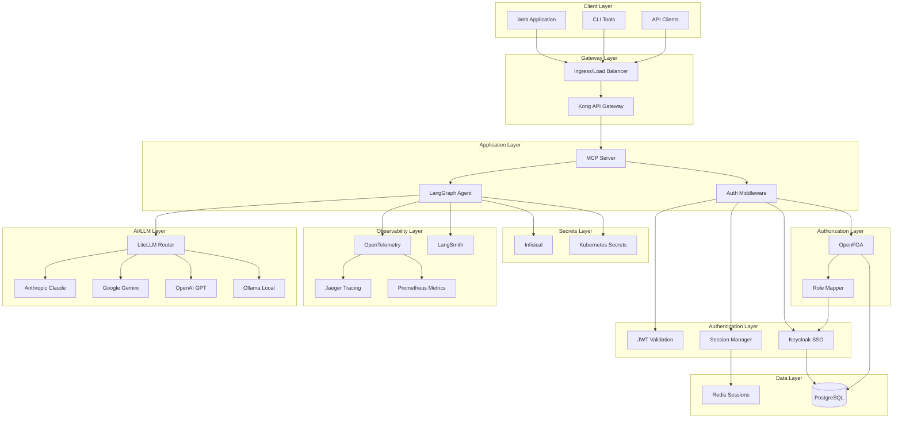
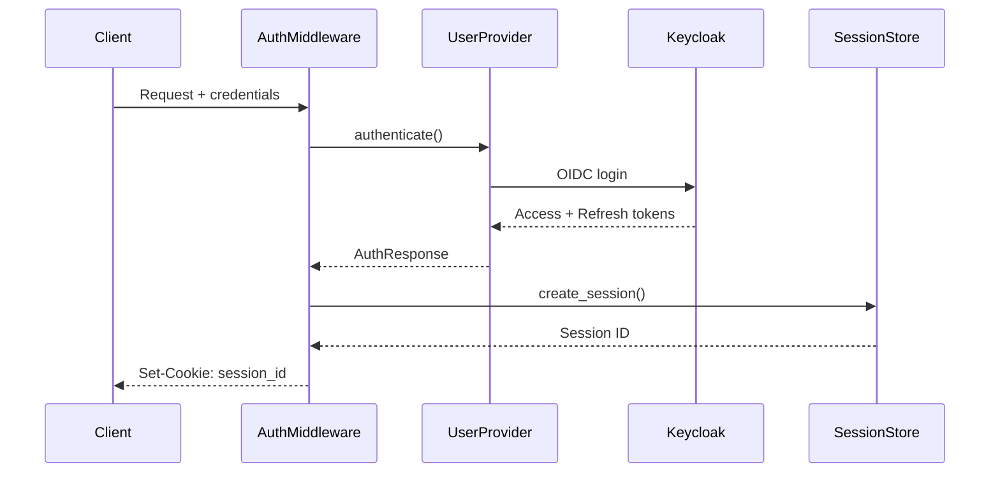
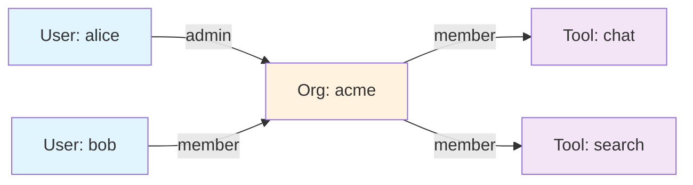
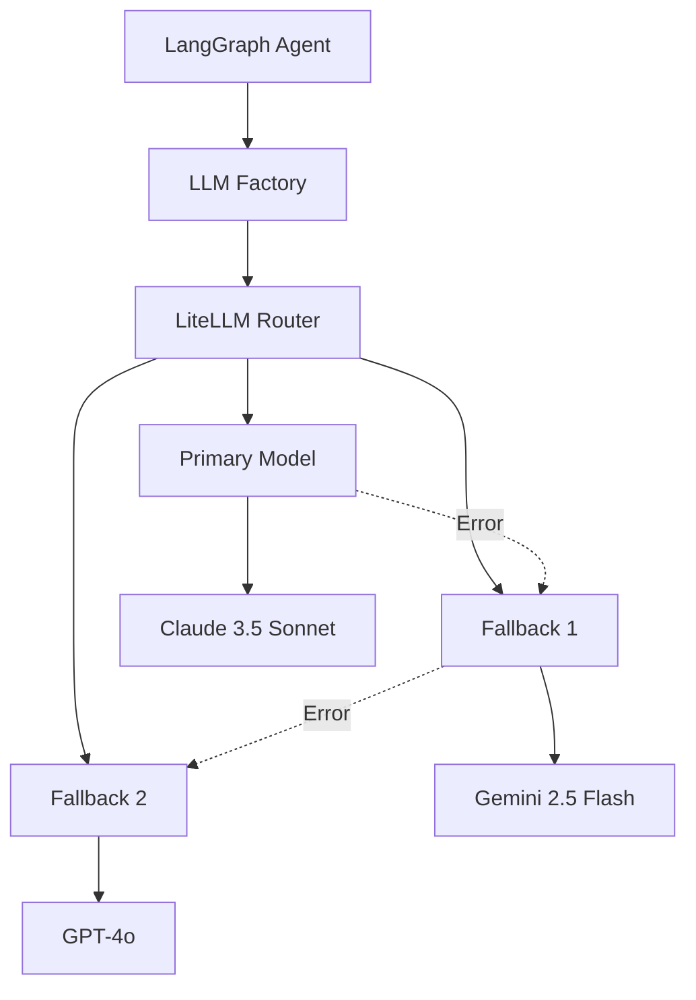
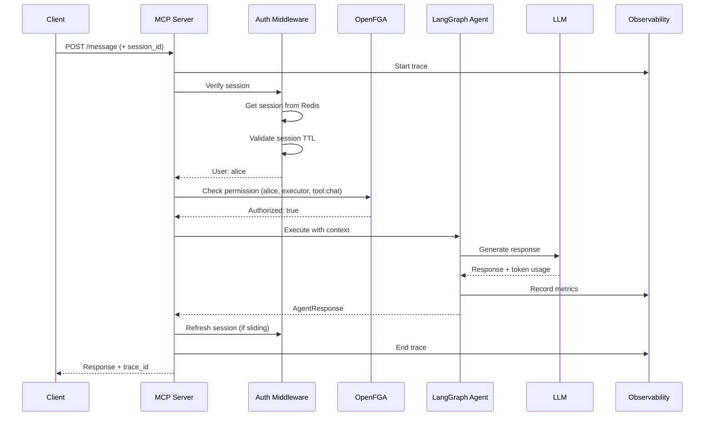
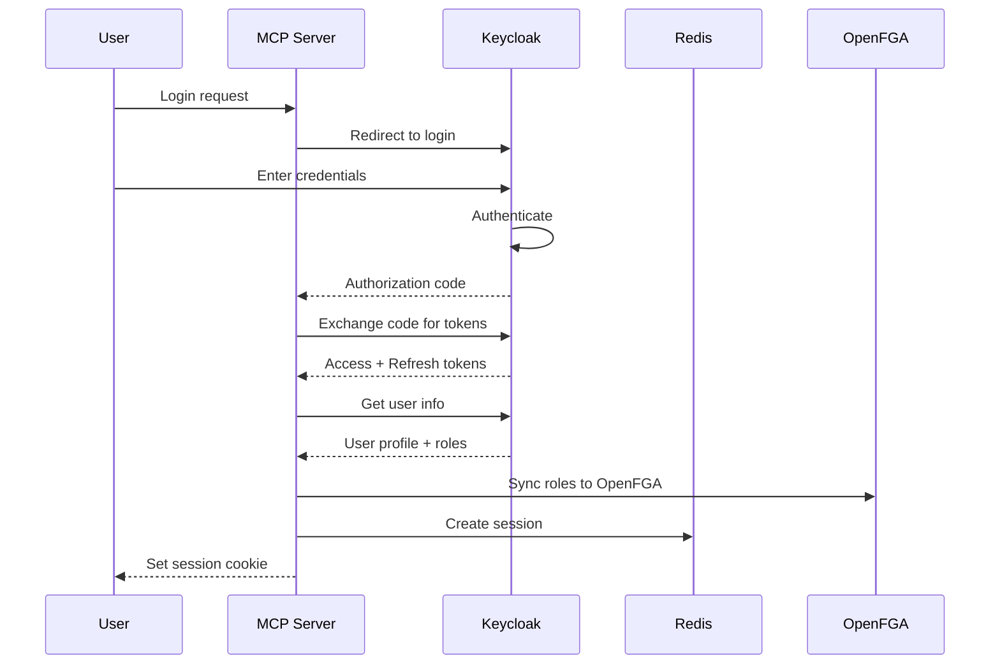
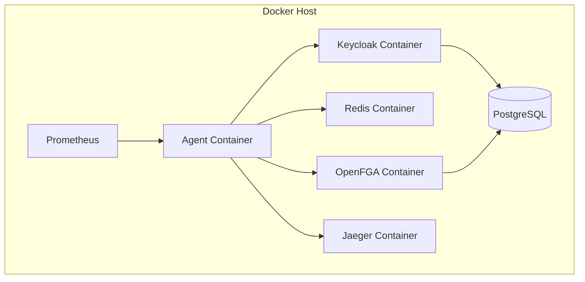

## Overview

MCP Server with LangGraph is a production-ready, multi-layered architecture designed for enterprise AI applications. It combines stateful AI agents, enterprise authentication, fine-grained authorization, and comprehensive observability.

## High-Level Architecture



## Core Components

### MCP Server

**Model Context Protocol server** - Exposes AI agents as standard tools.

<CardGroup cols={2}>
  <Card title="stdio Transport" icon="terminal">
    Standard input/output for CLI integration
    - Direct agent interaction
    - Shell scripting support
    - Development and testing
  </Card>

  <Card title="StreamableHTTP" icon="globe">
    HTTP API with streaming support
    - REST endpoints
    - Server-Sent Events (SSE)
    - Production deployments
  </Card>
</CardGroup>

**Key Features**:
- Protocol-compliant MCP implementation
- Tool registration and discovery
- Streaming responses
- Error handling and retries

**Code Location**: `src/mcp_server_langgraph/server.py`

---

### LangGraph Agent

**Stateful AI agent** with functional API and conditional routing.

```python
# Agent graph structure
START → authenticate → authorize → execute_tool → END
                ↓           ↓            ↓
          unauthorized  forbidden   tool_error
                ↓           ↓            ↓
               END         END       retry/END
```

**Components**:

<Tabs>
  <Tab title="State Management">
    **AgentState** - Pydantic model for type-safe state

    ```python
    class AgentState(BaseModel):
        messages: List[Message]
        user_id: str
        authorized: bool
        context: Dict[str, Any]
        tool_results: List[Any]
    ```

    **Features**:
    - Immutable state transitions
    - Type validation
    - Checkpointing support
  </Tab>

  <Tab title="Tool Execution">
    **Dynamic tool routing** based on LLM decisions

    ```python
    tools = {
        "chat": chat_tool,
        "search": search_tool,
        # Add custom tools
    }
    ```

    **Authorization**:
    - Per-tool permission checks
    - OpenFGA relationship validation
    - Fallback admin access
  </Tab>

  <Tab title="Checkpointing">
    **State persistence** for conversation history

    - In-memory checkpoints (development)
    - Redis checkpoints (production)
    - Resume interrupted conversations
    - Audit trail
  </Tab>
</Tabs>

**Code Location**: `src/mcp_server_langgraph/agent.py`

---

### Authentication Layer

**Pluggable authentication** with multiple provider support.



**Providers**:

<AccordionGroup>
  <Accordion title="InMemoryUserProvider" icon="memory">
    **Development and testing**

    - Pre-defined users (alice, bob, admin)
    - No external dependencies
    - Fast iteration
    - Zero configuration

    ```python
    users = {
        "alice": User(username="alice", roles=["admin"]),
        "bob": User(username="bob", roles=["user"])
    }
    ```
  </Accordion>

  <Accordion title="KeycloakUserProvider" icon="shield">
    **Production SSO**

    - OpenID Connect / OAuth2
    - JWKS token verification
    - Refresh token rotation
    - Role/group synchronization

    ```python
    provider = KeycloakUserProvider(
        server_url="https://sso.yourdomain.com",
        realm="langgraph-agent",
        client_id="langgraph-client"
    )
    ```
  </Accordion>

  <Accordion title="Custom Providers" icon="code">
    **Extensible architecture**

    Implement `UserProvider` interface:

    ```python
    class CustomProvider(UserProvider):
        async def authenticate(self, username, password):
            # Custom auth logic
            return AuthResponse(...)

        async def verify_token(self, token):
            # Custom verification
            return TokenVerification(...)
    ```
  </Accordion>
</AccordionGroup>

**Code Location**: `src/mcp_server_langgraph/auth/`

---

### Authorization Layer

**Fine-grained, relationship-based** access control with OpenFGA.



**Authorization Model**:

```typescript
type user

type organization
  relations
    define admin: [user]
    define member: [user] or admin

type tool
  relations
    define owner: [user]
    define executor: [user, organization#member]
    define viewer: [user, organization#member]
```

**Features**:
- Relationship-based permissions
- Hierarchical roles (admin → member → viewer)
- Multi-tenancy support
- Audit logging
- Keycloak role synchronization

**Code Location**: `src/mcp_server_langgraph/auth/openfga.py`

---

### Session Management

**Flexible session storage** with Redis or in-memory backends.

<Tabs>
  <Tab title="Architecture">
    ```mermaid
    graph LR
        App[Application] --> SM[SessionManager]
        SM --> Memory[InMemory Store]
        SM --> Redis[Redis Store]
        Redis --> Master[Redis Master]
        Redis --> Replica[Redis Replica]
    ```
  </Tab>

  <Tab title="Features">
    **Session Lifecycle**:
    - Creation with metadata
    - Retrieval and validation
    - Refresh with sliding window
    - Revocation (single or bulk)

    **Advanced**:
    - Concurrent session limits
    - IP/User agent tracking
    - TTL management
    - Automatic cleanup
  </Tab>

  <Tab title="Configuration">
    ```python
    # Redis backend
    SESSION_BACKEND=redis
    REDIS_URL=redis://redis:6379/0
    SESSION_TTL_SECONDS=86400
    SESSION_SLIDING_WINDOW=true
    SESSION_MAX_CONCURRENT=5

    # In-memory backend
    SESSION_BACKEND=memory
    ```
  </Tab>
</Tabs>

**Code Location**: `src/mcp_server_langgraph/auth/session.py`

---

### LLM Integration

**Multi-LLM routing** via LiteLLM with automatic fallback.



**Supported Providers** (100+):
- **Cloud**: Anthropic, OpenAI, Google, Azure, AWS Bedrock
- **Open Source**: Ollama (Llama, Mistral, Qwen, DeepSeek)
- **Custom**: Bring your own endpoints

**Features**:
- Automatic fallback on errors
- Load balancing
- Rate limiting
- Cost tracking
- Response caching

**Configuration**:
```python
LLM_PROVIDER=anthropic
MODEL_NAME=claude-3-5-sonnet-20241022
ENABLE_FALLBACK=true
FALLBACK_MODELS=["gemini-2.5-flash-002", "gpt-4o"]
```

**Code Location**: `src/mcp_server_langgraph/llm_factory.py`

---

### Observability

**Dual observability stack** - OpenTelemetry + LangSmith.

<Tabs>
  <Tab title="OpenTelemetry">
    **Distributed tracing and metrics**

    ```mermaid
    graph LR
        App[Application] --> Exporter[OTLP Exporter]
        Exporter --> Collector[OTel Collector]
        Collector --> Jaeger[Jaeger UI]
        Collector --> Prometheus[Prometheus]
        Prometheus --> Grafana[Grafana]
    ```

    **Traces**:
    - End-to-end request flow
    - LLM call timing
    - Authorization decisions
    - Tool executions

    **Metrics** (30+):
    - Request rate, latency, errors
    - Authentication success/failure
    - Authorization decisions
    - LLM token usage
    - Session lifecycle
  </Tab>

  <Tab title="LangSmith">
    **LLM-specific observability**

    - Prompt tracking
    - LLM response analysis
    - Chain visualization
    - Cost attribution
    - A/B testing
    - Evaluations

    ```python
    LANGSMITH_TRACING=true
    LANGSMITH_API_KEY=your-key
    LANGSMITH_PROJECT=langgraph-agent
    ```
  </Tab>

  <Tab title="Structured Logging">
    **JSON logging with context**

    ```json
    {
      "timestamp": "2025-10-12T10:30:00Z",
      "level": "INFO",
      "service": "mcp-server-langgraph",
      "trace_id": "abc123...",
      "span_id": "def456...",
      "user_id": "alice",
      "event": "authorization_check",
      "resource": "tool:chat",
      "authorized": true,
      "duration_ms": 15
    }
    ```
  </Tab>
</Tabs>

**Code Location**: `src/mcp_server_langgraph/observability/`

---

### Secrets Management

**Secure secret storage** with Infisical or cloud-native solutions.

<Tabs>
  <Tab title="Infisical">
    **Centralized secret management**

    - End-to-end encryption
    - Secret versioning
    - Access controls
    - Audit logging
    - Secret rotation

    ```python
    INFISICAL_CLIENT_ID=your-client-id
    INFISICAL_CLIENT_SECRET=your-secret
    INFISICAL_PROJECT_ID=project-id
    ```
  </Tab>

  <Tab title="Cloud Providers">
    **Native secret managers**

    - **GCP**: Secret Manager
    - **AWS**: Secrets Manager
    - **Azure**: Key Vault
    - **Kubernetes**: Secrets + RBAC

    Automatic injection via workload identity.
  </Tab>

  <Tab title="Local Development">
    **.env files with validation**

    ```bash
    # .env
    ANTHROPIC_API_KEY=sk-ant-...
    GOOGLE_API_KEY=AIza...
    JWT_SECRET_KEY=$(openssl rand -base64 32)
    ```

    <Warning>
    Never commit `.env` files to Git!
    </Warning>
  </Tab>
</Tabs>

**Code Location**: `src/mcp_server_langgraph/config.py`

---

## Data Flow

### Request Flow (Authenticated Request)



### Authentication Flow (Keycloak SSO)



---

## Deployment Architectures

### Development (Docker Compose)



**Command**: `docker compose up`

---

### Production (Kubernetes)

```mermaid
graph TB
    subgraph "Kubernetes Cluster"
        subgraph "Ingress"
            LB[Load Balancer]
            Ingress[Ingress Controller]
        end

        subgraph "Application Pods"
            A1[Agent Pod 1]
            A2[Agent Pod 2]
            A3[Agent Pod 3]
        end

        subgraph "Auth Services"
            KC1[Keycloak Pod 1]
            KC2[Keycloak Pod 2]
        end

        subgraph "Session Store"
            RM[Redis Master]
            RR[Redis Replica]
        end

        subgraph "Authorization"
            FGA1[OpenFGA Pod 1]
            FGA2[OpenFGA Pod 2]
        end

        subgraph "Data"
            PG[(PostgreSQL Primary)]
            PGR[(PostgreSQL Replica)]
        end
    end

    Internet --> LB
    LB --> Ingress
    Ingress --> A1
    Ingress --> A2
    Ingress --> A3
    A1 --> KC1
    A2 --> KC2
    A3 --> KC1
    A1 --> RM
    A2 --> RM
    A3 --> RM
    RM -.-> RR
    A1 --> FGA1
    A2 --> FGA2
    A3 --> FGA1
    KC1 --> PG
    KC2 --> PG
    FGA1 --> PG
    FGA2 --> PG
    PG -.-> PGR
```

**Deployment**: See [Kubernetes Guide](/deployment/kubernetes) or [Helm Guide](/deployment/helm)

---

## Design Principles

<AccordionGroup>
  <Accordion title="Modularity" icon="cubes">
    - Pluggable authentication providers
    - Swappable session stores
    - Custom authorization models
    - Extensible tool framework
  </Accordion>

  <Accordion title="Type Safety" icon="shield-check">
    - Pydantic models for all data
    - Type hints throughout
    - Validation at boundaries
    - Property-based testing
  </Accordion>

  <Accordion title="Observability First" icon="eye">
    - Trace every request
    - Structured logging
    - Comprehensive metrics
    - Correlation IDs
  </Accordion>

  <Accordion title="Security by Default" icon="lock">
    - Authentication required
    - Authorization on all tools
    - Secrets in secure stores
    - Encrypted communications
  </Accordion>

  <Accordion title="Production Ready" icon="rocket">
    - Health checks
    - Graceful shutdown
    - Error recovery
    - Rate limiting
    - Circuit breakers
  </Accordion>
</AccordionGroup>

---

## Technology Stack

<Tabs>
  <Tab title="Core">
    - **Python 3.10+**
    - **LangGraph**: Stateful agent framework
    - **LiteLLM**: Multi-LLM router
    - **Pydantic**: Data validation
    - **FastAPI**: HTTP server (StreamableHTTP)
  </Tab>

  <Tab title="Authentication">
    - **Keycloak**: SSO and OIDC
    - **PyJWT**: Token validation
    - **Redis**: Session storage
  </Tab>

  <Tab title="Authorization">
    - **OpenFGA**: Relationship-based authz
    - **PostgreSQL**: Authorization data
  </Tab>

  <Tab title="Observability">
    - **OpenTelemetry**: Tracing & metrics
    - **Jaeger**: Trace visualization
    - **Prometheus**: Metrics storage
    - **Grafana**: Dashboards
    - **LangSmith**: LLM observability
  </Tab>

  <Tab title="Infrastructure">
    - **Docker**: Containerization
    - **Kubernetes**: Orchestration
    - **Helm**: Package management
    - **Infisical**: Secrets management
  </Tab>
</Tabs>

---

## Next Steps

<CardGroup cols={2}>
  <Card title="Quick Start" icon="rocket" href="/getting-started/quickstart">
    Get started in 5 minutes
  </Card>
  <Card title="Authentication" icon="key" href="/getting-started/authentication">
    Configure authentication
  </Card>
  <Card title="Authorization" icon="shield" href="/getting-started/authorization">
    Setup fine-grained permissions
  </Card>
  <Card title="Observability" icon="chart-line" href="/guides/observability">
    Enable tracing and metrics
  </Card>
</CardGroup>

---

<Check>
**Enterprise-Grade Architecture**: Production-ready components designed for scale and reliability!
</Check>
