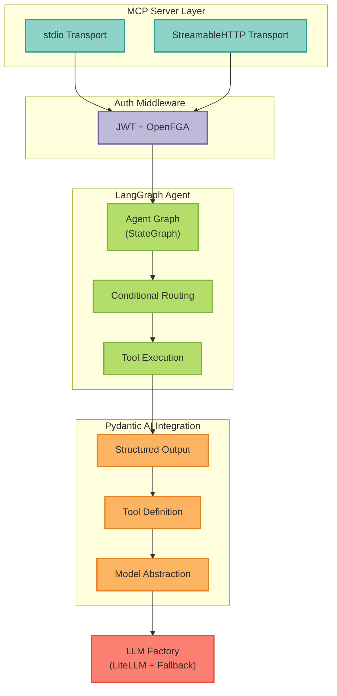

# Agent Architecture and Usage

This document describes the agent architecture used in MCP Server LangGraph and provides guidance for working with LangGraph agents and Pydantic AI integration.

**Related Documentation**: This guide covers agent architecture. For Claude Code workflow guidance, see [CLAUDE.md](https://github.com/vishnu2kmohan/mcp-server-langgraph/blob/main/.github/CLAUDE.md).

## Table of Contents

- [Overview](#overview)
- [LangGraph Agent](#langgraph-agent)
- [Pydantic AI Integration](#pydantic-ai-integration)
- [Agent Configuration](#agent-configuration)
- [Tool Integration](#tool-integration)
- [State Management](#state-management)
- [Best Practices](#best-practices)

## Overview

MCP Server LangGraph implements a **functional agent architecture** using LangGraph for stateful conversation management and Pydantic AI for structured outputs and tool calling.

**Note**: This guide is placed at the repository root for maximum discoverability. For project-specific Claude Code workflow patterns, see [CLAUDE.md](https://github.com/vishnu2kmohan/mcp-server-langgraph/blob/main/.github/CLAUDE.md).

### Architecture Diagram

[... rest of AGENTS.md content continues as in the original ...]

---

**Last Updated**: 2025-10-14
**LangGraph Version**: 0.6.10 (upgraded from 0.2.28)
**Pydantic AI Version**: 0.0.15
