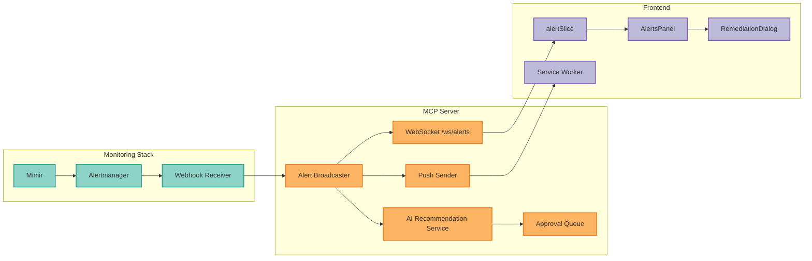
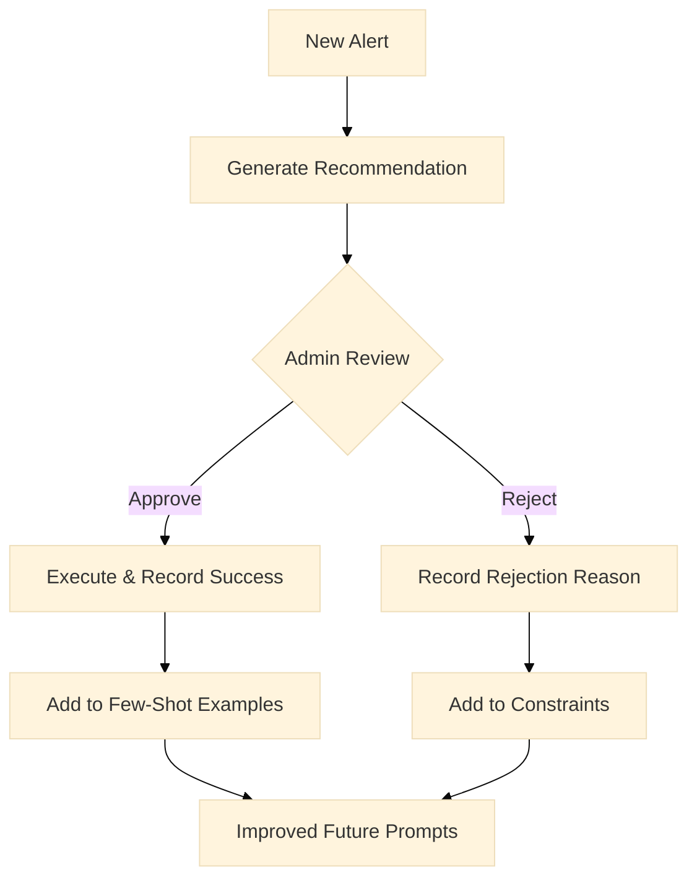
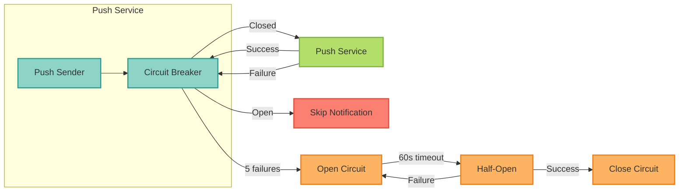

<Note>
**NEW in v2.8.0** - Complete alert management integration with OTEL/Mimir, AI-powered remediation recommendations, and Web Push notifications for critical alerts.
</Note>

### Overview

The Alert Management system provides:

- **Real-time Alerting** - WebSocket-based alert streaming from Alertmanager
- **AI Remediation** - LLM-powered root cause analysis and fix recommendations
- **Human Approval** - Mandatory approval workflow for all remediation actions
- **Push Notifications** - Browser notifications for critical alerts
- **Alert Grouping** - Frontend-based alert grouping by service and name
- **Feedback Learning** - AI improves recommendations based on approval/rejection patterns

### Architecture



### Quick Start

<Steps>
  <Step title="Configure Alertmanager Webhook">
    Add the MCP Server webhook receiver to your Alertmanager configuration:

    ```yaml
    # alertmanager.yml
    receivers:
      - name: 'mcp-server'
        webhook_configs:
          - url: 'http://mcp-server-langgraph:8000/api/v1/webhooks/alertmanager'
            send_resolved: true
            http_config:
              bearer_token_file: /etc/alertmanager/mcp-token

    route:
      receiver: 'mcp-server'
      group_by: ['alertname', 'service']
      group_wait: 30s
      group_interval: 5m
      repeat_interval: 4h
      routes:
        # Only route critical and warning alerts
        - match:
            severity: critical
          receiver: 'mcp-server'
          continue: true
        - match:
            severity: warning
          receiver: 'mcp-server'
          continue: true
    ```
  </Step>

  <Step title="Set Environment Variables">
    Configure the required environment variables:

    ```bash
    # .env

    # Alertmanager webhook authentication (optional but recommended)
    ALERTMANAGER_WEBHOOK_SECRET=your-webhook-secret

    # AI Recommendation settings
    AI_RECOMMENDATION_MODEL=claude-3-5-sonnet-20241022
    AI_RECOMMENDATION_CACHE_TTL=300  # 5 minutes

    # Web Push VAPID Keys (generate with: npx web-push generate-vapid-keys)
    VAPID_PUBLIC_KEY=BEl62iUYgUivxIkv...
    VAPID_PRIVATE_KEY=UUxI4O8k-x-...
    VAPID_CLAIMS_EMAIL=admin@yourdomain.com
    ```

    <Tip>
    Generate VAPID keys using the web-push CLI:
    ```bash
    npx web-push generate-vapid-keys
    ```
    </Tip>
  </Step>

  <Step title="Run Database Migrations">
    Apply the required database migrations:

    ```bash
    # Using Alembic
    uv run alembic upgrade head

    # Or manually apply migrations
    psql -U postgres -d mcp_server -f migrations/002_remediation_feedback.sql
    psql -U postgres -d mcp_server -f migrations/003_push_subscriptions.sql
    ```
  </Step>

  <Step title="Access Admin Dashboard">
    Navigate to the Admin Dashboard Alerts tab:

    1. Log in with an admin account
    2. Navigate to **Admin Dashboard** > **Alerts** tab
    3. Enable sound notifications (optional)
    4. Subscribe to push notifications (optional)
  </Step>
</Steps>

### API Endpoints

#### Alert Webhook

Receives alerts from Alertmanager:

```http
POST /api/v1/webhooks/alertmanager
Content-Type: application/json
Authorization: Bearer <token>

{
  "version": "4",
  "status": "firing",
  "alerts": [
    {
      "status": "firing",
      "labels": {
        "alertname": "HighCPUUsage",
        "severity": "critical",
        "service": "api-gateway"
      },
      "annotations": {
        "summary": "CPU usage above 90%",
        "description": "Instance api-gateway-1 has high CPU"
      },
      "startsAt": "2024-01-15T10:00:00Z"
    }
  ]
}
```

#### AI Recommendations

Get AI-generated remediation recommendations:

```http
GET /api/v1/alerts/{alert_id}/recommendation
Authorization: Bearer <admin-token>

# Response
{
  "recommendation_id": "rec-123",
  "alert_id": "alert-456",
  "root_cause_analysis": "High CPU is caused by...",
  "remediation_steps": [
    {
      "step_number": 1,
      "action": "Scale pods",
      "description": "Increase replica count",
      "command": "kubectl scale deployment api-gateway --replicas=3",
      "requires_approval": true,
      "risk_level": "low"
    }
  ],
  "risk_assessment": {
    "overall_risk": "medium",
    "factors": ["Service restart required"]
  },
  "generated_at": "2024-01-15T10:05:00Z",
  "model_used": "claude-3-5-sonnet-20241022"
}
```

Regenerate a recommendation:

```http
POST /api/v1/alerts/{alert_id}/recommendation/regenerate
Authorization: Bearer <admin-token>
```

#### Alert Correlation

Correlate alerts to find related issues and identify root causes:

```http
POST /api/v1/alerts/correlate
Authorization: Bearer <admin-token>
Content-Type: application/json

{
  "correlation_type": "label",
  "label_key": "service",
  "detect_patterns": true,
  "identify_root_cause": true
}
```

**Request Parameters:**

| Field | Type | Description |
|-------|------|-------------|
| `correlation_type` | `"label"` \| `"time"` | How to correlate alerts |
| `label_key` | string | Label key for label-based correlation (required if type="label") |
| `window_minutes` | int (1-60) | Time window for time-based correlation (default: 5) |
| `detect_patterns` | boolean | Detect patterns like cascading_failure, resource_exhaustion |
| `identify_root_cause` | boolean | Identify the likely root cause alert in each group |

**Response:**

```json
{
  "groups": [
    {
      "group_key": "uuid-123",
      "label_value": "api-gateway",
      "alerts": [
        {
          "alert_id": "alert-1",
          "name": "HighCPU",
          "severity": "critical",
          "started_at": "2024-01-15T10:00:00Z",
          "labels": {"service": "api-gateway"},
          "is_root_cause": true
        },
        {
          "alert_id": "alert-2",
          "name": "HighLatency",
          "severity": "warning",
          "started_at": "2024-01-15T10:02:00Z",
          "labels": {"service": "api-gateway"},
          "is_root_cause": false
        }
      ],
      "root_cause_id": "alert-1",
      "pattern": {
        "pattern_type": "resource_exhaustion",
        "confidence": 0.85,
        "description": "Multiple resource-related alerts detected",
        "affected_alerts": ["HighCPU", "HighMemory"]
      }
    }
  ],
  "total_alerts": 5,
  "total_groups": 2
}
```

**Correlation Types:**

<Tabs>
  <Tab title="Label-based">
    Groups alerts by a common label (e.g., `service`, `host`, `namespace`):

    ```json
    {
      "correlation_type": "label",
      "label_key": "service"
    }
    ```

    Use this to find all alerts related to a specific service or host.
  </Tab>
  <Tab title="Time-based">
    Groups alerts that occur within a time window:

    ```json
    {
      "correlation_type": "time",
      "window_minutes": 5
    }
    ```

    Use this to find alerts that may be caused by the same incident.
  </Tab>
</Tabs>

**Pattern Detection:**

When `detect_patterns: true`, the API analyzes alert groups for common failure patterns:

| Pattern | Description | Detected When |
|---------|-------------|---------------|
| `cascading_failure` | Failure spreading across services | Related services fail in sequence |
| `resource_exhaustion` | Resource limits reached | Multiple CPU/memory/disk alerts |
| `network_partition` | Network connectivity issues | Multiple network-related alerts |
| `deployment_issue` | Recent deployment caused problems | Alerts correlate with deploy time |

#### Remediation Approvals

List pending remediations:

```http
GET /api/v1/remediations/pending
Authorization: Bearer <admin-token>

# Response
{
  "pending": [
    {
      "id": "rem-123",
      "alert_id": "alert-456",
      "recommendation_id": "rec-789",
      "status": "pending",
      "created_at": "2024-01-15T10:05:00Z"
    }
  ]
}
```

Approve a remediation:

```http
POST /api/v1/remediations/{id}/approve
Authorization: Bearer <admin-token>
Content-Type: application/json

{
  "approval_notes": "Approved after verifying impact"
}
```

Reject with structured feedback:

```http
POST /api/v1/remediations/{id}/reject
Authorization: Bearer <admin-token>
Content-Type: application/json

{
  "reason": "too_risky",
  "reason_detail": "Cannot restart during peak hours"
}
```

<Info>
**Rejection reasons** help improve AI recommendations over time:
- `too_risky` - Command or action is too dangerous
- `incorrect_diagnosis` - Root cause analysis is wrong
- `wrong_command` - Command syntax or path is incorrect
- `incomplete_steps` - Missing important steps
- `not_relevant` - Doesn't apply to this alert
- `prefer_manual` - Want to handle manually
- `other` - Other reason (specify in detail)
</Info>

### WebSocket Connection

Connect to receive real-time alerts:

```typescript
// Frontend example
const ws = new WebSocket('wss://your-domain/ws/alerts?token=<jwt>');

ws.onmessage = (event) => {
  const alert = JSON.parse(event.data);
  console.log('New alert:', alert);

  // Handle based on severity
  if (alert.severity === 'critical') {
    playAlertSound();
    showToastNotification(alert);
  }
};

ws.onerror = (error) => {
  console.error('WebSocket error:', error);
  // Implement reconnection logic
};
```

### Push Notifications

#### Subscribe to Push Notifications

```typescript
// Request notification permission
const permission = await Notification.requestPermission();
if (permission !== 'granted') return;

// Get push subscription
const registration = await navigator.serviceWorker.ready;
const subscription = await registration.pushManager.subscribe({
  userVisibleOnly: true,
  applicationServerKey: urlBase64ToUint8Array(VAPID_PUBLIC_KEY)
});

// Send to backend
await fetch('/api/v1/notifications/push/subscribe', {
  method: 'POST',
  headers: {
    'Content-Type': 'application/json',
    'Authorization': `Bearer ${token}`
  },
  body: JSON.stringify({
    endpoint: subscription.endpoint,
    keys: {
      p256dh: btoa(String.fromCharCode(...new Uint8Array(subscription.getKey('p256dh')))),
      auth: btoa(String.fromCharCode(...new Uint8Array(subscription.getKey('auth'))))
    },
    deviceName: 'Chrome on Windows'
  })
});
```

<Warning>
**Device Limit**: Each user can have a maximum of 5 push subscriptions to prevent device spam. Remove unused subscriptions via the Settings page.
</Warning>

#### Managing Subscriptions

List your subscriptions:

```http
GET /api/v1/notifications/push/subscriptions
Authorization: Bearer <token>

# Response
[
  {
    "id": "sub-123",
    "endpoint": "https://fcm.googleapis.com/fcm/send/abc...",
    "device_name": "Chrome on Windows",
    "created_at": "2024-01-15T10:00:00Z",
    "last_used_at": "2024-01-15T12:00:00Z"
  }
]
```

Remove a subscription:

```http
DELETE /api/v1/notifications/push/unsubscribe
Authorization: Bearer <token>
Content-Type: application/json

{
  "endpoint": "https://fcm.googleapis.com/fcm/send/abc..."
}
```

### Frontend Components

#### AlertsPanel

The main alerts view in the Admin Dashboard:

```tsx
import { AlertsPanel } from '@/components/Admin/AlertsPanel';

// In AdminDashboard.tsx
<Tabs defaultValue="overview">
  <TabsList>
    <TabsTrigger value="overview">Overview</TabsTrigger>
    <TabsTrigger value="users">Users</TabsTrigger>
    <TabsTrigger value="alerts">
      Alerts
      {criticalCount > 0 && (
        <Badge variant="destructive">{criticalCount}</Badge>
      )}
    </TabsTrigger>
  </TabsList>

  <TabsContent value="alerts">
    <AlertsPanel />
  </TabsContent>
</Tabs>
```

#### Alert Grouping

Toggle between flat and grouped alert views:

```tsx
import { useAppSelector } from '@/store/hooks';
import { selectAlertGroups, selectFilteredAlertGroups } from '@/store/slices/alertSlice';

function AlertsPanel() {
  const [viewMode, setViewMode] = useState<'flat' | 'grouped'>('grouped');
  const groups = useAppSelector(selectFilteredAlertGroups);

  return (
    <div>
      <ToggleGroup value={viewMode} onValueChange={setViewMode}>
        <ToggleGroupItem value="flat">Flat</ToggleGroupItem>
        <ToggleGroupItem value="grouped">Grouped</ToggleGroupItem>
      </ToggleGroup>

      {viewMode === 'grouped' ? (
        <AlertGroupsPanel groups={groups} />
      ) : (
        <AlertList alerts={alerts} />
      )}
    </div>
  );
}
```

#### Sound Toggle

Enable/disable alert sounds:

```tsx
import { useAlertSound } from '@/hooks/useAlertSound';

function AlertSettings() {
  const { soundEnabled, toggleSound, playTestSound } = useAlertSound();

  return (
    <div>
      <Switch
        checked={soundEnabled}
        onCheckedChange={toggleSound}
        aria-label="Enable alert sounds"
      />
      <Button variant="ghost" onClick={playTestSound}>
        Test Sound
      </Button>
    </div>
  );
}
```

### AI Recommendation Tuning

The AI recommendation system uses few-shot learning to improve over time:

#### How It Works

1. **Initial Recommendations**: AI generates recommendations based on alert context
2. **Approval/Rejection**: Admins approve or reject with structured feedback
3. **Pattern Learning**: System tracks rejection reasons and successful remediations
4. **Prompt Enhancement**: Future prompts include successful examples and constraints

#### Feedback Loop



#### Providing Good Feedback

When rejecting recommendations, provide specific feedback:

<AccordionGroup>
  <Accordion title="Too Risky">
    Use when the suggested command could cause outages or data loss.
    **Example**: "Cannot run `kubectl delete pod` during business hours"
  </Accordion>
  <Accordion title="Incorrect Diagnosis">
    Use when the root cause analysis is wrong.
    **Example**: "CPU spike is caused by memory leak, not traffic increase"
  </Accordion>
  <Accordion title="Wrong Command">
    Use when command syntax or paths are incorrect.
    **Example**: "Service name is `api-gateway-v2`, not `api-gateway`"
  </Accordion>
  <Accordion title="Incomplete Steps">
    Use when critical steps are missing.
    **Example**: "Missing step to drain node before maintenance"
  </Accordion>
</AccordionGroup>

### Deployment

#### Kubernetes

```yaml
# values.yaml for Helm chart
alerts:
  enabled: true
  webhook:
    secret: ${ALERTMANAGER_WEBHOOK_SECRET}

  ai:
    model: claude-3-5-sonnet-20241022
    cacheTTL: 300

  pushNotifications:
    enabled: true
    vapidPublicKey: ${VAPID_PUBLIC_KEY}
    vapidPrivateKey: ${VAPID_PRIVATE_KEY}
    claimsEmail: admin@yourdomain.com

# Alertmanager ServiceMonitor for webhook
alertmanager:
  config:
    receivers:
      - name: mcp-server
        webhook_configs:
          - url: http://mcp-server-langgraph:8000/api/v1/webhooks/alertmanager
            send_resolved: true
```

#### Docker Compose

```yaml
# docker-compose.yml
services:
  mcp-server:
    environment:
      - ALERTMANAGER_WEBHOOK_SECRET=${ALERTMANAGER_WEBHOOK_SECRET}
      - AI_RECOMMENDATION_MODEL=claude-3-5-sonnet-20241022
      - VAPID_PUBLIC_KEY=${VAPID_PUBLIC_KEY}
      - VAPID_PRIVATE_KEY=${VAPID_PRIVATE_KEY}
      - VAPID_CLAIMS_EMAIL=admin@yourdomain.com

  alertmanager:
    image: prom/alertmanager:v0.27.0
    volumes:
      - ./alertmanager.yml:/etc/alertmanager/alertmanager.yml
    command:
      - '--config.file=/etc/alertmanager/alertmanager.yml'
```

### Rate Limits

| Endpoint | Limit | Purpose |
|----------|-------|---------|
| `POST /webhooks/alertmanager` | 120/minute | Alertmanager webhook |
| `POST /notifications/push/subscribe` | 10/minute | Push subscription |
| `GET /alerts/{id}/recommendation` | 30/minute | AI recommendations |

### Security Considerations

<Warning>
**Important Security Notes:**

1. **Webhook Authentication**: Always use bearer token authentication for the Alertmanager webhook in production
2. **RBAC Enforcement**: Only admin users can view alerts and approve remediations
3. **Subscription Ownership**: Users can only manage their own push subscriptions (admins can manage all)
4. **Device Limits**: Maximum 5 push subscriptions per user to prevent abuse
</Warning>

### Troubleshooting

<AccordionGroup>
  <Accordion title="Alerts not appearing in dashboard">
    1. Check Alertmanager is sending webhooks: `curl -X POST http://localhost:8000/api/v1/webhooks/alertmanager -d '{"alerts":[]}'`
    2. Verify WebSocket connection: Check browser DevTools Network tab
    3. Ensure user has admin role
  </Accordion>

  <Accordion title="Push notifications not working">
    1. Check notification permission: `Notification.permission`
    2. Verify service worker registration: `navigator.serviceWorker.ready`
    3. Check VAPID keys are correctly configured
    4. Inspect subscription in Settings page
  </Accordion>

  <Accordion title="AI recommendations taking too long">
    1. Check LLM provider status
    2. Verify `AI_RECOMMENDATION_MODEL` is valid
    3. Check cache TTL settings
    4. Review recommendation service logs
  </Accordion>

  <Accordion title="Remediation execution failures">
    1. Check remediation script permissions
    2. Verify Kubernetes/Docker credentials
    3. Review execution logs in Loki
    4. Check approval queue for stuck items
  </Accordion>
</AccordionGroup>

### Runbooks

Pre-configured runbooks for common alert scenarios. These runbooks are referenced by AI recommendations and provide standardized remediation steps.

<AccordionGroup>
  <Accordion title="HighCPUUsage">
    **Severity**: Critical

    **Root Cause Analysis**:
    1. Check current CPU usage: `kubectl top pods -n <namespace>`
    2. Identify hot processes: `kubectl exec <pod> -- top -bn1`
    3. Check for runaway queries or infinite loops in logs

    **Remediation Steps**:
    ```bash
    # Step 1: Scale horizontally if load-based
    kubectl scale deployment <name> --replicas=<current+1>

    # Step 2: If single pod issue, restart
    kubectl delete pod <pod-name>

    # Step 3: If persistent, apply resource limits
    kubectl patch deployment <name> -p '{"spec":{"template":{"spec":{"containers":[{"name":"<container>","resources":{"limits":{"cpu":"500m"}}}]}}}}'
    ```

    **Post-Remediation**:
    - Verify CPU returned to normal: `kubectl top pods`
    - Check application health endpoint
    - Review Grafana dashboard for pattern
  </Accordion>

  <Accordion title="HighMemoryUsage">
    **Severity**: Critical

    **Root Cause Analysis**:
    1. Check memory usage: `kubectl top pods -n <namespace>`
    2. Look for OOMKilled events: `kubectl describe pod <pod>`
    3. Check for memory leaks in application logs

    **Remediation Steps**:
    ```bash
    # Step 1: Identify highest memory consumers
    kubectl top pods --sort-by=memory -n <namespace>

    # Step 2: For memory leaks, restart the pod
    kubectl rollout restart deployment/<name>

    # Step 3: Increase memory limits if undersized
    kubectl set resources deployment/<name> --limits=memory=2Gi
    ```

    **Post-Remediation**:
    - Monitor memory trend in Grafana
    - Schedule heap dump analysis if recurring
  </Accordion>

  <Accordion title="HighLatency (P99 > threshold)">
    **Severity**: Warning/Critical

    **Root Cause Analysis**:
    1. Check endpoint latency in Grafana Tempo traces
    2. Identify slow database queries
    3. Check downstream service health

    **Remediation Steps**:
    ```bash
    # Step 1: Check service mesh metrics
    kubectl exec -it <pod> -- curl localhost:9090/metrics | grep request_duration

    # Step 2: Enable query logging for slow queries
    kubectl set env deployment/<name> LOG_SLOW_QUERIES=true

    # Step 3: Scale if throughput-related
    kubectl scale deployment/<name> --replicas=<count>
    ```

    **Post-Remediation**:
    - Review traces in Tempo for the time period
    - Check if latency correlates with external dependencies
  </Accordion>

  <Accordion title="PodCrashLooping">
    **Severity**: Critical

    **Root Cause Analysis**:
    1. Check pod status: `kubectl get pods -n <namespace>`
    2. View crash logs: `kubectl logs <pod> --previous`
    3. Check events: `kubectl describe pod <pod>`

    **Remediation Steps**:
    ```bash
    # Step 1: Get crash reason
    kubectl logs <pod> --previous | tail -50

    # Step 2: Check resource constraints
    kubectl describe pod <pod> | grep -A5 "Last State"

    # Step 3: For config issues, check ConfigMaps
    kubectl get configmap <name> -o yaml

    # Step 4: Rollback if recent deployment
    kubectl rollout undo deployment/<name>
    ```

    **Post-Remediation**:
    - Verify pod is Running
    - Check deployment history for what changed
  </Accordion>

  <Accordion title="DatabaseConnectionPoolExhausted">
    **Severity**: Critical

    **Root Cause Analysis**:
    1. Check active connections: `SELECT count(*) FROM pg_stat_activity;`
    2. Identify long-running queries
    3. Check for connection leaks

    **Remediation Steps**:
    ```bash
    # Step 1: Kill idle connections (PostgreSQL)
    SELECT pg_terminate_backend(pid) FROM pg_stat_activity
    WHERE state = 'idle' AND query_start < now() - interval '30 minutes';

    # Step 2: Increase pool size if undersized
    kubectl set env deployment/<name> DB_POOL_SIZE=20

    # Step 3: Enable connection recycling
    kubectl set env deployment/<name> DB_POOL_RECYCLE=300
    ```

    **Post-Remediation**:
    - Monitor `pg_stat_activity` for connection count
    - Check application logs for connection errors
  </Accordion>

  <Accordion title="DiskSpaceLow">
    **Severity**: Warning/Critical

    **Root Cause Analysis**:
    1. Check disk usage: `df -h`
    2. Find large files: `du -sh /* | sort -rh | head`
    3. Check log rotation configuration

    **Remediation Steps**:
    ```bash
    # Step 1: Clean old logs
    find /var/log -name "*.gz" -mtime +7 -delete

    # Step 2: Clear package cache
    apt-get clean && rm -rf /var/lib/apt/lists/*

    # Step 3: Expand volume if cloud-based
    # AWS: aws ec2 modify-volume --volume-id vol-xxx --size 100
    # Then: growpart /dev/xvda 1 && resize2fs /dev/xvda1
    ```

    **Post-Remediation**:
    - Verify disk usage dropped
    - Set up alerting at lower threshold
    - Consider PVC expansion for Kubernetes
  </Accordion>

  <Accordion title="ServiceUnavailable (5xx errors)">
    **Severity**: Critical

    **Root Cause Analysis**:
    1. Check pod health: `kubectl get pods -n <namespace>`
    2. Review error logs: `kubectl logs <pod> --tail=100`
    3. Check ingress/load balancer health

    **Remediation Steps**:
    ```bash
    # Step 1: Check pod readiness
    kubectl get pods -o wide | grep -v Running

    # Step 2: Restart unhealthy pods
    kubectl delete pod <pod-name>

    # Step 3: Check ingress configuration
    kubectl describe ingress <name>

    # Step 4: Rollback if recent change
    kubectl rollout undo deployment/<name>
    ```

    **Post-Remediation**:
    - Verify health endpoints responding
    - Check error rate in metrics dashboard
  </Accordion>
</AccordionGroup>

### Circuit Breaker Integration

The alert system integrates with circuit breakers (ADR-0026) to prevent cascade failures:



**States**:
- **Closed**: Normal operation, push notifications sent
- **Open**: Push service failing, skip notifications to prevent backlog
- **Half-Open**: Testing if service recovered

**Configuration**:
```python
# resilience_config.yaml
circuit_breakers:
  webpush:
    fail_max: 5         # Open after 5 failures
    reset_timeout: 60   # Try again after 60 seconds
```

### OpenTelemetry Tracing

The alert system includes comprehensive OpenTelemetry tracing for full observability:

#### Traced Operations

| Span Name | Component | Attributes |
|-----------|-----------|------------|
| `alert.broadcast` | AlertBroadcaster | `alert.id`, `alert.name`, `alert.severity`, `broadcast.client_count` |
| `alert.broadcast_update` | AlertBroadcaster | `alert.id`, `alert.update_type` |
| `alert.generate_recommendation` | AIRecommendationService | `alert.id`, `alert.type`, `recommendation.cache_hit` |
| `alert.route` | AlertRouter | `routing.alert_id`, `routing.tenant_id`, `routing.alert_name`, `routing.severity` |
| `alert.route_async.subscriptions` | AlertRouter | `routing.alert_id`, `routing.subscription_error` (if error) |
| `alert.check_escalation` | AlertRouter | `escalation.alert_id`, `escalation.tenant_id`, `escalation.alert_name` |
| `alert.correlate_by_label` | AlertCorrelationEngine | `correlation.alert_count`, `correlation.method`, `correlation.label_key` |
| `alert.correlate_by_time` | AlertCorrelationEngine | `correlation.alert_count`, `correlation.method`, `correlation.window_minutes` |
| `alert.detect_pattern` | AlertCorrelationEngine | `pattern.alert_count`, `pattern.type`, `pattern.confidence` |
| `alert.remediation.execute` | RemediationExecutor | `remediation.id`, `remediation.alert_id`, `remediation.action` |

#### Distributed Tracing

All alert operations share trace context for end-to-end visibility:

```
Alertmanager Webhook (root span)
├── alert.broadcast
│   └── WebSocket message to clients
├── alert.generate_recommendation (async)
│   ├── LLM API call (child span)
│   └── Cache operations
└── alert.correlate_by_label
    └── alert.detect_pattern
```

View traces in Tempo/Grafana by:
1. Filter by `service.name = mcp-server-langgraph`
2. Search for `alert.id = <alert-id>` to find all operations for an alert
3. Use `remediation.id` to trace approval workflow

#### Cache Metrics

The AI recommendation cache reports size via OpenTelemetry:

| Metric | Type | Description |
|--------|------|-------------|
| `alerts.recommendation.cache_size` | Gauge | Current L1 cache entries |
| `alerts.recommendation.cache_hits` | Counter | Cache hit count |
| `alerts.recommendation.cache_misses` | Counter | Cache miss (LLM called) |
| `alerts.recommendation.duration` | Histogram | Recommendation generation time |

### Metrics & Monitoring

Key metrics exported by the alert system:

| Metric | Type | Description |
|--------|------|-------------|
| `alerts.received.total` | Counter | Total alerts received from Alertmanager |
| `alerts.active.count` | Gauge | Current active (firing) alerts |
| `alerts.by_severity` | Gauge | Alert count by severity level |
| `push.notifications.sent` | Counter | Push notifications sent |
| `push.notifications.failed` | Counter | Push notification failures |
| `push.circuit_breaker.state` | Gauge | Circuit breaker state (0=closed, 1=open) |
| `remediation.pending.count` | Gauge | Pending remediations awaiting approval |
| `remediation.approved.total` | Counter | Total approved remediations |
| `remediation.rejected.total` | Counter | Total rejected remediations |
| `ai.recommendation.latency` | Histogram | AI recommendation generation time |

**Grafana Dashboard**: Import `monitoring/grafana/dashboards/Application/alert-dashboard.json`

### Related Guides

- [Observability Setup](/guides/observability) - Configure OTEL, Loki, Tempo, Mimir
- [Keycloak SSO](/guides/keycloak-sso) - Set up admin authentication
- [Resilience Patterns](/guides/resilience-patterns) - Circuit breakers and retries
- [Push Notifications](/guides/push-notifications) - Detailed push notification setup
