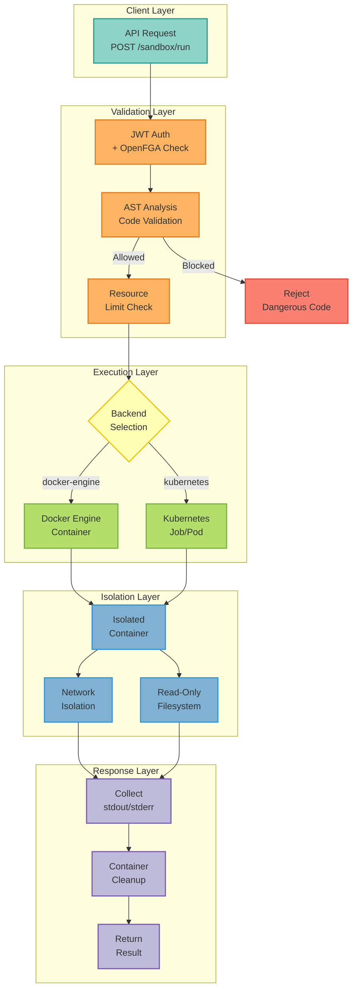
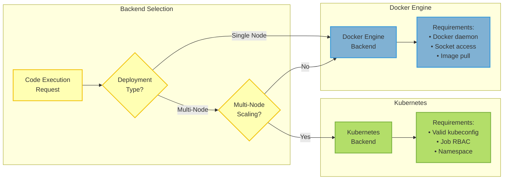

## Overview

The MCP Server provides a secure code execution engine that runs Python code in isolated sandbox environments. This enables AI agents to execute code safely with:

- **Complete Isolation** - Each execution runs in a fresh container/pod
- **Resource Limits** - CPU, memory, disk, and process constraints
- **Network Isolation** - No network access by default
- **Security Validation** - AST-based code analysis blocks dangerous patterns

<Warning>
Code execution is **disabled by default** for security. Enable it only after understanding the security implications and configuring appropriate limits.
</Warning>

### Execution Flow



---

## Quick Start

### Enable Code Execution

```bash
# Enable in environment
export ENABLE_CODE_EXECUTION=true
export CODE_EXECUTION_BACKEND="docker-engine"

# Or in .env file
ENABLE_CODE_EXECUTION=true
CODE_EXECUTION_BACKEND=docker-engine
```

### Execute Code via API

```bash
curl -X POST http://localhost:8000/api/v1/sandbox/run \
  -H "Authorization: Bearer $JWT" \
  -H "Content-Type: application/json" \
  -d '{
    "type": "python",
    "code": "print(sum([1, 2, 3, 4, 5]))"
  }'
```

**Response:**
```json
{
  "stdout": "15\n",
  "stderr": "",
  "exit_code": 0,
  "duration_ms": 245,
  "timed_out": false
}
```

---

## Backends



### Docker Engine (Recommended)

Uses Docker containers for isolation. Best for single-node deployments.

```bash
CODE_EXECUTION_BACKEND=docker-engine
CODE_EXECUTION_DOCKER_IMAGE=python:3.12-slim
CODE_EXECUTION_DOCKER_SOCKET=/var/run/docker.sock
```

**Requirements:**
- Docker daemon running
- Socket access (`/var/run/docker.sock`)
- Pull permission for specified image

### Kubernetes

Uses Kubernetes Jobs for isolation. Best for multi-node deployments.

```bash
CODE_EXECUTION_BACKEND=kubernetes
CODE_EXECUTION_K8S_NAMESPACE=sandbox
CODE_EXECUTION_K8S_JOB_TTL=300
```

**Requirements:**
- Valid kubeconfig or in-cluster RBAC
- Permission to create/delete Jobs in namespace
- Namespace must exist

---

## Resource Limits

Configure execution constraints to prevent resource exhaustion:

| Variable | Default | Range | Description |
|----------|---------|-------|-------------|
| `CODE_EXECUTION_TIMEOUT` | 30 | 1-600 | Max execution time (seconds) |
| `CODE_EXECUTION_MEMORY_LIMIT_MB` | 512 | 64-8192 | Memory limit (MB) |
| `CODE_EXECUTION_CPU_QUOTA` | 1.0 | 0.1-8.0 | CPU cores |
| `CODE_EXECUTION_DISK_QUOTA_MB` | 100 | 1-10240 | Disk space (MB) |
| `CODE_EXECUTION_MAX_PROCESSES` | 1 | 1-100 | Max concurrent processes |

### Preset Profiles

<Tabs>
  <Tab title="Production">
    ```bash
    # Strict limits for production
    CODE_EXECUTION_TIMEOUT=30
    CODE_EXECUTION_MEMORY_LIMIT_MB=512
    CODE_EXECUTION_CPU_QUOTA=1.0
    CODE_EXECUTION_NETWORK_MODE=none
    ```
  </Tab>
  <Tab title="Development">
    ```bash
    # Relaxed limits for development
    CODE_EXECUTION_TIMEOUT=300
    CODE_EXECUTION_MEMORY_LIMIT_MB=2048
    CODE_EXECUTION_CPU_QUOTA=2.0
    CODE_EXECUTION_NETWORK_MODE=unrestricted
    ```
  </Tab>
  <Tab title="Data Processing">
    ```bash
    # For data-heavy workloads
    CODE_EXECUTION_TIMEOUT=300
    CODE_EXECUTION_MEMORY_LIMIT_MB=4096
    CODE_EXECUTION_CPU_QUOTA=4.0
    CODE_EXECUTION_NETWORK_MODE=allowlist
    CODE_EXECUTION_ALLOWED_DOMAINS=api.example.com,data.example.com
    ```
  </Tab>
</Tabs>

---

## Security Model

The code execution engine uses **defense-in-depth** with multiple security layers:

```mermaid
flowchart TB
    subgraph Input["Incoming Code"]
        Code[Python Code<br/>from Agent/User]
    end

    subgraph Layer1["Layer 1: Code Validation"]
        AST[AST Parser]
        ModuleCheck{Blocked<br/>Module?}
        BuiltinCheck{Blocked<br/>Builtin?}
        PatternCheck{Dangerous<br/>Pattern?}
    end

    subgraph Layer2["Layer 2: Container Security"]
        NonRoot[Non-Root User<br/>nobody/1000]
        ReadOnly[Read-Only<br/>Root FS]
        NoCaps[Drop ALL<br/>Capabilities]
        NoPriv[No Privilege<br/>Escalation]
    end

    subgraph Layer3["Layer 3: Network Isolation"]
        NetMode{Network<br/>Mode?}
        None[No Network<br/>Access]
        Allowlist[Domain<br/>Allowlist]
        Unrestricted[Full Network<br/>Dev Only]
    end

    subgraph Output["Execution Result"]
        Safe[Safe Execution<br/>stdout/stderr]
    end

    Code --> AST
    AST --> ModuleCheck
    ModuleCheck -->|Yes| Reject1[Block: os, sys,<br/>subprocess, etc.]
    ModuleCheck -->|No| BuiltinCheck
    BuiltinCheck -->|Yes| Reject2[Block: eval, exec,<br/>open, etc.]
    BuiltinCheck -->|No| PatternCheck
    PatternCheck -->|Yes| Reject3[Block: __import__,<br/>globals(), etc.]
    PatternCheck -->|No| NonRoot

    NonRoot --> ReadOnly
    ReadOnly --> NoCaps
    NoCaps --> NoPriv
    NoPriv --> NetMode

    NetMode -->|none| None
    NetMode -->|allowlist| Allowlist
    NetMode -->|unrestricted| Unrestricted

    None --> Safe
    Allowlist --> Safe
    Unrestricted --> Safe

    %% ColorBrewer2 Set3 palette
    classDef inputStyle fill:#8dd3c7,stroke:#2a9d8f,stroke-width:2px,color:#333
    classDef layer1Style fill:#fdb462,stroke:#e67e22,stroke-width:2px,color:#333
    classDef layer2Style fill:#b3de69,stroke:#7cb342,stroke-width:2px,color:#333
    classDef layer3Style fill:#80b1d3,stroke:#3498db,stroke-width:2px,color:#333
    classDef outputStyle fill:#bebada,stroke:#7e5eb0,stroke-width:2px,color:#333
    classDef rejectStyle fill:#fb8072,stroke:#e74c3c,stroke-width:2px,color:#333
    classDef decisionStyle fill:#ffffb3,stroke:#f1c40f,stroke-width:2px,color:#333

    class Code inputStyle
    class AST layer1Style
    class NonRoot,ReadOnly,NoCaps,NoPriv layer2Style
    class None,Allowlist,Unrestricted layer3Style
    class Safe outputStyle
    class Reject1,Reject2,Reject3 rejectStyle
    class ModuleCheck,BuiltinCheck,PatternCheck,NetMode decisionStyle
```

### Layer 1: Code Validation

AST-based analysis blocks dangerous patterns before execution:

**Blocked Modules:**
```python
# OS/System (52 modules blocked)
os, sys, subprocess, pty, shutil, ctypes

# Networking
socket, urllib, requests, http.client

# Serialization (unsafe)
pickle, marshal

# Debugging/Introspection
code, pdb, inspect, gc, ast
```

**Blocked Builtins:**
```python
eval, exec, compile, __import__
open, input, breakpoint
globals, locals, vars
getattr, setattr, delattr
```

### Layer 2: Container Security

<AccordionGroup>
  <Accordion title="Docker Security" icon="docker">
    ```
    - user: nobody (non-root)
    - read_only: true (read-only root FS)
    - security_opt: ["no-new-privileges"]
    - cap_drop: ["ALL"]
    - network_mode: none (isolated)
    - tmpfs: /tmp, /var/tmp (ephemeral)
    ```
  </Accordion>
  <Accordion title="Kubernetes Security" icon="cloud">
    ```yaml
    securityContext:
      runAsNonRoot: true
      runAsUser: 1000
      allowPrivilegeEscalation: false
      capabilities:
        drop: ["ALL"]
    ```
  </Accordion>
</AccordionGroup>

### Layer 3: Network Isolation

| Mode | Description | Use Case |
|------|-------------|----------|
| `none` | No network access | **Default** - highest security |
| `allowlist` | Domain-restricted via proxy | Controlled API access |
| `unrestricted` | Full network | Development only |

```bash
# Enable domain allowlist
CODE_EXECUTION_NETWORK_MODE=allowlist
CODE_EXECUTION_ALLOWED_DOMAINS=api.github.com,pypi.org
```

---

## Allowed Imports

Only whitelisted modules can be imported:

```bash
CODE_EXECUTION_ALLOWED_IMPORTS=json,math,datetime,collections,itertools,functools,typing,dataclasses,enum,abc,statistics,re,decimal,fractions,numbers,operator
```

**Default Allowed Modules:**

| Category | Modules |
|----------|---------|
| Data | `json`, `datetime`, `collections`, `dataclasses` |
| Math | `math`, `statistics`, `decimal`, `fractions`, `numbers` |
| Typing | `typing`, `enum`, `abc` |
| Text | `re` |
| Functional | `functools`, `itertools`, `operator` |

<Note>
To allow additional modules, extend the `CODE_EXECUTION_ALLOWED_IMPORTS` list. Be cautious with modules that have network or file system access.
</Note>

---

## API Reference

### Execute Python Code

**Endpoint:** `POST /api/v1/sandbox/run`

```json
{
  "type": "python",
  "code": "import json\ndata = {'key': 'value'}\nprint(json.dumps(data))",
  "timeout": 30
}
```

**Response:**
```json
{
  "stdout": "{\"key\": \"value\"}\n",
  "stderr": "",
  "exit_code": 0,
  "duration_ms": 156,
  "timed_out": false
}
```

### Other Operations

| Operation | Description |
|-----------|-------------|
| `bash` | Execute shell commands |
| `web_fetch` | Fetch URL content (requires network) |
| `write_file` | Create file in sandbox |
| `edit_file` | Modify file in sandbox |
| `screenshot` | Capture web page (Playwright) |
| `computer_use` | Browser automation (Playwright) |

---

## Examples

### Data Processing

```python
import json
from collections import Counter
from statistics import mean, stdev

# Process data
data = [1, 2, 2, 3, 3, 3, 4, 4, 5]
result = {
    "count": len(data),
    "mean": mean(data),
    "stdev": stdev(data),
    "frequency": dict(Counter(data))
}

print(json.dumps(result, indent=2))
```

### JSON Transformation

```python
import json
from datetime import datetime

input_data = {"name": "Alice", "age": 30}
output = {
    **input_data,
    "processed_at": datetime.now().isoformat(),
    "version": "1.0"
}

print(json.dumps(output))
```

---

## Troubleshooting

<AccordionGroup>
  <Accordion title="Execution times out" icon="clock">
    **Symptoms:** Code execution exceeds timeout limit

    **Solutions:**
    1. Increase `CODE_EXECUTION_TIMEOUT` (max 600 seconds)
    2. Optimize code for efficiency
    3. Break large operations into smaller chunks
  </Accordion>

  <Accordion title="Import not allowed" icon="ban">
    **Symptoms:** `ImportError: Module 'xyz' is not in allowed imports`

    **Solutions:**
    1. Add module to `CODE_EXECUTION_ALLOWED_IMPORTS`
    2. Verify module doesn't have security risks
    3. Consider if functionality can use allowed modules
  </Accordion>

  <Accordion title="Out of memory" icon="memory">
    **Symptoms:** Process killed due to memory limit

    **Solutions:**
    1. Increase `CODE_EXECUTION_MEMORY_LIMIT_MB`
    2. Process data in smaller batches
    3. Use generators instead of loading all data into memory
  </Accordion>

  <Accordion title="Docker permission denied" icon="lock">
    **Symptoms:** Cannot connect to Docker daemon

    **Solutions:**
    1. Verify Docker daemon is running
    2. Check socket permissions: `chmod 666 /var/run/docker.sock`
    3. Add user to docker group: `usermod -aG docker $USER`
  </Accordion>
</AccordionGroup>

---

## Feature Flags

| Flag | Default | Description |
|------|---------|-------------|
| `enable_code_execution` | false | Master switch (in settings, not FF_) |
| `enable_bash_tool` | false | Allow bash command execution |
| `enable_computer_use` | false | Allow browser automation |
| `enable_programmatic_tools` | false | Allow sandbox code to call MCP tools |

---

## Related Documentation

- [Feature Flags Guide](/guides/feature-flags) - Configuration options
