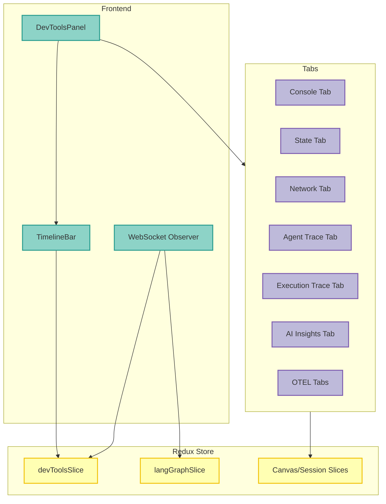

<Note>
**NEW in v2.8.0** - Chrome DevTools-inspired debugging panel with context-aware tabs, time-travel debugging, AI-powered insights, and unified observability.
</Note>

### Overview

Agent Studio DevTools provides a comprehensive debugging environment for inspecting and troubleshooting agent behavior:

- **Context-Aware Tabs** - Adapts displayed tabs based on whether you're debugging a chat session or workflow
- **Time-Travel Debugging** - Replay agent decisions and inspect state at any point in time
- **State Inspector** - View Redux state, session data, and workflow execution state
- **Network Monitor** - Track API calls, WebSocket messages, and MCP protocol traffic
- **Performance Profiler** - Identify bottlenecks and analyze execution traces
- **AI-Powered Insights** - Get intelligent recommendations for anomaly detection and optimization

### Architecture



### Quick Start

<Steps>
  <Step title="Open DevTools Panel">
    DevTools can be opened in multiple ways:

    **Keyboard Shortcut:**
    - Mac: `Cmd+Shift+I`
    - Windows/Linux: `Ctrl+Shift+I`

    **Status Bar:**
    - Click the terminal icon in the bottom status bar

    **Default Behavior:**
    - Automatically open for developer/admin personas
    - Collapsed by default for regular users
  </Step>

  <Step title="Navigate Tabs">
    Use keyboard shortcuts to navigate between tabs:

    | Shortcut | Action |
    |----------|--------|
    | `Cmd/Ctrl+]` | Next tab |
    | `Cmd/Ctrl+[` | Previous tab |
    | `Cmd/Ctrl+Shift+C` | Focus Console tab |
    | `Cmd/Ctrl+K` | Clear Console (when focused) |
  </Step>

  <Step title="Enable Feature Flags">
    Configure advanced DevTools features via environment variables or feature flags:

    ```bash
    # .env
    FF_DEVTOOLS_PANEL=true              # Master toggle
    FF_DEVTOOLS_AI_INSIGHTS=true        # Enable AI Insights tab
    FF_DEVTOOLS_AI_LAYOUT=true          # Enable AI layout suggestions
    FF_DEVTOOLS_NETWORK_TAB=true        # Enable Network tab
    ```

    See [Feature Flags](/guides/studio-feature-flags) for complete list.
  </Step>
</Steps>

### Feature Flags

DevTools functionality is controlled by backend feature flags:

| Flag | Default | Environment Variable | Description |
|------|---------|---------------------|-------------|
| `devtools_panel` | `true` | `FF_DEVTOOLS_PANEL` | Master toggle for DevTools panel |
| `devtools_ai_insights` | `false` | `FF_DEVTOOLS_AI_INSIGHTS` | Enable AI Insights tab with anomaly detection |
| `devtools_ai_layout` | `false` | `FF_DEVTOOLS_AI_LAYOUT` | Enable AI-powered tab layout suggestions |
| `devtools_network_tab` | `true` | `FF_DEVTOOLS_NETWORK_TAB` | Enable Network monitoring tab |

<Info>
**AI Insights** requires `devtools_ai_insights=true` and uses the Multi-Agent Orchestrator for intelligent analysis. This feature is experimental and may incur additional LLM costs.
</Info>

### Available Tabs

DevTools provides context-aware tabs that adapt based on your current view:

| Tab | Description | Available In |
|-----|-------------|--------------|
| **Console** | Logs, notifications, API calls, errors | All contexts |
| **Problems** | Aggregated errors and warnings | All contexts |
| **Network** | API and WebSocket traffic monitoring | All contexts |
| **State** | Redux/session/workflow state inspection | All contexts |
| **Agent Trace** | LangGraph node execution visualization | Session context |
| **Execution Trace** | Workflow node execution timeline | Workflow context |
| **AI Insights** | Anomaly detection, bottleneck analysis, suggestions | All contexts (behind flag) |
| **Traces** | OpenTelemetry distributed traces | All contexts |
| **Metrics** | Performance metrics from OTEL | All contexts |
| **Alerts** | Infrastructure alerts from Alertmanager | All contexts |
| **Logs** | Structured logs from Loki | All contexts |

### Time-Travel Debugging

The TimelineBar provides time-travel debugging capabilities across all tabs:

<AccordionGroup>
  <Accordion title="Timeline Scrubber">
    **Features:**
    - Unified timeline for all DevTools events
    - Minimap visualization showing event density
    - Playback controls (play, pause, skip forward/backward)
    - Variable playback speed (0.5x, 1x, 2x, 4x)
    - Bookmarking important moments

    **Usage:**
    ```typescript
    // TimelineBar automatically tracks:
    // - Console entries
    // - Network requests
    // - State changes
    // - Agent execution events
    // - WebSocket messages
    ```

    **Keyboard Shortcuts:**
    | Shortcut | Action |
    |----------|--------|
    | `Space` | Play/Pause |
    | `Left Arrow` | Step backward |
    | `Right Arrow` | Step forward |
    | `Shift+Left` | Skip to previous bookmark |
    | `Shift+Right` | Skip to next bookmark |
    | `B` | Add bookmark at current time |
  </Accordion>

  <Accordion title="State Replay">
    **How It Works:**
    1. DevTools captures all Redux state changes with timestamps
    2. TimelineBar lets you scrub to any point in time
    3. State tab shows the exact Redux state at that moment
    4. Agent Trace and Execution Trace tabs show execution at that time

    **Example Workflow:**
    1. Navigate to a session where an error occurred
    2. Open DevTools and locate the error in Console tab
    3. Click on the error timestamp to jump to that moment
    4. Switch to State tab to inspect Redux state
    5. Review Agent Trace to see which node was executing
  </Accordion>

  <Accordion title="Export Debug Sessions">
    Export complete debug sessions for offline analysis or sharing:

    ```typescript
    // Click the Export button in TimelineBar
    // Exports include:
    // - All timeline events with timestamps
    // - Console entries and errors
    // - Network request/response data
    // - State snapshots at key moments
    // - Agent execution traces

    // Format: JSON
    // Download: debug-session-YYYY-MM-DD.json
    ```

    Share exported sessions with your team or attach to bug reports.
  </Accordion>
</AccordionGroup>

### Console Tab

Aggregates logs from multiple sources with powerful filtering:

#### Log Sources

| Source | Description |
|--------|-------------|
| **System** | Application lifecycle events, startup, shutdown |
| **API** | HTTP request/response logs with status codes |
| **MCP** | Model Context Protocol messages |
| **Notification** | User-facing notifications and toasts |
| **Execution** | Agent execution logs, tool calls |
| **WebSocket** | WebSocket connection events and messages |

#### Filtering

Filter console entries by:
- **Level**: All, Info, Warning, Error (dropdown in header)
- **Source**: Multi-select filter for log sources
- **Search**: Text search across all log messages
- **Time Range**: Show logs from specific time period

#### Custom Console Entries

Add custom log entries from your code:

```typescript
import { useConsoleEntries } from '@/components/DevTools/hooks/useConsoleEntries';

function MyComponent() {
  const { addEntry } = useConsoleEntries();

  const handleAction = () => {
    addEntry({
      level: 'info',
      source: 'custom',
      message: 'Action completed successfully',
      data: { userId: 123, action: 'update_profile' },
      timestamp: Date.now(),
    });
  };

  return <button onClick={handleAction}>Execute</button>;
}
```

#### Export Console Logs

Export console logs to JSON or CSV:

```typescript
import {
  exportConsoleToJSON,
  exportConsoleToCSV
} from '@/components/DevTools/utils/export';

// Export to JSON
exportConsoleToJSON(consoleEntries);
// Downloads: console-log-2025-01-15.json

// Export to CSV
exportConsoleToCSV(consoleEntries);
// Downloads: console-log-2025-01-15.csv
```

### State Inspector

Inspect Redux state, session data, and workflow execution state:

#### Context-Aware Display

State tab adapts based on context:

- **Session Context**: Shows `session`, `canvas`, and `ui` slices
- **Workflow Context**: Shows workflow-related state
- **Global Context**: Shows all Redux state

#### Features

- **JSON Tree View** - Expandable tree for nested objects
- **Search** - Filter state by key names, paths, or values
- **Copy Path** - Copy JSON path to clipboard
- **Copy Value** - Copy state value to clipboard
- **Live Updates** - State updates in real-time as you interact

#### Usage Example

```typescript
// State tab automatically displays Redux state
// Use search to find specific keys:
// - Search: "session.messages"
// - Search: "canvas.panelSizes"
// - Search: "user.email"

// Right-click on any value to:
// - Copy path: "session.messages[2].content"
// - Copy value: "{ role: 'user', content: '...' }"
```

### Network Inspector

Monitor API calls, WebSocket messages, and MCP protocol traffic:

#### Network Entry Types

| Type | Description |
|------|-------------|
| **HTTP** | REST API calls to backend |
| **WebSocket** | WebSocket messages (chat, alerts, notifications) |
| **MCP** | Model Context Protocol requests/responses |
| **GraphQL** | GraphQL queries and mutations |

#### Features

- **Request/Response Details** - View headers, body, status
- **Timing Information** - See request duration and timing breakdown
- **Size Metrics** - Request and response payload sizes
- **Status Filter** - Filter by success (2xx), error (4xx, 5xx)
- **Search** - Search by URL, method, or response content

#### Example Network Entry

```json
{
  "startTime": "2025-01-15T10:00:00Z",
  "method": "POST",
  "url": "/api/v1/chat/send",
  "status": "completed",
  "statusCode": 200,
  "duration": 1234,
  "requestSize": 512,
  "responseSize": 2048,
  "requestBody": { "message": "Hello" },
  "responseBody": { "id": "msg-123", "content": "..." },
  "source": "api"
}
```

#### Export Network Logs

```typescript
import {
  exportNetworkToJSON,
  exportNetworkToCSV
} from '@/components/DevTools/utils/export';

// Export to JSON
exportNetworkToJSON(networkEntries);

// Export to CSV
exportNetworkToCSV(networkEntries);
```

### Agent Trace Tab

Visualize LangGraph agent execution with node-level detail:

<Note>
**Available in**: Session context only (when viewing a chat session)
</Note>

#### Visualization Modes

<Tabs>
  <Tab title="List View">
    **Features:**
    - Expandable list of execution nodes
    - Color-coded status (completed, running, pending, error, skipped)
    - Duration display for each node
    - Input/output data inspection

    **Node Status Colors:**
    | Status | Color | Description |
    |--------|-------|-------------|
    | Completed | Green | Node executed successfully |
    | Running | Blue | Node currently executing |
    | Pending | Gray | Node waiting to execute |
    | Error | Red | Node failed with error |
    | Skipped | Yellow | Node skipped (conditional) |
  </Tab>

  <Tab title="Timeline View">
    **Features:**
    - Gantt chart-style visualization
    - Parallel execution visualization
    - Timeline scrubber integration
    - Hover for node details

    **Use Case:** Identify performance bottlenecks and parallel execution patterns
  </Tab>
</Tabs>

#### Token Usage Tracking

Agent Trace displays comprehensive token usage:

```json
{
  "inputTokens": 1234,
  "outputTokens": 567,
  "totalTokens": 1801,
  "cost": 0.0234
}
```

#### Tool Call Inspection

View tool call arguments and results:

```json
{
  "toolName": "search_database",
  "arguments": {
    "query": "SELECT * FROM users WHERE id = 123",
    "timeout": 30
  },
  "result": {
    "rows": [...],
    "executionTime": 45
  },
  "status": "success"
}
```

### Execution Trace Tab

Visualize workflow execution for multi-step workflows:

<Note>
**Available in**: Workflow context only (when viewing a workflow)
</Note>

#### Features

- **Node Execution Order** - See which nodes executed and in what order
- **Branch Visualization** - View conditional branches and loops
- **Execution Duration** - Track time spent in each node
- **Error Highlighting** - Quickly identify failed nodes
- **Dependency Graph** - Understand node dependencies

#### Workflow Metrics

```json
{
  "totalDuration": 12345,
  "nodesExecuted": 15,
  "nodesFailed": 2,
  "nodesSkipped": 3,
  "parallelExecutions": 4
}
```

### AI Insights Tab

<Warning>
**Experimental Feature** - Requires `devtools_ai_insights=true` feature flag
</Warning>

AI-powered analysis of agent behavior with intelligent recommendations:

#### Features

<AccordionGroup>
  <Accordion title="Anomaly Detection">
    **What It Detects:**
    - Unusual response times or latency spikes
    - Unexpected error patterns
    - Abnormal token usage
    - Tool call failures
    - State inconsistencies

    **Output:**
    ```json
    {
      "anomalies": [
        {
          "type": "latency_spike",
          "confidence": 0.87,
          "description": "Response time 3x higher than baseline",
          "affectedNodes": ["search_tool", "llm_call"],
          "timestamp": "2025-01-15T10:05:23Z"
        }
      ]
    }
    ```
  </Accordion>

  <Accordion title="Bottleneck Analysis">
    **Identifies:**
    - Slow executing nodes
    - Sequential bottlenecks (could be parallelized)
    - Large payload transfers
    - Database query performance issues

    **Recommendations:**
    - "Parallelize search_tool and llm_call for 40% faster execution"
    - "Cache database query results to reduce latency by 60%"
    - "Reduce payload size by removing unused fields (2048 -> 512 bytes)"
  </Accordion>

  <Accordion title="Health Score">
    **Metrics:**
    - Overall execution health (0-100)
    - Error rate
    - Performance score
    - Cost efficiency

    **Visualization:**
    ```
    ╔══════════════════════════════╗
    ║  Health Score: 87/100        ║
    ║  ━━━━━━━━━━━━━━━━━━━━━━━━━  ║
    ║                              ║
    ║  Performance:     92/100     ║
    ║  Reliability:     85/100     ║
    ║  Cost Efficiency: 78/100     ║
    ╚══════════════════════════════╝
    ```
  </Accordion>

  <Accordion title="Cost Projection">
    **Features:**
    - Estimated monthly cost based on current usage
    - Token usage breakdown by model
    - Cost optimization suggestions
    - Budget alerts

    **Example:**
    ```json
    {
      "monthlyProjection": 123.45,
      "breakdown": {
        "claude-3-5-sonnet": 89.23,
        "claude-3-haiku": 34.22
      },
      "suggestions": [
        "Switch to Haiku for simple queries (save $45/month)",
        "Cache frequently used prompts (save $23/month)"
      ]
    }
    ```
  </Accordion>

  <Accordion title="Optimization Suggestions">
    **AI-Generated Recommendations:**
    - Prompt optimization
    - Caching strategies
    - Model selection (when to use Haiku vs Sonnet)
    - Parallel execution opportunities
    - Error handling improvements

    **Example Suggestion:**
    ```json
    {
      "type": "caching",
      "priority": "high",
      "impact": "40% latency reduction",
      "effort": "low",
      "description": "Enable Redis cache for search_tool results",
      "implementation": "Set FF_ENABLE_AI_UX_REDIS_CACHE=true"
    }
    ```
  </Accordion>
</AccordionGroup>

### OTEL Observability Tabs

DevTools integrates with OpenTelemetry for comprehensive observability:

#### Traces Tab

View distributed traces from Grafana Tempo:

- **Trace Timeline** - See request flow across services
- **Span Details** - Inspect individual operations
- **Error Highlighting** - Quickly identify failed spans
- **Search** - Find traces by ID, service, or operation

#### Metrics Tab

Visualize metrics from Grafana Mimir:

- **Real-time Metrics** - Live metric visualization
- **Custom Queries** - PromQL query builder
- **Dashboard Widgets** - Pre-configured metric panels
- **Alerts** - Metric-based alert rules

#### Alerts Tab

Monitor infrastructure alerts from Alertmanager:

- **Active Alerts** - Current firing alerts
- **Alert History** - Resolved alerts
- **Severity Filtering** - Filter by critical, warning, info
- **Remediation** - AI-powered remediation suggestions

See [Alert Management](/guides/alert-management) for details.

#### Logs Tab

Query structured logs from Grafana Loki:

- **LogQL Queries** - Query logs with LogQL syntax
- **Live Streaming** - Tail logs in real-time
- **Context View** - See surrounding log lines
- **Export** - Download log results

### Best Practices

<AccordionGroup>
  <Accordion title="Debugging Agent Errors">
    **Workflow:**
    1. Open DevTools when error occurs
    2. Check **Console** tab for error message and stack trace
    3. Switch to **Agent Trace** tab to see which node failed
    4. Use **State** tab to inspect Redux state at error time
    5. Check **Network** tab for failed API calls
    6. Review **AI Insights** for root cause analysis
  </Accordion>

  <Accordion title="Performance Optimization">
    **Steps:**
    1. Open **Agent Trace** or **Execution Trace** tab
    2. Switch to Timeline View to see parallel execution
    3. Identify sequential nodes that could be parallelized
    4. Check **AI Insights** for bottleneck analysis
    5. Review **Metrics** tab for performance trends
    6. Use TimelineBar to compare before/after optimization
  </Accordion>

  <Accordion title="Debugging WebSocket Issues">
    **Troubleshooting:**
    1. Open **Network** tab and filter by "WebSocket"
    2. Check connection status and message flow
    3. Review **Console** tab for WebSocket errors
    4. Use **State** tab to verify WebSocket slice state
    5. Check **Logs** tab for backend WebSocket logs
  </Accordion>

  <Accordion title="State Debugging">
    **Techniques:**
    1. Use **State** tab search to find specific Redux keys
    2. Copy state path to reference in code
    3. Use TimelineBar to replay state changes
    4. Compare state at different points in time
    5. Export state snapshot for offline analysis
  </Accordion>

  <Accordion title="Sharing Debug Sessions">
    **How to Share:**
    1. Reproduce the issue with DevTools open
    2. Click Export button in TimelineBar
    3. Attach `debug-session-YYYY-MM-DD.json` to bug report
    4. Include screenshots from relevant tabs
    5. Note exact timestamp of issue occurrence

    **What Gets Exported:**
    - Console logs with timestamps
    - Network requests/responses
    - State snapshots at key moments
    - Agent execution traces
    - Error stack traces
  </Accordion>
</AccordionGroup>

### Configuration

#### Environment Variables

```bash
# .env

# DevTools Panel
FF_DEVTOOLS_PANEL=true
FF_DEVTOOLS_NETWORK_TAB=true

# AI Insights (experimental)
FF_DEVTOOLS_AI_INSIGHTS=true
FF_DEVTOOLS_AI_LAYOUT=true

# AI UX (required for AI Insights)
FF_ENABLE_AI_UX=true
FF_ENABLE_AI_UX_REDIS_CACHE=true  # Recommended for cost savings

# Redis Configuration (for AI caching)
REDIS_HOST=localhost
REDIS_PORT=6379
REDIS_DB=0
```

#### Feature Flag API

Check feature flags programmatically:

```typescript
import { useFeatureFlags } from '@/hooks/useFeatureFlags';

function MyComponent() {
  const {
    devtools_panel,
    devtools_ai_insights,
    devtools_network_tab
  } = useFeatureFlags();

  if (!devtools_panel) {
    return null; // DevTools disabled
  }

  return (
    <div>
      {devtools_ai_insights && <AIInsightsPanel />}
      {devtools_network_tab && <NetworkMonitor />}
    </div>
  );
}
```

#### Redux Configuration

DevTools state is managed by `devToolsSlice`:

```typescript
import {
  selectDevToolsCollapsed,
  selectActiveTab,
  selectAvailableTabs,
  toggleDevTools,
  setActiveTab,
} from '@/store/slices/devToolsSlice';

function MyComponent() {
  const dispatch = useDispatch();
  const collapsed = useAppSelector(selectDevToolsCollapsed);
  const activeTab = useAppSelector(selectActiveTab);

  const handleToggle = () => {
    dispatch(toggleDevTools());
  };

  return <button onClick={handleToggle}>Toggle DevTools</button>;
}
```

### Deployment

#### Kubernetes

```yaml
# values.yaml
studio:
  devtools:
    enabled: true
    aiInsights:
      enabled: false  # Set to true for AI Insights
      model: "claude-3-5-sonnet-20241022"
      cacheTTL: 300  # seconds

  featureFlags:
    devtools_panel: true
    devtools_ai_insights: false
    devtools_network_tab: true
```

#### Docker Compose

```yaml
# docker-compose.yml
services:
  mcp-server:
    environment:
      - FF_DEVTOOLS_PANEL=true
      - FF_DEVTOOLS_AI_INSIGHTS=false
      - FF_DEVTOOLS_NETWORK_TAB=true
      - FF_ENABLE_AI_UX=true
      - REDIS_HOST=redis
      - REDIS_PORT=6379
```

### Accessibility

DevTools is designed with accessibility in mind:

- **Keyboard Navigation** - Full keyboard support for all interactions
- **ARIA Labels** - Proper labels for screen readers
- **Focus Management** - Logical focus order within panels
- **Screen Reader Support** - Semantic HTML structure
- **High Contrast Mode** - Respects system preferences

### Performance

DevTools is optimized for minimal performance impact:

#### Lazy Loading

All tabs are lazy-loaded to reduce initial bundle size:

```typescript
// Tabs only load when activated
const ConsoleTab = lazy(() => import('./tabs/ConsoleTab'));
const NetworkTab = lazy(() => import('./tabs/NetworkTab'));
const StateTab = lazy(() => import('./tabs/StateTab'));
```

#### Virtualization

Long lists use virtualization for performance:

- Console entries (1000+ logs)
- Network requests (500+ requests)
- State tree nodes (deep nested objects)

#### Memoization

Heavy computations are memoized:

```typescript
// Event density calculation memoized
const density = useMemo(() =>
  calculateDensity(events, startTime, endTime),
  [events, startTime, endTime]
);
```

### Troubleshooting

<AccordionGroup>
  <Accordion title="DevTools not appearing">
    **Possible Causes:**
    1. `devtools_panel` feature flag is `false`
    2. User persona doesn't have access
    3. DevTools panel is collapsed

    **Solutions:**
    - Check feature flag: `FF_DEVTOOLS_PANEL=true`
    - Try keyboard shortcut: `Cmd/Ctrl+Shift+I`
    - Check persona permissions in Admin Dashboard
  </Accordion>

  <Accordion title="AI Insights tab missing">
    **Requirements:**
    1. `FF_DEVTOOLS_AI_INSIGHTS=true`
    2. `FF_ENABLE_AI_UX=true`
    3. LLM provider configured

    **Check Configuration:**
    ```bash
    # Verify in .env
    FF_DEVTOOLS_AI_INSIGHTS=true
    FF_ENABLE_AI_UX=true
    ANTHROPIC_API_KEY=sk-ant-...
    ```
  </Accordion>

  <Accordion title="Timeline not recording events">
    **Check:**
    1. DevTools panel is open
    2. WebSocket connection is active
    3. Browser storage not full

    **Debug:**
    - Open browser DevTools Console
    - Check for `DevToolsWebSocketObserver` errors
    - Verify localStorage quota
  </Accordion>

  <Accordion title="Network tab showing no requests">
    **Verify:**
    1. `FF_DEVTOOLS_NETWORK_TAB=true`
    2. Network interceptor is running
    3. CORS is properly configured

    **Test:**
    - Make a test API call
    - Check browser Network tab for requests
    - Verify WebSocket connection
  </Accordion>

  <Accordion title="State tab not updating">
    **Possible Issues:**
    1. Redux DevTools extension conflict
    2. State changes not dispatched
    3. Selector memoization issue

    **Solutions:**
    - Disable Redux DevTools extension temporarily
    - Verify actions are dispatched
    - Check Redux state in browser console: `window.__REDUX_STORE__`
  </Accordion>
</AccordionGroup>

### Related Guides

- [Feature Flags](/guides/studio-feature-flags) - Configure DevTools feature flags
- [Observability Setup](/guides/observability) - Set up OTEL, Loki, Tempo, Mimir
- [Alert Management](/guides/alert-management) - Configure Alertmanager integration
- [Keyboard Shortcuts](/guides/keyboard-shortcuts) - Complete keyboard shortcuts reference
- [Agent Architecture](/guides/agent-architecture) - Understand LangGraph agent structure

### Advanced Topics

<AccordionGroup>
  <Accordion title="Custom DevTools Hooks">
    Create custom hooks for your application:

    ```typescript
    // Custom hook for tracking app-specific events
    import { useDevToolsContext } from '@/components/DevTools/hooks/useDevToolsContext';

    export function useMyAppDevTools() {
      const { addTimelineEvent } = useDevToolsContext();

      const trackCustomEvent = (eventType: string, data: any) => {
        addTimelineEvent({
          type: eventType,
          timestamp: Date.now(),
          data,
          source: 'my-app',
        });
      };

      return { trackCustomEvent };
    }
    ```
  </Accordion>

  <Accordion title="Extending DevTools Tabs">
    Add custom tabs to DevTools:

    ```typescript
    // 1. Create your tab component
    export function MyCustomTab() {
      return <div>My Custom DevTools Tab</div>;
    }

    // 2. Register in DevToolsPanel.tsx
    const TAB_ICONS = {
      ...existingIcons,
      'my-custom': MyIcon,
    };

    const TAB_LABELS = {
      ...existingLabels,
      'my-custom': 'My Custom Tab',
    };

    // 3. Add lazy import
    const MyCustomTabContent = lazy(() =>
      import('./tabs/MyCustomTab').then((m) => ({
        default: m.MyCustomTab
      }))
    );
    ```
  </Accordion>

  <Accordion title="Timeline Event Sources">
    Register custom event sources for timeline:

    ```typescript
    import { useTimelineContext } from '@/components/DevTools/context/DevToolsTimelineProvider';

    function MyComponent() {
      const { registerEventSource } = useTimelineContext();

      useEffect(() => {
        const source = registerEventSource({
          id: 'my-source',
          name: 'My Event Source',
          color: '#FF5733',
          getEvents: () => myCustomEvents,
        });

        return () => source.unregister();
      }, []);
    }
    ```
  </Accordion>
</AccordionGroup>
