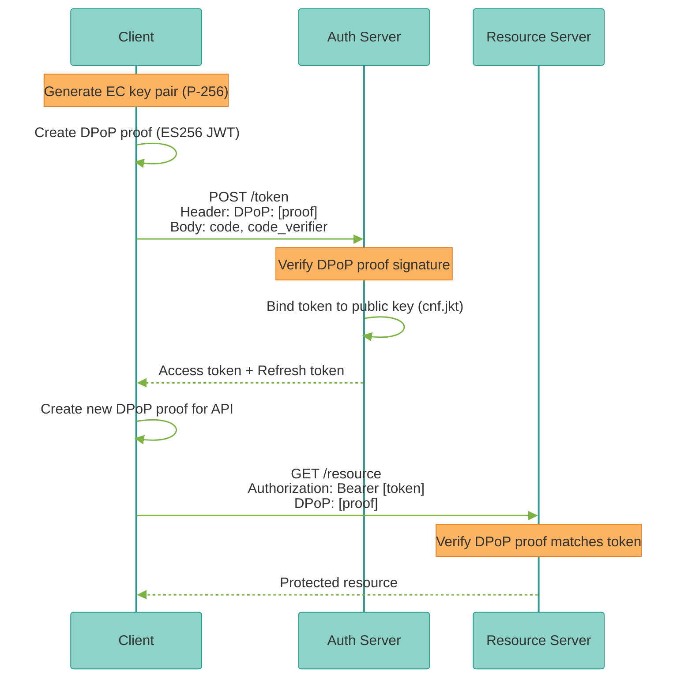
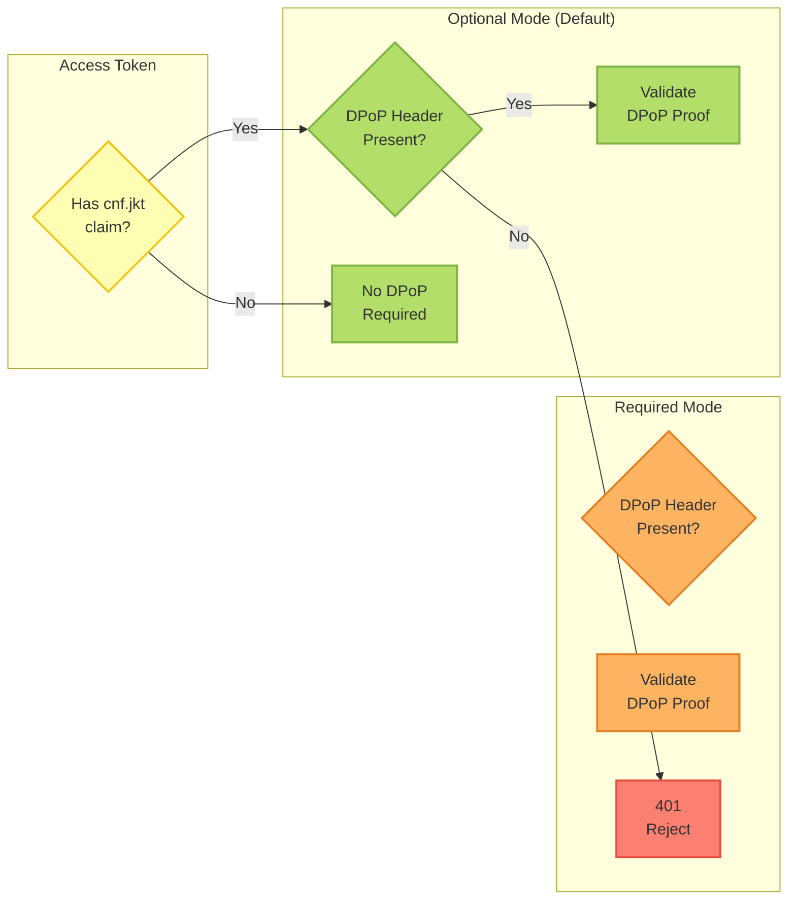
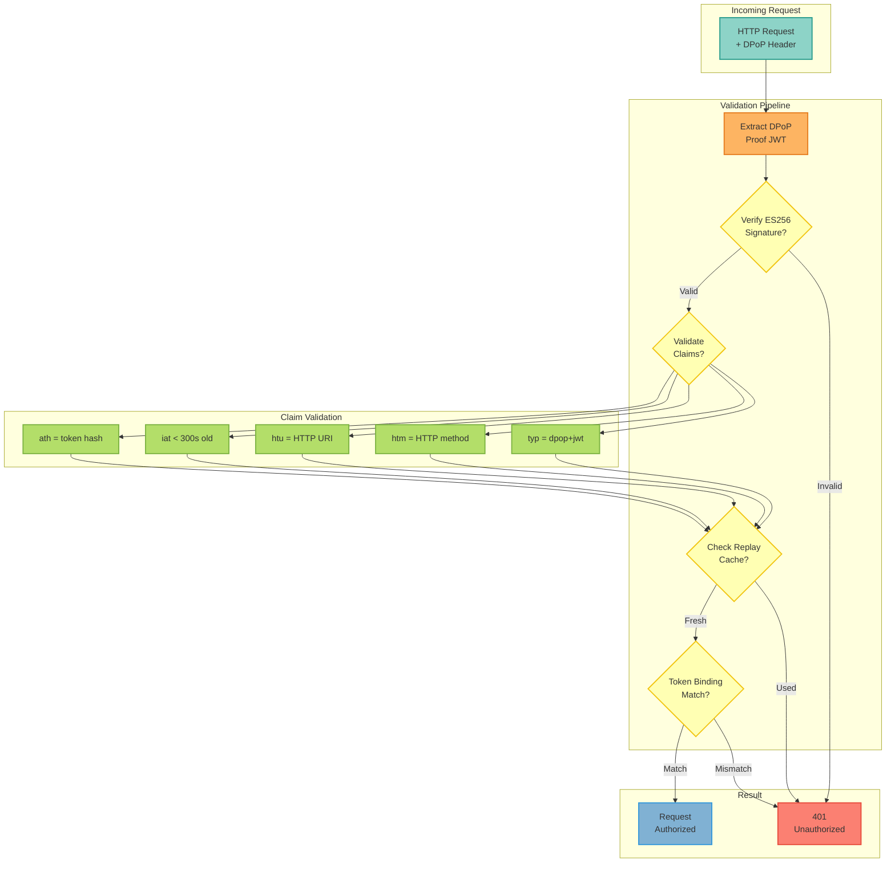

# DPoP Token Binding

DPoP (Demonstrating Proof of Possession) provides sender-constrained access tokens that prevent token theft and replay attacks by requiring clients to prove possession of a private key.

<Note>
**NEW in v2.8.0** - RFC 9449 compliant DPoP implementation with automatic sender-constraint verification.
</Note>

## Overview

DPoP binds access tokens to a client's cryptographic key pair, preventing:

- **Token Theft** - Stolen tokens cannot be used without the private key
- **Replay Attacks** - Each request requires a fresh proof with unique jti
- **Token Interception** - TLS alone is insufficient, DPoP adds application-layer security
- **Man-in-the-Middle Attacks** - Attacker cannot forge valid DPoP proofs

### How It Works



### Key Components

| Component | Purpose |
|-----------|---------|
| **DPoP Proof** | ES256-signed JWT proving key possession |
| **Public Key (JWK)** | Included in DPoP proof header |
| **Token Binding (cnf.jkt)** | JWK thumbprint in access token |
| **Replay Cache** | Prevents jti reuse |

## RFC 9449 Compliance

This implementation follows [RFC 9449: OAuth 2.0 Demonstrating Proof of Possession](https://datatracker.ietf.org/doc/rfc9449/):

- ✅ ES256 algorithm (ECDSA with P-256 and SHA-256)
- ✅ JWK thumbprint calculation (RFC 7638)
- ✅ `htm` (HTTP method) validation
- ✅ `htu` (HTTP URI) validation
- ✅ `ath` (access token hash) for token binding
- ✅ `jti` replay protection
- ✅ `iat` freshness validation (300s max age)
- ✅ `cnf.jkt` confirmation claim in access tokens

## Configuration

### Environment Variables

```bash
# DPoP Enforcement (default: false)
DPOP_REQUIRED=false  # Set to true to require DPoP for ALL tokens

# DPoP Nonce TTL (seconds, default: 3600)
DPOP_NONCE_TTL_SECONDS=3600

# DPoP Max Clock Skew (seconds, default: 30)
DPOP_MAX_CLOCK_SKEW_SECONDS=30
```

### Feature Flag

DPoP is always available but enforcement is optional:

```bash
# Default: DPoP is OPTIONAL
# - Tokens with cnf.jkt claim require DPoP proof
# - Tokens without cnf claim do not require DPoP proof

# Strict mode: DPoP is REQUIRED for ALL tokens
DPOP_REQUIRED=true
```

### Enforcement Modes



| Mode | Behavior | Use Case |
|------|----------|----------|
| **Optional** (default) | DPoP-bound tokens require proof, others don't | Gradual rollout, backward compatibility |
| **Required** | ALL tokens require DPoP proof | High-security environments |

## Client Implementation

### JavaScript/TypeScript Example

```javascript
// Install dependencies
// npm install jose

import { generateKeyPair, SignJWT } from 'jose';
import crypto from 'crypto';

/**
 * DPoP Client for browser/Node.js applications.
 */
class DPoPClient {
  constructor(privateKey, publicKey) {
    this.privateKey = privateKey;
    this.publicKey = publicKey;
  }

  /**
   * Generate new DPoP client with ES256 key pair.
   */
  static async generate() {
    const { privateKey, publicKey } = await generateKeyPair('ES256');
    return new DPoPClient(privateKey, publicKey);
  }

  /**
   * Get public key as JWK (JSON Web Key).
   */
  async getPublicJWK() {
    const exported = await crypto.subtle.exportKey('jwk', this.publicKey);
    return {
      kty: exported.kty,
      crv: exported.crv,
      x: exported.x,
      y: exported.y,
    };
  }

  /**
   * Generate DPoP proof for a request.
   *
   * @param {string} httpMethod - HTTP method (GET, POST, etc.)
   * @param {string} httpUri - Full URI (https://api.example.com/resource)
   * @param {string} [accessToken] - Access token (for ath claim)
   * @param {string} [nonce] - Server-provided nonce
   * @returns {Promise<string>} DPoP proof JWT
   */
  async generateProof(httpMethod, httpUri, accessToken = null, nonce = null) {
    const jwk = await this.getPublicJWK();

    // Build payload
    const payload = {
      jti: crypto.randomUUID(),
      htm: httpMethod.toUpperCase(),
      htu: httpUri,
      iat: Math.floor(Date.now() / 1000),
    };

    // Add access token hash (ath) if binding to token
    if (accessToken) {
      const hash = crypto.createHash('sha256').update(accessToken).digest();
      payload.ath = hash.toString('base64url');
    }

    // Add nonce if provided
    if (nonce) {
      payload.nonce = nonce;
    }

    // Sign with ES256
    const proof = await new SignJWT(payload)
      .setProtectedHeader({
        typ: 'dpop+jwt',
        alg: 'ES256',
        jwk: jwk
      })
      .sign(this.privateKey);

    return proof;
  }
}

// Usage Example
async function example() {
  // Step 1: Generate DPoP client
  const client = await DPoPClient.generate();

  // Step 2: Request token with DPoP proof
  const tokenProof = await client.generateProof(
    'POST',
    'https://auth.example.com/oauth/token'
  );

  const tokenResponse = await fetch('https://auth.example.com/oauth/token', {
    method: 'POST',
    headers: {
      'Content-Type': 'application/x-www-form-urlencoded',
      'DPoP': tokenProof,
    },
    body: new URLSearchParams({
      grant_type: 'authorization_code',
      code: 'abc123',
      code_verifier: 'xyz789',
      client_id: 'my-app',
    }),
  });

  const tokens = await tokenResponse.json();
  const accessToken = tokens.access_token;

  // Step 3: Use access token with DPoP proof
  const resourceProof = await client.generateProof(
    'GET',
    'https://api.example.com/resource',
    accessToken  // Include for ath claim
  );

  const response = await fetch('https://api.example.com/resource', {
    method: 'GET',
    headers: {
      'Authorization': `Bearer ${accessToken}`,
      'DPoP': resourceProof,
    },
  });

  const data = await response.json();
  console.log(data);
}
```

### Python Example

```python
from mcp_server_langgraph.auth.dpop import DPoPClient
import httpx

# Step 1: Generate DPoP client
client = DPoPClient.generate()

# Step 2: Request token with DPoP proof
token_proof = client.generate_proof(
    http_method="POST",
    http_uri="https://auth.example.com/oauth/token",
)

async with httpx.AsyncClient() as http:
    # Exchange authorization code for tokens
    token_response = await http.post(
        "https://auth.example.com/oauth/token",
        headers={"DPoP": token_proof},
        data={
            "grant_type": "authorization_code",
            "code": "abc123",
            "code_verifier": "xyz789",
            "client_id": "my-app",
        },
    )
    tokens = token_response.json()
    access_token = tokens["access_token"]

    # Step 3: Use access token with DPoP proof
    resource_proof = client.generate_proof(
        http_method="GET",
        http_uri="https://api.example.com/resource",
        access_token=access_token,  # Include for ath claim
    )

    response = await http.get(
        "https://api.example.com/resource",
        headers={
            "Authorization": f"Bearer {access_token}",
            "DPoP": resource_proof,
        },
    )
    data = response.json()
    print(data)
```

## Server Validation Flow



The server automatically validates DPoP proofs via middleware:

```python
from mcp_server_langgraph.auth.middleware import AuthMiddleware
from mcp_server_langgraph.auth.dpop import DPoPReplayCache

# Initialize middleware with DPoP support
replay_cache = DPoPReplayCache(max_size=10000)
middleware = AuthMiddleware(
    dpop_replay_cache=replay_cache,
    dpop_required=False,  # Optional mode
)

# Middleware automatically:
# 1. Extracts DPoP proof from request header
# 2. Verifies JWT signature (ES256)
# 3. Validates htm, htu, iat claims
# 4. Checks jti replay cache
# 5. Verifies ath matches token hash (for bound tokens)
# 6. Validates cnf.jkt thumbprint matches proof JWK
```

### Validation Steps

<Steps>
  <Step title="Extract DPoP Proof">
    Middleware reads `DPoP` header from request.
  </Step>

  <Step title="Verify Signature">
    Validate ES256 signature using public key from JWK header.
  </Step>

  <Step title="Validate Claims">
    - `typ`: Must be `dpop+jwt`
    - `alg`: Must be `ES256`
    - `jti`: Unique identifier (replay check)
    - `htm`: Must match HTTP method
    - `htu`: Must match HTTP URI
    - `iat`: Must not be expired (300s max age)
    - `ath`: Must match access token SHA-256 (if bound)
  </Step>

  <Step title="Check Token Binding">
    If access token has `cnf.jkt` claim, verify it matches JWK thumbprint.
  </Step>

  <Step title="Replay Protection">
    Add `jti` to cache and reject if already seen.
  </Step>
</Steps>

## DPoP Proof Anatomy

### Header

```json
{
  "typ": "dpop+jwt",
  "alg": "ES256",
  "jwk": {
    "kty": "EC",
    "crv": "P-256",
    "x": "l8tFrhx-34tV3hRICRDY9zCkDlpBhF42UQUfWVAWBFs",
    "y": "9VE4jf_Ok_o64zbTTlcuNJajHmt6v9TDVrU0CdvGRDA"
  }
}
```

### Payload

```json
{
  "jti": "e1j3V_bKic8-SDHSiSSRQw",
  "htm": "GET",
  "htu": "https://api.example.com/resource",
  "iat": 1703001234,
  "ath": "fUHyO2r2Z3DZ53EsNrWBb0xWXoaNy59IiKCAqksmQEo"
}
```

### Signature

ES256 signature over `base64url(header).base64url(payload)`.

## DPoP-Bound Token

Access token with `cnf` (confirmation) claim:

```json
{
  "sub": "user:alice",
  "aud": "api.example.com",
  "iss": "https://auth.example.com",
  "exp": 1703004834,
  "iat": 1703001234,
  "cnf": {
    "jkt": "0ZcOCORZNYy-DWpqq30jZyJGHTN0d2HglBV3uiguA4I"
  }
}
```

The `cnf.jkt` value is the JWK thumbprint (RFC 7638) of the client's public key.

## Troubleshooting

<AccordionGroup>
  <Accordion title="Missing DPoP proof for sender-constrained token">
    **Symptom**: `401 Unauthorized - DPoP proof required (sender-constrained token)`

    **Cause**: Token has `cnf.jkt` claim but no `DPoP` header provided.

    **Solution**:
    - Include `DPoP` header in all requests using this token
    - Generate fresh proof for each request (new `jti`)
    - Ensure proof signature uses same key pair
  </Accordion>

  <Accordion title="HTTP method mismatch">
    **Symptom**: `401 Unauthorized - HTTP method mismatch: expected POST, got GET`

    **Cause**: `htm` claim in DPoP proof doesn't match actual HTTP method.

    **Solution**:
    ```javascript
    // WRONG
    const proof = await client.generateProof('GET', url);
    await fetch(url, { method: 'POST', headers: { 'DPoP': proof } });

    // CORRECT
    const proof = await client.generateProof('POST', url);
    await fetch(url, { method: 'POST', headers: { 'DPoP': proof } });
    ```
  </Accordion>

  <Accordion title="HTTP URI mismatch">
    **Symptom**: `401 Unauthorized - HTTP URI mismatch`

    **Cause**: `htu` claim doesn't exactly match request URI.

    **Solution**:
    - Use full URI including scheme, host, port, and path
    - Do NOT include query parameters or fragments
    - Match exactly: `https://api.example.com/resource`

    ```javascript
    // WRONG
    const proof = await client.generateProof('GET', '/resource');

    // CORRECT
    const proof = await client.generateProof('GET', 'https://api.example.com/resource');
    ```
  </Accordion>

  <Accordion title="Replay attack detected">
    **Symptom**: `401 Unauthorized - Replay attack detected: jti already used`

    **Cause**: Same `jti` value used in multiple requests.

    **Solution**:
    - Generate NEW proof for each request
    - Never reuse DPoP proofs across requests
    - Each proof must have unique `jti` (use crypto.randomUUID())

    ```javascript
    // WRONG - Reusing proof
    const proof = await client.generateProof('GET', url);
    await fetch(url, { headers: { 'DPoP': proof } });
    await fetch(url, { headers: { 'DPoP': proof } }); // FAIL

    // CORRECT - Fresh proof per request
    const proof1 = await client.generateProof('GET', url);
    await fetch(url, { headers: { 'DPoP': proof1 } });

    const proof2 = await client.generateProof('GET', url);
    await fetch(url, { headers: { 'DPoP': proof2 } });
    ```
  </Accordion>

  <Accordion title="Proof expired">
    **Symptom**: `401 Unauthorized - Proof expired (iat too old, max_age=300s)`

    **Cause**: DPoP proof is older than 5 minutes (300 seconds).

    **Solution**:
    - Generate proof immediately before request
    - Check system clock synchronization (NTP)
    - Reduce proof generation to just-in-time

    ```javascript
    // WRONG - Proof generated too early
    const proof = await client.generateProof('GET', url);
    await sleep(400); // 400 seconds
    await fetch(url, { headers: { 'DPoP': proof } }); // FAIL

    // CORRECT - Generate proof just before request
    const proof = await client.generateProof('GET', url);
    await fetch(url, { headers: { 'DPoP': proof } });
    ```
  </Accordion>

  <Accordion title="Access token hash mismatch">
    **Symptom**: `401 Unauthorized - Access token hash (ath) mismatch`

    **Cause**: `ath` claim doesn't match SHA-256 hash of access token.

    **Solution**:
    - Include correct access token when generating proof
    - Don't modify token after generating proof
    - Ensure token is base64url-encoded correctly

    ```javascript
    // CORRECT
    const proof = await client.generateProof(
      'GET',
      'https://api.example.com/resource',
      accessToken  // Include token for ath calculation
    );

    await fetch('https://api.example.com/resource', {
      headers: {
        'Authorization': `Bearer ${accessToken}`,
        'DPoP': proof,
      },
    });
    ```
  </Accordion>

  <Accordion title="DPoP key thumbprint mismatch">
    **Symptom**: `401 Unauthorized - DPoP key thumbprint does not match token binding`

    **Cause**: Using different key pair than what token was bound to.

    **Solution**:
    - Use SAME DPoPClient instance for token exchange and resource requests
    - Store private key securely (never send over network)
    - Don't generate new key pair per request

    ```javascript
    // WRONG - Different keys
    const client1 = await DPoPClient.generate();
    const tokenProof = await client1.generateProof('POST', tokenUrl);
    // ... get token ...

    const client2 = await DPoPClient.generate(); // NEW KEY!
    const resourceProof = await client2.generateProof('GET', resourceUrl, token);
    // FAIL - Token bound to client1's key

    // CORRECT - Same key
    const client = await DPoPClient.generate();
    const tokenProof = await client.generateProof('POST', tokenUrl);
    // ... get token ...

    const resourceProof = await client.generateProof('GET', resourceUrl, token);
    // SUCCESS - Using same key
    ```
  </Accordion>

  <Accordion title="Invalid signature">
    **Symptom**: `401 Unauthorized - Invalid proof: Signature verification failed`

    **Cause**: DPoP proof signature doesn't match public key in JWK header.

    **Solution**:
    - Use correct library for ES256 signing (jose, PyJWT, etc.)
    - Verify key pair is valid EC P-256 curve
    - Check that JWK in header matches signing key

    ```python
    # CORRECT - Python example
    from mcp_server_langgraph.auth.dpop import DPoPClient

    client = DPoPClient.generate()  # Generates valid P-256 key
    proof = client.generate_proof(
        http_method="GET",
        http_uri="https://api.example.com/resource",
    )
    ```
  </Accordion>
</AccordionGroup>

## Security Best Practices

### Key Management

<Warning>
**NEVER** send the private key over the network. Only the public key (JWK) is included in DPoP proofs.
</Warning>

```javascript
// ✅ DO: Store private key securely
const client = await DPoPClient.generate();
// Store client in memory or secure storage (Keychain, etc.)

// ❌ DON'T: Send private key to server
const privateKeyJWK = await exportJWK(client.privateKey);
await fetch('/api/register-key', {
  body: JSON.stringify({ privateKey: privateKeyJWK }) // NEVER DO THIS
});
```

### Proof Freshness

```javascript
// ✅ DO: Generate proof just before request
const proof = await client.generateProof('GET', url, token);
await fetch(url, { headers: { 'DPoP': proof } });

// ❌ DON'T: Reuse old proofs
const cachedProof = localStorage.getItem('dpop_proof');
await fetch(url, { headers: { 'DPoP': cachedProof } }); // FAIL
```

### Token Storage

```javascript
// ✅ DO: Store tokens in memory only
let accessToken = null;

async function login() {
  const tokens = await authenticate();
  accessToken = tokens.access_token; // Memory only
}

// ❌ DON'T: Store DPoP-bound tokens in localStorage
localStorage.setItem('access_token', token); // Unusable without key
```

### Clock Synchronization

DPoP validation uses `iat` (issued-at) timestamps:

- Ensure system clock is synchronized (NTP)
- Server allows 30-second clock skew by default
- Proofs expire after 300 seconds (5 minutes)

## Monitoring

### Prometheus Metrics

```promql
# DPoP verification rate
rate(dpop_verifications_total[5m])

# DPoP verification errors
rate(dpop_verification_errors_total[5m])

# DPoP replay attempts
rate(dpop_replay_attempts_total[5m])

# DPoP cache size
dpop_replay_cache_size
```

### Logging

DPoP events are logged with structured data:

```json
{
  "level": "warning",
  "message": "DPoP proof verification failed",
  "error": "HTTP method mismatch: expected POST, got GET",
  "sub": "user:alice",
  "dpop_bound": true
}
```

## Production Deployment

### Redis Replay Cache

For production, replace in-memory cache with Redis:

```python
from mcp_server_langgraph.auth.dpop import DPoPReplayCache
import redis.asyncio as redis

class RedisReplayCache(DPoPReplayCache):
    def __init__(self, redis_client: redis.Redis):
        self.redis = redis_client

    async def has_been_used(self, jti: str) -> bool:
        return await self.redis.exists(f"dpop:jti:{jti}")

    async def mark_used(self, jti: str) -> None:
        # TTL matches proof expiration (300s)
        await self.redis.setex(f"dpop:jti:{jti}", 300, "1")
```

### Load Balancer Configuration

Ensure `DPoP` header is forwarded:

```nginx
# Nginx
proxy_set_header DPoP $http_dpop;

# Kong
config.headers = ["DPoP"]
```

### High Availability

- Redis cluster for replay cache
- Shared cache across all server replicas
- Monitor cache hit rate (should be ~0% for fresh proofs)

## Migration Guide

### Adding DPoP to Existing Application

<Steps>
  <Step title="Update Client Code">
    Add DPoP client library and generate proofs before token requests.
  </Step>

  <Step title="Test in Optional Mode">
    Deploy with `DPOP_REQUIRED=false` and verify DPoP-bound tokens work.
  </Step>

  <Step title="Monitor Metrics">
    Track DPoP verification rate and error rate.
  </Step>

  <Step title="Enable Strict Mode">
    Set `DPOP_REQUIRED=true` to enforce DPoP for all tokens.
  </Step>
</Steps>

### Gradual Rollout

1. **Week 1**: Deploy optional DPoP, monitor errors
2. **Week 2**: Issue DPoP-bound tokens to 10% of users
3. **Week 3**: Issue DPoP-bound tokens to 50% of users
4. **Week 4**: Issue DPoP-bound tokens to 100% of users
5. **Week 5**: Enable `DPOP_REQUIRED=true` for strict enforcement

## References

### Standards & RFCs

- [RFC 9449: OAuth 2.0 Demonstrating Proof of Possession](https://datatracker.ietf.org/doc/rfc9449/)
- [RFC 7638: JSON Web Key (JWK) Thumbprint](https://datatracker.ietf.org/doc/rfc7638/)
- [RFC 7515: JSON Web Signature (JWS)](https://datatracker.ietf.org/doc/rfc7515/)

### Related Documentation

<CardGroup cols={2}>
  <Card title="Keycloak SSO" icon="key" href="/guides/keycloak-sso">
    OAuth2 + PKCE authentication
  </Card>
  <Card title="API Key Management" icon="shield" href="/guides/api-key-management">
    Long-lived API key authentication
  </Card>
  <Card title="Authorization" icon="lock" href="/getting-started/authorization">
    OpenFGA fine-grained authorization
  </Card>
  <Card title="Security Architecture" icon="shield-check" href="/architecture/keycloak-jwt-architecture-overview">
    JWT validation and security
  </Card>
</CardGroup>

---

<Check>
**Production Ready**: DPoP provides defense-in-depth against token theft and replay attacks!
</Check>
