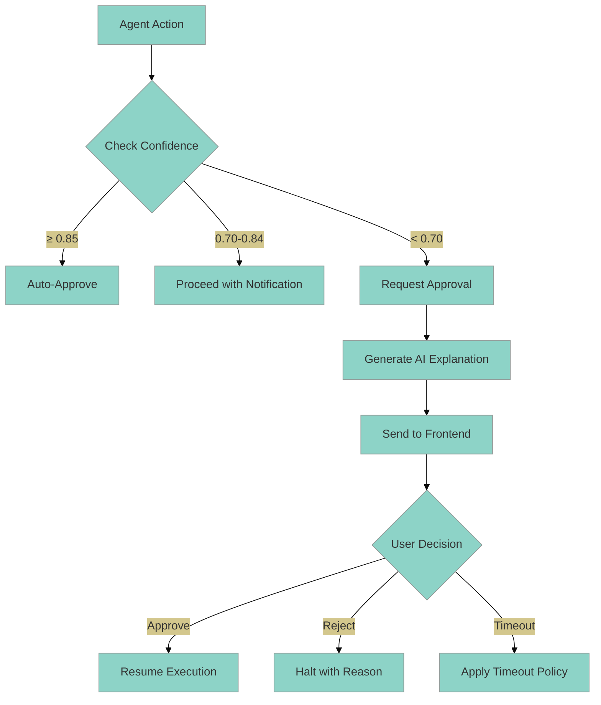

# HITL Confidence-Based Approvals

This guide explains how to configure the confidence-based approval system that automatically approves high-confidence agent actions while requiring human review for low-confidence decisions, enhanced with AI-generated explanations.

## Table of Contents

- [Overview](#overview)
- [Configuration](#configuration)
- [AI Explanations](#ai-explanations)
- [WebSocket Integration](#websocket-integration)
- [Example Approval Request](#example-approval-request)
- [Troubleshooting](#troubleshooting)
- [Best Practices](#best-practices)

## Overview

The confidence-based HITL system provides intelligent automation for agent approvals:

### Core Features

| Feature | Description |
|---------|-------------|
| **Automatic Approval** | High-confidence actions (≥85%) auto-approve without human review |
| **Manual Review** | Low-confidence actions (&lt;70%) require human approval |
| **AI Explanations** | Context-aware explanations for why approval is needed |
| **Risk Assessment** | AI-powered analysis of potential negative outcomes |
| **Smart Alternatives** | Suggested safer actions with trade-off analysis |

### How It Works



### Confidence Thresholds

| Level | Range | Color | Behavior |
|-------|-------|-------|----------|
| **High** | ≥ 85% | Green | Auto-approve (skip human review) |
| **Medium** | 70-84% | Blue | Proceed with notification |
| **Low** | 50-69% | Amber | **Require approval** |
| **Critical** | < 50% | Red | Halt with detailed explanation |

## Configuration

### Feature Flags

Configure confidence-based HITL via environment variables:

```bash
# Enable/disable confidence-based HITL system
FF_ENABLE_CONFIDENCE_HITL=true

# Minimum confidence for auto-proceed (below this requires approval)
FF_HITL_CONFIDENCE_THRESHOLD=0.70

# Auto-approve threshold (above this skips human review)
FF_HITL_AUTO_APPROVE_THRESHOLD=0.85

# Enable AI-generated explanations
FF_ENABLE_AI_EXPLANATIONS=true

# Approval timeout (seconds)
FF_AGENT_HITL_APPROVAL_TIMEOUT=3600

# Timeout action: "reject" or "auto_approve"
FF_HITL_TIMEOUT_ACTION=reject
```

### Feature Flag Structure

```python
# src/mcp_server_langgraph/core/feature_flags.py
class FeatureFlags(BaseSettings):
    enable_confidence_hitl: bool = True
    hitl_confidence_threshold: float = 0.70  # 0.0-1.0
    hitl_auto_approve_threshold: float = 0.85  # 0.0-1.0
    enable_ai_explanations: bool = True
    agent_hitl_approval_timeout: int = 3600  # seconds
```

### Environment-Specific Configurations

#### Production (Balanced Automation)

```bash
# .env.production
FF_ENABLE_CONFIDENCE_HITL=true
FF_HITL_CONFIDENCE_THRESHOLD=0.70
FF_HITL_AUTO_APPROVE_THRESHOLD=0.85
FF_ENABLE_AI_EXPLANATIONS=true
FF_HITL_TIMEOUT_ACTION=reject
```

#### High-Risk Environments (Healthcare/Finance)

```bash
# .env.hipaa
FF_ENABLE_CONFIDENCE_HITL=true
FF_HITL_CONFIDENCE_THRESHOLD=0.80  # Higher threshold
FF_HITL_AUTO_APPROVE_THRESHOLD=0.95  # Very high for auto-approve
FF_ENABLE_AI_EXPLANATIONS=true
FF_HITL_TIMEOUT_ACTION=reject  # Always reject on timeout
```

#### Development (Maximum Automation)

```bash
# .env.development
FF_ENABLE_CONFIDENCE_HITL=true
FF_HITL_CONFIDENCE_THRESHOLD=0.60  # Lower threshold
FF_HITL_AUTO_APPROVE_THRESHOLD=0.80  # More auto-approvals
FF_ENABLE_AI_EXPLANATIONS=true
FF_HITL_TIMEOUT_ACTION=auto_approve  # Less disruptive
```

### Kubernetes Configuration

```yaml
apiVersion: v1
kind: ConfigMap
metadata:
  name: mcp-server-hitl-config
data:
  FF_ENABLE_CONFIDENCE_HITL: "true"
  FF_HITL_CONFIDENCE_THRESHOLD: "0.70"
  FF_HITL_AUTO_APPROVE_THRESHOLD: "0.85"
  FF_ENABLE_AI_EXPLANATIONS: "true"
  FF_AGENT_HITL_APPROVAL_TIMEOUT: "3600"
```

## AI Explanations

The system generates context-aware explanations using specialized analysis agents when confidence is low.

### Explanation Components

| Component | Description |
|-----------|-------------|
| `why_uncertain` | Natural language explanation of why confidence is low |
| `what_could_go_wrong` | Risk analysis of potential negative outcomes |
| `safer_alternatives` | List of safer alternative actions with trade-offs |
| `confidence_factors` | Specific factors affecting the confidence score |
| `reasoning_trace` | Key steps in the agent's decision-making process |

### Example AI Explanation

```json
{
  "why_uncertain": "The query uses ambiguous terms like 'old files' without specifying a clear threshold. Multiple interpretations are possible (files older than 30 days, 90 days, or 1 year).",

  "what_could_go_wrong": "If the threshold is misinterpreted, the agent may delete important files that are needed for compliance or operational purposes. Recovery from accidental deletion could be time-consuming or impossible.",

  "safer_alternatives": [
    {
      "action": "List files that would be affected first, then request confirmation before deletion",
      "confidence": 0.92,
      "trade_off": "Requires one additional interaction step, adding 30-60 seconds to the workflow"
    },
    {
      "action": "Ask for clarification on the exact age threshold before proceeding",
      "confidence": 0.95,
      "trade_off": "Delays action until clarification is provided, may interrupt user flow"
    },
    {
      "action": "Apply a conservative default (e.g., files older than 1 year) and notify user",
      "confidence": 0.78,
      "trade_off": "May not delete as many files as intended, requiring follow-up action"
    }
  ],

  "confidence_factors": [
    {
      "factor": "ambiguous_threshold",
      "weight": -0.25,
      "evidence": "Term 'old' is not precisely defined in the request"
    },
    {
      "factor": "destructive_action",
      "weight": -0.15,
      "evidence": "File deletion is irreversible and high-risk"
    },
    {
      "factor": "multiple_interpretations",
      "weight": -0.10,
      "evidence": "Three or more valid interpretations of the request exist"
    }
  ],

  "reasoning_trace": [
    "Analyzed user request for file deletion operation",
    "Identified ambiguous age threshold ('old files')",
    "Evaluated potential interpretations (30d, 90d, 1y)",
    "Assessed risk level as HIGH due to irreversible nature",
    "Concluded that clarification is necessary before proceeding"
  ],

  "explanation_type": "uncertainty",
  "model_used": "gpt-4o-mini",
  "generated_at": "2025-12-26T10:30:45.123Z",
  "generation_latency_ms": 1847.3,
  "cached": false
}
```

### Explanation Orchestration

The system uses parallel AI agents to generate comprehensive explanations:

```python
from mcp_server_langgraph.agents.explanation_orchestrator import (
    ExplanationOrchestrator,
)

# Orchestrator coordinates 4 specialized agents:
# 1. UncertaintyAgent - Analyzes why confidence is low
# 2. RiskAgent - Assesses potential negative outcomes
# 3. AlternativesAgent - Suggests safer options
# 4. EvidenceAgent - Extracts confidence factors
```

### Disabling AI Explanations

For faster approvals (at the cost of less context):

```bash
FF_ENABLE_AI_EXPLANATIONS=false
```

When disabled, you'll receive basic templated explanations instead of rich AI-generated context.

## WebSocket Integration

### Connection

Connect to the agent request WebSocket for real-time approval notifications:

```
ws://localhost:8000/api/v1/agents/requests/ws?token={jwt}
```

### Frontend Integration

```typescript
import { useAgentRequestWebSocket } from '@/hooks/useAgentRequestWebSocket';

function MyComponent() {
  const { pendingApprovals, isConnected } = useAgentRequestWebSocket({
    onApprovalRequired: (approval) => {
      // Show approval dialog with AI explanation
      showApprovalDialog(approval);

      // Play notification sound if enabled
      if (userPreferences.soundEnabled) {
        playNotificationSound();
      }

      // Send push notification if permitted
      if (userPreferences.pushNotificationsEnabled) {
        sendPushNotification({
          title: 'Agent Approval Required',
          body: `${approval.agent_name}: ${approval.proposed_action}`,
          tag: approval.approval_id,
        });
      }
    },

    onApprovalResolved: (approval) => {
      // Update UI to reflect decision
      closeApprovalDialog(approval.approval_id);
    },
  });

  return (
    <div>
      {pendingApprovals.map((approval) => (
        <ApprovalCard key={approval.approval_id} approval={approval} />
      ))}
    </div>
  );
}
```

### WebSocket Message Types

**Server → Client: Approval Required**

```json
{
  "type": "approval_required",
  "payload": {
    "approval_id": "conf_1234567890",
    "session_id": "session_abc123",
    "task_id": "task_xyz789",
    "agent_name": "Data Processing Agent",
    "confidence": 0.65,
    "threshold": 0.70,
    "auto_approve_threshold": 0.85,
    "proposed_action": "Delete 47 files older than 30 days from /data/temp",
    "risk_level": "medium",
    "context": {
      "file_count": 47,
      "directory": "/data/temp",
      "age_threshold_days": 30
    },
    "ai_explanation": {
      "why_uncertain": "Ambiguous age threshold without explicit confirmation",
      "what_could_go_wrong": "May delete files still needed for operations",
      "safer_alternatives": [
        {
          "action": "List files first, then confirm deletion",
          "confidence": 0.92,
          "trade_off": "Adds one extra step before deletion"
        }
      ],
      "confidence_factors": [
        {
          "factor": "ambiguous_threshold",
          "weight": -0.25,
          "evidence": "Age threshold not explicitly confirmed"
        }
      ]
    },
    "created_at": "2025-12-26T10:30:45.123Z",
    "expires_at": "2025-12-26T11:30:45.123Z"
  }
}
```

**Client → Server: Approval Response**

```json
{
  "type": "approval_response",
  "payload": {
    "approval_id": "conf_1234567890",
    "approved": true,
    "reason": "Verified that files are no longer needed for active operations",
    "approved_by": "user@example.com",
    "responded_at": "2025-12-26T10:32:15.456Z"
  }
}
```

**Server → Client: Execution Resumed**

```json
{
  "type": "execution_resumed",
  "payload": {
    "approval_id": "conf_1234567890",
    "session_id": "session_abc123",
    "status": "approved",
    "resumed_at": "2025-12-26T10:32:15.789Z"
  }
}
```

## Example Approval Request

### Python Backend (Creating Approval)

```python
from mcp_server_langgraph.core.interrupts.confidence import (
    ConfidenceApprovalNode,
    check_confidence,
)
from mcp_server_langgraph.core.interrupts.ai_explanation import (
    AIExplanation,
)

# Check if approval is needed
confidence = 0.65
threshold = 0.70

if not check_confidence(confidence, threshold):
    # Generate AI explanation (if enabled)
    explanation = await generate_ai_explanation(
        action=proposed_action,
        confidence=confidence,
        threshold=threshold,
        context=context,
    )

    # Create approval request
    approval_node = ConfidenceApprovalNode(
        threshold=threshold,
        name="data_deletion_approval",
        description="File deletion requires approval due to low confidence",
    )

    # Add to agent state
    state = approval_node(state)

    # Broadcast to WebSocket subscribers
    await broadcast_approval_request(state["current_approval_id"])
```

### REST API Endpoints

| Method | Endpoint | Description |
|--------|----------|-------------|
| `GET` | `/api/v1/agents/approvals/pending` | List all pending approvals |
| `GET` | `/api/v1/agents/approvals/{id}` | Get specific approval details |
| `POST` | `/api/v1/agents/approvals/{id}/approve` | Approve and resume execution |
| `POST` | `/api/v1/agents/approvals/{id}/reject` | Reject and halt execution |

### Approve via REST API

```bash
curl -X POST /api/v1/agents/approvals/conf_1234567890/approve \
  -H "Authorization: Bearer $JWT_TOKEN" \
  -H "Content-Type: application/json" \
  -d '{
    "reason": "Verified files are safe to delete",
    "approved_by": "user@example.com"
  }'
```

### Reject via REST API

```bash
curl -X POST /api/v1/agents/approvals/conf_1234567890/reject \
  -H "Authorization: Bearer $JWT_TOKEN" \
  -H "Content-Type: application/json" \
  -d '{
    "reason": "Files are still needed for compliance audit",
    "approved_by": "user@example.com"
  }'
```

## Troubleshooting

### Approvals Not Triggering

**Symptom**: Actions proceed without approval even when confidence is low.

**Solutions**:

1. **Verify feature flag is enabled**:
   ```bash
   # Check environment variable
   echo $FF_ENABLE_CONFIDENCE_HITL

   # Should output: true
   ```

2. **Check confidence threshold**:
   ```bash
   echo $FF_HITL_CONFIDENCE_THRESHOLD

   # If 0.5 and confidence is 0.6, approval won't trigger
   # Lower the threshold or increase agent confidence
   ```

3. **Verify approval node is in graph**:
   ```python
   # Ensure ConfidenceApprovalNode is added to your graph
   graph.add_node("confidence_check", ConfidenceApprovalNode(threshold=0.7))
   ```

### AI Explanations Not Appearing

**Symptom**: Approval requests lack AI-generated explanations.

**Solutions**:

1. **Enable AI explanations**:
   ```bash
   FF_ENABLE_AI_EXPLANATIONS=true
   ```

2. **Check LLM availability**:
   ```bash
   # Verify LLM service is running and accessible
   curl http://localhost:8000/api/v1/health
   ```

3. **Review explanation timeout**:
   ```python
   # Increase timeout if explanations are timing out
   FF_AI_EXPLANATION_TIMEOUT_MS=5000  # 5 seconds
   ```

### WebSocket Connection Failures

**Symptom**: Frontend not receiving real-time approval notifications.

**Solutions**:

1. **Verify WebSocket endpoint**:
   ```javascript
   // Check connection URL includes valid JWT
   const ws = new WebSocket(
     `ws://localhost:8000/api/v1/agents/requests/ws?token=${jwt}`
   );
   ```

2. **Check token expiration**:
   ```bash
   # Decode JWT and verify not expired
   jwt decode $JWT_TOKEN
   ```

3. **Review CORS/WebSocket settings**:
   ```yaml
   # Ensure WebSocket is allowed in production
   CORS_ALLOWED_ORIGINS: "https://yourdomain.com"
   WEBSOCKET_ALLOWED_ORIGINS: "https://yourdomain.com"
   ```

### Auto-Approval Not Working

**Symptom**: High-confidence actions still require manual approval.

**Solutions**:

1. **Check auto-approve threshold**:
   ```bash
   FF_HITL_AUTO_APPROVE_THRESHOLD=0.85

   # If confidence is 0.84, it won't auto-approve
   # Lower threshold: FF_HITL_AUTO_APPROVE_THRESHOLD=0.80
   ```

2. **Verify auto-approve is enabled**:
   ```python
   # Check FeatureFlags configuration
   feature_flags.hitl_auto_approve_above_threshold  # Should be True
   ```

3. **Review confidence scoring**:
   ```python
   # Log actual confidence scores to identify patterns
   logger.info(f"Action confidence: {confidence}, threshold: {threshold}")
   ```

## Best Practices

### 1. Tune Thresholds by Task Type

Different tasks warrant different confidence thresholds:

| Task Type | Recommended Thresholds |
|-----------|----------------------|
| **Read-only queries** | Confidence: 0.60, Auto-approve: 0.80 |
| **Data modifications** | Confidence: 0.75, Auto-approve: 0.90 |
| **External API calls** | Confidence: 0.80, Auto-approve: 0.92 |
| **Destructive actions** | Confidence: 0.85, Auto-approve: 0.95 |

### 2. Monitor Approval Patterns

Track metrics to optimize thresholds:

```promql
# Approval request rate by confidence range
rate(mcp_hitl_requests_total[5m])

# Percentage of auto-approvals
sum(mcp_hitl_auto_approved_total) / sum(mcp_hitl_requests_total)

# Average user response time
histogram_quantile(0.95, mcp_hitl_response_latency_seconds_bucket)
```

### 3. Design Clear Explanations

When displaying approvals to users:

- **Lead with "why"**: Show explanation before technical details
- **Highlight risks**: Make potential issues visually prominent
- **Suggest alternatives**: Always present safer options
- **Show confidence visually**: Use gauges/progress bars, not just percentages

### 4. Handle Timeouts Gracefully

Configure timeout behavior based on risk:

```yaml
# Conservative (fail-safe)
FF_HITL_TIMEOUT_ACTION: reject
FF_AGENT_HITL_APPROVAL_TIMEOUT: 1800  # 30 minutes

# Aggressive (minimize disruption)
FF_HITL_TIMEOUT_ACTION: auto_approve
FF_AGENT_HITL_APPROVAL_TIMEOUT: 3600  # 1 hour
```

### 5. Batch Similar Approvals

For workflows with multiple low-confidence steps:

```typescript
// Group similar approvals by task type
const groupedApprovals = pendingApprovals.reduce((acc, approval) => {
  const key = approval.task_type || 'other';
  if (!acc[key]) acc[key] = [];
  acc[key].push(approval);
  return acc;
}, {});

// Allow batch approval/rejection
const handleBatchApprove = (approvalIds: string[]) => {
  Promise.all(approvalIds.map(id => approveRequest(id)));
};
```

### 6. Use Task-Specific Overrides

Override global thresholds for specific task types:

```python
# In user preferences
hitl_preferences = {
    "enabled": True,
    "confidenceThreshold": 0.70,  # Global default
    "autoApproveThreshold": 0.85,  # Global default
    "taskOverrides": {
        "file_deletion": {
            "enabled": True,
            "threshold": 0.90,  # Higher for destructive actions
        },
        "read_query": {
            "enabled": True,
            "threshold": 0.60,  # Lower for safe operations
        },
    },
}
```

### 7. Progressive Disclosure

Don't overwhelm users with technical details:

```typescript
// Show summary first
<ApprovalSummary
  action={approval.proposed_action}
  confidence={approval.confidence}
  recommendation={getRecommendation(approval)}
/>

// Reveal details on demand
{showDetails && (
  <>
    <AIExplanation explanation={approval.ai_explanation} />
    <ConfidenceFactors factors={approval.ai_explanation.confidence_factors} />
    <ReasoningTrace trace={approval.ai_explanation.reasoning_trace} />
  </>
)}
```

## Related Documentation

- [HITL Visual Flow Diagrams](/guides/hitl-visual-flows) - Visual diagrams of approval and clarification flows
- [Agent HITL Approval](/guides/agent-hitl-approval) - Complete HITL system overview
- [Feature Flags](/guides/feature-flags) - Feature flag configuration
- [Push Notifications](/guides/push-notifications) - Browser notification setup
- [Multi-Agent Orchestrators](/guides/multi-agent-orchestrators) - Multi-agent workflows
- [Agent Architecture](/guides/agent-architecture) - Overall agent design
